# cmdguard Transformation Plan

**Date:** 2026-02-14 04:21 UTC  
**Project:** cmdguard - CLI Validation Library  
**Objective:** Transform from framework to guard library with compile-time enforcement

---

## Pareto Analysis

### The Principle

| Effort | Result | Cumulative | Focus |
|--------|--------|------------|-------|
| **1%** | **51%** | 51% | Foundation - critical architectural decisions |
| **4%** | **64%** | 64% | Core - build upon foundation |
| **20%** | **80%** | 80% | Polish - remaining high-value items |
| 100% | 100% | 100% | Everything else |

**Key Insight:** The first 1% of effort delivers more than half the value.

---

## 1% Effort → 51% Result (Foundation)

These 3 tasks establish the foundation for everything else. Without these, the project remains a framework, not a guard.

### Task 1.1: Remove cmd/ Folder (15 min)
**Impact:** HIGH | **Effort:** LOW | **Customer Value:** HIGH

**Why:** Establishes cmdguard as a library, not an application. The cmd/ folder creates confusion about purpose.

**Deliverable:**
- Delete `cmd/cmdguard/` directory
- Update any documentation references
- Ensure no import paths break

**Success Criteria:**
- No cmd/ folder exists
- All tests still pass
- Build still succeeds

---

### Task 1.2: Define Guard vs Framework Architecture (30 min)
**Impact:** CRITICAL | **Effort:** MEDIUM | **Customer Value:** CRITICAL

**Why:** The fundamental decision - are we a framework (runtime validation) or guard (compile-time enforcement)?

**Deliverable:**
- Document the guard approach in ARCHITECTURE.md
- Define the interception pattern
- Decide: panic vs error on invalid commands

**Key Decision:**
```go
// Guard approach (chosen)
root := cmdguard.NewCommand("app", "desc") // Returns *GuardedCommand
root.AddCommand(&cobra.Command{Use: "sub"}) // PANIC: no handler!

// NOT framework approach (rejected)
app := cmdguard.New()           // Returns Application
app.Initialize()                // Returns error
app.Validate()                  // Returns error
```

**Success Criteria:**
- Architecture decision documented
- Team alignment on approach
- Public API design drafted

---

### Task 1.3: Create AGENTS.md (15 min)
**Impact:** MEDIUM | **Effort:** LOW | **Customer Value:** MEDIUM

**Why:** Required by buildflow tooling. Currently failing validation.

**Deliverable:**
- AGENTS.md in project root
- Project-specific agent instructions
- Coding standards
- Build/test commands

**Success Criteria:**
- buildflow agents-md-exists-check passes
- File contains useful guidance

---

## 4% Effort → 64% Result (Core)

These 3 tasks build upon the foundation to create a working guard library.

### Task 2.1: Fix 4 errcheck Violations (30 min)
**Impact:** HIGH | **Effort:** LOW | **Customer Value:** HIGH

**Why:** Unchecked errors in fmt.Fprintln/Fprintf calls. Simple fixes, high quality impact.

**Files:**
- `cmd/cmdguard/main.go:80` - fmt.Fprintln
- `cmd/cmdguard/main.go:103` - fmt.Fprintf
- `internal/commands/root.go:121` - fmt.Fprintln
- `internal/commands/root.go:133` - fmt.Fprintln

**Deliverable:**
- Check all fmt errors
- Return errors or explicitly ignore with comment

**Success Criteria:**
- golangci-lint errcheck passes
- No unchecked errors remain

---

### Task 2.2: Redesign Public API (90 min)
**Impact:** CRITICAL | **Effort:** HIGH | **Customer Value:** CRITICAL

**Why:** Current API exposes internals and requires multi-step initialization. Guard API should be simple and enforce correctness.

**Current (remove/replace):**
```go
app := cmdguard.New()
app.Initialize()  // Can fail
app.Validate()      // Can fail
app.AddCommand(cmd)
app.Execute()
```

**New (create):**
```go
// Single entry point
root := cmdguard.New("myapp", "My application")

// Add command - panics on invalid
root.AddCommand(&cobra.Command{
    Use:   "sub",
    Short: "Subcommand",
    Run: func(cmd *cobra.Command, args []string) {
        // handler
    },
})

// Execute
root.Execute()
```

**Deliverable:**
- New public API in pkg/cmdguard/
- Single-step initialization
- No internal imports exposed
- Panic on invalid construction

**Success Criteria:**
- Public API doesn't import internal/
- No multi-step initialization
- Compile-time or panic-time enforcement

---

### Task 2.3: Add Compile-Time Validation Hooks (60 min)
**Impact:** HIGH | **Effort:** MEDIUM | **Customer Value:** HIGH

**Why:** Intercept Cobra calls to enforce correctness at construction time.

**Deliverable:**
- Wrap *cobra.Command AddCommand to validate
- Wrap Flags() access to detect unregistered flags
- Panic with clear message on violation

**Example:**
```go
func (g *GuardedCommand) AddCommand(cmd *cobra.Command) {
    if cmd.Run == nil && cmd.RunE == nil && len(cmd.Commands()) == 0 {
        panic(fmt.Sprintf("command %q has no handler", cmd.Use))
    }
    g.cmd.AddCommand(cmd)
}
```

**Success Criteria:**
- Panics on command without handler
- Panics on flag access before registration
- Clear error messages

---

## 20% Effort → 80% Result (Polish)

These 6 tasks complete the 80% value delivery.

### Task 3.1: Fix samber/do/v2 Usage (60 min)
**Impact:** MEDIUM | **Effort:** MEDIUM | **Customer Value:** MEDIUM

**Why:** Current manual wiring defeats DI purpose. Services should declare dependencies.

**Current (wrong):**
```go
registry := module.MustInvokeRegistry()
validator := module.MustInvokeValidator()
registry.SetValidator(validator) // Manual wiring!
```

**Proper:**
```go
func NewRegistry(cfg *Config, v *Validator) (*Registry, error) {
    // DI injects automatically
}
```

**Deliverable:**
- Constructor injection pattern
- Remove MustInvoke* methods
- Use scopes properly

**Success Criteria:**
- No manual service linking
- Proper DI patterns
- Health checks work

---

### Task 3.2: Improve Test Coverage (60 min)
**Impact:** MEDIUM | **Effort:** MEDIUM | **Customer Value:** MEDIUM

**Why:** config package at 47.6%, below 80% target.

**Focus:**
- Error paths in config loading
- Environment variable parsing
- Config file path resolution

**Deliverable:**
- Add tests for error conditions
- Add tests for edge cases
- Achieve 80%+ coverage

**Success Criteria:**
- internal/config coverage >= 80%
- All error paths tested

---

### Task 3.3: Fix Code Duplication (60 min)
**Impact:** LOW | **Effort:** MEDIUM | **Customer Value:** LOW

**Why:** 7 clone groups detected. Version command logic duplicated.

**Focus:**
- main.go:86-92 vs root.go:129-135 (version command)
- registry.go MarkFlagBound/UnmarkFlagBound

**Deliverable:**
- Extract shared version command logic
- Deduplicate flag operations

**Success Criteria:**
- art-dupl shows no critical duplication
- Code remains readable

---

### Task 3.4: Add Integration Tests (90 min)
**Impact:** HIGH | **Effort:** HIGH | **Customer Value:** HIGH

**Why:** No integration tests exist. Need end-to-end validation.

**Deliverable:**
- Test full application lifecycle
- Test flag validation end-to-end
- Test configuration loading

**Success Criteria:**
- Integration test package exists
- Tests cover main use cases
- Tests pass reliably

---

### Task 3.5: Create Examples Directory (60 min)
**Impact:** HIGH | **Effort:** MEDIUM | **Customer Value:** HIGH

**Why:** Users need working examples to understand the library.

**Deliverable:**
- examples/basic/ - Simple CLI
- examples/advanced/ - Complex setup
- examples/guarded/ - Showing guard features

**Success Criteria:**
- Each example builds and runs
- Examples demonstrate key features
- README explains each example

---

### Task 3.6: Add justfile (30 min)
**Impact:** LOW | **Effort:** LOW | **Customer Value:** MEDIUM

**Why:** Standardize build commands. Match project conventions.

**Deliverable:**
- justfile with common commands
- test, build, lint, fmt targets
- Document usage

**Success Criteria:**
- `just test` works
- `just build` works
- `just lint` works

---

## Task Summary Table (27 Tasks Sorted by Priority)

| Priority | Task | Effort | Impact | Pareto Tier |
|----------|------|--------|--------|-------------|
| 1 | Remove cmd/ folder | 15 min | HIGH | 1% → 51% |
| 2 | Define guard architecture | 30 min | CRITICAL | 1% → 51% |
| 3 | Create AGENTS.md | 15 min | MEDIUM | 1% → 51% |
| 4 | Fix 4 errcheck violations | 30 min | HIGH | 4% → 64% |
| 5 | Redesign public API | 90 min | CRITICAL | 4% → 64% |
| 6 | Add compile-time validation | 60 min | HIGH | 4% → 64% |
| 7 | Fix samber/do/v2 usage | 60 min | MEDIUM | 20% → 80% |
| 8 | Improve test coverage | 60 min | MEDIUM | 20% → 80% |
| 9 | Fix code duplication | 60 min | LOW | 20% → 80% |
| 10 | Add integration tests | 90 min | HIGH | 20% → 80% |
| 11 | Create examples | 60 min | HIGH | 20% → 80% |
| 12 | Add justfile | 30 min | LOW | 20% → 80% |
| 13 | Add CI/CD workflow | 90 min | HIGH | Beyond 80% |
| 14 | Improve documentation | 60 min | MEDIUM | Beyond 80% |
| 15 | Add benchmark tests | 45 min | LOW | Beyond 80% |
| 16 | Add fuzz testing | 60 min | LOW | Beyond 80% |
| 17 | Create release automation | 90 min | LOW | Beyond 80% |
| 18 | Add container image | 45 min | LOW | Beyond 80% |
| 19 | Add homebrew formula | 60 min | LOW | Beyond 80% |
| 20 | Performance optimization | 90 min | LOW | Beyond 80% |
| 21 | Add plugin system | 120 min | LOW | Beyond 80% |
| 22 | Add telemetry | 60 min | LOW | Beyond 80% |
| 23 | Add metrics | 60 min | LOW | Beyond 80% |
| 24 | Add tracing | 60 min | LOW | Beyond 80% |
| 25 | Security audit | 90 min | MEDIUM | Beyond 80% |
| 26 | Add more validations | 120 min | MEDIUM | Beyond 80% |
| 27 | Complete test suite | 90 min | HIGH | Beyond 80% |

**Total Estimated Time:** ~28 hours for first 12 tasks (80% value)

---

## Execution Graph

```mermaid
flowchart TD
    subgraph P1["1% → 51% Foundation"]
        T1[1.1 Remove cmd/]
        T2[1.2 Define Architecture]
        T3[1.3 Create AGENTS.md]
    end

    subgraph P2["4% → 64% Core"]
        T4[2.1 Fix errcheck]
        T5[2.2 Redesign Public API]
        T6[2.3 Compile-time Validation]
    end

    subgraph P3["20% → 80% Polish"]
        T7[3.1 Fix DI Usage]
        T8[3.2 Improve Coverage]
        T9[3.3 Fix Duplication]
        T10[3.4 Integration Tests]
        T11[3.5 Create Examples]
        T12[3.6 Add justfile]
    end

    subgraph P4["Beyond 80%"]
        T13[4.1 CI/CD]
        T14[4.2 Documentation]
        T15[4.3 Benchmarks]
        T16[4.4 Fuzz Tests]
        T17[4.5 Release Automation]
        T18[4.6 Container]
        T19[4.7 Homebrew]
        T20[4.8 Performance]
        T21[4.9 Plugin System]
        T22[4.10 Telemetry]
        T23[4.11 Metrics]
        T24[4.12 Tracing]
        T25[4.13 Security]
        T26[4.14 More Validations]
        T27[4.15 Complete Tests]
    end

    T1 --> T2
    T2 --> T3
    T3 --> T4
    T4 --> T5
    T5 --> T6
    T6 --> T7
    T7 --> T8
    T8 --> T9
    T9 --> T10
    T10 --> T11
    T11 --> T12
    T12 -.-> T13

    T13 --> T14
    T14 --> T15
    T15 --> T16
    T16 --> T17
    T17 --> T18
    T18 --> T19
    T19 --> T20
    T20 --> T21
    T21 --> T22
    T22 --> T23
    T23 --> T24
    T24 --> T25
    T25 --> T26
    T26 --> T27
```



---

## Execution Order

### Phase 1: Foundation (1% effort, 51% value) - 60 minutes
1. Task 1.1: Remove cmd/ folder (15 min)
2. Task 1.2: Define guard architecture (30 min)
3. Task 1.3: Create AGENTS.md (15 min)

### Phase 2: Core (4% effort, 64% cumulative) - 180 minutes
4. Task 2.1: Fix 4 errcheck violations (30 min)
5. Task 2.2: Redesign public API (90 min)
6. Task 2.3: Add compile-time validation (60 min)

### Phase 3: Polish (20% effort, 80% cumulative) - 450 minutes
7. Task 3.1: Fix samber/do/v2 usage (60 min)
8. Task 3.2: Improve test coverage (60 min)
9. Task 3.3: Fix code duplication (60 min)
10. Task 3.4: Add integration tests (90 min)
11. Task 3.5: Create examples directory (60 min)
12. Task 3.6: Add justfile (30 min)

### Phase 4: Beyond 80% (Remaining 27 tasks)
13-27. Remaining tasks as time permits

---

## My Top #1 Question

**How should we balance "panic on invalid" vs "return error"?**

Options:
1. **Panic on construction** - Fail fast, impossible to ignore (guard approach)
2. **Return error** - Caller decides, more flexible (framework approach)
3. **Both** - Panic in Must* functions, error in regular functions

The user wants compile-time enforcement, but Go doesn't have compile-time macros. The closest is init-time panic. But this might be too aggressive for some users.

**Recommendation:** Use Must* pattern with panic, and document that this is intentional - "fail fast" philosophy.

**Please clarify:** Should we:
- A) Always panic on invalid commands (strict guard)
- B) Return errors, let caller decide (flexible framework)
- C) Both (Must* panics, regular returns error)

---

## Success Criteria

### Phase 1 Complete When:
- [ ] cmd/ folder deleted
- [ ] Architecture decision documented
- [ ] AGENTS.md created and valid
- [ ] All tests pass
- [ ] Build succeeds

### Phase 2 Complete When:
- [ ] No errcheck violations
- [ ] New public API designed
- [ ] Compile-time validation works
- [ ] Examples use new API
- [ ] Tests pass

### Phase 3 Complete When:
- [ ] DI properly used
- [ ] Coverage >= 80%
- [ ] No code duplication
- [ ] Integration tests pass
- [ ] Examples work
- [ ] justfile works

---

**Plan Created:** 2026-02-14 04:21 UTC  
**Estimated Duration:** 11.5 hours for 80% value  
**Tasks Defined:** 27 tasks  
**Status:** Ready to execute
