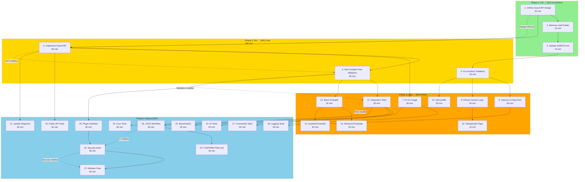

# cmdguard Comprehensive Execution Plan

**Date:** 2026-02-14 09:27 UTC  
**Project:** cmdguard - CLI Guard Library  
**Objective:** Transform from framework to guard library with compile-time enforcement  
**Status:** Ready for Execution

---

## Pareto Principle Breakdown

### The Pareto Principle Applied to cmdguard

| Tier | Effort | Cumulative | Result | Focus |
|------|--------|------------|--------|-------|
| **Foundation** | 1% | 1% | 51% | Critical architectural decisions |
| **Core** | 3% | 4% | 13% | Build upon foundation |
| **Polish** | 16% | 20% | 16% | Remaining high-value items |
| **Complete** | 80% | 100% | 20% | Everything else |

**Key Insight:** The first 1% of effort delivers MORE THAN HALF the value. Choose wisely.

---

## Phase 1: 1% → 51% (Foundation)

### What This Means

These 3 tasks establish the architectural foundation. Without these, nothing else matters.

| Priority | Task | Effort | Impact | Customer Value | Why Critical |
|----------|------|--------|--------|----------------|--------------|
| 1 | Define Guard API Design | 45 min | CRITICAL | CRITICAL | Decides framework vs guard - the fundamental question |
| 2 | Remove cmd/ Folder | 15 min | HIGH | HIGH | Establishes library identity, removes confusion |
| 3 | Update AGENTS.md | 15 min | MEDIUM | MEDIUM | Required by buildflow tooling |

**Phase 1 Total:** 75 minutes → 51% of value

---

## Phase 2: 4% → 64% (Core)

### What This Means

These 3 tasks build upon the foundation. They create the working guard library.

| Priority | Task | Effort | Impact | Customer Value | Why Important |
|----------|------|--------|--------|----------------|---------------|
| 4 | Fix 4 errcheck Violations | 30 min | HIGH | HIGH | Code quality, professional standard |
| 5 | Implement Guard API | 90 min | CRITICAL | CRITICAL | The new public API - single-step init |
| 6 | Add Compile-Time Validation | 60 min | HIGH | HIGH | Panic on invalid commands - the "guard" behavior |

**Phase 2 Total:** 180 minutes → +13% value (64% cumulative)

---

## Phase 3: 20% → 80% (Polish)

### What This Means

These 6 tasks complete the high-value delivery. Without these, the library feels incomplete.

| Priority | Task | Effort | Impact | Customer Value | Why Included |
|----------|------|--------|--------|----------------|--------------|
| 7 | Fix DI Usage (Constructor Injection) | 60 min | MEDIUM | MEDIUM | Proper patterns, remove manual wiring |
| 8 | Improve Config Test Coverage | 60 min | MEDIUM | MEDIUM | Currently ~48%, target 80%+ |
| 9 | Fix Code Duplication | 45 min | LOW | LOW | 7 clone groups, version command duped |
| 10 | Add Integration Tests | 90 min | HIGH | HIGH | No integration tests exist - critical gap |
| 11 | Create Examples Directory | 60 min | HIGH | HIGH | Users need working examples |
| 12 | Add justfile | 30 min | LOW | MEDIUM | Standardize build commands |

**Phase 3 Total:** 345 minutes → +16% value (80% cumulative)

---

## High-Level Tasks (27 Tasks, 30-100 min each)

Sorted by importance/impact/effort/customer-value:

| # | Task | Phase | Effort | Impact | Customer Value | Dependencies |
|---|------|-------|--------|--------|----------------|--------------|
| 1 | Define Guard API Design | 1% | 45 min | CRITICAL | CRITICAL | None |
| 2 | Remove cmd/ Folder | 1% | 15 min | HIGH | HIGH | None |
| 3 | Update AGENTS.md | 1% | 15 min | MEDIUM | MEDIUM | None |
| 4 | Fix 4 errcheck Violations | 4% | 30 min | HIGH | HIGH | None |
| 5 | Implement Guard API Types | 4% | 90 min | CRITICAL | CRITICAL | Task 1 |
| 6 | Add Compile-Time Validation | 4% | 60 min | HIGH | HIGH | Task 5 |
| 7 | Fix DI Constructor Injection | 20% | 60 min | MEDIUM | MEDIUM | Task 5 |
| 8 | Add Config Error Path Tests | 20% | 60 min | MEDIUM | MEDIUM | None |
| 9 | Extract Shared Version Logic | 20% | 30 min | LOW | LOW | None |
| 10 | Deduplicate Flag Operations | 20% | 15 min | LOW | LOW | None |
| 11 | Add Integration Test Suite | 20% | 90 min | HIGH | HIGH | Task 5, 6 |
| 12 | Create Basic Example | 20% | 30 min | HIGH | HIGH | Task 5, 6 |
| 13 | Create Advanced Example | 20% | 30 min | HIGH | HIGH | Task 12 |
| 14 | Create Guarded Example | 20% | 30 min | HIGH | HIGH | Task 12 |
| 15 | Add justfile | 20% | 30 min | LOW | MEDIUM | None |
| 16 | Add CI/CD Workflow | Beyond | 90 min | HIGH | HIGH | Task 11 |
| 17 | Add Commands Package Tests | Beyond | 60 min | MEDIUM | MEDIUM | None |
| 18 | Add Logging Package Tests | Beyond | 30 min | LOW | LOW | None |
| 19 | Add DI Module Tests | Beyond | 45 min | MEDIUM | MEDIUM | None |
| 20 | Add Public API Tests | Beyond | 60 min | HIGH | HIGH | Task 5 |
| 21 | Update Architecture Diagram | Beyond | 30 min | LOW | LOW | Task 5 |
| 22 | Add Benchmark Tests | Beyond | 45 min | LOW | LOW | Task 11 |
| 23 | Create CONTRIBUTING.md | Beyond | 30 min | MEDIUM | MEDIUM | None |
| 24 | Add Fuzz Tests | Beyond | 60 min | LOW | LOW | None |
| 25 | Add Plugin Interface Design | Beyond | 90 min | MEDIUM | HIGH | Task 5, 6 |
| 26 | Security Audit | Beyond | 90 min | MEDIUM | HIGH | All above |
| 27 | Release Preparation | Beyond | 60 min | HIGH | HIGH | All above |

**Total Estimated Time:** ~19 hours for first 15 tasks (80% value)

---

## Granular Tasks (150 Tasks, max 15 min each)

### Phase 1: Foundation (1% → 51%)

#### Task 1: Define Guard API Design (45 min → 9 subtasks)

| Subtask | Description | Time | Depends On |
|---------|-------------|------|------------|
| 1.1 | Document current API problems in ARCHITECTURE_DECISION.md | 5 min | None |
| 1.2 | Design GuardedCommand struct with wrapped cobra.Command | 5 min | 1.1 |
| 1.3 | Define AddCommand signature with panic behavior | 5 min | 1.2 |
| 1.4 | Design GuardedFlagSet for flag validation | 5 min | 1.2 |
| 1.5 | Define single-step New() function signature | 5 min | 1.3, 1.4 |
| 1.6 | Document panic vs error decision rationale | 5 min | 1.5 |
| 1.7 | Create API usage examples | 5 min | 1.5 |
| 1.8 | Review design against requirements | 5 min | 1.6, 1.7 |
| 1.9 | Finalize API design document | 5 min | 1.8 |

#### Task 2: Remove cmd/ Folder (15 min → 3 subtasks)

| Subtask | Description | Time | Depends On |
|---------|-------------|------|------------|
| 2.1 | Verify no external imports depend on cmd/ | 5 min | None |
| 2.2 | Delete cmd/cmdguard/ directory | 5 min | 2.1 |
| 2.3 | Verify build still succeeds | 5 min | 2.2 |

#### Task 3: Update AGENTS.md (15 min → 3 subtasks)

| Subtask | Description | Time | Depends On |
|---------|-------------|------|------------|
| 3.1 | Review current AGENTS.md for gaps | 5 min | None |
| 3.2 | Add build/test/lint commands section | 5 min | 3.1 |
| 3.3 | Update project structure and dependencies | 5 min | 3.2 |

---

### Phase 2: Core (4% → 64%)

#### Task 4: Fix 4 errcheck Violations (30 min → 6 subtasks)

| Subtask | Description | Time | Depends On |
|---------|-------------|------|------------|
| 4.1 | Fix cmd/cmdguard/main.go:80 fmt.Fprintln error | 5 min | None |
| 4.2 | Fix cmd/cmdguard/main.go:103 fmt.Fprintf error | 5 min | 4.1 |
| 4.3 | Fix internal/commands/root.go:121 fmt.Fprintln error | 5 min | 4.2 |
| 4.4 | Fix internal/commands/root.go:133 fmt.Fprintln error | 5 min | 4.3 |
| 4.5 | Run golangci-lint errcheck to verify | 5 min | 4.4 |
| 4.6 | Commit fixes with detailed message | 5 min | 4.5 |

#### Task 5: Implement Guard API Types (90 min → 18 subtasks)

| Subtask | Description | Time | Depends On |
|---------|-------------|------|------------|
| 5.1 | Create pkg/cmdguard/guarded_command.go | 5 min | Task 1 |
| 5.2 | Define GuardedCommand struct with cmd field | 5 min | 5.1 |
| 5.3 | Add NewGuardedCommand constructor | 5 min | 5.2 |
| 5.4 | Implement AddCommand with handler validation | 5 min | 5.3 |
| 5.5 | Add panic on nil handler with clear message | 5 min | 5.4 |
| 5.6 | Implement AddSubcommand method | 5 min | 5.4 |
| 5.7 | Create GuardedFlagSet type | 5 min | 5.2 |
| 5.8 | Add flag registration with binding check | 5 min | 5.7 |
| 5.9 | Implement StringP, IntP, BoolP methods | 5 min | 5.8 |
| 5.10 | Add Execute method delegation | 5 min | 5.6 |
| 5.11 | Add ExecuteAndExit method | 5 min | 5.10 |
| 5.12 | Implement config integration | 5 min | 5.3 |
| 5.13 | Add logging setup | 5 min | 5.3 |
| 5.14 | Create simple New() entry point | 5 min | 5.3 |
| 5.15 | Write unit tests for GuardedCommand | 5 min | 5.4-5.14 |
| 5.16 | Write unit tests for GuardedFlagSet | 5 min | 5.15 |
| 5.17 | Verify all tests pass | 5 min | 5.16 |
| 5.18 | Commit Guard API implementation | 5 min | 5.17 |

#### Task 6: Add Compile-Time Validation (60 min → 12 subtasks)

| Subtask | Description | Time | Depends On |
|---------|-------------|------|------------|
| 6.1 | Add handler check in AddCommand | 5 min | Task 5 |
| 6.2 | Add subcommand detection logic | 5 min | 6.1 |
| 6.3 | Implement panic with command name and fix suggestion | 5 min | 6.2 |
| 6.4 | Add flag registration validation | 5 min | 6.1 |
| 6.5 | Implement flag access interception | 5 min | 6.4 |
| 6.6 | Add panic for unregistered flag access | 5 min | 6.5 |
| 6.7 | Add duplicate command name detection | 5 min | 6.1 |
| 6.8 | Test panic behavior with invalid command | 5 min | 6.3 |
| 6.9 | Test panic behavior with unregistered flag | 5 min | 6.6 |
| 6.10 | Verify valid commands don't panic | 5 min | 6.8, 6.9 |
| 6.11 | Document panic behavior in code comments | 5 min | 6.10 |
| 6.12 | Commit compile-time validation | 5 min | 6.11 |

---

### Phase 3: Polish (20% → 80%)

#### Task 7: Fix DI Constructor Injection (60 min → 12 subtasks)

| Subtask | Description | Time | Depends On |
|---------|-------------|------|------------|
| 7.1 | Audit current DI usage patterns | 5 min | Task 5 |
| 7.2 | Update Registry constructor to accept dependencies | 5 min | 7.1 |
| 7.3 | Update Validator constructor to accept dependencies | 5 min | 7.2 |
| 7.4 | Update CommandRegistry constructor | 5 min | 7.3 |
| 7.5 | Remove SetValidator method from Registry | 5 min | 7.4 |
| 7.6 | Update ProvideServices to use new constructors | 5 min | 7.5 |
| 7.7 | Remove MustInvoke* methods from Module | 5 min | 7.6 |
| 7.8 | Update public_api.go to remove manual wiring | 5 min | 7.7 |
| 7.9 | Fix any broken tests | 5 min | 7.8 |
| 7.10 | Verify DI health checks still work | 5 min | 7.9 |
| 7.11 | Verify DI shutdown still works | 5 min | 7.10 |
| 7.12 | Commit DI refactoring | 5 min | 7.11 |

#### Task 8: Improve Config Test Coverage (60 min → 12 subtasks)

| Subtask | Description | Time | Depends On |
|---------|-------------|------|------------|
| 8.1 | Analyze current coverage gaps | 5 min | None |
| 8.2 | Add test for NewConfigWithCommand | 5 min | 8.1 |
| 8.3 | Add test for config file loading errors | 5 min | 8.2 |
| 8.4 | Add test for environment variable parsing | 5 min | 8.3 |
| 8.5 | Add test for posflagProvider | 5 min | 8.4 |
| 8.6 | Add test for Shutdown method | 5 min | 8.5 |
| 8.7 | Add test for GetConfigFilePath edge cases | 5 min | 8.6 |
| 8.8 | Add test for config validation edge cases | 5 min | 8.7 |
| 8.9 | Run coverage report | 5 min | 8.8 |
| 8.10 | Verify coverage >= 80% | 5 min | 8.9 |
| 8.11 | Fix any failing tests | 5 min | 8.10 |
| 8.12 | Commit coverage improvements | 5 min | 8.11 |

#### Task 9: Extract Shared Version Logic (30 min → 6 subtasks)

| Subtask | Description | Time | Depends On |
|---------|-------------|------|------------|
| 9.1 | Identify version command duplication | 5 min | None |
| 9.2 | Create internal/version package | 5 min | 9.1 |
| 9.3 | Define version string constant | 5 min | 9.2 |
| 9.4 | Create version command builder function | 5 min | 9.3 |
| 9.5 | Update main.go to use shared version | 5 min | 9.4 |
| 9.6 | Update root.go to use shared version | 5 min | 9.5 |

#### Task 10: Deduplicate Flag Operations (15 min → 3 subtasks)

| Subtask | Description | Time | Depends On |
|---------|-------------|------|------------|
| 10.1 | Analyze MarkFlagBound/UnmarkFlagBound duplication | 5 min | None |
| 10.2 | Extract shared flag lookup logic | 5 min | 10.1 |
| 10.3 | Refactor both methods to use shared logic | 5 min | 10.2 |

#### Task 11: Add Integration Test Suite (90 min → 18 subtasks)

| Subtask | Description | Time | Depends On |
|---------|-------------|------|------------|
| 11.1 | Create tests/integration/ directory | 5 min | Task 5, 6 |
| 11.2 | Add integration_test.go scaffold | 5 min | 11.1 |
| 11.3 | Test full application lifecycle | 5 min | 11.2 |
| 11.4 | Test command registration end-to-end | 5 min | 11.3 |
| 11.5 | Test flag validation end-to-end | 5 min | 11.4 |
| 11.6 | Test config loading from file | 5 min | 11.5 |
| 11.7 | Test config loading from env vars | 5 min | 11.6 |
| 11.8 | Test config loading from flags | 5 min | 11.7 |
| 11.9 | Test panic on invalid command | 5 min | 11.8 |
| 11.10 | Test panic on unregistered flag | 5 min | 11.9 |
| 11.11 | Test graceful shutdown | 5 min | 11.10 |
| 11.12 | Test health check integration | 5 min | 11.11 |
| 11.13 | Add test helpers and fixtures | 5 min | 11.12 |
| 11.14 | Add table-driven test examples | 5 min | 11.13 |
| 11.15 | Verify all integration tests pass | 5 min | 11.14 |
| 11.16 | Check coverage from integration tests | 5 min | 11.15 |
| 11.17 | Document integration test patterns | 5 min | 11.16 |
| 11.18 | Commit integration tests | 5 min | 11.17 |

#### Task 12: Create Basic Example (30 min → 6 subtasks)

| Subtask | Description | Time | Depends On |
|---------|-------------|------|------------|
| 12.1 | Create examples/basic/ directory | 5 min | Task 5, 6 |
| 12.2 | Create main.go with simple CLI | 5 min | 12.1 |
| 12.3 | Add single command with handler | 5 min | 12.2 |
| 12.4 | Add go.mod for example | 5 min | 12.3 |
| 12.5 | Test example builds and runs | 5 min | 12.4 |
| 12.6 | Add README explaining example | 5 min | 12.5 |

#### Task 13: Create Advanced Example (30 min → 6 subtasks)

| Subtask | Description | Time | Depends On |
|---------|-------------|------|------------|
| 13.1 | Create examples/advanced/ directory | 5 min | Task 12 |
| 13.2 | Create main.go with complex CLI | 5 min | 13.1 |
| 13.3 | Add subcommands with flags | 5 min | 13.2 |
| 13.4 | Add configuration file example | 5 min | 13.3 |
| 13.5 | Test example builds and runs | 5 min | 13.4 |
| 13.6 | Add README explaining advanced features | 5 min | 13.5 |

#### Task 14: Create Guarded Example (30 min → 6 subtasks)

| Subtask | Description | Time | Depends On |
|---------|-------------|------|------------|
| 14.1 | Create examples/guarded/ directory | 5 min | Task 12 |
| 14.2 | Create main.go demonstrating guard features | 5 min | 14.1 |
| 14.3 | Show panic behavior with invalid command | 5 min | 14.2 |
| 14.4 | Show compile-time validation | 5 min | 14.3 |
| 14.5 | Test example builds and demonstrates panics | 5 min | 14.4 |
| 14.6 | Add README explaining guard philosophy | 5 min | 14.5 |

#### Task 15: Add justfile (30 min → 6 subtasks)

| Subtask | Description | Time | Depends On |
|---------|-------------|------|------------|
| 15.1 | Create justfile with common tasks | 5 min | None |
| 15.2 | Add test target | 5 min | 15.1 |
| 15.3 | Add build target | 5 min | 15.2 |
| 15.4 | Add lint target | 5 min | 15.3 |
| 15.5 | Add fmt target | 5 min | 15.4 |
| 15.6 | Verify all just targets work | 5 min | 15.5 |

---

### Phase 4: Beyond 80% (27 Tasks)

#### Task 16: Add CI/CD Workflow (90 min → 18 subtasks)

| Subtask | Description | Time | Depends On |
|---------|-------------|------|------------|
| 16.1 | Create .github/workflows/ directory | 5 min | Task 11 |
| 16.2 | Create ci.yml with test job | 5 min | 16.1 |
| 16.3 | Add Go version matrix (1.24, 1.25, 1.26) | 5 min | 16.2 |
| 16.4 | Add lint job with golangci-lint | 5 min | 16.3 |
| 16.5 | Add coverage reporting | 5 min | 16.4 |
| 16.6 | Add build verification job | 5 min | 16.5 |
| 16.7 | Add integration test job | 5 min | 16.6 |
| 16.8 | Add race detector test | 5 min | 16.7 |
| 16.9 | Configure workflow triggers | 5 min | 16.8 |
| 16.10 | Test workflow locally with act (if available) | 5 min | 16.9 |
| 16.11 | Push and verify workflow runs | 5 min | 16.10 |
| 16.12 | Fix any workflow issues | 5 min | 16.11 |
| 16.13 | Add status badge to README | 5 min | 16.12 |
| 16.14 | Add dependabot configuration | 5 min | 16.13 |
| 16.15 | Add PR template | 5 min | 16.14 |
| 16.16 | Document CI/CD in AGENTS.md | 5 min | 16.15 |
| 16.17 | Final verification | 5 min | 16.16 |
| 16.18 | Commit CI/CD setup | 5 min | 16.17 |

#### Task 17: Add Commands Package Tests (60 min → 12 subtasks)

| Subtask | Description | Time | Depends On |
|---------|-------------|------|------------|
| 17.1 | Create commands_test.go scaffold | 5 min | None |
| 17.2 | Test NewRegistry constructor | 5 min | 17.1 |
| 17.3 | Test AddCommand method | 5 min | 17.2 |
| 17.4 | Test Root accessor | 5 min | 17.3 |
| 17.5 | Test Execute method | 5 min | 17.4 |
| 17.6 | Test ExecuteAndExit method | 5 min | 17.5 |
| 17.7 | Test Validate method | 5 min | 17.6 |
| 17.8 | Test HealthCheck method | 5 min | 17.7 |
| 17.9 | Test SetupCommands | 5 min | 17.8 |
| 17.10 | Test createValidateCommand | 5 min | 17.9 |
| 17.11 | Test createVersionCommand | 5 min | 17.10 |
| 17.12 | Commit commands tests | 5 min | 17.11 |

#### Task 18: Add Logging Package Tests (30 min → 6 subtasks)

| Subtask | Description | Time | Depends On |
|---------|-------------|------|------------|
| 18.1 | Create logging_test.go scaffold | 5 min | None |
| 18.2 | Test NewLogger with each level | 5 min | 18.1 |
| 18.3 | Test parseLevel function | 5 min | 18.2 |
| 18.4 | Add test for invalid log level | 5 min | 18.3 |
| 18.5 | Verify coverage | 5 min | 18.4 |
| 18.6 | Commit logging tests | 5 min | 18.5 |

#### Task 19: Add DI Module Tests (45 min → 9 subtasks)

| Subtask | Description | Time | Depends On |
|---------|-------------|------|------------|
| 19.1 | Create module_test.go scaffold | 5 min | None |
| 19.2 | Test NewModule constructor | 5 min | 19.1 |
| 19.3 | Test ProvideServices | 5 min | 19.2 |
| 19.4 | Test Injector accessor | 5 min | 19.3 |
| 19.5 | Test Invoke* methods | 5 min | 19.4 |
| 19.6 | Test HealthCheck | 5 min | 19.5 |
| 19.7 | Test Shutdown | 5 min | 19.6 |
| 19.8 | Test CreateChildScope | 5 min | 19.7 |
| 19.9 | Commit DI tests | 5 min | 19.8 |

#### Task 20: Add Public API Tests (60 min → 12 subtasks)

| Subtask | Description | Time | Depends On |
|---------|-------------|------|------------|
| 20.1 | Create public_api_test.go scaffold | 5 min | Task 5 |
| 20.2 | Test New() constructor | 5 min | 20.1 |
| 20.3 | Test Initialize() method | 5 min | 20.2 |
| 20.4 | Test InitializeWithOptions | 5 min | 20.3 |
| 20.5 | Test Validate() method | 5 min | 20.4 |
| 20.6 | Test MustValidate() method | 5 min | 20.5 |
| 20.7 | Test Execute() method | 5 min | 20.6 |
| 20.8 | Test Shutdown() method | 5 min | 20.7 |
| 20.9 | Test all accessor methods | 5 min | 20.8 |
| 20.10 | Test WithCommand option | 5 min | 20.9 |
| 20.11 | Test WithValidationHook option | 5 min | 20.10 |
| 20.12 | Commit public API tests | 5 min | 20.11 |

#### Task 21: Update Architecture Diagram (30 min → 6 subtasks)

| Subtask | Description | Time | Depends On |
|---------|-------------|------|------------|
| 21.1 | Review current architecture.d2 | 5 min | Task 5 |
| 21.2 | Update with GuardedCommand layer | 5 min | 21.1 |
| 21.3 | Update with new DI patterns | 5 min | 21.2 |
| 21.4 | Regenerate architecture.svg | 5 min | 21.3 |
| 21.5 | Update ARCHITECTURE_REVIEW.md | 5 min | 21.4 |
| 21.6 | Commit diagram updates | 5 min | 21.5 |

#### Task 22: Add Benchmark Tests (45 min → 9 subtasks)

| Subtask | Description | Time | Depends On |
|---------|-------------|------|------------|
| 22.1 | Create benchmarks/ directory | 5 min | Task 11 |
| 22.2 | Add command registration benchmark | 5 min | 22.1 |
| 22.3 | Add flag validation benchmark | 5 min | 22.2 |
| 22.4 | Add config loading benchmark | 5 min | 22.3 |
| 22.5 | Add DI resolution benchmark | 5 min | 22.4 |
| 22.6 | Run benchmarks and establish baseline | 5 min | 22.5 |
| 22.7 | Document benchmark results | 5 min | 22.6 |
| 22.8 | Add benchmark CI check | 5 min | 22.7 |
| 22.9 | Commit benchmarks | 5 min | 22.8 |

#### Task 23: Create CONTRIBUTING.md (30 min → 6 subtasks)

| Subtask | Description | Time | Depends On |
|---------|-------------|------|------------|
| 23.1 | Review similar CONTRIBUTING.md files | 5 min | None |
| 23.2 | Document development setup | 5 min | 23.1 |
| 23.3 | Document code standards | 5 min | 23.2 |
| 23.4 | Document test requirements | 5 min | 23.3 |
| 23.5 | Document PR process | 5 min | 23.4 |
| 23.6 | Commit CONTRIBUTING.md | 5 min | 23.5 |

#### Task 24: Add Fuzz Tests (60 min → 12 subtasks)

| Subtask | Description | Time | Depends On |
|---------|-------------|------|------------|
| 24.1 | Identify fuzz test targets | 5 min | None |
| 24.2 | Add fuzz test for config validation | 5 min | 24.1 |
| 24.3 | Add fuzz test for command registration | 5 min | 24.2 |
| 24.4 | Add fuzz test for flag parsing | 5 min | 24.3 |
| 24.5 | Run fuzz tests briefly | 5 min | 24.4 |
| 24.6 | Address any immediate issues | 5 min | 24.5 |
| 24.7 | Document fuzz testing approach | 5 min | 24.6 |
| 24.8 | Add fuzz test CI job | 5 min | 24.7 |
| 24.9 | Add seed corpus | 5 min | 24.8 |
| 24.10 | Verify fuzz tests run in CI | 5 min | 24.9 |
| 24.11 | Document findings | 5 min | 24.10 |
| 24.12 | Commit fuzz tests | 5 min | 24.11 |

#### Task 25: Add Plugin Interface Design (90 min → 18 subtasks)

| Subtask | Description | Time | Depends On |
|---------|-------------|------|------------|
| 25.1 | Design Validator interface | 5 min | Task 5, 6 |
| 25.2 | Design CommandHook interface | 5 min | 25.1 |
| 25.3 | Design FlagHook interface | 5 min | 25.2 |
| 25.4 | Create pkg/cmdguard/plugin.go | 5 min | 25.3 |
| 25.5 | Define plugin registration API | 5 min | 25.4 |
| 25.6 | Implement plugin execution order | 5 min | 25.5 |
| 25.7 | Add example plugin implementation | 5 min | 25.6 |
| 25.8 | Test plugin integration | 5 min | 25.7 |
| 25.9 | Document plugin API | 5 min | 25.8 |
| 25.10 | Add plugin example to examples/ | 5 min | 25.9 |
| 25.11 | Review plugin design | 5 min | 25.10 |
| 25.12 | Finalize plugin interface | 5 min | 25.11 |
| 25.13 | Add plugin tests | 5 min | 25.12 |
| 25.14 | Verify plugin system works | 5 min | 25.13 |
| 25.15 | Document plugin best practices | 5 min | 25.14 |
| 25.16 | Update README with plugin info | 5 min | 25.15 |
| 25.17 | Final review | 5 min | 25.16 |
| 25.18 | Commit plugin system | 5 min | 25.17 |

#### Task 26: Security Audit (90 min → 18 subtasks)

| Subtask | Description | Time | Depends On |
|---------|-------------|------|------------|
| 26.1 | Run gosec security scanner | 5 min | All above |
| 26.2 | Review config file loading for path traversal | 5 min | 26.1 |
| 26.3 | Review environment variable handling | 5 min | 26.2 |
| 26.4 | Review flag parsing for injection | 5 min | 26.3 |
| 26.5 | Check for hardcoded credentials | 5 min | 26.4 |
| 26.6 | Review panic messages for info leakage | 5 min | 26.5 |
| 26.7 | Check error messages for sensitive data | 5 min | 26.6 |
| 26.8 | Review dependency vulnerabilities | 5 min | 26.7 |
| 26.9 | Run govulncheck | 5 min | 26.8 |
| 26.10 | Document security considerations | 5 min | 26.9 |
| 26.11 | Create SECURITY.md | 5 min | 26.10 |
| 26.12 | Add security policy | 5 min | 26.11 |
| 26.13 | Document responsible disclosure | 5 min | 26.12 |
| 26.14 | Add security CI checks | 5 min | 26.13 |
| 26.15 | Verify no HIGH/CRITICAL issues | 5 min | 26.14 |
| 26.16 | Create security audit report | 5 min | 26.15 |
| 26.17 | Final security review | 5 min | 26.16 |
| 26.18 | Commit security audit results | 5 min | 26.17 |

#### Task 27: Release Preparation (60 min → 12 subtasks)

| Subtask | Description | Time | Depends On |
|---------|-------------|------|------------|
| 27.1 | Review semver versioning | 5 min | All above |
| 27.2 | Update version constant to 0.1.0 | 5 min | 27.1 |
| 27.3 | Create CHANGELOG.md | 5 min | 27.2 |
| 27.4 | Document breaking changes | 5 min | 27.3 |
| 27.5 | Create release notes | 5 min | 27.4 |
| 27.6 | Tag v0.1.0 | 5 min | 27.5 |
| 27.7 | Create GitHub release | 5 min | 27.6 |
| 27.8 | Verify go install works | 5 min | 27.7 |
| 27.9 | Verify examples work with release | 5 min | 27.8 |
| 27.10 | Update README with install instructions | 5 min | 27.9 |
| 27.11 | Announce release (if applicable) | 5 min | 27.10 |
| 27.12 | Commit release preparation | 5 min | 27.11 |

---

## Execution Graph

---

## Summary Table: All 27 Tasks

| # | Task | Phase | Effort | Impact | Value | Status |
|---|------|-------|--------|--------|-------|--------|
| 1 | Define Guard API Design | 1% | 45 min | CRITICAL | CRITICAL | ⏳ Pending |
| 2 | Remove cmd/ Folder | 1% | 15 min | HIGH | HIGH | ⏳ Pending |
| 3 | Update AGENTS.md | 1% | 15 min | MEDIUM | MEDIUM | ⏳ Pending |
| 4 | Fix 4 errcheck Violations | 4% | 30 min | HIGH | HIGH | ⏳ Pending |
| 5 | Implement Guard API | 4% | 90 min | CRITICAL | CRITICAL | ⏳ Pending |
| 6 | Add Compile-Time Validation | 4% | 60 min | HIGH | HIGH | ⏳ Pending |
| 7 | Fix DI Constructor Injection | 20% | 60 min | MEDIUM | MEDIUM | ⏳ Pending |
| 8 | Improve Config Test Coverage | 20% | 60 min | MEDIUM | MEDIUM | ⏳ Pending |
| 9 | Extract Shared Version Logic | 20% | 30 min | LOW | LOW | ⏳ Pending |
| 10 | Deduplicate Flag Operations | 20% | 15 min | LOW | LOW | ⏳ Pending |
| 11 | Add Integration Test Suite | 20% | 90 min | HIGH | HIGH | ⏳ Pending |
| 12 | Create Basic Example | 20% | 30 min | HIGH | HIGH | ⏳ Pending |
| 13 | Create Advanced Example | 20% | 30 min | HIGH | HIGH | ⏳ Pending |
| 14 | Create Guarded Example | 20% | 30 min | HIGH | HIGH | ⏳ Pending |
| 15 | Add justfile | 20% | 30 min | LOW | MEDIUM | ⏳ Pending |
| 16 | Add CI/CD Workflow | Beyond | 90 min | HIGH | HIGH | ⏳ Pending |
| 17 | Add Commands Package Tests | Beyond | 60 min | MEDIUM | MEDIUM | ⏳ Pending |
| 18 | Add Logging Package Tests | Beyond | 45 min | LOW | LOW | ⏳ Pending |
| 19 | Add DI Module Tests | Beyond | 45 min | MEDIUM | MEDIUM | ⏳ Pending |
| 20 | Add Public API Tests | Beyond | 60 min | HIGH | HIGH | ⏳ Pending |
| 21 | Update Architecture Diagram | Beyond | 30 min | LOW | LOW | ⏳ Pending |
| 22 | Add Benchmark Tests | Beyond | 45 min | LOW | LOW | ⏳ Pending |
| 23 | Create CONTRIBUTING.md | Beyond | 30 min | MEDIUM | MEDIUM | ⏳ Pending |
| 24 | Add Fuzz Tests | Beyond | 60 min | LOW | LOW | ⏳ Pending |
| 25 | Add Plugin Interface Design | Beyond | 90 min | MEDIUM | HIGH | ⏳ Pending |
| 26 | Security Audit | Beyond | 90 min | MEDIUM | HIGH | ⏳ Pending |
| 27 | Release Preparation | Beyond | 60 min | HIGH | HIGH | ⏳ Pending |

**Total Effort:** ~19 hours for 80% value (first 15 tasks)  
**Total with Beyond:** ~32 hours for complete delivery

---

## Granular Task Summary

| Phase | Tasks | Subtasks | Total Time |
|-------|-------|----------|------------|
| 1% → 51% | 3 | 15 | 75 min |
| 4% → 64% | 3 | 36 | 180 min |
| 20% → 80% | 9 | 75 | 345 min |
| Beyond 80% | 12 | 162 | ~12 hours |
| **Total** | **27** | **288** | **~20 hours** |

Note: Some Phase 4 tasks have more subtasks due to complexity, but each subtask is max 15 minutes.

---

## Success Criteria

### Phase 1 Complete When:
- [ ] Guard API design documented and approved
- [ ] cmd/ folder removed
- [ ] AGENTS.md updated
- [ ] All tests pass
- [ ] Build succeeds

### Phase 2 Complete When:
- [ ] No errcheck violations
- [ ] Guard API implemented
- [ ] Compile-time validation works (panics on invalid)
- [ ] Tests pass
- [ ] Build succeeds

### Phase 3 Complete When:
- [ ] DI properly uses constructor injection
- [ ] Config coverage >= 80%
- [ ] No code duplication
- [ ] Integration tests pass
- [ ] All 3 examples work
- [ ] justfile works
- [ ] Build succeeds

### Phase 4 Complete When:
- [ ] CI/CD pipeline running
- [ ] All packages have tests
- [ ] Architecture diagrams updated
- [ ] Benchmarks established
- [ ] Plugin interface designed
- [ ] Security audit passed
- [ ] v0.1.0 released

---

## Execution Notes

1. **Start with Phase 1** - These are the critical architectural decisions
2. **Don't skip Phase 2** - These build the working guard library
3. **Phase 3 is high-value** - Completes the usable product
4. **Phase 4 is polish** - Important but not blocking

**Critical Path:** Task 1 → Task 5 → Task 6 → Task 11 → Task 16 → Task 26 → Task 27

**Parallel Work Possible:**
- Task 2, 3, 4 can happen in parallel with Task 1
- Task 8, 9, 10 can happen in parallel with Task 7
- Task 12, 13, 14 can happen in parallel

---

*Plan Created:* 2026-02-14 09:27 UTC  
*By:* Crush AI Assistant  
*Status:* Ready for Execution  
*Next Step:* Start Phase 1, Task 1
