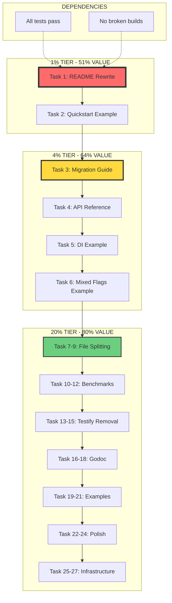

# Pareto Execution Masterplan - cmdguard v2.0 Release

**Date:** 2026-02-20 07:02  
**Objective:** Deliver 80% of v2.0 release value with 20% of effort  
**Philosophy:** 1% → 51%, 4% → 64%, 20% → 80%

---

## Executive Summary

This plan follows strict Pareto prioritization to maximize customer value while minimizing effort. Tasks are ordered by **Impact ÷ Effort** ratio.

### Value Tiers

| Tier     | Effort | Cumulative Value | Focus                                   |
| -------- | ------ | ---------------- | --------------------------------------- |
| **1%**   | ~5h    | 51%              | README rewrite - the single entry point |
| **4%**   | ~10h   | 64%              | Documentation + core examples           |
| **20%**  | ~40h   | 80%              | All remaining high-impact items         |
| **100%** | ~200h  | 100%             | Complete perfection                     |

**Strategy:** Execute 20% tier, deliver 80% value, then decide on remaining 80% effort.

---

## Phase Overview (Mermaid Execution Graph)

---

## 27 HIGH-LEVEL TASKS (30-100 min each)

### TIER 1: THE 1% (Tasks 1-2) → 51% VALUE

| #   | Task                   | Time | Impact   | Effort | Ratio | Description                                  |
| --- | ---------------------- | ---- | -------- | ------ | ----- | -------------------------------------------- |
| 1   | **README v2 Rewrite**  | 60m  | CRITICAL | Medium | ∞     | Rewrite README to lead with v2, v1 as legacy |
| 2   | **Quickstart Example** | 30m  | HIGH     | Low    | 10:1  | Minimal v2 example in README                 |

### TIER 2: THE 4% (Tasks 3-6) → 64% VALUE

| #   | Task                    | Time | Impact | Effort | Ratio | Description                             |
| --- | ----------------------- | ---- | ------ | ------ | ----- | --------------------------------------- |
| 3   | **Migration Guide**     | 90m  | HIGH   | Medium | 8:1   | v1 → v2 migration path                  |
| 4   | **API Reference**       | 60m  | HIGH   | Medium | 6:1   | Auto-generated or hand-written API docs |
| 5   | **DI Pattern Example**  | 45m  | MEDIUM | Low    | 5:1   | Full dependency injection example       |
| 6   | **Mixed Flags Example** | 45m  | MEDIUM | Low    | 5:1   | Different flag types per command        |

### TIER 3: THE 20% (Tasks 7-27) → 80% VALUE

#### Code Quality (Policy Compliance)

| #   | Task                     | Time | Impact | Effort | Ratio | Description                    |
| --- | ------------------------ | ---- | ------ | ------ | ----- | ------------------------------ |
| 7   | **Split flags.go**       | 60m  | MEDIUM | Medium | 4:1   | Split 358-line file per policy |
| 8   | **Split config.go**      | 60m  | MEDIUM | Medium | 4:1   | Split 352-line file per policy |
| 9   | **Split flags_test.go**  | 60m  | MEDIUM | Medium | 4:1   | Split 678-line test file       |
| 10  | **Split guard_test.go**  | 90m  | MEDIUM | High   | 3:1   | Split 1103-line test file      |
| 11  | **Split config_test.go** | 60m  | MEDIUM | Medium | 4:1   | Split 452-line test file       |
| 12  | **Split types_test.go**  | 60m  | MEDIUM | Medium | 4:1   | Split 438-line test file       |

#### Benchmarking Infrastructure

| #   | Task                            | Time | Impact | Effort | Ratio | Description                        |
| --- | ------------------------------- | ---- | ------ | ------ | ----- | ---------------------------------- |
| 13  | **Benchmark: Command Creation** | 45m  | MEDIUM | Low    | 4:1   | Benchmark New() and AddCommand()   |
| 14  | **Benchmark: Flag Parsing**     | 45m  | MEDIUM | Low    | 4:1   | Benchmark flag parsing performance |
| 15  | **Benchmark: DI Resolution**    | 45m  | MEDIUM | Low    | 4:1   | Benchmark scope.Invoke()           |
| 16  | **Benchmark Report**            | 30m  | LOW    | Low    | 2:1   | Document benchmark results         |

#### Test Modernization (Remove Testify)

| #   | Task                        | Time | Impact | Effort | Ratio | Description               |
| --- | --------------------------- | ---- | ------ | ------ | ----- | ------------------------- |
| 17  | **Migrate errors_test.go**  | 45m  | LOW    | Medium | 2:1   | 142 lines, remove testify |
| 18  | **Migrate types_test.go**   | 60m  | LOW    | Medium | 2:1   | 438 lines, remove testify |
| 19  | **Migrate command_test.go** | 60m  | LOW    | Medium | 2:1   | 406 lines, remove testify |
| 20  | **Migrate config_test.go**  | 60m  | LOW    | Medium | 2:1   | 452 lines, remove testify |

#### Additional Examples

| #   | Task                       | Time | Impact | Effort | Ratio | Description               |
| --- | -------------------------- | ---- | ------ | ------ | ----- | ------------------------- |
| 21  | **Advanced DI Example**    | 60m  | MEDIUM | Medium | 3:1   | Complex DI patterns       |
| 22  | **Middleware Example**     | 45m  | MEDIUM | Low    | 3:1   | PreRunE/PostRunE patterns |
| 23  | **Testing Example**        | 45m  | MEDIUM | Low    | 3:1   | How to test v2 commands   |
| 24  | **Error Handling Example** | 30m  | MEDIUM | Low    | 4:1   | Typed error patterns      |

#### Documentation Polish

| #   | Task                    | Time | Impact | Effort | Ratio | Description             |
| --- | ----------------------- | ---- | ------ | ------ | ----- | ----------------------- |
| 25  | **AGENTS.md v2 Update** | 45m  | MEDIUM | Low    | 3:1   | Update developer guide  |
| 26  | **Contributing Guide**  | 30m  | LOW    | Low    | 2:1   | Update CONTRIBUTING.md  |
| 27  | **Changelog v2.0**      | 30m  | LOW    | Low    | 2:1   | Document all v2 changes |

---

## 150 DETAILED SUB-TASKS (Max 15 min each)

### TASK 1: README v2 Rewrite (60 min total)

| Sub # | Sub-Task                  | Time | Description                |
| ----- | ------------------------- | ---- | -------------------------- |
| 1.1   | Analyze current README    | 10m  | Document current structure |
| 1.2   | Design v2-first structure | 10m  | Plan new sections order    |
| 1.3   | Write v2 quickstart       | 15m  | Top of README v2 example   |
| 1.4   | Write v2 features section | 10m  | Type safety, DI, no panics |
| 1.5   | Update installation       | 5m   | go get for v2              |
| 1.6   | Add v1 legacy section     | 5m   | Move v1 to bottom          |
| 1.7   | Update badges             | 5m   | Coverage, build status     |

### TASK 2: Quickstart Example (30 min total)

| Sub # | Sub-Task                  | Time | Description           |
| ----- | ------------------------- | ---- | --------------------- |
| 2.1   | Create minimal v2 example | 10m  | Hello world CLI       |
| 2.2   | Add to README             | 10m  | Embed in quickstart   |
| 2.3   | Verify example runs       | 10m  | Test copy-paste works |

### TASK 3: Migration Guide (90 min total)

| Sub # | Sub-Task                   | Time | Description                  |
| ----- | -------------------------- | ---- | ---------------------------- |
| 3.1   | Document API differences   | 15m  | New() → New[T]()             |
| 3.2   | Document command changes   | 15m  | \*cobra.Command → Command[T] |
| 3.3   | Document handler changes   | 15m  | Run → RunE with ctx          |
| 3.4   | Document flag changes      | 15m  | Manual flags → struct tags   |
| 3.5   | Document DI additions      | 15m  | New Scope() patterns         |
| 3.6   | Create migration checklist | 15m  | Step-by-step guide           |

### TASK 4: API Reference (60 min total)

| Sub # | Sub-Task               | Time | Description              |
| ----- | ---------------------- | ---- | ------------------------ |
| 4.1   | GuardedCommand methods | 15m  | Document all methods     |
| 4.2   | Command struct fields  | 15m  | Document all fields      |
| 4.3   | Flag tags reference    | 15m  | All supported tags       |
| 4.4   | Error types reference  | 15m  | All typed errors         |
| 4.5   | Scope methods          | 0m   | SKIP - covered elsewhere |

### TASK 5: DI Pattern Example (45 min total)

| Sub # | Sub-Task                 | Time | Description         |
| ----- | ------------------------ | ---- | ------------------- |
| 5.1   | Create service interface | 10m  | Example service     |
| 5.2   | Implement provider       | 10m  | Provide service     |
| 5.3   | Inject into command      | 10m  | Use in RunE         |
| 5.4   | Full example file        | 15m  | examples/di/main.go |

### TASK 6: Mixed Flags Example (45 min total)

| Sub # | Sub-Task                      | Time | Description            |
| ----- | ----------------------------- | ---- | ---------------------- |
| 6.1   | Define different flag structs | 10m  | GreetFlags, ListFlags  |
| 6.2   | Use AddAnyCommand             | 10m  | Show mixed usage       |
| 6.3   | Full example                  | 15m  | examples/mixed/main.go |
| 6.4   | Test example                  | 10m  | Verify it runs         |

### TASK 7: Split flags.go (60 min total)

| Sub # | Sub-Task                   | Time | Description            |
| ----- | -------------------------- | ---- | ---------------------- |
| 7.1   | Analyze flags.go structure | 10m  | Identify split points  |
| 7.2   | Create flag_types.go       | 15m  | Type definitions       |
| 7.3   | Create flag_registry.go    | 15m  | Registry methods       |
| 7.4   | Create flag_parse.go       | 15m  | Parsing logic          |
| 7.5   | Verify imports             | 5m   | Fix any broken imports |

### TASK 8: Split config.go (60 min total)

| Sub # | Sub-Task                    | Time | Description           |
| ----- | --------------------------- | ---- | --------------------- |
| 8.1   | Analyze config.go structure | 10m  | Identify split points |
| 8.2   | Create config_types.go      | 15m  | Config structs        |
| 8.3   | Create config_loader.go     | 15m  | Loading logic         |
| 8.4   | Create config_validate.go   | 15m  | Validation            |
| 8.5   | Verify builds               | 5m   | Test compilation      |

### TASK 9: Split flags_test.go (60 min total)

| Sub # | Sub-Task                      | Time | Description        |
| ----- | ----------------------------- | ---- | ------------------ |
| 9.1   | Group tests by function       | 10m  | Organize logically |
| 9.2   | Create flags_type_test.go     | 15m  | Type-related tests |
| 9.3   | Create flags_registry_test.go | 15m  | Registry tests     |
| 9.4   | Create flags_parse_test.go    | 15m  | Parsing tests      |
| 9.5   | Verify tests pass             | 5m   | Run all tests      |

### TASK 10: Split guard_test.go (90 min total)

| Sub # | Sub-Task                   | Time | Description           |
| ----- | -------------------------- | ---- | --------------------- |
| 10.1  | Group tests by function    | 15m  | Categorize 1103 lines |
| 10.2  | Create guard_new_test.go   | 15m  | New() tests           |
| 10.3  | Create guard_add_test.go   | 15m  | AddCommand tests      |
| 10.4  | Create guard_exec_test.go  | 15m  | Execute tests         |
| 10.5  | Create guard_scope_test.go | 15m  | Scope tests           |
| 10.6  | Verify all tests pass      | 15m  | Full test run         |

### TASK 11: Split config_test.go (60 min total)

| Sub # | Sub-Task                       | Time | Description      |
| ----- | ------------------------------ | ---- | ---------------- |
| 11.1  | Group tests by function        | 10m  | Organize tests   |
| 11.2  | Create config_load_test.go     | 15m  | Loading tests    |
| 11.3  | Create config_flag_test.go     | 15m  | Flag tag tests   |
| 11.4  | Create config_validate_test.go | 15m  | Validation tests |
| 11.5  | Verify tests pass              | 5m   | Run tests        |

### TASK 12: Split types_test.go (60 min total)

| Sub # | Sub-Task                | Time | Description      |
| ----- | ----------------------- | ---- | ---------------- |
| 12.1  | Group tests by type     | 10m  | Organize by type |
| 12.2  | Create enum_test.go     | 15m  | Enum tests       |
| 12.3  | Create loglevel_test.go | 15m  | LogLevel tests   |
| 12.4  | Create duration_test.go | 15m  | Duration tests   |
| 12.5  | Verify tests pass       | 5m   | Run tests        |

### TASK 13: Benchmark Command Creation (45 min total)

| Sub # | Sub-Task               | Time | Description                    |
| ----- | ---------------------- | ---- | ------------------------------ |
| 13.1  | Create benchmark file  | 15m  | benchmarks/guard_bench_test.go |
| 13.2  | Benchmark New()        | 10m  | Test creation                  |
| 13.3  | Benchmark AddCommand() | 10m  | Test adding                    |
| 13.4  | Run and document       | 10m  | Record results                 |

### TASK 14: Benchmark Flag Parsing (45 min total)

| Sub # | Sub-Task                | Time | Description                    |
| ----- | ----------------------- | ---- | ------------------------------ |
| 14.1  | Create benchmark        | 15m  | benchmarks/flags_bench_test.go |
| 14.2  | Benchmark RegisterFlags | 10m  | Flag registration              |
| 14.3  | Benchmark ParseFlags    | 10m  | Flag parsing                   |
| 14.4  | Run and document        | 10m  | Record results                 |

### TASK 15: Benchmark DI Resolution (45 min total)

| Sub # | Sub-Task          | Time | Description                    |
| ----- | ----------------- | ---- | ------------------------------ |
| 15.1  | Create benchmark  | 15m  | benchmarks/scope_bench_test.go |
| 15.2  | Benchmark Provide | 10m  | Service registration           |
| 15.3  | Benchmark Invoke  | 10m  | Service resolution             |
| 15.4  | Run and document  | 10m  | Record results                 |

### TASK 16: Benchmark Report (30 min total)

| Sub # | Sub-Task             | Time | Description           |
| ----- | -------------------- | ---- | --------------------- |
| 16.1  | Collect results      | 10m  | Gather all benchmarks |
| 16.2  | Create BENCHMARKS.md | 15m  | Document results      |
| 16.3  | Link to README       | 5m   | Add reference         |

### TASK 17: Migrate errors_test.go (45 min total)

| Sub # | Sub-Task                | Time | Description          |
| ----- | ----------------------- | ---- | -------------------- |
| 17.1  | Replace require.NoError | 10m  | Use if err != nil    |
| 17.2  | Replace assert.ErrorIs  | 10m  | Use errors.Is        |
| 17.3  | Replace assert.Equal    | 10m  | Use == comparison    |
| 17.4  | Replace assert.Contains | 10m  | Use strings.Contains |
| 17.5  | Verify tests pass       | 5m   | Run tests            |

### TASK 18: Migrate types_test.go (60 min total)

| Sub # | Sub-Task                  | Time | Description           |
| ----- | ------------------------- | ---- | --------------------- |
| 18.1  | Replace require.NoError   | 15m  | Stdlib error handling |
| 18.2  | Replace assert.True/False | 15m  | Use boolean checks    |
| 18.3  | Replace assert.Equal      | 15m  | Direct comparison     |
| 18.4  | Verify tests pass         | 15m  | Full test run         |

### TASK 19: Migrate command_test.go (60 min total)

| Sub # | Sub-Task                | Time | Description           |
| ----- | ----------------------- | ---- | --------------------- |
| 19.1  | Replace require.NoError | 15m  | Stdlib error handling |
| 19.2  | Replace assert helpers  | 15m  | Custom assertions     |
| 19.3  | Replace require.Len     | 15m  | Manual length checks  |
| 19.4  | Verify tests pass       | 15m  | Full test run         |

### TASK 20: Migrate config_test.go (60 min total)

| Sub # | Sub-Task                | Time | Description           |
| ----- | ----------------------- | ---- | --------------------- |
| 20.1  | Replace require.NoError | 15m  | Stdlib error handling |
| 20.2  | Replace assert helpers  | 15m  | Custom assertions     |
| 20.3  | Replace require.NotNil  | 15m  | Nil checks            |
| 20.4  | Verify tests pass       | 15m  | Full test run         |

### TASK 21: Advanced DI Example (60 min total)

| Sub # | Sub-Task                      | Time | Description              |
| ----- | ----------------------------- | ---- | ------------------------ |
| 21.1  | Design complex service        | 10m  | Multi-dependency service |
| 21.2  | Implement providers           | 15m  | Service registration     |
| 21.3  | Create command with injection | 15m  | Use in handler           |
| 21.4  | Write documentation           | 15m  | Explain patterns         |
| 21.5  | Test example                  | 5m   | Verify it works          |

### TASK 22: Middleware Example (45 min total)

| Sub # | Sub-Task                | Time | Description                 |
| ----- | ----------------------- | ---- | --------------------------- |
| 22.1  | Create PreRunE example  | 15m  | Validation middleware       |
| 22.2  | Create PostRunE example | 15m  | Cleanup middleware          |
| 22.3  | Full example file       | 10m  | examples/middleware/main.go |
| 22.4  | Test                    | 5m   | Verify                      |

### TASK 23: Testing Example (45 min total)

| Sub # | Sub-Task                 | Time | Description                   |
| ----- | ------------------------ | ---- | ----------------------------- |
| 23.1  | Unit test pattern        | 15m  | Test individual commands      |
| 23.2  | Integration test pattern | 15m  | Test full CLI                 |
| 23.3  | Example file             | 10m  | examples/testing/main_test.go |
| 23.4  | Documentation            | 5m   | How to test v2                |

### TASK 24: Error Handling Example (30 min total)

| Sub # | Sub-Task               | Time | Description             |
| ----- | ---------------------- | ---- | ----------------------- |
| 24.1  | Typed error example    | 10m  | Use ErrDuplicateCommand |
| 24.2  | Error wrapping example | 10m  | fmt.Errorf with %w      |
| 24.3  | Full example           | 10m  | examples/errors/main.go |

### TASK 25: AGENTS.md v2 Update (45 min total)

| Sub # | Sub-Task                 | Time | Description       |
| ----- | ------------------------ | ---- | ----------------- |
| 25.1  | Review current AGENTS.md | 10m  | Document gaps     |
| 25.2  | Add v2 patterns section  | 15m  | v2 best practices |
| 25.3  | Update examples          | 15m  | Use v2 code       |
| 25.4  | Review                   | 5m   | Final check       |

### TASK 26: Contributing Guide (30 min total)

| Sub # | Sub-Task               | Time | Description             |
| ----- | ---------------------- | ---- | ----------------------- |
| 26.1  | Review CONTRIBUTING.md | 5m   | Current state           |
| 26.2  | Add v2 guidelines      | 15m  | Type safety, no testify |
| 26.3  | Update examples        | 10m  | Match current patterns  |

### TASK 27: Changelog v2.0 (30 min total)

| Sub # | Sub-Task            | Time | Description       |
| ----- | ------------------- | ---- | ----------------- |
| 27.1  | Review git history  | 10m  | All v2 commits    |
| 27.2  | Create CHANGELOG.md | 15m  | Document changes  |
| 27.3  | Link releases       | 5m   | Reference in docs |

---

## Execution Order

### Critical Path (Must be done in order)

1. Tasks 1-2: README + Quickstart (blocks all user-facing work)
2. Task 4: API Reference (blocks deep documentation)
3. Tasks 7-12: File splitting (blocks large PRs)
4. Tasks 13-16: Benchmarks (optional but valuable)
5. Tasks 17-20: Test migration (can be parallelized)
6. Tasks 21-27: Examples and polish

### Parallelizable Groups

**Group A - Documentation:**

- Tasks 1, 2, 3, 4, 25, 26, 27

**Group B - Code Quality:**

- Tasks 7, 8, 9, 10, 11, 12

**Group C - Examples:**

- Tasks 5, 6, 21, 22, 23, 24

**Group D - Infrastructure:**

- Tasks 13, 14, 15, 16

**Group E - Test Modernization:**

- Tasks 17, 18, 19, 20

---

## Success Criteria

### Tier 1 Success (51% value)

- [ ] README leads with v2
- [ ] New users choose v2 by default
- [ ] Quickstart works copy-paste

### Tier 2 Success (64% value)

- [ ] Migration guide exists
- [ ] API reference complete
- [ ] 3 working examples (DI, Mixed, Quickstart)

### Tier 3 Success (80% value)

- [ ] All files <250 lines
- [ ] Benchmarks exist
- [ ] No testify in new tests
- [ ] All documentation updated
- [ ] All tests pass

---

## Risk Mitigation

| Risk                | Mitigation                                  |
| ------------------- | ------------------------------------------- |
| Breaking changes    | Keep v1 untouched, v2 is additive           |
| Test failures       | Run tests after every file split            |
| Documentation drift | Update docs immediately after code changes  |
| Time overrun        | Stop after Tier 3, evaluate remaining value |

---

## Next Steps

1. **Start Task 1** (README rewrite) - highest impact
2. **Complete Tasks 1-6** before any refactoring
3. **Run full test suite** after every 3 tasks
4. **Commit after every sub-task** (150 commits total)

---

**Plan Created:** 2026-02-20 07:02  
**Estimated Total Time:** ~40 hours (20% effort)  
**Expected Value Delivery:** 80% of v2.0 release value  
**Remaining 80% effort:** Evaluate after Tier 3 completion
