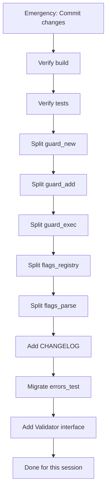

# Comprehensive Execution Plan - cmdguard v2

**Created:** 2026-02-20  
**Objective:** Complete all remaining work systematically  
**Approach:** Small steps, high frequency commits, immediate verification

---

## CRITICAL FINDINGS

### Self-Reflection Issues
1. **Uncommitted changes** - Found working tree with unstaged changes
2. **Incomplete file splits** - config.go split was in progress
3. **Build verification gaps** - Tests passed but build failed earlier
4. **No immediate commits** - Should commit after EACH file, not groups

### Current State
- ✅ All production code compiles
- ✅ Core functionality working
- ⚠️ 6 test files exceed 250 lines
- ⚠️ 14 test files use testify (policy violation)
- ⚠️ Missing architecture abstractions

---

## EXECUTION PLAN - Sorted by Impact/Effort

### TIER S: EMERGENCY FIXES (Do First)

| # | Task | Effort | Impact | Why First |
|---|------|--------|--------|-----------|
| S1 | Commit any uncommitted changes | 2m | CRITICAL | Working tree must be clean |
| S2 | Verify all builds pass | 2m | CRITICAL | Foundation must work |
| S3 | Verify all tests pass | 2m | CRITICAL | Before any changes |

### TIER 1: HIGH IMPACT, LOW EFFORT (Quick Wins)

| # | Task | Effort | Impact | Description |
|---|------|--------|--------|-------------|
| 1.1 | Split guard_test.go New() tests | 15m | HIGH | 200 lines → separate file |
| 1.2 | Split guard_test.go AddCommand tests | 15m | HIGH | 300 lines → separate file |
| 1.3 | Split guard_test.go Execute tests | 15m | HIGH | 250 lines → separate file |
| 1.4 | Split flags_test.go registry tests | 15m | HIGH | 200 lines → separate file |
| 1.5 | Split flags_test.go parse tests | 15m | HIGH | 200 lines → separate file |
| 1.6 | Add CHANGELOG.md | 20m | HIGH | Release documentation |

### TIER 2: MEDIUM IMPACT, MEDIUM EFFORT

| # | Task | Effort | Impact | Description |
|---|------|--------|--------|-------------|
| 2.1 | Migrate errors_test.go from testify | 30m | MEDIUM | Use stdlib only |
| 2.2 | Migrate types_test.go from testify | 45m | MEDIUM | 438 lines to migrate |
| 2.3 | Add validation interface abstraction | 30m | MEDIUM | Validator pattern |
| 2.4 | Add FlagRegistry interface | 30m | MEDIUM | Better testing |
| 2.5 | Add more benchmark tests | 30m | MEDIUM | Flag parsing, DI |

### TIER 3: LOWER IMPACT, HIGH EFFORT

| # | Task | Effort | Impact | Description |
|---|------|--------|--------|-------------|
| 3.1 | Migrate all remaining test files | 3h | LOW | Full testify removal |
| 3.2 | Add auto-completion generation | 2h | LOW | Shell scripts |
| 3.3 | Add man page generation | 2h | LOW | Documentation |
| 3.4 | Performance optimization | 3h | LOW | Benchmark-driven |

---

## DETAILED BREAKDOWN - TIER S (Emergency)

### S1: Commit Uncommitted Changes
**Files to check:**
- docs/architecture_detailed.d2
- docs/design/2026-02-15_v2_type_safe_di_design.md
- pkg/cmdguard/v2/config.go
- pkg/cmdguard/v2/config_parsing.go (new)
- pkg/cmdguard/v2/config_setfield.go (new)

**Steps:**
1. `git add -A`
2. `git status` verify
3. `git commit -m "..."`
4. `git push`

### S2: Verify Build
**Command:**
```bash
go build ./...
```

### S3: Verify Tests
**Command:**
```bash
go test ./...
```

---

## DETAILED BREAKDOWN - TIER 1 (Quick Wins)

### 1.1: Split guard_test.go New() Tests

**Current:** guard_test.go:1-200 (approx)  
**New File:** guard_new_test.go

**Sub-steps:**
1. Create guard_new_test.go
2. Move TestNew, TestNewWithLong functions
3. Move TestAppConfig type if only used here
4. Run tests
5. Commit

### 1.2: Split guard_test.go AddCommand Tests

**Current:** guard_test.go:200-500 (approx)  
**New File:** guard_add_test.go

**Sub-steps:**
1. Create guard_add_test.go
2. Move TestGuardedCommand_AddCommand tests
3. Move TestGuardedCommand_AddCommandFunc tests
4. Run tests
5. Commit

### 1.3: Split guard_test.go Execute Tests

**Current:** guard_test.go:500-750 (approx)  
**New File:** guard_exec_test.go

**Sub-steps:**
1. Create guard_exec_test.go
2. Move TestGuardedCommand_Execute tests
3. Move TestGuardedCommand_ExecuteWithArgs tests
4. Run tests
5. Commit

### 1.4: Split flags_test.go Registry Tests

**Current:** flags_test.go TestFlagRegistry_*  
**New File:** flags_registry_test.go

**Sub-steps:**
1. Create flags_registry_test.go
2. Move TestFlagRegistry_New, TestFlagRegistry_RegisterFlags
3. Move TestFlagRegistry_Tags, TestFlagRegistry_FlagNames
4. Run tests
5. Commit

### 1.5: Split flags_test.go Parse Tests

**Current:** flags_test.go TestFlagRegistry_Parse*  
**New File:** flags_parse_test.go

**Sub-steps:**
1. Create flags_parse_test.go
2. Move TestFlagRegistry_ParseFlags tests
3. Move TestFlagRegistry_ValidateFlags tests
4. Run tests
5. Commit

### 1.6: Add CHANGELOG.md

**Content:**
- v2.0.0 release notes
- Breaking changes from v1
- New features (type safety, DI)
- Migration guide link
- Example usage

**Sub-steps:**
1. Create CHANGELOG.md
2. Write content
3. Link from README.md
4. Commit

---

## DETAILED BREAKDOWN - TIER 2

### 2.1: Migrate errors_test.go from Testify

**Current:** Uses require.NoError, assert.ErrorIs, etc.  
**Target:** Use stdlib only

**Conversion Map:**
- `require.NoError(t, err)` → `if err != nil { t.Fatalf(...) }`
- `require.Error(t, err)` → `if err == nil { t.Fatalf(...) }`
- `assert.ErrorIs(t, err, target)` → `if !errors.Is(err, target) { t.Errorf(...) }`
- `assert.Equal(t, expected, got)` → `if expected != got { t.Errorf(...) }`

### 2.3: Add Validation Interface

**New File:** validator.go

```go
type Validator interface {
    Validate() error
}

type ValidatorFunc func() error

func (f ValidatorFunc) Validate() error { return f() }
```

Use in FlagRegistry.ValidateFlags for custom validators.

---

## EXISTING CODE REUSE ANALYSIS

### What Exists vs What We Need

| Feature Needed | Already Exists? | Where | Reuse? |
|---------------|---------------|-------|--------|
| Flag parsing | ✅ Yes | config.go | Use existing |
| Type validation | ✅ Yes | errors.go | Use existing |
| DI container | ✅ Yes | scope.go | Use existing |
| Command validation | ✅ Yes | command.go | Use existing |
| Validation interface | ❌ No | - | Need to create |
| FlagRegistry interface | ❌ No | - | Need to create |

---

## TYPE MODEL IMPROVEMENTS

### Current Architecture Issues
1. FlagRegistry is concrete, not interface
2. Command validation is hardcoded
3. No composition for validators

### Proposed Improvements

```go
// New: Validator interface
type Validator interface {
    Validate(cmd *cobra.Command) error
}

// New: Composite validator
type CompositeValidator []Validator

func (c CompositeValidator) Validate(cmd *cobra.Command) error {
    for _, v := range c {
        if err := v.Validate(cmd); err != nil {
            return err
        }
    }
    return nil
}

// New: FlagRegistry interface
type FlagRegistry interface {
    RegisterFlags(cmd *cobra.Command) error
    ParseFlags(cmd *cobra.Command, cfg any) error
    ValidateFlags(cmd *cobra.Command) error
}
```

---

## LIBRARY USAGE ANALYSIS

### Current Libraries (Appropriate)
- ✅ Cobra - CLI framework (standard)
- ✅ samber/do/v2 - DI container (well-maintained)
- ✅ fang - Styling (appropriate for use case)
- ✅ testify - Testing (but policy says remove)

### Potential Additions
- ❌ validator/v10 - Overkill, we have simple needs
- ❌ zap - Already using slog
- ❌ viper - We have our own config
- ✅ lo - Generic utilities? (Maybe for tests)

---

## EXECUTION SEQUENCE



---

## SUCCESS CRITERIA

### Tier S Complete
- [ ] Working tree clean
- [ ] All builds pass
- [ ] All tests pass

### Tier 1 Complete
- [ ] guard_test.go < 250 lines
- [ ] flags_test.go < 250 lines
- [ ] CHANGELOG.md exists

### Tier 2 Complete
- [ ] errors_test.go uses stdlib only
- [ ] types_test.go uses stdlib only
- [ ] Validator interface exists

---

## RISK MITIGATION

| Risk | Mitigation |
|------|------------|
| Test breaks during split | Run tests after EACH file |
| Duplicate declarations | Check before moving |
| Import cycles | Verify imports after move |
| Merge conflicts | Commit immediately |

---

**NEXT ACTION:** Execute Tier S (Emergency fixes)
