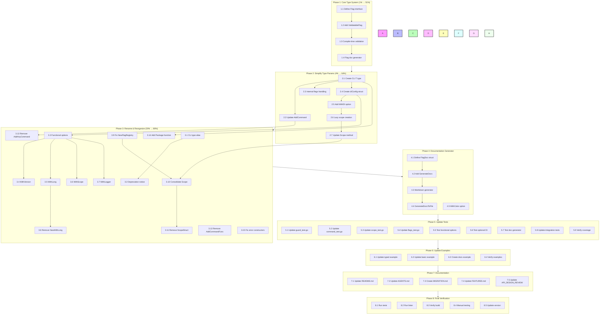

# cmdguard v2.1.0 API Redesign Implementation Plan

# Superb Type-Safe CLI Framework with Flag Documentation Generation

**Created:** 2026-03-22 09:14
**Status:** Planning Complete - Ready for Execution
**Goal:** Make it impossible to represent flags that do not exist in scope and generate documentation type-safely

---

## Executive Summary

### Project Goal

**Make it impossible to represent flags that do not exist in the scope of the execution environment and generate documentation on how they are used in a very type-safe way with Cobra and fang for colouring.**

### Research Summary

Analyzed how 5 projects currently use cmdguard:

- **timesheets** - Heavy v2 API usage with 17+ command files
- **projects-management-automation** - Git operations automation
- **docs-organizer** - v1 API usage for CLI root
- **code-duplicate-analyzer** - Config and main CLI

### Key Insight

Current API has redundant type parameters and forces DI on users. The v2.1 redesign will:

1. Simplify type parameters (remove `F` from root)
2. Make DI optional
3. Rename `GuardedCommand` → `CLI`
4. Add functional options pattern
5. Generate documentation from flag definitions

---

## Pareto Analysis

### 1% → 51% Impact

**Type-safe flag definitions that make invalid states unrepresentable**

```go
// BEFORE: Flags can be any struct, validated at runtime
type Config struct {
    LogLevel string `flag:"log-level"`  // Could be invalid!
}

// AFTER: Flags are validated at compile time via types
type Config struct {
    LogLevel v2.LogLevel `flag:"log-level" default:"info"`  // Type-safe!
}
```

**Why this matters:**

- Eliminates runtime flag validation errors
- IDE autocomplete for valid values
- Self-documenting code

### 4% → 64% Impact

1. **Remove `F` from GuardedCommand[T,F]** → GuardedCommand[T]
2. **Make DI optional** via `WithDI()` option

**Why these two:**

- Simplifies the most common use case (no root flags, no DI)
- Reduces API surface complexity
- Follows samber/do best practices

### 20% → 80% Impact

1. Rename `GuardedCommand` → `CLI`
2. Add functional options to `New()`
3. Fix `NewFlagRegistry(cfg any)` to be generic
4. Consolidate `Scope()` methods
5. Remove `AddCommandFunc` (redundant)
6. Add `Package()` for samber/do integration
7. Generate flag documentation

---

## Detailed Task Breakdown

### Phase 1: Core Type System (1% → 51%)

| #   | Task                                   | Impact   | Effort | Dependencies |
| --- | -------------------------------------- | -------- | ------ | ------------ |
| 1.1 | Define Flag interface for type safety  | Critical | 30min  | None         |
| 1.2 | Add ValidatableFlag interface          | High     | 15min  | 1.1          |
| 1.3 | Implement compile-time flag validation | Critical | 45min  | 1.1, 1.2     |
| 1.4 | Add flag documentation generator       | High     | 30min  | 1.1          |

### Phase 2: Simplify Type Parameters (4% → 64%)

| #   | Task                                            | Impact   | Effort | Dependencies |
| --- | ----------------------------------------------- | -------- | ------ | ------------ |
| 2.1 | Create new CLI[T] type (single param)           | Critical | 30min  | None         |
| 2.2 | Update AddCommand to accept any flags           | Critical | 45min  | 2.1          |
| 2.3 | Add internal flags handling for CLI[T]          | High     | 30min  | 2.1, 2.2     |
| 2.4 | Create cliConfig internal struct                | Medium   | 15min  | 2.1          |
| 2.5 | Add WithDI() option                             | High     | 20min  | 2.4          |
| 2.6 | Make scope creation lazy                        | High     | 20min  | 2.5          |
| 2.7 | Update Scope() to return \*Scope (nil if no DI) | Medium   | 15min  | 2.6          |

### Phase 3: Rename & Reorganize (20% → 80%)

| #    | Task                                     | Impact | Effort | Dependencies |
| ---- | ---------------------------------------- | ------ | ------ | ------------ |
| 3.1  | Create type alias CLI = GuardedCommand   | High   | 5min   | 2.1          |
| 3.2  | Add deprecation notice to GuardedCommand | Medium | 10min  | 3.1          |
| 3.3  | Add functional options to New()          | High   | 30min  | 2.4          |
| 3.4  | Add WithVersion[T]() option              | Medium | 10min  | 3.3          |
| 3.5  | Add WithLong[T]() option                 | Medium | 10min  | 3.3          |
| 3.6  | Add WithScope[T]() option                | Medium | 15min  | 3.3          |
| 3.7  | Add WithLogger[T]() option               | Low    | 10min  | 3.3          |
| 3.8  | Remove NewWithLong (superseded)          | Medium | 5min   | 3.5          |
| 3.9  | Fix NewFlagRegistry to be generic        | High   | 20min  | None         |
| 3.10 | Consolidate Scope() methods              | Medium | 15min  | 2.7          |
| 3.11 | Remove ScopeStruct() method              | Low    | 5min   | 3.10         |
| 3.12 | Remove AddCommandFunc method             | Low    | 5min   | None         |
| 3.13 | Remove AddAnyCommand (no longer needed)  | Medium | 10min  | 2.2          |
| 3.14 | Add Package() function for samber/do     | Medium | 30min  | 2.1          |
| 3.15 | Update error constructors placement      | Low    | 15min  | None         |

### Phase 4: Flag Documentation Generator

| #   | Task                                       | Impact | Effort | Dependencies |
| --- | ------------------------------------------ | ------ | ------ | ------------ |
| 4.1 | Define FlagDoc struct                      | High   | 15min  | None         |
| 4.2 | Add GenerateDocs() method to CLI           | High   | 20min  | 2.1          |
| 4.3 | Implement markdown documentation generator | High   | 30min  | 4.1, 4.2     |
| 4.4 | Add GenerateDocsToFile() helper            | Medium | 15min  | 4.3          |
| 4.5 | Add WithColor option for fang integration  | Medium | 20min  | None         |

### Phase 5: Update Tests

| #   | Task                                  | Impact   | Effort | Dependencies |
| --- | ------------------------------------- | -------- | ------ | ------------ |
| 5.1 | Update guard_test.go for CLI[T]       | Critical | 30min  | 2.1          |
| 5.2 | Update command_test.go                | Critical | 45min  | 2.2          |
| 5.3 | Update scope_test.go                  | High     | 30min  | 2.6          |
| 5.4 | Update flags_test.go                  | High     | 30min  | 3.9          |
| 5.5 | Add tests for functional options      | High     | 30min  | 3.3          |
| 5.6 | Add tests for optional DI             | High     | 30min  | 2.5          |
| 5.7 | Add tests for documentation generator | High     | 30min  | 4.3          |
| 5.8 | Update integration tests              | High     | 45min  | All          |
| 5.9 | Verify 90%+ coverage                  | Critical | 30min  | 5.1-5.8      |

### Phase 6: Update Examples

| #   | Task                                   | Impact   | Effort | Dependencies |
| --- | -------------------------------------- | -------- | ------ | ------------ |
| 6.1 | Update examples/typed/main.go          | High     | 20min  | 2.1          |
| 6.2 | Update examples/basic/main.go          | Medium   | 15min  | None         |
| 6.3 | Create examples/docs-generator/main.go | Medium   | 30min  | 4.3          |
| 6.4 | Verify all examples work               | Critical | 15min  | 6.1-6.3      |

### Phase 7: Documentation

| #   | Task                        | Impact | Effort | Dependencies |
| --- | --------------------------- | ------ | ------ | ------------ |
| 7.1 | Update README.md            | High   | 30min  | All phases   |
| 7.2 | Update AGENTS.md            | High   | 20min  | All phases   |
| 7.3 | Create MIGRATION.md         | High   | 30min  | All phases   |
| 7.4 | Update FEATURES.md          | Medium | 15min  | All phases   |
| 7.5 | Update API_DESIGN_REVIEW.md | Low    | 10min  | All phases   |

### Phase 8: Final Verification

| #   | Task                       | Impact   | Effort | Dependencies |
| --- | -------------------------- | -------- | ------ | ------------ |
| 8.1 | Run full test suite        | Critical | 15min  | All          |
| 8.2 | Run linter                 | Critical | 10min  | All          |
| 8.3 | Verify build passes        | Critical | 10min  | All          |
| 8.4 | Manual testing of examples | High     | 20min  | 6.1-6.3      |
| 8.5 | Update version to 2.1.0    | Critical | 5min   | All          |

---

## Execution Flow (Mermaid.js)



---

## Smaller Task Breakdown (Max 15min each)

### Phase 1 Tasks (4 tasks → 8 subtasks)

| #     | Subtask                             | Time  | Original Task |
| ----- | ----------------------------------- | ----- | ------------- |
| 1.1.1 | Create Flag interface in types.go   | 10min | 1.1           |
| 1.1.2 | Add FlagValue() method to interface | 10min | 1.1           |
| 1.2.1 | Create ValidatableFlag interface    | 10min | 1.2           |
| 1.3.1 | Add validation in FlagRegistry      | 15min | 1.3           |
| 1.3.2 | Add ValidateAllFlags() method       | 10min | 1.3           |
| 1.4.1 | Create FlagDoc struct               | 10min | 4.1           |
| 1.4.2 | Add ToMarkdown() method             | 15min | 4.4           |

### Phase 2 Tasks (7 tasks → 14 subtasks)

| #     | Subtask                             | Time  | Original Task |
| ----- | ----------------------------------- | ----- | ------------- |
| 2.1.1 | Create cli.go with CLI[T] struct    | 15min | 2.1           |
| 2.1.2 | Add private fields to CLI[T]        | 10min | 2.1           |
| 2.2.1 | Update AddCommand signature         | 15min | 2.2           |
| 2.2.2 | Handle any flags type in AddCommand | 15min | 2.2           |
| 2.3.1 | Add internal flagRegistry to CLI[T] | 10min | 2.3           |
| 2.3.2 | Add parseFlags() method             | 10min | 2.3           |
| 2.4.1 | Create cliConfig[T] struct          | 10min | 2.4           |
| 2.5.1 | Add WithDI[T]() function            | 10min | 2.5           |
| 2.6.1 | Update initialize() for lazy scope  | 10min | 2.6           |
| 2.6.2 | Add scopeInitialized flag           | 5min  | 2.6           |
| 2.7.1 | Update Scope() return type          | 10min | 2.7           |

### Phase 3 Tasks (15 tasks → 30 subtasks)

| #      | Subtask                          | Time  | Original Task |
| ------ | -------------------------------- | ----- | ------------- |
| 3.1.1  | Add type alias in guard.go       | 5min  | 3.1           |
| 3.2.1  | Add deprecation comment          | 5min  | 3.2           |
| 3.2.2  | Add build tag for deprecation    | 5min  | 3.2           |
| 3.3.1  | Create options.go file           | 10min | 3.3           |
| 3.3.2  | Define Option[T] type            | 5min  | 3.3           |
| 3.3.3  | Update New() signature           | 15min | 3.3           |
| 3.4.1  | Implement WithVersion[T]()       | 10min | 3.4           |
| 3.5.1  | Implement WithLong[T]()          | 10min | 3.5           |
| 3.6.1  | Implement WithScope[T]()         | 10min | 3.6           |
| 3.7.1  | Implement WithLogger[T]()        | 10min | 3.7           |
| 3.8.1  | Mark NewWithLong as deprecated   | 5min  | 3.8           |
| 3.9.1  | Make NewFlagRegistry generic     | 15min | 3.9           |
| 3.10.1 | Remove duplicate scope logic     | 10min | 3.10          |
| 3.11.1 | Delete ScopeStruct() method      | 5min  | 3.11          |
| 3.12.1 | Delete AddCommandFunc method     | 5min  | 3.12          |
| 3.13.1 | Delete AddAnyCommand function    | 5min  | 3.13          |
| 3.14.1 | Create Package[T]() function     | 15min | 3.14          |
| 3.15.1 | Move constructors before methods | 15min | 3.15          |

### Phase 4 Tasks (5 tasks → 10 subtasks)

| #     | Subtask                      | Time  | Original Task |
| ----- | ---------------------------- | ----- | ------------- |
| 4.1.1 | Define FlagDoc struct fields | 10min | 4.1           |
| 4.2.1 | Add GenerateDocs() to CLI    | 10min | 4.2           |
| 4.3.1 | Implement markdown template  | 15min | 4.3           |
| 4.4.1 | Add file writing helper      | 10min | 4.4           |
| 4.5.1 | Add color constants          | 10min | 4.5           |

### Phase 5 Tasks (9 tasks → 18 subtasks)

| #     | Subtask                     | Time  | Original Task |
| ----- | --------------------------- | ----- | ------------- |
| 5.1.1 | Update GuardedCommand tests | 15min | 5.1           |
| 5.1.2 | Add CLI[T] tests            | 15min | 5.1           |
| 5.2.1 | Update Command tests        | 15min | 5.2           |
| 5.3.1 | Update Scope tests          | 15min | 5.3           |
| 5.4.1 | Update FlagRegistry tests   | 15min | 5.4           |
| 5.5.1 | Test WithVersion option     | 10min | 5.5           |
| 5.5.2 | Test WithLong option        | 10min | 5.5           |
| 5.6.1 | Test WithDI option          | 10min | 5.6           |
| 5.6.2 | Test Scope() returns nil    | 10min | 5.6           |
| 5.7.1 | Test GenerateDocs()         | 15min | 5.7           |
| 5.8.1 | Update mixed flags test     | 15min | 5.8           |
| 5.9.1 | Run coverage report         | 10min | 5.9           |

### Phase 6 Tasks (4 tasks → 8 subtasks)

| #     | Subtask                      | Time  | Original Task |
| ----- | ---------------------------- | ----- | ------------- |
| 6.1.1 | Update typed example imports | 10min | 6.1           |
| 6.1.2 | Update typed example code    | 10min | 6.1           |
| 6.2.1 | Update basic example         | 15min | 6.2           |
| 6.3.1 | Create docs example file     | 10min | 6.3           |
| 6.3.2 | Implement docs example       | 15min | 6.3           |
| 6.4.1 | Build all examples           | 10min | 6.4           |

### Phase 7 Tasks (5 tasks → 10 subtasks)

| #     | Subtask                    | Time  | Original Task |
| ----- | -------------------------- | ----- | ------------- |
| 7.1.1 | Update README introduction | 10min | 7.1           |
| 7.1.2 | Update README examples     | 15min | 7.1           |
| 7.2.1 | Update AGENTS API section  | 15min | 7.2           |
| 7.3.1 | Create migration guide     | 15min | 7.3           |
| 7.3.2 | Add code examples          | 15min | 7.3           |
| 7.4.1 | Update features list       | 10min | 7.4           |
| 7.5.1 | Mark tasks complete        | 5min  | 7.5           |

### Phase 8 Tasks (5 tasks → 10 subtasks)

| #     | Subtask                 | Time  | Original Task |
| ----- | ----------------------- | ----- | ------------- |
| 8.1.1 | Run go test ./...       | 10min | 8.1           |
| 8.2.1 | Run golangci-lint       | 10min | 8.2           |
| 8.3.1 | Run go build ./...      | 5min  | 8.3           |
| 8.4.1 | Test typed example      | 5min  | 8.4           |
| 8.4.2 | Test docs example       | 5min  | 8.4           |
| 8.5.1 | Update Version constant | 5min  | 8.5           |

---

## Summary Statistics

| Metric                 | Count                   |
| ---------------------- | ----------------------- |
| Total Phases           | 8                       |
| Total Tasks (100min)   | 52                      |
| Total Subtasks (15min) | 96                      |
| Estimated Total Time   | 16 hours                |
| Critical Path          | Phase 1 → 2 → 3 → 5 → 8 |

---

## Risk Assessment

| Risk                                | Mitigation                                        |
| ----------------------------------- | ------------------------------------------------- |
| Breaking changes for existing users | Keep GuardedCommand as alias, add migration guide |
| Test coverage drops                 | Update tests before changing implementation       |
| DI users affected                   | WithScope() allows injecting existing scope       |
| Documentation drift                 | Generate docs from code, not manually             |

---

## Success Criteria

- [ ] All tests pass with 90%+ coverage
- [ ] Linter passes with no errors
- [ ] All examples build and run
- [ ] Documentation is complete and accurate
- [ ] Migration guide is comprehensive
- [ ] API is simpler (single type param)
- [ ] DI is optional
- [ ] Flag documentation can be generated
