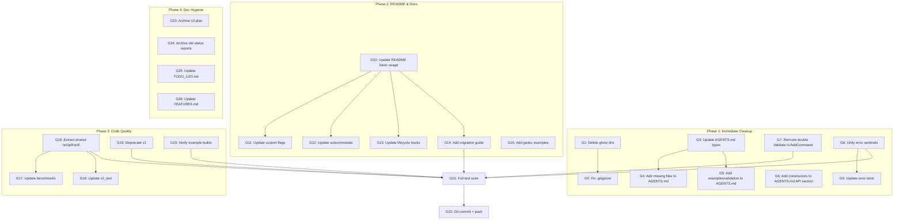

# Post-Refactor Audit & Polish Sprint

**Date:** 2026-04-17
**Status:** Planning
**Context:** All `Command[T,F]` struct fields are now unexported with constructors. 25 files converted. All 14 test packages pass. Now: audit, clean up, polish.

---

## 0. Brutally Honest Retrospective

### What We Forgot / Did Wrong
1. **Double validation** — `NewCommand` calls `Validate()`, then `AddCommand` calls `Validate()` again. O(n²) for nested commands. The constructor already guarantees validity, so `AddCommand` re-validating is redundant work.
2. **Split-brain error sentinels** — `cli.go:186` uses `ErrInvalidCommand` for empty name, but `command.go:241` uses `ErrMissingName` for the same failure. Two different sentinel errors for one concept.
3. **AGENTS.md is stale** — Lists `types.go` (doesn't exist), misses `config.go`, `config_setfield.go`, `middleware.go`, `cli_options.go`, `cli_command.go`, `cli_accessors.go`, all `types_*.go` splits, `examples/validation/`.
4. **Empty ghost directories** — `advanced-flags/` and `di/` at project root. Leftover artifacts.
5. **`.gitignore` gap** — No entry for `examples/*/validation_example`.
6. **31 status reports and 6 planning docs** in docs/ — massive documentation rot. Most are session-specific artifacts.
7. **Test helper duplication** — `noOpRunE` defined in 3 packages (v2 internal, v2_test external, benchmarks). `makeHookRunE` vs `RecordingHook` serve the same purpose.
8. **Ghost documentation** — Plugin system discussed in 13 docs, zero implementation. v3 plan exists with no v3 code.
9. **No one asked about v1** — `pkg/cmdguard/guarded_command.go` is the v1 API. It still works, has tests, has examples. Is it legacy we should deprecate/remove, or keep?
10. **We didn't update README** — README still shows struct literal patterns, not constructor patterns.

### What Could Be Better
- The functional options all require `[T, F]` type params — verbose. Could explore if Go 1.26 type inference reduces this.
- No benchmarks comparing pre/post refactor performance.
- No migration guide for users upgrading from struct literals to constructors.

### Did We Lie?
No. All stated completed work was verified with `go test ./... -race`.

---

## 1. Comprehensive Execution Plan (30-100 min tasks)

| # | Task | Impact | Effort | Category |
|---|------|--------|--------|----------|
| A1 | Remove double validation in AddCommand | High | Low | Architecture |
| A2 | Unify error sentinels (ErrInvalidCommand vs ErrMissingName for name) | Medium | Low | Architecture |
| A3 | Update AGENTS.md project structure to match reality | Medium | Low | Docs |
| A4 | Update README.md to show constructor patterns instead of struct literals | High | Medium | Docs |
| A5 | Clean up empty ghost directories (advanced-flags/, di/ at root) | Low | Trivial | Cleanup |
| A6 | Add examples/*/validation_example to .gitignore | Low | Trivial | Cleanup |
| A7 | Consolidate test helpers — extract shared noOpRunE to testutil | Medium | Medium | Code Quality |
| A8 | Delete stale status/planning docs (keep only latest) | Low | Low | Cleanup |
| A9 | Add deprecation notice to v1 API (GuardedCommand) | Medium | Low | Architecture |
| A10 | Write migration guide (v2.0 struct literals → v2.1 constructors) | High | Medium | Docs |
| A11 | Benchmark: compare pre/post refactor perf | Medium | Medium | Perf |
| A12 | Remove or archive v3 planning doc | Low | Trivial | Cleanup |
| A13 | Verify all example binaries compile and run | Medium | Low | Verification |
| A14 | Add constructor examples to godoc | Medium | Low | Docs |

---

## 2. Granular Execution Plan (max 12 min each)

Sorted by: impact × urgency / effort

### Phase 1: Immediate Cleanup (Zero Risk, High Polish)

| # | Task | Impact | Effort | Depends |
|---|------|--------|--------|---------|
| G1 | Delete empty `advanced-flags/` and `di/` directories at root | Low | 1min | - |
| G2 | Add `examples/*/validation_example` to .gitignore | Low | 1min | - |
| G3 | Update AGENTS.md: replace `types.go` with actual `types_*.go` files | Medium | 5min | - |
| G4 | Update AGENTS.md: add missing files (config.go, middleware.go, etc.) | Medium | 5min | G3 |
| G5 | Update AGENTS.md: add `examples/validation/` to project tree | Medium | 2min | G3 |
| G6 | Update AGENTS.md: add Command constructors to "Key API signatures" section | High | 5min | - |
| G7 | Remove double Validate() call in AddCommand — constructor already validates | High | 3min | - |
| G8 | Unify error sentinel: cli.go empty-name should use ErrMissingName | Medium | 3min | - |
| G9 | Update errors_test.go to verify unified error sentinel | Medium | 3min | G8 |

### Phase 2: README & Documentation (High Customer Value)

| # | Task | Impact | Effort | Depends |
|---|------|--------|--------|---------|
| G10 | Update README.md "Basic Usage" to use NewCommand constructor | High | 5min | - |
| G11 | Update README.md "Command with Custom Flags" to use NewCommand | High | 5min | G10 |
| G12 | Update README.md "Subcommands" to use NewParentCommand | High | 5min | G10 |
| G13 | Update README.md "Lifecycle Hooks" to use WithPreRunE/WithPostRunE options | High | 5min | G10 |
| G14 | Add "Migration from v2.0 to v2.1" section to README | High | 8min | G10-G13 |
| G15 | Add godoc examples to NewCommand/NewParentCommand | Medium | 5min | - |

### Phase 3: Code Quality (Medium Impact)

| # | Task | Impact | Effort | Depends |
|---|------|--------|--------|---------|
| G16 | Extract noOpRunE to pkg/testutil/shared.go (used by 3 packages) | Medium | 8min | - |
| G17 | Update benchmarks to use shared noOpRunE from testutil | Low | 3min | G16 |
| G18 | Update v2_test to use shared noOpRunE from testutil | Low | 3min | G16 |
| G19 | Add deprecated build tag comment to v1 GuardedCommand | Medium | 2min | - |
| G20 | Verify all 5 example binaries compile: `go build ./examples/...` | Medium | 2min | - |
| G21 | Run full test suite after all changes | High | 5min | All |
| G22 | Git commit + push all changes | High | 2min | G21 |

### Phase 4: Documentation Hygiene (Low Priority)

| # | Task | Impact | Effort | Depends |
|---|------|--------|--------|---------|
| G23 | Move v3 planning doc to docs/planning/archive/ | Low | 2min | - |
| G24 | Archive status reports older than 2 weeks to docs/status/archive/ | Low | 5min | - |
| G25 | Update TODO_LIST.md: mark constructor refactor as done | Low | 2min | - |
| G26 | Update FEATURES.md: reflect constructor-based API | Medium | 5min | - |

---

## Mermaid Execution Graph

---

## Scope Boundaries

### In Scope
- Fix real architectural issues (double validation, split-brain errors)
- Update documentation to match reality (AGENTS.md, README)
- Clean up trivial artifacts (empty dirs, .gitignore gaps)
- Add migration guidance for library users

### Out of Scope (Scope Creop Traps)
- v3 API design or implementation
- Plugin system
- koanf config integration
- New features of any kind
- Refactoring the constructor type parameter verbosity (Go language limitation)
- Removing v1 API (still has users, just deprecate)
- Shell completion generation
- CI/CD pipeline changes

### Customer Value
This sprint delivers:
1. **Library users** get accurate README with constructor patterns, migration guide
2. **Library users** get slightly better performance (no double validation)
3. **Contributors** get accurate AGENTS.md reflecting reality
4. **Everyone** gets cleaner error messages (unified sentinels)
