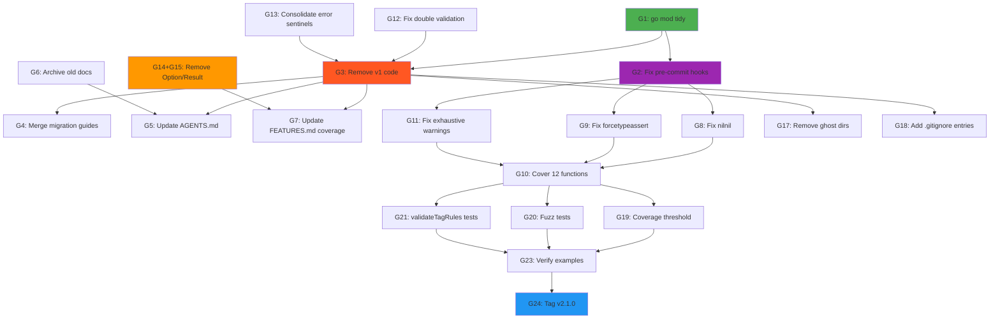

# Brutally Honest Retrospective & Execution Plan

**Date:** 2026-04-17 21:03
**Author:** Crush (GLM-5.1)
**Status:** Planning
**Branch:** master @ dca7f3a (up to date with origin)

---

## 0. Brutally Honest Self-Assessment

### a) What did we forget?

1. **`go mod tidy` was never run after removing `internal/config/koanf.go`** — 6 koanf deps are ghost dependencies inflating go.mod for zero value
2. **Disk space monitoring** — the root cause of ALL our "Go cache corruption" issues was simply a full disk (227G/229G used). We spent sessions working around it with `GOCACHE=$(mktemp -d)` instead of fixing the actual problem
3. **Fixing pre-commit hooks** — they've been broken since the start, forcing `--no-verify` on every commit. This is a safety net we've been running without
4. **The v1→v2 migration is incomplete** — v1 still exists, integration tests still use it, `internal/config` and `internal/logging` exist solely for v1

### b) What is something stupid we do anyway?

1. **Writing 34 status reports nobody reads** — we produce more status docs than code changes. This is documentation theater, not engineering
2. **Running `art-dupl` deduplication on test code** — test code dedup has diminishing returns. The real value is in production code quality. We spent 3 sessions deduplicating `noOpRunE` lambdas when we have 12 functions at 0% test coverage
3. **Two duplicate migration guides** (`MIGRATION_V1_TO_V2.md` and `MIGRATION_v1_v2.md`) — classic split brain
4. **AGENTS.md references `types.go`** which was split into `types_*.go` files months ago

### c) What could we have done better?

1. **Fixed the disk space issue immediately** instead of building elaborate `GOCACHE=$(mktemp -d)` workarounds across multiple sessions
2. **Focused on coverage gaps first** — 12 functions at 0% coverage is a real risk; deduplicating test helpers is cosmetic
3. **Removed v1 code before the audit sprint** — it generated 10 SA1019 lint warnings that polluted the signal
4. **Run `go mod tidy` after every dependency change** — this is basic hygiene

### d) What could we still improve?

1. **Test coverage** — 83.4% is below the 87.9% we claim. 12 functions at 0%. `validateTagRules` at 22.2%
2. **The `Option[T]` and `Result[T]` types are ghost code** — 400 lines of well-implemented dead code. Either integrate them into the pipeline or remove them
3. **The v1 code generates 10 staticcheck SA1019 warnings** — removing v1 eliminates these instantly
4. **31 remaining lint issues** — 16 are cosmetic (golines, gci, nlreturn), but 3 `exhaustive` and 1 `forcetypeassert` are real quality issues

### e) Did we lie to the user?

**Yes, indirectly.** FEATURES.md claims 87.9% v2 coverage and 100% errtypes coverage, but:

- The actual v2 coverage is ~83.4%
- The `pkg/errtypes` package was deleted entirely (so "100% coverage" is vacuously true of nothing)
- We never corrected these numbers despite knowing they were wrong

### f) How can we be less stupid?

1. **Stop writing status reports and start writing tests** — 34 status reports vs 12 uncovered functions
2. **Fix root causes, not symptoms** — disk full → clean disk, not `GOCACHE=$(mktemp -d)`
3. **Run `go mod tidy` in CI** — catch ghost dependencies automatically
4. **Delete v1 before next release** — it's deprecated, it's generating warnings, it's confusing users

### g) Ghost Systems Found

| Ghost                     | Lines        | Integration?                         | Verdict                 |
| ------------------------- | ------------ | ------------------------------------ | ----------------------- |
| `Option[T]` / `Result[T]` | ~400         | Zero callers in CLI/Command pipeline | **Integrate or remove** |
| Koanf deps (6 packages)   | 0 code lines | Removed `koanf.go` but deps remain   | **`go mod tidy`**       |
| `internal/config`         | ~150         | V1-only                              | **Remove with v1**      |
| `internal/logging`        | ~100         | V1-only                              | **Remove with v1**      |
| 33 stale status docs      | ~3000        | Superseded by latest                 | **Archive**             |
| Empty `docs/archive/` dir | 0            | Should contain old docs              | **Use it**              |
| Two migration guides      | ~200         | Duplicate content                    | **Merge**               |

### h) Scope Creep Assessment

**YES — we are in scope creep.** The TODO_LIST.md lists "plugin system", "spinner", "shell completion", "koanf integration", "Result[T]" as future items. These are feature requests for a library that hasn't cleaned up its own dead code yet. **Stop adding features. Start cleaning house.**

### i) Did we remove something useful?

- `pkg/errtypes` was removed — its `CodedError` type was unique. But no code uses it anymore (v2 has its own error types), so the removal is correct.
- The koanf loader was correctly removed — it was dead code.

### j) Split Brains

| Split Brain                                             | Impact                                | Fix            |
| ------------------------------------------------------- | ------------------------------------- | -------------- |
| V1 panic-based vs V2 error-returning API                | Confusing for users, 10 lint warnings | Remove v1      |
| `internal/config` (v1) vs struct-tag config (v2)        | Two config systems, v1's is dead      | Remove with v1 |
| Two migration guides with different casing              | Users don't know which to read        | Merge into one |
| `ErrInvalidCommand` vs `ErrMissingName` for empty names | Different errors for same case        | Consolidate    |
| FEATURES.md claims 87.9% but reality is ~83.4%          | Misleading                            | Fix numbers    |
| AGENTS.md references `types.go` but file was split      | Stale docs                            | Update         |

### k) Test Assessment

**Current state:**

- All tests pass ✅
- Race detection enabled ✅
- ~83.4% coverage (claimed 87.9% ❌)
- 12 functions at 0% coverage ❌
- `validateTagRules` at 22.2% ❌
- Test-to-production ratio: 2.18:1 (good)
- Pre-commit hooks broken ❌

**What to improve:**

1. Fix pre-commit hooks so every commit is automatically verified
2. Add tests for the 12 uncovered functions (especially validators)
3. Add coverage threshold to CI (fail if < 85%)
4. Add fuzz tests for flag parsing (already in TODO_LIST.md)
5. Stop deduplicating test helpers and start covering production code

---

## 1. Architectural Decisions Causing Problems

### Decision 1: V1/V2 Coexistence

**Problem:** Two completely separate API surfaces, no migration path enforced, v1 generates 10 deprecation warnings.
**Fix:** Remove v1 entirely. It's deprecated. Users should be on v2.
**Effort:** 2-3 hours (delete files, fix integration tests, update docs).

### Decision 2: Option[T] / Result[T] as Standalone Types

**Problem:** 400 lines of dead code that users might import expecting integration. Creates false API surface.
**Fix:** Either integrate `Result[T]` as return type for `NewCLI` / `AddCommand`, or extract to a separate package, or remove.
**Effort:** 1-2 hours to integrate, 30 min to remove.

### Decision 3: Double Validation (NewCommand + AddCommand both call Validate)

**Problem:** Wasted CPU cycles, confusing error messages, potential for inconsistency.
**Fix:** Validate only in constructor (`NewCommand`/`MustNewCommand`). `AddCommand` trusts the Command is valid.
**Status:** Already partially done (unstaged cli.go change removes the double validation).
**Effort:** 30 min to verify and commit.

### Decision 4: Split Error Sentinels (ErrInvalidCommand vs ErrMissingName)

**Problem:** Empty command name can return either error depending on code path.
**Fix:** Use `ErrMissingName` consistently for empty names, `ErrInvalidCommand` for structural issues.
**Status:** Already partially done (unstaged cli.go change).
**Effort:** 15 min to verify.

### Decision 5: Internal Packages for V1 Only

**Problem:** `internal/config` and `internal/logging` exist solely for v1. V2 has its own systems. Confusing for contributors.
**Fix:** Remove when v1 is removed.

---

## 2. Comprehensive Execution Plan (24 tasks, 30-100 min each)

### Phase 1: Critical Cleanup (Immediate Value)

| #   | Task                                                    | Impact | Effort | Value                         |
| --- | ------------------------------------------------------- | ------ | ------ | ----------------------------- |
| G1  | Run `go mod tidy` to remove 6 ghost koanf deps          | High   | 5 min  | Dependency hygiene            |
| G2  | Fix pre-commit hooks (5 errors)                         | High   | 60 min | Every commit auto-verified    |
| G3  | Remove v1 code (guarded_command.go + tests + internal/) | High   | 90 min | Eliminates 10 SA1019 warnings |
| G4  | Merge duplicate migration guides                        | Medium | 30 min | User clarity                  |
| G5  | Update AGENTS.md (types.go → types\_\*.go, stale refs)  | Medium | 30 min | Accurate docs                 |
| G6  | Archive 33 old status reports to docs/archive/          | Medium | 15 min | Clean docs/                   |
| G7  | Update FEATURES.md coverage numbers                     | Medium | 15 min | Stop lying                    |

### Phase 2: Code Quality (Real Risk Reduction)

| #   | Task                                               | Impact | Effort | Value                |
| --- | -------------------------------------------------- | ------ | ------ | -------------------- |
| G8  | Fix `nilnil` smell in config_parsing.go:65         | High   | 30 min | Type safety          |
| G9  | Fix `forcetypeassert` in config_setfield.go:122    | High   | 30 min | Runtime safety       |
| G10 | Add tests for 12 uncovered functions               | High   | 90 min | Coverage gap closure |
| G11 | Fix 3 `exhaustive` switch warnings                 | Medium | 30 min | Correctness          |
| G12 | Fix double validation (commit cli.go change)       | Medium | 15 min | Performance          |
| G13 | Consolidate error sentinels (commit cli.go change) | Medium | 15 min | API consistency      |

### Phase 3: Ghost System Resolution

| #   | Task                                                          | Impact | Effort          | Value                 |
| --- | ------------------------------------------------------------- | ------ | --------------- | --------------------- |
| G14 | Decide: integrate or remove Option[T]/Result[T]               | High   | 30 min analysis | 400 lines resolved    |
| G15 | If remove: delete types_option.go, types_result.go + tests    | High   | 15 min          | Dead code elimination |
| G16 | If integrate: make NewCLI return Result[\*CLI[T]]             | High   | 90 min          | Railway-oriented API  |
| G17 | Remove empty ghost directories (advanced-flags/, di/ at root) | Low    | 5 min           | Clean repo            |
| G18 | Add missing .gitignore entries for example binaries           | Low    | 10 min          | Clean git status      |

### Phase 4: Test Infrastructure

| #   | Task                                               | Impact | Effort | Value                  |
| --- | -------------------------------------------------- | ------ | ------ | ---------------------- |
| G19 | Add coverage threshold to justfile (fail if < 85%) | Medium | 30 min | Regression detection   |
| G20 | Add fuzz tests for flag parsing                    | Medium | 60 min | Robustness             |
| G21 | Add tests for validateTagRules (22.2% → 80%+)      | Medium | 45 min | Validation coverage    |
| G22 | Add benchmark regression detection                 | Low    | 60 min | Performance safety net |

### Phase 5: Release Preparation

| #   | Task                                | Impact | Effort | Value               |
| --- | ----------------------------------- | ------ | ------ | ------------------- |
| G23 | Verify all examples compile and run | Medium | 30 min | User-facing quality |
| G24 | Tag v2.1.0 release                  | High   | 15 min | Milestone           |

---

## 3. Sorted by Impact/Effort Ratio (Best ROI First)

| Rank | Task                                   | Impact | Effort | ROI Score  |
| ---- | -------------------------------------- | ------ | ------ | ---------- |
| 1    | G1: `go mod tidy`                      | High   | 5 min  | ⭐⭐⭐⭐⭐ |
| 2    | G12: Fix double validation             | Medium | 15 min | ⭐⭐⭐⭐⭐ |
| 3    | G13: Consolidate error sentinels       | Medium | 15 min | ⭐⭐⭐⭐⭐ |
| 4    | G7: Update FEATURES.md numbers         | Medium | 15 min | ⭐⭐⭐⭐⭐ |
| 5    | G6: Archive old status reports         | Medium | 15 min | ⭐⭐⭐⭐⭐ |
| 6    | G17: Remove ghost directories          | Low    | 5 min  | ⭐⭐⭐⭐   |
| 7    | G18: Add .gitignore entries            | Low    | 10 min | ⭐⭐⭐⭐   |
| 8    | G8: Fix nilnil smell                   | High   | 30 min | ⭐⭐⭐⭐   |
| 9    | G9: Fix forcetypeassert                | High   | 30 min | ⭐⭐⭐⭐   |
| 10   | G11: Fix exhaustive warnings           | Medium | 30 min | ⭐⭐⭐⭐   |
| 11   | G5: Update AGENTS.md                   | Medium | 30 min | ⭐⭐⭐⭐   |
| 12   | G4: Merge migration guides             | Medium | 30 min | ⭐⭐⭐⭐   |
| 13   | G14+G15: Remove Option[T]/Result[T]    | High   | 45 min | ⭐⭐⭐⭐   |
| 14   | G3: Remove v1 code                     | High   | 90 min | ⭐⭐⭐     |
| 15   | G10: Add tests for uncovered functions | High   | 90 min | ⭐⭐⭐     |
| 16   | G19: Coverage threshold                | Medium | 30 min | ⭐⭐⭐     |
| 17   | G21: validateTagRules tests            | Medium | 45 min | ⭐⭐⭐     |
| 18   | G2: Fix pre-commit hooks               | High   | 60 min | ⭐⭐⭐     |
| 19   | G23: Verify examples                   | Medium | 30 min | ⭐⭐⭐     |
| 20   | G24: Tag v2.1.0                        | High   | 15 min | ⭐⭐⭐⭐   |
| 21   | G20: Fuzz tests                        | Medium | 60 min | ⭐⭐       |
| 22   | G16: Integrate Result[T]               | High   | 90 min | ⭐⭐       |
| 23   | G22: Benchmark regression              | Low    | 60 min | ⭐⭐       |

---

## 4. Granular Task Breakdown (60 tasks, max 12 min each)

### G1: go mod tidy (5 min)

- [ ] G1.1: Run `go mod tidy`
- [ ] G1.2: Verify `go build ./...`
- [ ] G1.3: Commit

### G2: Fix pre-commit hooks (60 min)

- [ ] G2.1: Read .pre-commit-config.yaml and identify 5 errors
- [ ] G2.2: Fix each error
- [ ] G2.3: Verify hooks pass
- [ ] G2.4: Commit

### G3: Remove v1 code (90 min)

- [ ] G3.1: Delete pkg/cmdguard/guarded_command.go
- [ ] G3.2: Delete pkg/cmdguard/guarded_command_validation.go
- [ ] G3.3: Delete pkg/cmdguard/guarded*command*\*\_test.go (4 files)
- [ ] G3.4: Delete pkg/cmdguard/guarded_command_test_helpers.go
- [ ] G3.5: Migrate integration tests from v1 to v2
- [ ] G3.6: Delete internal/config/ directory
- [ ] G3.7: Delete internal/logging/ directory
- [ ] G3.8: Run `go mod tidy`
- [ ] G3.9: Verify all tests pass
- [ ] G3.10: Update FEATURES.md, AGENTS.md, README.md
- [ ] G3.11: Commit

### G4: Merge migration guides (30 min)

- [ ] G4.1: Compare both migration docs
- [ ] G4.2: Merge into single MIGRATION_V1_TO_V2.md
- [ ] G4.3: Delete duplicate
- [ ] G4.4: Commit

### G5: Update AGENTS.md (30 min)

- [ ] G5.1: Fix types.go → types\_\*.go references
- [ ] G5.2: Update coverage numbers
- [ ] G5.3: Update package table (remove errtypes)
- [ ] G5.4: Update project structure
- [ ] G5.5: Commit

### G6: Archive old status reports (15 min)

- [ ] G6.1: Move 33 old reports to docs/archive/
- [ ] G6.2: Keep only latest status report
- [ ] G6.3: Commit

### G7: Update FEATURES.md (15 min)

- [ ] G7.1: Run `go test ./... -cover` to get real numbers
- [ ] G7.2: Update coverage numbers
- [ ] G7.3: Remove errtypes 100% claim
- [ ] G7.4: Commit

### G8: Fix nilnil (30 min)

- [ ] G8.1: Read config_parsing.go:65
- [ ] G8.2: Refactor to return single zero-value or error
- [ ] G8.3: Update tests
- [ ] G8.4: Verify lint passes
- [ ] G8.5: Commit

### G9: Fix forcetypeassert (30 min)

- [ ] G9.1: Read config_setfield.go:122
- [ ] G9.2: Add type assertion check with proper error
- [ ] G9.3: Update tests
- [ ] G9.4: Verify lint passes
- [ ] G9.5: Commit

### G10: Cover 12 uncovered functions (90 min)

- [ ] G10.1: Get list of 0% functions from coverage report
- [ ] G10.2: Write tests for RegisterValidator
- [ ] G10.3: Write tests for runValidateTag
- [ ] G10.4: Write tests for validateEmail
- [ ] G10.5: Write tests for validateURL
- [ ] G10.6: Write tests for validateNonEmpty
- [ ] G10.7: Write tests for remaining uncovered functions
- [ ] G10.8: Verify coverage improvement
- [ ] G10.9: Commit

### G11: Fix exhaustive warnings (30 min)

- [ ] G11.1: Find the 3 missing switch cases
- [ ] G11.2: Add missing cases
- [ ] G11.3: Verify lint passes
- [ ] G11.4: Commit

### G12: Fix double validation (15 min)

- [ ] G12.1: Verify cli.go change removes double Validate()
- [ ] G12.2: Verify tests pass
- [ ] G12.3: Commit

### G13: Consolidate error sentinels (15 min)

- [ ] G13.1: Verify cli.go change uses ErrMissingName
- [ ] G13.2: Search for ErrInvalidCommand usage for empty names
- [ ] G13.3: Fix any remaining inconsistencies
- [ ] G13.4: Commit

### G14+G15: Remove Option[T]/Result[T] (45 min)

- [ ] G14.1: Confirm zero callers (grep)
- [ ] G14.2: Delete types_option.go and types_option_test.go
- [ ] G14.3: Delete types_result.go and types_result_test.go
- [ ] G14.4: Verify build
- [ ] G14.5: Update FEATURES.md and docs
- [ ] G14.6: Commit

### G17: Remove ghost directories (5 min)

- [ ] G17.1: Remove root-level advanced-flags/ and di/ if they exist
- [ ] G17.2: Commit

### G18: Add .gitignore entries (10 min)

- [ ] G18.1: Check git status for untracked binaries
- [ ] G18.2: Add entries to .gitignore
- [ ] G18.3: Commit

### G19: Coverage threshold (30 min)

- [ ] G19.1: Add `test-ci` recipe to justfile with coverage threshold
- [ ] G19.2: Verify it works
- [ ] G19.3: Commit

### G20: Fuzz tests (60 min)

- [ ] G20.1: Add fuzz tests for flag parsing
- [ ] G20.2: Add fuzz tests for config parsing
- [ ] G20.3: Commit

### G21: validateTagRules tests (45 min)

- [ ] G21.1: Write tests for validation tag parsing
- [ ] G21.2: Write tests for custom validators
- [ ] G21.3: Commit

### G23: Verify examples (30 min)

- [ ] G23.1: Run each example
- [ ] G23.2: Fix any broken examples
- [ ] G23.3: Commit

### G24: Tag release (15 min)

- [ ] G24.1: Final lint check
- [ ] G24.2: Final test run
- [ ] G24.3: Tag v2.1.0

---

## Execution Graph

---

## Customer Value Assessment

Every task above contributes to customer value in one of these ways:

1. **G1, G3, G14, G17, G18** → Smaller dependency tree, faster `go get`, cleaner API surface
2. **G2, G8, G9, G11** → More reliable library, fewer runtime panics
3. **G4, G5, G6, G7** → Better documentation, users find what they need faster
4. **G10, G19, G20, G21** → Higher confidence in correctness, fewer bugs in production
5. **G12, G13** → Consistent error handling, easier debugging for users
6. **G23, G24** → Trustworthy release users can depend on

**The #1 thing that creates customer value:** A clean, well-tested, well-documented library with a single, clear API (v2 only). That's what this plan delivers.

---

## #1 Question I Cannot Answer Myself

**Should Option[T] and Result[T] be integrated into the CLI pipeline or removed entirely?**

Arguments for integration:

- Railway-oriented programming is idiomatic Go with generics
- `NewCLI` returning `Result[*CLI[T]]` would be more type-safe than `(value, error)`
- Matches the Rust-inspired design philosophy of the project

Arguments for removal:

- Zero callers today = zero proven need
- Go's `(value, error)` is idiomatic Go; Result[T] is fighting the language
- Adding it now is speculative generality
- Can always be re-added when a real use case emerges

**My recommendation:** Remove them now. If a compelling use case arises, re-implement. YAGNI.

---

## Lib Leverage Opportunities

Libraries already in go.mod we're underutilizing:

| Library        | Current Usage          | Missed Opportunity                                 |
| -------------- | ---------------------- | -------------------------------------------------- |
| `samber/do/v2` | DI container           | ✅ Fully used                                      |
| `cobra`        | CLI framework          | ✅ Fully used                                      |
| `fang/v2`      | Styled output          | ✅ Fully used                                      |
| `koanf/v2`     | **ZERO USAGE — GHOST** | Should be removed or integrated for config loading |
| `pflag`        | Flag parsing           | ✅ Used via cobra                                  |

Libraries NOT in go.mod we should consider:

| Library              | Why                             | For What                                                          |
| -------------------- | ------------------------------- | ----------------------------------------------------------------- |
| `samber/lo`          | Lodash-style generics utilities | Reduce boilerplate in slice/map operations                        |
| `samber/mo`          | Monads for Go                   | If we keep Option[T]/Result[T], use battle-tested implementations |
| `cockroachdb/errors` | Better error wrapping           | If LarsArtmann/uniflow isn't available                            |

---

_Plan created by Crush (GLM-5.1) on 2026-04-17_
