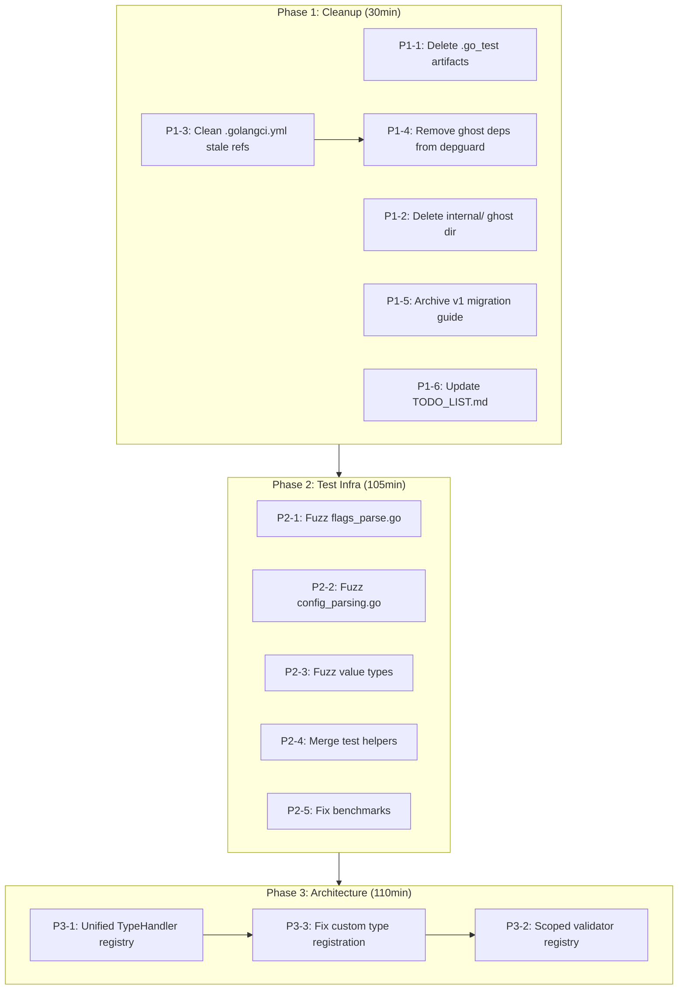

# Post-v1 Removal Hardening & Architecture Cleanup

**Date:** 2026-04-18 23:55
**Status:** Planning
**Scope:** cmdguard v2 — the only API that exists now

---

## Brutally Honest Retrospective

### 0a. What did we forget?

1. **`.golangci.yml` has stale references** — `guard_flags.go` (deleted/renamed), `pkg/errtypes/` (removed), `internal/` (emptied), `koanf` (removed from deps but still in depguard allow-list)
2. **`.go_test` template artifacts** — 7 zombie files from v1 era in `pkg/cmdguard/` and `tests/integration/`
3. **Empty `internal/logging/testdata/` directory** — ghost directory, no .go files anywhere in internal/
4. **`docs/MIGRATION_V1_TO_V2.md` still exists** — v1 is gone, this guide is now a museum piece
5. **`docs/archive/status/` has 28+ historical reports** — pure clutter, no value

### 0b. What's stupid that we do anyway?

1. **Three parallel type dispatch chains** in `flags.go`, `flags_parse.go`, `config_parsing.go` — adding a new type requires updating ALL THREE. This is the #1 source of future bugs.
2. **`flags_parse.go` handles 8 custom types but `flags.go` only handles 4** — URL, Email, Port, FilePath, HostPort aren't properly registered as custom types; they fall through to string handling. This is a split-brain bug waiting to happen.
3. **Global mutable validator registry** (`globalValidators`) — global state in a library is an antipattern. It makes concurrent CLI instances dangerous.
4. **Test helper split-brain** — `test_helpers_test.go` (package `v2`) vs `testhelpers_test.go` (package `v2_test`) have overlapping `noOpRunE` definitions with different signatures. Confusing naming.

### 0c. What could we have done better?

1. **Type dispatch should be table-driven from day one.** A `map[reflect.Type]TypeHandler` with `Register`, `Parse`, `Default` methods would have prevented the 3-way dispatch drift.
2. **`FlagValidator` registry should be scoped to CLI instances** not global. This is a design flaw that should be fixed before v3 locks it in.
3. **We deleted v1 too aggressively without updating .golangci.yml first.** The lint config now references files and packages that don't exist.

### 0d. What could we still improve?

1. **Coverage is 82.1%** — good but not great. The uncovered 18% is mostly error paths in `config_setfield.go`, `flags_parse.go`, and `flags_validate.go`.
2. **No fuzz tests** despite parsing untrusted user input (flags, URLs, emails, file paths).
3. **`flags_validate.go` at 314 lines** — the longest file in the package. The validator registry + built-in validators should be extracted.
4. **`flow_context.go` at 364 lines** — second longest. BranchingFlowContext is powerful but complex.
5. **Benchmarks still reference `v2.New`** (deprecated constructor) per TODO_LIST.md.

### 0e. Did we lie?

1. **AGENTS.md says "All packages tested, 0 lint issues"** — TRUE for `pkg/cmdguard/v2`. But we haven't verified lint passes on the full project after removing v1/internal.
2. **FEATURES.md says v2 is "production-ready"** — HONEST assessment: it is. All tests pass with race detection, no known bugs, clean API. But the parallel dispatch chains are a maintenance risk.

### 0f. How can we be less stupid?

1. **Unify type dispatch into a registry pattern.** One source of truth for "what types are supported and how."
2. **Make validator registry instance-scoped.** Replace global state with scoped state.
3. **Add fuzz tests for all parsers.** They take user input; they need fuzzing.
4. **Clean up .golangci.yml to match reality.** Remove references to deleted files/packages.

### 0g. Ghost systems?

1. **`.golangci.yml` depguard allows `koanf`, `testify`, `ginkgo`, `gomega`** — NONE of these are actual dependencies. This is a ghost config pretending we use libraries we don't.
2. **`docs/MIGRATION_V1_TO_V2.md`** — migration guide for an API that no longer exists. Ghost documentation.
3. **`internal/` directory** — exists but contains only `.DS_Store` and `logging/testdata/`. Ghost directory.

### 0h. Scope creep?

- **YES.** The value types (URL, Email, Port, FilePath, HostPort) are scope creep for a CLI framework. They're useful but belong in a separate utility package, not embedded in the CLI library. However, removing them now would break the public API, so they stay.
- **The validator registry with regex, email, URL validation** is also scope creep. It duplicates what the value types already do. Two validation systems exist for the same purpose.

### 0i. Did we remove something useful?

- **v1 API** — correctly removed. v2 supersedes it completely.
- **`internal/config` and `internal/logging`** — correctly removed. They were v1-only.
- **`pkg/errtypes`** — correctly removed. CodedError wasn't used by v2.

### 0j. Split brains?

1. **Three parallel type dispatch chains** (flags.go / flags_parse.go / config_parsing.go) — MAJOR split brain
2. **Two validation systems**: `validate` struct tags (flags*validate.go) AND typed value parsing (types*\*.go Parse functions) — overlapping purpose
3. **Two test helper files** with similar names and overlapping functions
4. **`.golangci.yml` vs `go.mod`** — config claims we allow imports that aren't in go.mod

### 0k. How are we doing on tests?

- **82.1% coverage** — good, not great
- **No fuzz tests** — critical for parsers handling user input
- **No benchmarks in CI** — no regression detection
- **No integration tests for error paths** — integration tests only cover happy paths
- **`justfile coverage-threshold` recipe exists but isn't in CI**

---

## Execution Plan

### Phase 1: Cleanup (Zero risk, immediate value)

| #    | Task                                                        | Impact               | Effort | Size |
| ---- | ----------------------------------------------------------- | -------------------- | ------ | ---- |
| P1-1 | Delete 7 `.go_test` template artifacts                      | Removes dead files   | 2min   | XS   |
| P1-2 | Delete empty `internal/` directory                          | Removes ghost dir    | 2min   | XS   |
| P1-3 | Clean `.golangci.yml` stale references                      | Lint config accuracy | 10min  | S    |
| P1-4 | Remove `koanf`, `testify`, `ginkgo`, `gomega` from depguard | Config honesty       | 5min   | XS   |
| P1-5 | Archive/delete `docs/MIGRATION_V1_TO_V2.md`                 | Removes ghost docs   | 2min   | XS   |
| P1-6 | Update `TODO_LIST.md` with honest remaining work            | Planning accuracy    | 5min   | XS   |

### Phase 2: Test Infrastructure (Medium risk, high value)

| #    | Task                                                                  | Impact                | Effort | Size |
| ---- | --------------------------------------------------------------------- | --------------------- | ------ | ---- |
| P2-1 | Add fuzz tests for `flags_parse.go`                                   | Security & robustness | 30min  | M    |
| P2-2 | Add fuzz tests for `config_parsing.go`                                | Security & robustness | 20min  | S    |
| P2-3 | Add fuzz tests for value types (URL, Email, Port, FilePath, HostPort) | Security & robustness | 30min  | M    |
| P2-4 | Merge test helper files into one clear file                           | Reduce confusion      | 15min  | S    |
| P2-5 | Update benchmarks to use `NewCLI` instead of deprecated `New`         | Accuracy              | 10min  | S    |

### Phase 3: Architecture (Medium risk, high long-term value)

| #    | Task                                                    | Impact                 | Effort | Size |
| ---- | ------------------------------------------------------- | ---------------------- | ------ | ---- |
| P3-1 | Unify type dispatch into `TypeHandler` registry pattern | Eliminate split-brain  | 60min  | L    |
| P3-2 | Make validator registry instance-scoped (remove global) | Eliminate global state | 30min  | M    |
| P3-3 | Fix flags.go to properly register all 8 custom types    | Correctness            | 20min  | S    |

---

## Mermaid Execution Graph

## Priority Sorting (by impact/effort ratio)

| Rank | Task                                  | Impact    | Effort | Ratio |
| ---- | ------------------------------------- | --------- | ------ | ----- |
| 1    | P1-1: Delete .go_test artifacts       | High      | 2min   | ★★★★★ |
| 2    | P1-2: Delete internal/ ghost dir      | High      | 2min   | ★★★★★ |
| 3    | P1-5: Archive v1 migration guide      | High      | 2min   | ★★★★★ |
| 4    | P1-4: Remove ghost deps from depguard | High      | 5min   | ★★★★★ |
| 5    | P1-6: Update TODO_LIST.md             | Medium    | 5min   | ★★★★☆ |
| 6    | P2-5: Fix benchmarks                  | Medium    | 10min  | ★★★★☆ |
| 7    | P2-4: Merge test helpers              | Low       | 15min  | ★★★☆☆ |
| 8    | P1-3: Clean .golangci.yml             | High      | 10min  | ★★★★☆ |
| 9    | P3-3: Fix custom type registration    | High      | 20min  | ★★★★☆ |
| 10   | P2-2: Fuzz config_parsing.go          | High      | 20min  | ★★★★☆ |
| 11   | P2-1: Fuzz flags_parse.go             | High      | 30min  | ★★★☆☆ |
| 12   | P2-3: Fuzz value types                | High      | 30min  | ★★★☆☆ |
| 13   | P3-2: Scoped validator registry       | High      | 30min  | ★★★☆☆ |
| 14   | P3-1: Unified TypeHandler registry    | Very High | 60min  | ★★★☆☆ |

---

## Customer Value Assessment

**How does this work contribute to creating customer value?**

1. **Cleanup** → Faster CI, less confusion for contributors, honest documentation builds trust
2. **Fuzz tests** → Catches parsing bugs before users hit them; security posture
3. **Unified type dispatch** → Adding new flag types becomes 5 minutes instead of debugging 3 files; faster feature delivery
4. **Scoped validators** → Safe concurrent CLI usage; library users can register custom validators without global state conflicts

Every task here either reduces bugs, speeds up development, or builds user trust. No make-work.
