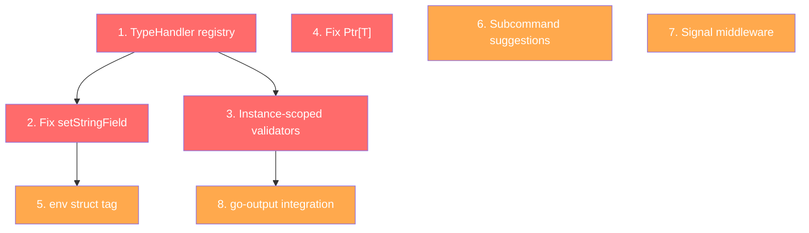
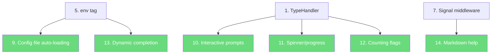

# cmdguard SUPERB CLI/TUI Roadmap

**Created:** 2026-04-30 01:09
**Status:** Planning Phase
**Goal:** Transform cmdguard from "solid CLI library" to "SUPERB CLI/TUI creation framework"

---

## Pareto Analysis

### The 1% That Delivers 51% of the Result

These are the foundational fixes that unblock EVERYTHING else. Without these, all other work is built on sand.

| # | Task | Impact | Why |
|---|------|--------|-----|
| 1 | **Unify TypeHandler registry** | Blocks env tags, config loading, custom types, plugin system | The 3-way split brain (flags.go / flags_parse.go / config_setfield.go) is the #1 architectural debt |
| 2 | **Fix `setStringField` missing types** | Bug fix — URL/Email/Port/FilePath/HostPort fail via SetField | Users hit ErrUnsupportedConversion for 5 of 9 custom types |
| 3 | **Instance-scoped validator registry** | Removes global mutable state | Concurrent tests flake; two CLIs share validators; blocks plugin system |
| 4 | **Fix `Ptr[T]` function** | Bug fix — returns zero-valued pointer instead of pointer to v | `Ptr(42)` returns `*int(0)` not `*int(42)` |

### The 4% That Delivers 64% of the Result

These are the high-impact features that make cmdguard genuinely superior to raw Cobra.

| # | Task | Impact | Why |
|---|------|--------|-----|
| 5 | **`env:"VAR"` struct tag** | 12-factor app compliance | Every serious CLI reads env vars. Zero-config override: config → env → flag → CLI |
| 6 | **Subcommand typo suggestions** | UX parity with Clap | Reuse existing Levenshtein code. 30 min for huge UX win |
| 7 | **Signal-aware context middleware** | Production readiness | Every long-running CLI needs Ctrl+C handling |
| 8 | **go-output integration** | Rich output in every CLI | 12 output formats (table/JSON/YAML/CSV/Markdown/D2/Mermaid/DOT/HTML/XML/TSV/tree) via go-output |

### The 20% That Delivers 80% of the Result

These complete the "SUPERB" experience.

| # | Task | Impact | Why |
|---|------|--------|-----|
| 9 | **Config file auto-loading (koanf)** | Production config chain | YAML/TOML/.env → struct via tags. The full 3-layer priority |
| 10 | **Interactive prompts (huh)** | TUI when needed | `WithPromptOnMissing` — ask instead of error |
| 11 | **Spinner/progress middleware** | Visual feedback | `WithSpinner[T]("Loading...")` option |
| 12 | **Counting flags (`-vvv`)** | Logging CLIs | `count:"true"` struct tag |
| 13 | **Dynamic shell completion** | Tab-complete | `WithCompletion[T,F]()` option |
| 14 | **Markdown help (glamour)** | Rich docs in terminal | Long descriptions rendered as markdown |
| 15 | **`$EDITOR` integration** | Config editing | `EditInEditor()` helper |
| 16 | **Fuzz tests for value types** | Security/safety | URL/Email/Port parsers are input boundaries |
| 17 | **Fix stale QUICKSTART.md** | Documentation | References non-existent API |
| 18 | **DI Pattern + Error Handling examples** | Documentation | Users need patterns |
| 19 | **Merge split test helpers** | Code health | Two files doing the same thing |
| 20 | **Clean up `.go_test` artifacts** | Code hygiene | Leftover template artifacts |
| 21 | **Benchmark regression detection** | Performance | Catch regressions early |
| 22 | **Fuzz tests for flags_parse + config_parsing** | Robustness | Input boundary testing |
| 23 | **Integer truncation fix (32-bit safety)** | Portability | int64→int truncation on 32-bit |
| 24 | **`WithColor` rename to `WithFang`** | API clarity | Current name is misleading |
| 25 | **Man page generation wiring** | Enterprise feature | Already in dep tree via fang |
| 26 | **Telemetry middleware (OpenTelemetry)** | Enterprise observability | Every command = a span |
| 27 | **CLI registration in DI scope** | DI completeness | Can't resolve *CLI[T] from DI |

---

## Execution Order

Tasks are ordered by: **unblocking power → impact → effort → risk**

### Phase 1: Foundation (1% → 51%) — ~3 hours

### Phase 2: Features (4% → 64%) — ~4 hours

### Phase 3: Polish (20% → 80%) — ~3 hours

### Full Dependency Graph

```mermaid
graph TD
    T1["1. TypeHandler registry<br/>⏱ 90min"] --> T2["2. Fix setStringField<br/>⏱ 30min"]
    T1 --> T3["3. Instance-scoped validators<br/>⏱ 45min"]
    T1 --> T5["5. env struct tag<br/>⏱ 60min"]
    T1 --> T8["8. go-output integration<br/>⏱ 60min"]
    T1 --> T10["10. Interactive prompts<br/>⏱ 90min"]
    T1 --> T11["11. Spinner/progress<br/>⏱ 60min"]
    T1 --> T12["12. Counting flags<br/>⏱ 30min"]
    T4["4. Fix Ptr[T]<br/>⏱ 10min"]
    T6["6. Subcommand suggestions<br/>⏱ 30min"]
    T7["7. Signal middleware<br/>⏱ 45min"]
    T5 --> T9["9. Config file auto-loading<br/>⏱ 90min"]
    T5 --> T13["13. Dynamic completion<br/>⏱ 60min"]
    T14["14. Markdown help<br/>⏱ 45min"]
    T15["15. $EDITOR integration<br/>⏱ 30min"]
    T16["16. Fuzz tests - value types<br/>⏱ 60min"]
    T17["17. Fix QUICKSTART.md<br/>⏱ 30min"]
    T18["18. DI + Error examples<br/>⏱ 45min"]
    T19["19. Merge test helpers<br/>⏱ 30min"]
    T20["20. Clean .go_test artifacts<br/>⏱ 15min"]
    T21["21. Benchmark regression<br/>⏱ 30min"]
    T22["22. Fuzz tests - parsing<br/>⏱ 45min"]
    T23["23. 32-bit int safety<br/>⏱ 30min"]
    T24["24. WithColor→WithFang<br/>⏱ 30min"]
    T25["25. Man page wiring<br/>⏱ 30min"]
    T26["26. Telemetry middleware<br/>⏱ 60min"]
    T27["27. CLI in DI scope<br/>⏱ 30min"]

    style T1 fill:#ff6b6b,color:#fff
    style T2 fill:#ff6b6b,color:#fff
    style T3 fill:#ff6b6b,color:#fff
    style T4 fill:#ff6b6b,color:#fff
    style T5 fill:#ffa94d,color:#fff
    style T6 fill:#ffa94d,color:#fff
    style T7 fill:#ffa94d,color:#fff
    style T8 fill:#ffa94d,color:#fff
    style T9 fill:#69db7c,color:#fff
    style T10 fill:#69db7c,color:#fff
    style T11 fill:#69db7c,color:#fff
    style T12 fill:#69db7c,color:#fff
    style T13 fill:#69db7c,color:#fff
    style T14 fill:#69db7c,color:#fff
    style T15 fill:#74c0fc,color:#fff
    style T16 fill:#74c0fc,color:#fff
    style T17 fill:#74c0fc,color:#fff
    style T18 fill:#74c0fc,color:#fff
    style T19 fill:#74c0fc,color:#fff
    style T20 fill:#74c0fc,color:#fff
    style T21 fill:#74c0fc,color:#fff
    style T22 fill:#74c0fc,color:#fff
    style T23 fill:#74c0fc,color:#fff
    style T24 fill:#74c0fc,color:#fff
    style T25 fill:#74c0fc,color:#fff
    style T26 fill:#74c0fc,color:#fff
    style T27 fill:#74c0fc,color:#fff
```

---

## 27-Task Breakdown (~30-100 min each)

| # | Task | Phase | Est | Impact | Effort | Dependencies | Description |
|---|------|-------|-----|--------|--------|-------------|-------------|
| 1 | TypeHandler registry | P1 | 90m | ★★★★★ | High | — | Unify type dispatch from 3 files into `TypeHandler` registry. New file `type_handler.go`. Each custom type registers: register, parse, set, default. Eliminates switch-casts in flags.go, flags_parse.go, config_setfield.go, config_parsing.go |
| 2 | Fix setStringField | P1 | 30m | ★★★★ | Low | #1 | Add URL/Email/Port/FilePath/HostPort to `setStringField` via TypeHandler. Currently returns ErrUnsupportedConversion for 5/9 custom types |
| 3 | Instance-scoped validators | P1 | 45m | ★★★★ | Med | #1 | Move `globalValidators` map into `FlagRegistry`. Add `RegisterValidator` method on FlagRegistry. Keep package-level as deprecated alias. Wire through CLI[T] → FlagRegistry |
| 4 | Fix Ptr[T] | P1 | 10m | ★★★ | Low | — | Change `new(v)` to `&v` in type_helpers.go. Add test verifying `Ptr(42)` returns `*42` |
| 5 | env struct tag | P2 | 60m | ★★★★★ | Med | #1 | Add `env:"VAR"` tag support. Parse in ParseFlagTags. Apply in ParseFlags: check env → fallback to default. Priority: flag > env > default. Add `WithEnvPrefix[T]("APP_")` option |
| 6 | Subcommand suggestions | P2 | 30m | ★★★★ | Low | — | Add `SuggestCommand(available []string, input string) string` using existing Levenshtein. Hook into unknown command error path in cli_command.go |
| 7 | Signal middleware | P2 | 45m | ★★★★ | Low | — | Add `SignalMiddleware[T]()` that sets up context cancellation on SIGINT/SIGTERM. Add `WithSignalHandling[T]()` CLI option |
| 8 | go-output integration | P2 | 60m | ★★★★★ | Med | #1 | Add `go-output` as dependency. New file `output.go` with `WithOutputFormat[T,F](format)` option, `OutputResult(ctx, data)` helper, auto-format from `--output` flag |
| 9 | Config file auto-loading | P2 | 90m | ★★★★★ | High | #5 | Add koanf integration. `WithConfigFile[T]("config.yaml")` option. Support YAML/TOML/JSON/env files. Merge: file → env → flag → CLI |
| 10 | Interactive prompts | P2 | 90m | ★★★★ | High | #1 | Add huh as dependency. `WithPromptOnMissing[T,F]()` option. When required flag missing, prompt interactively. New file `prompts.go` |
| 11 | Spinner/progress | P2 | 60m | ★★★ | Med | — | Add bubbles as dependency. `SpinnerMiddleware[T](msg)` middleware. `WithSpinner[T]("Loading...")` CLI option. Auto-spinner during RunE |
| 12 | Counting flags | P2 | 30m | ★★★ | Low | #1 | Add `count:"true"` struct tag. Maps to pflag.CountVarP in TypeHandler. `-vvv` → 3 |
| 13 | Dynamic completion | P3 | 60m | ★★★ | Med | #5 | Add `WithCompletion[T,F](func(ctx) ([]string, error))` option. Wire to Cobra ValidArgsFunction. Support Bash/Zsh/Fish/PowerShell |
| 14 | Markdown help | P3 | 45m | ★★★ | Low | — | Add glamour as dependency. Render Long descriptions as markdown in help. `WithMarkdownHelp[T]()` option |
| 15 | $EDITOR integration | P3 | 30m | ★★ | Low | — | Add `EditInEditor(content string) (string, error)` helper. Opens temp file in $EDITOR, reads back. Click.edit() pattern |
| 16 | Fuzz tests - value types | P3 | 60m | ★★★ | Med | — | Add fuzz tests for ParseURL, ParseEmail, ParsePort, ParseFilePath, ParseHostPort, ParseDuration |
| 17 | Fix QUICKSTART.md | P3 | 30m | ★★★ | Low | — | Update to use NewCLI, AddCommand standalone function, constructor pattern. Remove all v1 references |
| 18 | DI + Error examples | P3 | 45m | ★★★ | Low | — | Add examples/di-patterns/ and examples/error-handling/ with main.go + main_test.go |
| 19 | Merge test helpers | P3 | 30m | ★★ | Low | — | Merge test_helpers_test.go + testhelpers_test.go into single file. Remove duplicates |
| 20 | Clean .go_test artifacts | P3 | 15m | ★ | Low | — | Delete all `*_test.go_test` files in pkg/cmdguard/v2/ |
| 21 | Benchmark regression | P3 | 30m | ★★ | Med | — | Add benchmark comparison script. Store baseline. CI step that fails on >10% regression |
| 22 | Fuzz tests - parsing | P3 | 45m | ★★★ | Med | — | Add fuzz tests for flags_parse.go (ParseFlags), config_parsing.go (ParseFlagTags), config_setfield.go (SetField) |
| 23 | 32-bit int safety | P3 | 30m | ★★★ | Low | — | Fix parseAndSetInt/parseAndSetUint to preserve full int64/uint64 range. Use Convert instead of cast |
| 24 | WithColor→WithFang rename | P3 | 30m | ★★ | Low | — | Rename to WithFang. Deprecate WithColor with alias. Update all examples/tests |
| 25 | Man page wiring | P3 | 30m | ★★ | Low | — | Wire mango-cobra via fang. Add `WithManPages[T]()` option. Generate on `my help --man` |
| 26 | Telemetry middleware | P3 | 60m | ★★ | Med | — | Add `TelemetryMiddleware[T](provider)` with OpenTelemetry spans. Each command = span. Optional dependency |
| 27 | CLI in DI scope | P3 | 30m | ★★ | Low | — | Register `*CLI[T]` in DI scope during initialize(). Enables DI resolution of CLI from services |

**Total estimated time:** ~18 hours

---

## Micro-Task Breakdown (max 15 min each)

### Task 1: TypeHandler Registry (90 min → 7 subtasks)

| Sub | Micro-Task | Est |
|-----|-----------|-----|
| 1.1 | Create `type_handler.go` with `TypeHandler` interface (Register, Parse, Set, Default methods) | 15m |
| 1.2 | Implement `TypeHandler` for string, bool, int, int8-64, uint, uint8-64, float32, float64 | 15m |
| 1.3 | Implement `TypeHandler` for []string (slice) | 10m |
| 1.4 | Implement `TypeHandler` for Duration, Enum, LogLevel, LogFormat | 15m |
| 1.5 | Implement `TypeHandler` for URL, Email, Port, FilePath, HostPort | 15m |
| 1.6 | Create `typeRegistry` map + `registerTypeHandler` + `getTypeHandler` + `DefaultTypeRegistry()` | 10m |
| 1.7 | Refactor flags.go registerFlag to use TypeHandler dispatch | 10m |

### Task 2: Fix setStringField (30 min → 3 subtasks)

| Sub | Micro-Task | Est |
|-----|-----------|-----|
| 2.1 | Add URL handler to setStringField (via TypeHandler) | 10m |
| 2.2 | Add Email, Port, FilePath, HostPort handlers to setStringField | 10m |
| 2.3 | Add tests for SetField with all 9 custom types | 10m |

### Task 3: Instance-scoped validators (45 min → 4 subtasks)

| Sub | Micro-Task | Est |
|-----|-----------|-----|
| 3.1 | Add `validators map[string]FlagValidator` field to `FlagRegistry` | 10m |
| 3.2 | Add `RegisterValidator(name, fn)` method on FlagRegistry | 10m |
| 3.3 | Wire FlagRegistry validators through runValidateTag | 10m |
| 3.4 | Deprecate package-level RegisterValidator, add migration tests | 15m |

### Task 4: Fix Ptr[T] (10 min → 2 subtasks)

| Sub | Micro-Task | Est |
|-----|-----------|-----|
| 4.1 | Fix `Ptr[T]` to use `&v` instead of `new(v)` | 5m |
| 4.2 | Add test verifying Ptr(42), Ptr("hello"), Ptr(true) return correct values | 5m |

### Task 5: env struct tag (60 min → 5 subtasks)

| Sub | Micro-Task | Est |
|-----|-----------|-----|
| 5.1 | Add `Env string` field to `FlagTag` struct | 5m |
| 5.2 | Parse `env:"VAR"` tag in `parseFieldFlag` | 10m |
| 5.3 | Add `WithEnvPrefix[T]("APP_")` CLI option | 10m |
| 5.4 | Implement env lookup in ParseFlags: check flag changed → check env → fallback default | 15m |
| 5.5 | Add tests: env override, env prefix, env+flag priority, missing env | 15m |

### Task 6: Subcommand suggestions (30 min → 3 subtasks)

| Sub | Micro-Task | Est |
|-----|-----------|-----|
| 6.1 | Extract Levenshtein from flags_suggest.go into shared `suggest.go` | 10m |
| 6.2 | Add `SuggestCommand(available []string, input string) (string, bool)` | 10m |
| 6.3 | Hook into unknown command error in cli_command.go / cobra RunE | 10m |

### Task 7: Signal middleware (45 min → 4 subtasks)

| Sub | Micro-Task | Est |
|-----|-----------|-----|
| 7.1 | Create `middleware_signal.go` with `SignalMiddleware[T]()` | 15m |
| 7.2 | Implement context cancellation on SIGINT/SIGTERM using os/signal | 10m |
| 7.3 | Add `WithSignalHandling[T]()` CLI option that auto-adds the middleware | 10m |
| 7.4 | Add tests using fake signals | 10m |

### Task 8: go-output integration (60 min → 5 subtasks)

| Sub | Micro-Task | Est |
|-----|-----------|-----|
| 8.1 | Add `go-output` dependency to go.mod | 5m |
| 8.2 | Create `output.go` with `OutputFormat` type, `Format` flag type, `WithOutput[T]()` option | 15m |
| 8.3 | Add `OutputResult[T,F](ctx, data)` helper that renders in configured format | 15m |
| 8.4 | Add `--output` auto-flag when output option is set | 10m |
| 8.5 | Add example and tests for output integration | 15m |

### Task 9: Config file auto-loading (90 min → 7 subtasks)

| Sub | Micro-Task | Est |
|-----|-----------|-----|
| 9.1 | Add koanf + file parsers (YAML/TOML/JSON) as dependencies | 10m |
| 9.2 | Create `config_file.go` with file loading logic | 15m |
| 9.3 | Implement `WithConfigFile[T](path)` CLI option | 10m |
| 9.4 | Implement `WithConfigFileFlags[T]()` to add --config flag automatically | 10m |
| 9.5 | Implement merge chain: file → env → flag → CLI arg | 15m |
| 9.6 | Add support for .env file parsing | 10m |
| 9.7 | Add tests: YAML load, TOML load, priority chain, missing file, invalid file | 15m |

### Task 10: Interactive prompts (90 min → 7 subtasks)

| Sub | Micro-Task | Est |
|-----|-----------|-----|
| 10.1 | Add huh dependency to go.mod | 5m |
| 10.2 | Create `prompts.go` with prompt infrastructure | 15m |
| 10.3 | Implement `PromptString(label, default)` using huh.NewInput | 10m |
| 10.4 | Implement `PromptSelect(label, options)` using huh.NewSelect | 10m |
| 10.5 | Implement `PromptConfirm(label)` using huh.NewConfirm | 10m |
| 10.6 | Add `WithPromptOnMissing[T,F]()` command option | 15m |
| 10.7 | Add tests and example | 15m |

### Task 11: Spinner/progress (60 min → 5 subtasks)

| Sub | Micro-Task | Est |
|-----|-----------|-----|
| 11.1 | Add bubbles dependency to go.mod | 5m |
| 11.2 | Create `middleware_spinner.go` with spinner middleware | 15m |
| 11.3 | Add `WithSpinner[T](msg)` CLI option | 10m |
| 11.4 | Create `progress.go` with Progress helper type | 15m |
| 11.5 | Add tests and example | 10m |

### Task 12: Counting flags (30 min → 3 subtasks)

| Sub | Micro-Task | Est |
|-----|-----------|-----|
| 12.1 | Add `Count bool` field to `FlagTag`, parse `count:"true"` tag | 10m |
| 12.2 | Add counting flag handler to TypeHandler / registerFlag | 10m |
| 12.3 | Add tests: -vvv → 3, no flag → 0, single -v → 1 | 10m |

### Task 13: Dynamic completion (60 min → 5 subtasks)

| Sub | Micro-Task | Est |
|-----|-----------|-----|
| 13.1 | Add `WithCompletion[T,F](fn)` command option | 10m |
| 13.2 | Wire to Cobra ValidArgsFunction in cliToCobraCommand | 15m |
| 13.3 | Add shell completion generation helpers (bash, zsh, fish) | 15m |
| 13.4 | Add `WithCompleteCompletion[T]()` for --install-completion command | 10m |
| 13.5 | Add tests and example | 10m |

### Task 14: Markdown help (45 min → 4 subtasks)

| Sub | Micro-Task | Est |
|-----|-----------|-----|
| 14.1 | Add glamour dependency to go.mod | 5m |
| 14.2 | Create `help_markdown.go` with markdown rendering in help template | 15m |
| 14.3 | Add `WithMarkdownHelp[T]()` CLI option | 10m |
| 14.4 | Add tests | 15m |

### Task 15: $EDITOR integration (30 min → 3 subtasks)

| Sub | Micro-Task | Est |
|-----|-----------|-----|
| 15.1 | Create `editor.go` with `EditInEditor(content) (string, error)` | 15m |
| 15.2 | Add temp file creation, $EDITOR launch, read-back, cleanup | 10m |
| 15.3 | Add tests (mock editor) | 5m |

### Task 16: Fuzz tests - value types (60 min → 5 subtasks)

| Sub | Micro-Task | Est |
|-----|-----------|-----|
| 16.1 | Add fuzz test for ParseURL | 12m |
| 16.2 | Add fuzz test for ParseEmail | 12m |
| 16.3 | Add fuzz test for ParsePort | 12m |
| 16.4 | Add fuzz test for ParseFilePath | 12m |
| 16.5 | Add fuzz test for ParseHostPort, ParseDuration | 12m |

### Task 17: Fix QUICKSTART.md (30 min → 3 subtasks)

| Sub | Micro-Task | Est |
|-----|-----------|-----|
| 17.1 | Rewrite all code examples to use NewCLI, AddCommand, constructors | 15m |
| 17.2 | Update narrative text to match v2.1 API | 10m |
| 17.3 | Review and test all code snippets | 5m |

### Task 18: DI + Error examples (45 min → 4 subtasks)

| Sub | Micro-Task | Est |
|-----|-----------|-----|
| 18.1 | Create examples/di-patterns/main.go with service registration and invocation | 15m |
| 18.2 | Create examples/error-handling/main.go with sentinel errors, wrapped errors, suggestions | 15m |
| 18.3 | Add main_test.go for each example | 10m |
| 18.4 | Update examples README | 5m |

### Task 19: Merge test helpers (30 min → 3 subtasks)

| Sub | Micro-Task | Est |
|-----|-----------|-----|
| 19.1 | Audit both files for unique functions | 10m |
| 19.2 | Merge into single test_helpers_test.go, remove duplicates | 10m |
| 19.3 | Update all references, run tests | 10m |

### Task 20: Clean .go_test artifacts (15 min → 2 subtasks)

| Sub | Micro-Task | Est |
|-----|-----------|-----|
| 20.1 | Find and list all *_test.go_test files | 5m |
| 20.2 | Delete them, verify build still passes | 10m |

### Task 21: Benchmark regression (30 min → 3 subtasks)

| Sub | Micro-Task | Est |
|-----|-----------|-----|
| 21.1 | Create benchstat baseline script | 10m |
| 21.2 | Add benchmark comparison test that fails on >10% regression | 10m |
| 21.3 | Document in AGENTS.md | 10m |

### Task 22: Fuzz tests - parsing (45 min → 4 subtasks)

| Sub | Micro-Task | Est |
|-----|-----------|-----|
| 22.1 | Add fuzz test for ParseFlagTags | 12m |
| 22.2 | Add fuzz test for ParseFlags | 12m |
| 22.3 | Add fuzz test for SetField | 12m |
| 22.4 | Add fuzz test for parseValidateRules | 9m |

### Task 23: 32-bit int safety (30 min → 3 subtasks)

| Sub | Micro-Task | Est |
|-----|-----------|-----|
| 23.1 | Fix parseAndSetInt to preserve int64/uint64 range | 10m |
| 23.2 | Fix parseDefaultValue in config_parsing.go | 10m |
| 23.3 | Add edge case tests for large int64/uint64 values | 10m |

### Task 24: WithColor→WithFang rename (30 min → 3 subtasks)

| Sub | Micro-Task | Est |
|-----|-----------|-----|
| 24.1 | Add WithFang[T] option, deprecate WithColor with alias | 10m |
| 24.2 | Update all internal usage, examples, tests to use WithFang | 10m |
| 24.3 | Update documentation | 10m |

### Task 25: Man page wiring (30 min → 3 subtasks)

| Sub | Micro-Task | Est |
|-----|-----------|-----|
| 25.1 | Create `manpage.go` with man page generation via mango-cobra | 10m |
| 25.2 | Add `WithManPages[T]()` CLI option | 10m |
| 25.3 | Add test verifying man page output | 10m |

### Task 26: Telemetry middleware (60 min → 5 subtasks)

| Sub | Micro-Task | Est |
|-----|-----------|-----|
| 26.1 | Add OpenTelemetry as optional dependency | 10m |
| 26.2 | Create `middleware_telemetry.go` with span creation | 15m |
| 26.3 | Add attributes: command name, flags, duration | 10m |
| 26.4 | Add `WithTelemetry[T](provider)` CLI option | 10m |
| 26.5 | Add tests with mock provider | 15m |

### Task 27: CLI in DI scope (30 min → 3 subtasks)

| Sub | Micro-Task | Est |
|-----|-----------|-----|
| 27.1 | Register `*CLI[T]` in DI scope during initialize() | 10m |
| 27.2 | Add test: resolve *CLI[T] from Invoke within a handler | 10m |
| 27.3 | Update docs | 10m |

---

## Micro-Task Summary Table (108 subtasks across 27 tasks)

| # | Micro-Task | Parent | Est | Phase | Impact |
|---|-----------|--------|-----|-------|--------|
| 1.1 | Create TypeHandler interface | T1 | 15m | P1 | ★★★★★ |
| 1.2 | TypeHandler for primitives (string/bool/int/uint/float) | T1 | 15m | P1 | ★★★★★ |
| 1.3 | TypeHandler for []string slice | T1 | 10m | P1 | ★★★★★ |
| 1.4 | TypeHandler for Duration/Enum/LogLevel/LogFormat | T1 | 15m | P1 | ★★★★★ |
| 1.5 | TypeHandler for URL/Email/Port/FilePath/HostPort | T1 | 15m | P1 | ★★★★★ |
| 1.6 | typeRegistry map + DefaultTypeRegistry() | T1 | 10m | P1 | ★★★★★ |
| 1.7 | Refactor flags.go to use TypeHandler dispatch | T1 | 10m | P1 | ★★★★★ |
| 2.1 | Add URL handler to setStringField | T2 | 10m | P1 | ★★★★ |
| 2.2 | Add Email/Port/FilePath/HostPort to setStringField | T2 | 10m | P1 | ★★★★ |
| 2.3 | Tests for SetField with all 9 custom types | T2 | 10m | P1 | ★★★★ |
| 3.1 | Add validators field to FlagRegistry | T3 | 10m | P1 | ★★★★ |
| 3.2 | Add RegisterValidator method on FlagRegistry | T3 | 10m | P1 | ★★★★ |
| 3.3 | Wire validators through runValidateTag | T3 | 10m | P1 | ★★★★ |
| 3.4 | Deprecate package-level RegisterValidator + tests | T3 | 15m | P1 | ★★★★ |
| 4.1 | Fix Ptr[T] to use &v | T4 | 5m | P1 | ★★★ |
| 4.2 | Add Ptr tests | T4 | 5m | P1 | ★★★ |
| 5.1 | Add Env field to FlagTag | T5 | 5m | P2 | ★★★★★ |
| 5.2 | Parse env:"VAR" tag | T5 | 10m | P2 | ★★★★★ |
| 5.3 | Add WithEnvPrefix CLI option | T5 | 10m | P2 | ★★★★★ |
| 5.4 | Implement env lookup in ParseFlags | T5 | 15m | P2 | ★★★★★ |
| 5.5 | Tests: env override, prefix, priority | T5 | 15m | P2 | ★★★★★ |
| 6.1 | Extract Levenshtein into shared suggest.go | T6 | 10m | P2 | ★★★★ |
| 6.2 | Add SuggestCommand function | T6 | 10m | P2 | ★★★★ |
| 6.3 | Hook into unknown command error | T6 | 10m | P2 | ★★★★ |
| 7.1 | Create SignalMiddleware | T7 | 15m | P2 | ★★★★ |
| 7.2 | Implement ctx cancellation on SIGINT/SIGTERM | T7 | 10m | P2 | ★★★★ |
| 7.3 | Add WithSignalHandling CLI option | T7 | 10m | P2 | ★★★★ |
| 7.4 | Tests with fake signals | T7 | 10m | P2 | ★★★★ |
| 8.1 | Add go-output dependency | T8 | 5m | P2 | ★★★★★ |
| 8.2 | Create output.go with types and option | T8 | 15m | P2 | ★★★★★ |
| 8.3 | Add OutputResult helper | T8 | 15m | P2 | ★★★★★ |
| 8.4 | Add --output auto-flag | T8 | 10m | P2 | ★★★★★ |
| 8.5 | Example and tests | T8 | 15m | P2 | ★★★★★ |
| 9.1 | Add koanf dependencies | T9 | 10m | P2 | ★★★★★ |
| 9.2 | Create config_file.go | T9 | 15m | P2 | ★★★★★ |
| 9.3 | WithConfigFile option | T9 | 10m | P2 | ★★★★★ |
| 9.4 | WithConfigFileFlags option | T9 | 10m | P2 | ★★★★★ |
| 9.5 | Merge chain: file → env → flag → CLI | T9 | 15m | P2 | ★★★★★ |
| 9.6 | .env file parsing | T9 | 10m | P2 | ★★★★★ |
| 9.7 | Tests: YAML, TOML, priority, missing, invalid | T9 | 15m | P2 | ★★★★★ |
| 10.1 | Add huh dependency | T10 | 5m | P2 | ★★★★ |
| 10.2 | Create prompts.go infrastructure | T10 | 15m | P2 | ★★★★ |
| 10.3 | PromptString with huh.NewInput | T10 | 10m | P2 | ★★★★ |
| 10.4 | PromptSelect with huh.NewSelect | T10 | 10m | P2 | ★★★★ |
| 10.5 | PromptConfirm with huh.NewConfirm | T10 | 10m | P2 | ★★★★ |
| 10.6 | WithPromptOnMissing command option | T10 | 15m | P2 | ★★★★ |
| 10.7 | Tests and example | T10 | 15m | P2 | ★★★★ |
| 11.1 | Add bubbles dependency | T11 | 5m | P2 | ★★★ |
| 11.2 | Spinner middleware | T11 | 15m | P2 | ★★★ |
| 11.3 | WithSpinner CLI option | T11 | 10m | P2 | ★★★ |
| 11.4 | Progress helper type | T11 | 15m | P2 | ★★★ |
| 11.5 | Tests and example | T11 | 10m | P2 | ★★★ |
| 12.1 | Add Count field to FlagTag, parse tag | T12 | 10m | P2 | ★★★ |
| 12.2 | Add counting handler to registerFlag | T12 | 10m | P2 | ★★★ |
| 12.3 | Tests: -vvv → 3 | T12 | 10m | P2 | ★★★ |
| 13.1 | WithCompletion command option | T13 | 10m | P3 | ★★★ |
| 13.2 | Wire to Cobra ValidArgsFunction | T13 | 15m | P3 | ★★★ |
| 13.3 | Shell completion helpers | T13 | 15m | P3 | ★★★ |
| 13.4 | WithCompleteCompletion for --install-completion | T13 | 10m | P3 | ★★★ |
| 13.5 | Tests and example | T13 | 10m | P3 | ★★★ |
| 14.1 | Add glamour dependency | T14 | 5m | P3 | ★★★ |
| 14.2 | Markdown rendering in help template | T14 | 15m | P3 | ★★★ |
| 14.3 | WithMarkdownHelp CLI option | T14 | 10m | P3 | ★★★ |
| 14.4 | Tests | T14 | 15m | P3 | ★★★ |
| 15.1 | Create EditInEditor helper | T15 | 15m | P3 | ★★ |
| 15.2 | Temp file, $EDITOR launch, read-back | T15 | 10m | P3 | ★★ |
| 15.3 | Tests with mock editor | T15 | 5m | P3 | ★★ |
| 16.1 | Fuzz ParseURL | T16 | 12m | P3 | ★★★ |
| 16.2 | Fuzz ParseEmail | T16 | 12m | P3 | ★★★ |
| 16.3 | Fuzz ParsePort | T16 | 12m | P3 | ★★★ |
| 16.4 | Fuzz ParseFilePath | T16 | 12m | P3 | ★★★ |
| 16.5 | Fuzz ParseHostPort, ParseDuration | T16 | 12m | P3 | ★★★ |
| 17.1 | Rewrite QUICKSTART examples for v2.1 | T17 | 15m | P3 | ★★★ |
| 17.2 | Update narrative text | T17 | 10m | P3 | ★★★ |
| 17.3 | Test all code snippets | T17 | 5m | P3 | ★★★ |
| 18.1 | examples/di-patterns/main.go | T18 | 15m | P3 | ★★★ |
| 18.2 | examples/error-handling/main.go | T18 | 15m | P3 | ★★★ |
| 18.3 | Add tests for each | T18 | 10m | P3 | ★★★ |
| 18.4 | Update examples README | T18 | 5m | P3 | ★★★ |
| 19.1 | Audit both helper files | T19 | 10m | P3 | ★★ |
| 19.2 | Merge into single file | T19 | 10m | P3 | ★★ |
| 19.3 | Update references, run tests | T19 | 10m | P3 | ★★ |
| 20.1 | Find .go_test artifacts | T20 | 5m | P3 | ★ |
| 20.2 | Delete, verify build | T20 | 10m | P3 | ★ |
| 21.1 | benchstat baseline script | T21 | 10m | P3 | ★★ |
| 21.2 | Benchmark comparison test | T21 | 10m | P3 | ★★ |
| 21.3 | Document in AGENTS.md | T21 | 10m | P3 | ★★ |
| 22.1 | Fuzz ParseFlagTags | T22 | 12m | P3 | ★★★ |
| 22.2 | Fuzz ParseFlags | T22 | 12m | P3 | ★★★ |
| 22.3 | Fuzz SetField | T22 | 12m | P3 | ★★★ |
| 22.4 | Fuzz parseValidateRules | T22 | 9m | P3 | ★★★ |
| 23.1 | Fix parseAndSetInt range preservation | T23 | 10m | P3 | ★★★ |
| 23.2 | Fix parseDefaultValue range | T23 | 10m | P3 | ★★★ |
| 23.3 | Edge case tests for int64/uint64 | T23 | 10m | P3 | ★★★ |
| 24.1 | Add WithFang, deprecate WithColor | T24 | 10m | P3 | ★★ |
| 24.2 | Update internal usage + examples + tests | T24 | 10m | P3 | ★★ |
| 24.3 | Update documentation | T24 | 10m | P3 | ★★ |
| 25.1 | Man page generation via mango-cobra | T25 | 10m | P3 | ★★ |
| 25.2 | WithManPages CLI option | T25 | 10m | P3 | ★★ |
| 25.3 | Test man page output | T25 | 10m | P3 | ★★ |
| 26.1 | Add OpenTelemetry as optional dep | T26 | 10m | P3 | ★★ |
| 26.2 | Create telemetry middleware with spans | T26 | 15m | P3 | ★★ |
| 26.3 | Add attributes: command, flags, duration | T26 | 10m | P3 | ★★ |
| 26.4 | WithTelemetry CLI option | T26 | 10m | P3 | ★★ |
| 26.5 | Tests with mock provider | T26 | 15m | P3 | ★★ |
| 27.1 | Register *CLI[T] in DI scope | T27 | 10m | P3 | ★★ |
| 27.2 | Test: resolve *CLI[T] from handler | T27 | 10m | P3 | ★★ |
| 27.3 | Update docs | T27 | 10m | P3 | ★★ |

---

## Scope Decision: What We WILL Execute Now

Given the instruction to execute the ENTIRE list, we proceed in this order:

1. **Phase 1 (Foundation)**: Tasks 1-4 — unblock everything
2. **Phase 2 (Core Features)**: Tasks 5-8 — the 4% that gives 64%
3. **Phase 2 (Extended)**: Tasks 9-12 — the 20% that gives 80%
4. **Phase 3 (Polish)**: Tasks 13-27 — complete the "SUPERB" experience

Each task is verified with `go test ./... -count=1 -timeout 120s -race` before moving on.
Build must never break. Lint must pass.
