# cmdguard v2.3 Architecture Hardening Plan

**Date:** 2026-05-16 21:42 CEST
**Branch:** master (clean, pushed)
**Status:** 247 tests passing, 0 lint, 0 races, 80.4% coverage

---

## Pareto Analysis

### 1% → 51% of Result (Quick Wins)

These take minutes but bring documentation and code quality up to date:

| #   | Task                                                                                  | Impact        |
| --- | ------------------------------------------------------------------------------------- | ------------- |
| 1   | Update TODO_LIST.md — mark "exit codes" done, add new features                        | Docs accuracy |
| 2   | Update FEATURES.md — add ExitCoder, args, config validation, strict, VersionCommand   | Docs accuracy |
| 3   | Fix gopls hint: `errors.As` → `errors.AsType[ExitCoder]` in cli.go + test             | Go 1.26 idiom |
| 4   | Update AGENTS.md — test count (199→210 v2 / 247 total), coverage (80.4%), new gotchas | Docs accuracy |

### 4% → 64% of Result (Type Safety & Code Quality)

| #   | Task                                                                           | Impact          |
| --- | ------------------------------------------------------------------------------ | --------------- |
| 5   | Extract `handlerConfig[T,F]` struct — `wireHandlerWithMiddleware` has 8 params | API quality     |
| 6   | Add `Phase` typed enum — replace `CommandInfo.Phase string`                    | Type safety     |
| 7   | Fix 7 unwrapped error returns — add `fmt.Errorf("context: %w", err)`           | Error quality   |
| 8   | Split `command.go` (403 lines) — extract args options to `cli_args.go`         | File size < 370 |
| 9   | Fix `outputFormat` / `outputState.format` split brain — single source of truth | Split brain     |
| 10  | Consolidate 5 error types — extract generic `labeledError` internal type       | DRY, -80 lines  |

### 20% → 80% of Result (Architecture & Test Coverage)

| #   | Task                                                                          | Impact               |
| --- | ----------------------------------------------------------------------------- | -------------------- |
| 11  | Split `type_handler.go` (481 lines) — extract handlers to `type_handler_*.go` | File size < 370      |
| 12  | Split `flow_context.go` (396 lines) — extract options                         | File size < 370      |
| 13  | Consolidate value type MarshalText/UnmarshalText patterns                     | DRY, 9 types         |
| 14  | Add CLI construction benchmarks                                               | Performance baseline |
| 15  | Add flag parsing benchmarks                                                   | Performance baseline |
| 16  | Add command execution benchmarks                                              | Performance baseline |
| 17  | Add BDD-style integration test for critical path                              | Test quality         |
| 18  | Validate `useFang=false` + non-empty `fangOpts` — warn or clear               | Defensive            |

---

## Medium Tasks (30-100min each, 18 tasks)

Sorted by impact/effort/customer-value.

| #   | Task                                                                                    | Est | Impact | Files                         |
| --- | --------------------------------------------------------------------------------------- | --- | ------ | ----------------------------- |
| M1  | Update TODO_LIST.md + FEATURES.md with v2.3 features                                    | 30m | HIGH   | docs                          |
| M2  | Update AGENTS.md — metrics, gotchas, new features                                       | 30m | HIGH   | AGENTS.md                     |
| M3  | Fix gopls: `errors.As` → `errors.AsType[ExitCoder]` (2 files)                           | 15m | MED    | cli.go, test                  |
| M4  | Extract `handlerConfig[T,F]` from `wireHandlerWithMiddleware`                           | 60m | HIGH   | cli_command.go                |
| M5  | Add `Phase` typed enum to `CommandInfo`                                                 | 45m | MED    | middleware.go, cli_command.go |
| M6  | Fix 7 unwrapped error returns                                                           | 45m | MED    | config.go, flags.go, scope.go |
| M7  | Split `command.go` — extract args options to `cli_args.go`                              | 45m | MED    | command.go, cli_args.go       |
| M8  | Fix outputFormat/outputState split brain                                                | 45m | MED    | cli.go, cli_output.go         |
| M9  | Consolidate 5 error types into generic `labeledError`                                   | 90m | HIGH   | errors.go                     |
| M10 | Split `type_handler.go` — extract to `type_handler_kinds.go` + `type_handler_custom.go` | 90m | HIGH   | type_handler\*.go             |
| M11 | Split `flow_context.go` — extract options to `flow_context_options.go`                  | 60m | MED    | flow_context\*.go             |
| M12 | Consolidate value type text marshaling                                                  | 90m | MED    | types\_\*.go                  |
| M13 | Add CLI construction benchmark                                                          | 45m | MED    | benchmarks/                   |
| M14 | Add flag parsing benchmark                                                              | 45m | MED    | benchmarks/                   |
| M15 | Add command execution benchmark                                                         | 45m | MED    | benchmarks/                   |
| M16 | Add BDD integration test for full CLI lifecycle                                         | 90m | HIGH   | tests/                        |
| M17 | Validate useFang + fangOpts consistency                                                 | 30m | LOW    | cli.go, cli_options.go        |
| M18 | Run full test suite, lint, verify no regressions                                        | 15m | HIGH   | —                             |

---

## Fine Tasks (max 15min each, 75 tasks)

Sorted by execution order (respecting dependencies).

### Phase 1: Documentation & Quick Fixes (Tasks 1-12)

| #   | Task                                                                  | Est | Deps |
| --- | --------------------------------------------------------------------- | --- | ---- |
| F1  | Mark "exit codes" done in TODO_LIST.md                                | 5m  | —    |
| F2  | Add ExitCoder/ExitError to FEATURES.md error section                  | 5m  | —    |
| F3  | Add positional args validators to FEATURES.md command section         | 5m  | —    |
| F4  | Add config validation to FEATURES.md CLI options section              | 5m  | —    |
| F5  | Add strict validation to FEATURES.md CLI options section              | 5m  | —    |
| F6  | Add VersionCommand to FEATURES.md helpers section                     | 5m  | —    |
| F7  | Update FEATURES.md test coverage to 80.4%                             | 2m  | —    |
| F8  | Update AGENTS.md test count: 210 v2 / 247 total                       | 5m  | —    |
| F9  | Update AGENTS.md coverage: 80.9% → 80.4%                              | 2m  | —    |
| F10 | Add new gotchas to AGENTS.md (exit codes, strict, config val, args)   | 10m | —    |
| F11 | Fix `errors.As` → `errors.AsType[ExitCoder]` in cli.go:215            | 5m  | —    |
| F12 | Fix `errors.As` → `errors.AsType[ExitCoder]` in cli_superb_test.go:85 | 5m  | —    |

### Phase 2: Type Safety — handlerConfig (Tasks 13-20)

| #   | Task                                                            | Est | Deps |
| --- | --------------------------------------------------------------- | --- | ---- |
| F13 | Define unexported `handlerConfig[T,F]` struct in cli_command.go | 10m | —    |
| F14 | Move wireHandlerWithMiddleware params to handlerConfig fields   | 10m | F13  |
| F15 | Update all 3 call sites of wireHandlerWithMiddleware            | 10m | F14  |
| F16 | Run tests to verify handlerConfig refactor                      | 5m  | F15  |
| F17 | Define `Phase` type with constants in middleware.go             | 5m  | —    |
| F18 | Change `CommandInfo.Phase` from `string` to `Phase`             | 5m  | F17  |
| F19 | Update all Phase string literals in cli_command.go              | 10m | F18  |
| F20 | Add Phase type tests                                            | 10m | F19  |

### Phase 3: Error Quality (Tasks 21-30)

| #   | Task                                                                         | Est | Deps   |
| --- | ---------------------------------------------------------------------------- | --- | ------ |
| F21 | Wrap config.go:43 — `derefPointerToStruct` error with type context           | 3m  | —      |
| F22 | Wrap config.go:53 — `ParseFlagTags` error with config type context           | 3m  | —      |
| F23 | Wrap flags.go:33 — `ParseFlagTags` error with flag context                   | 3m  | —      |
| F24 | Wrap flags.go:74 — `dispatchRegister` error with flag name context           | 5m  | —      |
| F25 | Wrap scope.go:160 — `ShutdownReport` with scope name context                 | 5m  | —      |
| F26 | Wrap scope.go:199 — health check error with scope name                       | 3m  | —      |
| F27 | Wrap scope.go:214 — health check with context error                          | 3m  | —      |
| F28 | Run tests to verify error wrapping                                           | 5m  | F21-27 |
| F29 | Extract `labeledError` internal type in errors.go                            | 10m | —      |
| F30 | Refactor CommandError/FlagError/ConfigError/ServiceError to use labeledError | 15m | F29    |

### Phase 4: File Splits (Tasks 31-48)

| #   | Task                                                                        | Est | Deps   |
| --- | --------------------------------------------------------------------------- | --- | ------ |
| F31 | Create `cli_args.go` with 6 args option functions extracted from command.go | 10m | —      |
| F32 | Remove args options from command.go                                         | 5m  | F31    |
| F33 | Add `args` field comment in command.go struct                               | 3m  | F32    |
| F34 | Run tests after command.go split                                            | 5m  | F31-33 |
| F35 | Create `type_handler_kinds.go` with registerKinds() extracted               | 15m | —      |
| F36 | Create `type_handler_custom.go` with registerCustomTypes() extracted        | 10m | —      |
| F37 | Split registerKinds() into helper functions (registerBoolHandler, etc.)     | 10m | F35    |
| F38 | Update type_handler.go to call extracted functions                          | 5m  | F35-37 |
| F39 | Run tests after type_handler split                                          | 5m  | F38    |
| F40 | Create `flow_context_options.go` with option types extracted                | 10m | —      |
| F41 | Move FlowContextOption type and With\* option functions                     | 10m | F40    |
| F42 | Run tests after flow_context split                                          | 5m  | F40-41 |
| F43 | Fix outputFormat/outputState split brain — unify into single field          | 10m | —      |
| F44 | Update initOutputFlag and parseOutputFlag for unified field                 | 10m | F43    |
| F45 | Run tests after output format fix                                           | 5m  | F43-44 |
| F46 | Validate useFang=false clears fangOpts (or warn) in WithFang                | 5m  | —      |
| F47 | Add WithFangOptions test for conflict with WithFang(false)                  | 10m | F46    |
| F48 | Run full test suite after all Phase 4 changes                               | 5m  | F31-47 |

### Phase 5: Value Type Consolidation (Tasks 49-56)

| #   | Task                                                                 | Est | Deps   |
| --- | -------------------------------------------------------------------- | --- | ------ |
| F49 | Define `textMarshaler` / `textUnmarshaler` helper in type_helpers.go | 10m | —      |
| F50 | Refactor Email.MarshalText/UnmarshalText to use helper               | 5m  | F49    |
| F51 | Refactor URL.MarshalText/UnmarshalText to use helper                 | 5m  | F49    |
| F52 | Refactor HostPort.MarshalText/UnmarshalText to use helper            | 5m  | F49    |
| F53 | Refactor FilePath.MarshalText/UnmarshalText to use helper            | 5m  | F49    |
| F54 | Refactor Duration.MarshalText/UnmarshalText to use helper            | 5m  | F49    |
| F55 | Refactor Enum.MarshalText/UnmarshalText to use helper                | 5m  | F49    |
| F56 | Run tests after value type consolidation                             | 5m  | F49-55 |

### Phase 6: Benchmarks (Tasks 57-65)

| #   | Task                                                                 | Est | Deps   |
| --- | -------------------------------------------------------------------- | --- | ------ |
| F57 | Create benchmark scaffold in benchmarks/ or v2 package               | 5m  | —      |
| F58 | Write BenchmarkNewCLI — measure CLI construction overhead            | 10m | F57    |
| F59 | Write BenchmarkAddCommand — measure command registration             | 10m | F57    |
| F60 | Write BenchmarkParseFlags — measure flag parsing with various counts | 10m | F57    |
| F61 | Write BenchmarkExecute — measure command execution path              | 10m | F57    |
| F62 | Write BenchmarkMiddleware — measure middleware chain overhead        | 10m | F57    |
| F63 | Write BenchmarkTypeHandlers — measure value type parsing             | 10m | F57    |
| F64 | Run all benchmarks and record baseline numbers                       | 5m  | F58-63 |
| F65 | Document benchmark results in benchmarks/README.md                   | 10m | F64    |

### Phase 7: BDD Integration Test (Tasks 66-72)

| #   | Task                                                                      | Est | Deps   |
| --- | ------------------------------------------------------------------------- | --- | ------ |
| F66 | Write BDD test: CLI creation with typed config                            | 10m | —      |
| F67 | Write BDD test: Command with flags, execution, result assertion           | 10m | F66    |
| F68 | Write BDD test: Middleware chain (timing + recovery)                      | 10m | F66    |
| F69 | Write BDD test: DI scope — provide, invoke, lifecycle                     | 10m | F66    |
| F70 | Write BDD test: Error chain — CommandError wraps FlagError wraps sentinel | 10m | F66    |
| F71 | Write BDD test: Full lifecycle — create, validate, execute, shutdown      | 10m | F66-70 |
| F72 | Run all BDD tests                                                         | 5m  | F71    |

### Phase 8: Final Verification (Tasks 73-75)

| #   | Task                                    | Est | Deps |
| --- | --------------------------------------- | --- | ---- |
| F73 | Run full test suite with race detection | 5m  | All  |
| F74 | Run golangci-lint and fix any issues    | 10m | All  |
| F75 | Commit with detailed message and push   | 10m | All  |

---

## Execution Graph

```mermaid
graph TD
    subgraph "Phase 1: Docs & Quick Fixes"
        F1[F1: TODO_LIST.md] --> F1a[F2-F7: FEATURES.md]
        F2[F8-F10: AGENTS.md]
        F3[F11-F12: errors.AsType fix]
    end

    subgraph "Phase 2: Type Safety"
        F13[F13: handlerConfig struct] --> F14[F14: Move params]
        F14 --> F15[F15: Update call sites]
        F15 --> F16[F16: Test]
        F17[F17: Phase enum] --> F18[F18: CommandInfo.Phase]
        F18 --> F19[F19: Update literals]
        F19 --> F20[F20: Phase tests]
    end

    subgraph "Phase 3: Error Quality"
        F21[F21-F27: Wrap errors] --> F28[F28: Test]
        F29[F29: labeledError] --> F30[F30: Refactor 5 types]
    end

    subgraph "Phase 4: File Splits"
        F31[F31-F33: command.go split] --> F34[F34: Test]
        F35[F35-36: type_handler split] --> F37[F37: Helper functions]
        F37 --> F38[F38: Update calls]
        F38 --> F39[F39: Test]
        F40[F40-41: flow_context split] --> F42[F42: Test]
        F43[F43-44: outputFormat fix] --> F45[F45: Test]
        F46[F46-47: useFang validation]
    end

    subgraph "Phase 5: Value Types"
        F49[F49: textMarshaler helper] --> F50[F50-55: Refactor 6 types]
        F50 --> F56[F56: Test]
    end

    subgraph "Phase 6: Benchmarks"
        F57[F57: Scaffold] --> F58[F58-63: 6 benchmarks]
        F58 --> F64[F64: Run baselines]
        F64 --> F65[F65: Document]
    end

    subgraph "Phase 7: BDD Tests"
        F66[F66-70: 5 BDD tests] --> F71[F71: Full lifecycle]
        F71 --> F72[F72: Run]
    end

    subgraph "Phase 8: Verify"
        F73[F73: Full test suite]
        F74[F74: Lint]
        F75[F75: Commit & push]
    end

    Phase1 --> Phase2
    Phase2 --> Phase3
    Phase3 --> Phase4
    Phase4 --> Phase5
    Phase5 --> Phase6
    Phase6 --> Phase7
    Phase7 --> Phase8
```

---

## Files Over 370 Lines (Must Fix)

| File              | Lines | Action                                                                                   |
| ----------------- | ----- | ---------------------------------------------------------------------------------------- |
| `type_handler.go` | 481   | Split into `type_handler.go` (core) + `type_handler_kinds.go` + `type_handler_custom.go` |
| `command.go`      | 403   | Extract args options to `cli_args.go`                                                    |
| `flow_context.go` | 396   | Extract options to `flow_context_options.go`                                             |

## Split Brains (Must Fix)

| Location                                      | Issue                                        | Fix                                        |
| --------------------------------------------- | -------------------------------------------- | ------------------------------------------ |
| `CLI.outputFormat` + `CLI.outputState.format` | Two fields track same concept                | Unify to single field with `resolved` bool |
| `CLI.useFang` + `CLI.fangOpts`                | fangOpts silently ignored when useFang=false | Clear fangOpts or document                 |

## Type Safety Improvements

| Location                             | Issue                  | Fix                               |
| ------------------------------------ | ---------------------- | --------------------------------- |
| `CommandInfo.Phase string`           | Untyped string literal | `Phase` typed enum with constants |
| `wireHandlerWithMiddleware` 8 params | Impossible to read     | `handlerConfig[T,F]` struct       |
| 5 error types identical pattern      | ~80 lines duplication  | `labeledError` internal type      |

---

_Plan created 2026-05-16 21:42 CEST by Crush._
