# cmdguard v2.3 — SUPERB Architecture Hardening Plan

**Date:** 2026-05-16 22:31 CEST
**Branch:** master (clean, pushed)
**Status:** 247 tests, 80.4% coverage, 1 pre-existing lint issue (funlen on cliToCobraCommand)
**Principles:** Strong types, no split brains, no booleans-as-enums, uints where appropriate, files <370 lines, DDD naming

---

## Pareto Breakdown

### 1% → 51% (Quick Wins — Minutes Each)

These fix real bugs or enforce real quality with trivial effort:

| # | Task | Impact |
|---|------|--------|
| 1 | Add `ErrMissingVersion` sentinel — version.go uses `ErrMissingName` semantically wrong | Bug fix |
| 2 | Validate `ExitError.Code` range 0–255 in `NewExitError` | Type safety |
| 3 | Validate arg counts: `n >= 0`, `minArgs <= maxArgs` in `WithExactArgs`/`WithRangeArgs` | Type safety |
| 4 | Fix `Port.port` type: `int` → `uint16` internally | Type safety |
| 5 | Replace `CLI.strict bool` with `ValidationMode` enum (Lenient/Strict/Draconian) | Type safety |
| 6 | Fix `outputFormat`/`outputState` split brain — single source of truth | Split brain |
| 7 | Fix dual-write `version`/`long` — extract `setVersion()`/`setLong()` methods | Split brain |
| 8 | Add sentinel errors for editor.go (4 bare `fmt.Errorf` calls) | Error quality |
| 9 | Validate `NewScopeFromInjector` nil injector | Crash prevention |

### 4% → 64% (Type Safety & DRY — 30-60min Each)

| # | Task | Impact |
|---|------|--------|
| 10 | Strict mode hardening: enforce `help` tags on all flags when strict | Enforcement |
| 11 | Strict mode hardening: enforce `example` on leaf commands when draconian | Enforcement |
| 12 | Consolidate 11 `renderTable*` functions into generic helper in output.go | DRY, -80 lines |
| 13 | Consolidate `Branch*` child-creation pattern in flow_context.go | DRY |
| 14 | Add `must[T]` generic helper — eliminate 5+ duplicate Must* patterns | DRY |
| 15 | Wrap 7 unwrapped error returns in config.go, flags.go, scope.go | Error quality |
| 16 | Extract `labeledError` internal type — refactor 5 error types | DRY, -80 lines |

### 20% → 80% (Architecture — 60-90min Each)

| # | Task | Impact |
|---|------|--------|
| 17 | Split `command.go` (403 lines) — extract args to `command_args.go` | File size < 370 |
| 18 | Split `type_handler.go` (481 lines) — extract kinds + custom types | File size < 370 |
| 19 | Split `flow_context.go` (396 lines) — extract options | File size < 370 |
| 20 | Consolidate value type MarshalText/UnmarshalText patterns | DRY, 9 types |
| 21 | Add CLI construction + flag parsing + execution benchmarks | Performance baseline |
| 22 | Add BDD-style integration test for full CLI lifecycle | Test quality |
| 23 | Create `examples/superb/` demonstrating all enforcement features | Discoverability |
| 24 | Update README with 25+ missing public APIs | Docs |

---

## Medium Tasks (10-30min each, 27 tasks)

Sorted by importance/impact/effort/customer-value.

| # | Task | Est | Impact | Files | Deps |
|---|------|-----|--------|-------|------|
| M1 | Add `ErrMissingVersion` sentinel + fix version.go | 10m | HIGH | errors.go, version.go | — |
| M2 | Validate `ExitError.Code` 0–255 in `NewExitError` | 10m | HIGH | errors.go | — |
| M3 | Validate arg counts in `WithExactArgs`/`WithRangeArgs` (n≥0, min≤max) | 10m | HIGH | command.go | — |
| M4 | Add sentinel errors for editor.go (4 calls) | 15m | MED | errors.go, editor.go | — |
| M5 | Validate nil injector in `NewScopeFromInjector` | 10m | MED | scope.go | — |
| M6 | Fix `outputFormat`/`outputState` split brain — single source | 20m | HIGH | cli.go, cli_output.go | — |
| M7 | Extract `setVersion()`/`setLong()` internal methods — fix dual-write | 15m | MED | cli.go, cli_options.go, cli_accessors.go | — |
| M8 | Replace `CLI.strict bool` with `ValidationMode` enum | 30m | HIGH | cli.go, cli_options.go, command.go | — |
| M9 | Strict mode: enforce `help` tags on flags when ValidationMode ≥ Strict | 20m | HIGH | flags.go, command.go | M8 |
| M10 | Strict mode: enforce `example` on leaf commands when ValidationMode = Draconian | 15m | HIGH | command.go | M8 |
| M11 | Consolidate 11 `renderTable*` into generic helper | 30m | HIGH | output.go | — |
| M12 | Consolidate `Branch*` pattern — extract `branchAndRegister` | 15m | MED | flow_context.go | — |
| M13 | Add `must[T]` generic helper + refactor 5 Must* functions | 15m | MED | type_helpers.go, cli.go, command.go, scope.go, version.go | — |
| M14 | Wrap 7 unwrapped errors in config.go, flags.go, scope.go | 20m | MED | config.go, flags.go, scope.go | — |
| M15 | Extract `labeledError` internal type + refactor 5 error types | 30m | HIGH | errors.go | — |
| M16 | Split `command.go` — extract args to `command_args.go` | 15m | MED | command.go, command_args.go | M3 |
| M17 | Split `type_handler.go` — kinds + custom types | 30m | HIGH | type_handler*.go | — |
| M18 | Split `flow_context.go` — extract options | 15m | MED | flow_context.go, flow_context_options.go | M12 |
| M19 | Consolidate value type MarshalText/UnmarshalText | 30m | MED | types_*.go, type_helpers.go | — |
| M20 | Add CLI construction benchmark | 15m | MED | benchmarks/ | — |
| M21 | Add flag parsing + execution benchmarks | 15m | MED | benchmarks/ | — |
| M22 | Add BDD integration test | 30m | HIGH | tests/integration/ | — |
| M23 | Create `examples/superb/` with all enforcement features | 30m | HIGH | examples/superb/ | M1-M10 |
| M24 | Update README with missing APIs | 30m | HIGH | README.md | M1-M10 |
| M25 | Update TODO_LIST.md + FEATURES.md with v2.3 items | 15m | HIGH | docs | M1-M10 |
| M26 | Update AGENTS.md — metrics, gotchas, new features | 15m | MED | AGENTS.md | M1-M10 |
| M27 | Run full test suite, lint, verify, commit | 15m | HIGH | — | M1-M26 |

---

## Fine Tasks (max 15min each, 105 tasks)

Sorted by execution order within dependency groups. Can parallelize across groups.

### Group A: Bug Fixes & Validation (no deps, parallel)

| # | Task | Est |
|---|------|-----|
| F1 | Add `ErrMissingVersion` sentinel error to errors.go | 5m |
| F2 | Fix version.go: replace `ErrMissingName` with `ErrMissingVersion` (2 locations) | 5m |
| F3 | Add `ErrEditorTempFile`, `ErrEditorWrite`, `ErrEditorRun`, `ErrEditorRead` sentinels to errors.go | 5m |
| F4 | Wrap editor.go:23 with `ErrEditorTempFile` sentinel | 3m |
| F5 | Wrap editor.go:34 with `ErrEditorWrite` sentinel | 3m |
| F6 | Wrap editor.go:51 with `ErrEditorRun` sentinel | 3m |
| F7 | Wrap editor.go:56 with `ErrEditorRead` sentinel | 3m |
| F8 | Add exit code validation (0–255) in `NewExitError` | 5m |
| F9 | Add test for `NewExitError` with invalid codes (-1, 256) | 5m |
| F10 | Add arg count validation in `WithExactArgs` (n ≥ 0) | 5m |
| F11 | Add arg count validation in `WithMinimumArgs` (n ≥ 0) | 5m |
| F12 | Add arg count validation in `WithMaximumArgs` (n ≥ 0) | 5m |
| F13 | Add arg range validation in `WithRangeArgs` (minArgs ≤ maxArgs, both ≥ 0) | 5m |
| F14 | Add tests for invalid arg count parameters | 5m |
| F15 | Add nil injector check in `NewScopeFromInjector` | 5m |
| F16 | Add test for nil injector in `NewScopeFromInjector` | 5m |

### Group B: Split Brain Fixes (parallel)

| # | Task | Est |
|---|------|-----|
| F17 | Unify `outputFormat`/`outputState` — remove `outputState` wrapper, use `*OutputFormat` directly | 10m |
| F18 | Update `initOutputFlag` and `parseOutputFlag` for unified field | 10m |
| F19 | Run tests after output format unification | 5m |
| F20 | Extract `setVersion(version string)` internal method on CLI | 5m |
| F21 | Extract `setLong(long string)` internal method on CLI | 5m |
| F22 | Refactor `WithCLIVersion` to use `setVersion` | 3m |
| F23 | Refactor `SetVersion` accessor to use `setVersion` | 3m |
| F24 | Refactor `WithCLILong` to use `setLong` | 3m |
| F25 | Refactor `SetLong` accessor to use `setLong` | 3m |
| F26 | Run tests after dual-write fix | 5m |

### Group C: ValidationMode Enum (sequential)

| # | Task | Est |
|---|------|-----|
| F27 | Define `ValidationMode` type with `Lenient`/`Strict`/`Draconian` constants in command.go | 5m |
| F28 | Replace `CLI.strict bool` with `CLI.validationMode ValidationMode` | 5m |
| F29 | Update `WithStrictValidation` to set `ValidationModeStrict` | 3m |
| F30 | Add `WithDraconianValidation[T]()` CLI option | 5m |
| F31 | Change `validate(strict bool)` to `validate(mode ValidationMode)` | 5m |
| F32 | Update `AddCommand` to pass `cli.validationMode` | 3m |
| F33 | Run tests after ValidationMode refactor | 5m |

### Group D: Strict/Draconian Enforcement (depends on Group C)

| # | Task | Est |
|---|------|-----|
| F34 | Add help tag validation in strict mode — reject flags with empty `help` | 10m |
| F35 | Add test for help tag enforcement in strict mode | 5m |
| F36 | Add example enforcement in draconian mode — reject leaf commands without `WithExample` | 10m |
| F37 | Add test for example enforcement in draconian mode | 5m |
| F38 | Run tests after strict/draconian enforcement | 5m |

### Group E: Error Quality (parallel)

| # | Task | Est |
|---|------|-----|
| F39 | Wrap config.go:43 `derefPointerToStruct` error with type context | 3m |
| F40 | Wrap config.go:53 `ParseFlagTags` error with config type context | 3m |
| F41 | Wrap flags.go:33 `ParseFlagTags` error with flag context | 3m |
| F42 | Wrap flags.go:74 `dispatchRegister` error with flag name context | 5m |
| F43 | Wrap scope.go:160 `ShutdownReport` with scope name context | 5m |
| F44 | Wrap scope.go:199 health check error with scope name | 3m |
| F45 | Wrap scope.go:214 health check with context error | 3m |
| F46 | Run tests after error wrapping | 5m |
| F47 | Extract `labeledError` struct in errors.go (Label + Err fields, Error/Unwrap methods) | 10m |
| F48 | Refactor `CommandError` to embed `labeledError` | 5m |
| F49 | Refactor `FlagError` to use composition (has extra Suggestion field) | 5m |
| F50 | Refactor `ConfigError` to embed `labeledError` | 5m |
| F51 | Refactor `ServiceError` to embed `labeledError` | 5m |
| F52 | Run tests after labeledError refactor | 5m |

### Group F: DRY Consolidation (parallel)

| # | Task | Est |
|---|------|-----|
| F53 | Extract `renderTable(w, name, fn, data)` generic helper in output.go | 10m |
| F54 | Refactor 11 `renderTable*` functions to use generic helper | 15m |
| F55 | Run tests after output.go consolidation | 5m |
| F56 | Extract `branchAndRegister(ctx, name, opts)` helper in flow_context.go | 10m |
| F57 | Refactor 4 `Branch*` methods to use helper | 10m |
| F58 | Run tests after Branch consolidation | 5m |
| F59 | Add `must[T any](v T, err error, format string, args ...any) T` to type_helpers.go | 5m |
| F60 | Refactor `MustNewCLI` to use `must` | 3m |
| F61 | Refactor `MustAddCommand` to use `must` | 3m |
| F62 | Refactor `MustNewCommand`/`MustNewParentCommand` to use `must` | 3m |
| F63 | Refactor `MustVersionCommand` to use `must` | 3m |
| F64 | Refactor `MustInvoke`/`MustInvokeNamed` to use `must` | 5m |
| F65 | Run tests after must helper | 5m |

### Group G: File Splits (parallel)

| # | Task | Est |
|---|------|-----|
| F66 | Create `command_args.go` — move 6 args option functions from command.go | 10m |
| F67 | Verify command.go < 370 lines after split | 3m |
| F68 | Run tests after command.go split | 5m |
| F69 | Create `type_handler_kinds.go` — extract `registerKinds()` | 15m |
| F70 | Create `type_handler_custom.go` — extract `registerCustomTypes()` | 10m |
| F71 | Verify type_handler.go < 370 lines after split | 3m |
| F72 | Run tests after type_handler split | 5m |
| F73 | Create `flow_context_options.go` — extract option types and functions | 10m |
| F74 | Verify flow_context.go < 370 lines after split | 3m |
| F75 | Run tests after flow_context split | 5m |

### Group H: Value Type Consolidation (parallel)

| # | Task | Est |
|---|------|-----|
| F76 | Define `textMarshaler` / `textUnmarshaler` helper in type_helpers.go | 10m |
| F77 | Refactor Email.MarshalText/UnmarshalText to use helper | 5m |
| F78 | Refactor URL.MarshalText/UnmarshalText to use helper | 5m |
| F79 | Refactor HostPort.MarshalText/UnmarshalText to use helper | 5m |
| F80 | Refactor FilePath.MarshalText/UnmarshalText to use helper | 5m |
| F81 | Refactor Duration.MarshalText/UnmarshalText to use helper | 5m |
| F82 | Refactor Enum.MarshalText/UnmarshalText to use helper | 5m |
| F83 | Run tests after value type consolidation | 5m |

### Group I: Benchmarks (parallel)

| # | Task | Est |
|---|------|-----|
| F84 | Write `BenchmarkNewCLI` — CLI construction overhead | 10m |
| F85 | Write `BenchmarkAddCommand` — command registration | 10m |
| F86 | Write `BenchmarkParseFlags` — flag parsing with various counts | 10m |
| F87 | Write `BenchmarkExecute` — command execution path | 10m |
| F88 | Write `BenchmarkMiddleware` — middleware chain overhead | 10m |
| F89 | Write `BenchmarkTypeHandlers` — value type parsing | 10m |
| F90 | Run all benchmarks and record baseline | 5m |

### Group J: BDD + Examples + Docs (sequential)

| # | Task | Est |
|---|------|-----|
| F91 | Write BDD test: CLI creation with typed config | 10m |
| F92 | Write BDD test: Command + flags + execution + result assertion | 10m |
| F93 | Write BDD test: Middleware chain (timing + recovery) | 10m |
| F94 | Write BDD test: DI scope — provide, invoke, lifecycle | 10m |
| F95 | Write BDD test: Error chain — nested typed errors | 10m |
| F96 | Write BDD test: Full lifecycle — create, validate, execute, shutdown | 10m |
| F97 | Create `examples/superb/main.go` — all enforcement features | 15m |
| F98 | Create `examples/superb/main_test.go` | 10m |
| F99 | Update `examples/README.md` feature matrix | 10m |
| F100 | Update README.md with missing APIs (ValidationMode, exit codes, args, version cmd, middleware, man pages) | 15m |
| F101 | Update TODO_LIST.md + FEATURES.md | 10m |
| F102 | Update AGENTS.md — metrics, gotchas, ValidationMode, new features | 10m |

### Group K: Final Verification

| # | Task | Est |
|---|------|-----|
| F103 | Run full test suite with race detection | 5m |
| F104 | Run golangci-lint and fix any issues | 10m |
| F105 | Commit with detailed message and push | 5m |

---

## Execution Graph

```mermaid
graph TD
    subgraph "A: Bug Fixes"
        A1[F1-F7: Error sentinels]
        A2[F8-F9: ExitError validation]
        A3[F10-F14: Arg count validation]
        A4[F15-F16: Nil injector]
    end

    subgraph "B: Split Brains"
        B1[F17-F19: Output format unification]
        B2[F20-F26: Dual-write version/long]
    end

    subgraph "C: ValidationMode Enum"
        C1[F27-F33: ValidationMode refactor]
    end

    subgraph "D: Strict Enforcement"
        D1[F34-F38: Help tags + Examples]
    end

    subgraph "E: Error Quality"
        E1[F39-F46: Wrap 7 errors]
        E2[F47-F52: labeledError consolidation]
    end

    subgraph "F: DRY"
        F1[F53-F55: renderTable consolidation]
        F2[F56-F58: Branch consolidation]
        F3[F59-F65: must helper]
    end

    subgraph "G: File Splits"
        G1[F66-F68: command.go split]
        G2[F69-F72: type_handler split]
        G3[F73-F75: flow_context split]
    end

    subgraph "H: Value Types"
        H1[F76-F83: MarshalText consolidation]
    end

    subgraph "I: Benchmarks"
        I1[F84-F90: 6 benchmarks]
    end

    subgraph "J: BDD + Examples + Docs"
        J1[F91-F96: BDD tests]
        J2[F97-F99: Superb example]
        J3[F100-F102: Docs update]
    end

    subgraph "K: Verify"
        K1[F103-F105: Test + Lint + Push]
    end

    A1 & A2 & A3 & A4 --> E1
    B1 & B2 --> K1
    C1 --> D1
    D1 --> J2
    E1 --> E2
    E2 --> K1
    F1 & F2 & F3 --> K1
    G1 & G2 & G3 --> K1
    H1 --> K1
    I1 --> K1
    J1 & J2 & J3 --> K1
    K1 --> DONE[✅ Done]
```

### Parallelization Strategy

Groups A, B, E, F, G, H, I can run **in parallel** — they touch different files.
Group C must complete before D.
Group J depends on C+D (ValidationMode used in examples).
Group K runs last.

---

## Files Changed Summary

| File | What Changes |
|------|-------------|
| `errors.go` | +6 sentinels (ErrMissingVersion, 4 editor, ErrMissingVersion), +labeledError, ExitError validation |
| `version.go` | Fix wrong sentinel |
| `editor.go` | Use new sentinels |
| `command.go` | ValidationMode, arg validation, extract args to command_args.go |
| `command_args.go` | **NEW** — 6 args option functions |
| `cli.go` | ValidationMode, setVersion/setLong, output format unification |
| `cli_options.go` | ValidationMode options, use setVersion/setLong |
| `cli_accessors.go` | Use setVersion/setLong |
| `cli_output.go` | Remove outputState, use *OutputFormat |
| `output.go` | renderTable consolidation (-80 lines) |
| `flow_context.go` | branchAndRegister helper, extract options |
| `flow_context_options.go` | **NEW** — FlowContextOption types |
| `type_handler.go` | Extract kinds + custom |
| `type_handler_kinds.go` | **NEW** — registerKinds() |
| `type_handler_custom.go` | **NEW** — registerCustomTypes() |
| `type_helpers.go` | +must[T] helper, +textMarshaler helpers |
| `scope.go` | Nil check, must helper, error wrapping |
| `config.go` | Error wrapping |
| `flags.go` | Help tag validation, error wrapping |
| `types_*.go` | MarshalText consolidation |
| `benchmarks/` | **NEW** — 6 benchmarks |
| `tests/integration/` | BDD lifecycle test |
| `examples/superb/` | **NEW** — comprehensive example |
| `README.md` | 25+ missing APIs |
| `FEATURES.md` | v2.3 features |
| `TODO_LIST.md` | Update status |
| `AGENTS.md` | Metrics, gotchas, ValidationMode |

---

_Plan created 2026-05-16 22:31 CEST._
