# cmdguard v2.3 — Honest Execution Plan

**Date:** 2026-05-16 22:39 CEST
**Status:** 247 tests, 80.4% coverage, 0 races, **1 lint failure (funlen — my fault)**

---

## What Actually Matters (Honest Pareto)

### 1% → 51%: Fix My Mistake

- `cliToCobraCommand` is 91 lines, limit is 80. I caused this. Fix it.

### 4% → 64%: Split Oversized Files

- `type_handler.go` (480), `command.go` (402), `flow_context.go` (395) — all over 370 limit
- Extract focused sub-files. No behavior changes.

### 20% → 80%: Prove It Works

- Benchmarks for hot paths (CLI construction, flag parsing, command execution)
- BDD-style integration test for the full lifecycle

### Explicitly NOT Doing (Theater)

- ~~labeledError consolidation~~ — breaks errors.As, removes domain specificity
- ~~value type MarshalText consolidation~~ — each type has distinct validation, "duplication" is domain specificity
- ~~Phase real enum~~ — string alias is honest enough for now, real enum needs unexported fields which is a bigger refactor
- ~~outputFormat split brain~~ — works correctly, two fields track different lifecycle stages, not worth the risk

---

## Medium Tasks (7 tasks, 30-90min each)

| #   | Task                                                           | Est | Impact | Risk |
| --- | -------------------------------------------------------------- | --- | ------ | ---- |
| M1  | Fix funlen: extract `wireAllHandlers` from `cliToCobraCommand` | 30m | HIGH   | Low  |
| M2  | Split `type_handler.go` (480→3 files, each <200 lines)         | 60m | HIGH   | Low  |
| M3  | Split `command.go` (402→2 files, each <250 lines)              | 30m | MED    | Low  |
| M4  | Split `flow_context.go` (395→2 files, each <250 lines)         | 30m | MED    | Low  |
| M5  | Add benchmarks (construction, flag parsing, execution)         | 60m | HIGH   | None |
| M6  | Add BDD integration test for full CLI lifecycle                | 60m | HIGH   | None |
| M7  | Final verification: lint, build, tests, race, push             | 15m | HIGH   | None |

---

## Fine Tasks (50 tasks, max 15min each)

### Phase 1: Fix My Mistake (Tasks 1-4)

| #   | Task                                                                  | Est |
| --- | --------------------------------------------------------------------- | --- |
| F1  | Create `wireAllHandlers` helper function in cli_command.go            | 10m |
| F2  | Move 3 handler wiring calls from cliToCobraCommand to wireAllHandlers | 10m |
| F3  | Verify cliToCobraCommand is under 80 lines                            | 2m  |
| F4  | Run tests + lint to confirm fix                                       | 3m  |

### Phase 2: Split type_handler.go (Tasks 5-12)

| #   | Task                                                                                                              | Est |
| --- | ----------------------------------------------------------------------------------------------------------------- | --- |
| F5  | Create `type_handler_kinds.go` — extract `registerKinds()` (lines 82-254)                                         | 10m |
| F6  | Extract individual kind registration helpers (`registerBoolKind`, etc.)                                           | 10m |
| F7  | Create `type_handler_custom.go` — extract `registerCustomTypes()` (lines 256-365)                                 | 10m |
| F8  | Create `type_handler_lookup.go` — extract `lookupHandler`, `dispatchRegister`, `dispatchDefault`, `dispatchParse` | 10m |
| F9  | Create `type_handler_counting.go` — extract counting flag registration                                            | 5m  |
| F10 | Leave `type_handler.go` with core types (`typeRegistry`, `TypeHandler`, `RegisterTypeHandler`, constructors)      | 5m  |
| F11 | Verify all files are under 370 lines                                                                              | 2m  |
| F12 | Run tests + lint                                                                                                  | 3m  |

### Phase 3: Split command.go (Tasks 13-17)

| #   | Task                                                                                     | Est |
| --- | ---------------------------------------------------------------------------------------- | --- |
| F13 | Create `cli_args.go` — extract 6 args options (`WithExactArgs`, `WithMinimumArgs`, etc.) | 10m |
| F14 | Create `command_options.go` — extract remaining options (`WithShort`, `WithLong`, etc.)  | 10m |
| F15 | Leave `command.go` with core types (`Command` struct, constructors, `validate`)          | 5m  |
| F16 | Verify all files are under 370 lines                                                     | 2m  |
| F17 | Run tests + lint                                                                         | 3m  |

### Phase 4: Split flow_context.go (Tasks 18-23)

| #   | Task                                                                                                | Est |
| --- | --------------------------------------------------------------------------------------------------- | --- |
| F18 | Create `flow_context_options.go` — extract `FlowContextOption`, `WithTimeout`, `WithDeadline`, etc. | 10m |
| F19 | Create `flow_context_access.go` — extract `Get`, `MustGet`, `WithFlowContextValue`, etc.            | 10m |
| F20 | Leave `flow_context.go` with core types (`BranchingFlowContext`, constructors, branching methods)   | 5m  |
| F21 | Verify all files are under 370 lines                                                                | 2m  |
| F22 | Run tests + lint                                                                                    | 3m  |

### Phase 5: Benchmarks (Tasks 23-32)

| #   | Task                                                                         | Est |
| --- | ---------------------------------------------------------------------------- | --- |
| F23 | Create `benchmarks/cli_bench_test.go` scaffold                               | 5m  |
| F24 | Write `BenchmarkNewCLI` — measure CLI construction                           | 10m |
| F25 | Write `BenchmarkNewCLI_WithMiddleware` — construction with middleware        | 5m  |
| F26 | Write `BenchmarkAddCommand` — measure command registration                   | 10m |
| F27 | Write `BenchmarkAddCommand_WithFlags` — registration with flag parsing setup | 5m  |
| F28 | Write `BenchmarkParseFlags` — measure flag parsing with 5 flags              | 10m |
| F29 | Write `BenchmarkParseFlags_Large` — measure with 20 flags                    | 5m  |
| F30 | Write `BenchmarkExecute` — measure command execution path                    | 10m |
| F31 | Write `BenchmarkExecute_WithMiddleware` — with middleware chain              | 5m  |
| F32 | Run all benchmarks and record baselines                                      | 5m  |

### Phase 6: BDD Integration Test (Tasks 33-48)

| #   | Task                                                                         | Est |
| --- | ---------------------------------------------------------------------------- | --- |
| F33 | Create `tests/integration/lifecycle_test.go` scaffold                        | 5m  |
| F34 | Write: "CLI creation with typed config" — NewCLI succeeds with valid config  | 5m  |
| F35 | Write: "CLI creation fails with empty name" — NewCLI returns ErrMissingName  | 5m  |
| F36 | Write: "Add command with typed flags" — NewCommand + AddCommand works        | 5m  |
| F37 | Write: "Execute command with flags" — run handler, verify flag values        | 10m |
| F38 | Write: "Execute command with positional args" — WithExactArgs enforcement    | 5m  |
| F39 | Write: "Middleware chain executes in order" — timing + custom middleware     | 10m |
| F40 | Write: "RecoveryMiddleware catches panics" — handler panics, error returned  | 5m  |
| F41 | Write: "DI scope provides and invokes services" — Provide + Invoke           | 10m |
| F42 | Write: "Error chain unwraps correctly" — CommandError → FlagError → sentinel | 10m |
| F43 | Write: "Strict validation rejects missing short" — WithStrictValidation      | 5m  |
| F44 | Write: "Config validation blocks execution" — WithConfigValidation           | 5m  |
| F45 | Write: "VersionCommand prints version" — VersionCommand + Execute            | 5m  |
| F46 | Write: "ExitError provides custom exit code" — ExecuteAndExit with ExitCoder | 5m  |
| F47 | Write: "Full lifecycle" — create → add commands → execute → shutdown         | 10m |
| F48 | Run all integration tests                                                    | 3m  |

### Phase 7: Final Verification (Tasks 49-50)

| #   | Task                                                         | Est |
| --- | ------------------------------------------------------------ | --- |
| F49 | Full suite: `go build`, `go test -race`, `golangci-lint run` | 5m  |
| F50 | Commit with detailed message, push                           | 5m  |

---

## Execution Graph

```mermaid
graph TD
    subgraph "Phase 1: Fix My Mistake"
        F1[F1: wireAllHandlers helper] --> F2[F2: Move wiring calls]
        F2 --> F3[F3: Verify line count]
        F3 --> F4[F4: Test + lint]
    end

    subgraph "Phase 2: Split type_handler.go"
        F5[F5: type_handler_kinds.go] --> F6[F6: Kind helpers]
        F7[F7: type_handler_custom.go] --> F8[F8: type_handler_lookup.go]
        F9[F9: type_handler_counting.go] --> F10[F10: Core stays in type_handler.go]
        F10 --> F11[F11: Verify sizes]
        F11 --> F12[F12: Test + lint]
    end

    subgraph "Phase 3: Split command.go"
        F13[F13: cli_args.go] --> F14[F14: command_options.go]
        F14 --> F15[F15: Core stays in command.go]
        F15 --> F16[F16: Verify sizes]
        F16 --> F17[F17: Test + lint]
    end

    subgraph "Phase 4: Split flow_context.go"
        F18[F18: flow_context_options.go] --> F19[F19: flow_context_access.go]
        F19 --> F20[F20: Core stays in flow_context.go]
        F20 --> F21[F21: Verify sizes]
        F21 --> F22[F22: Test + lint]
    end

    subgraph "Phase 5: Benchmarks"
        F23[F23: Scaffold] --> F24[F24-31: 8 benchmarks]
        F24 --> F32[F32: Record baselines]
    end

    subgraph "Phase 6: BDD Tests"
        F33[F33: Scaffold] --> F34[F34-47: 15 test cases]
        F34 --> F48[F48: Run all]
    end

    subgraph "Phase 7: Verify"
        F49[F49: Full suite] --> F50[F50: Commit + push]
    end

    Phase1 --> Phase2
    Phase2 --> Phase3
    Phase3 --> Phase4
    Phase4 --> Phase5
    Phase4 --> Phase6
    Phase5 --> Phase7
    Phase6 --> Phase7
```

---

## Execution Rules

1. **Every change must pass lint** — no committing with lint failures
2. **Every change must pass tests** — run after each phase
3. **No behavior changes** — only structure, tests, and benchmarks
4. **No VERSCHLIMMBESSER** — if a split doesn't improve things, don't do it
5. **Commit after each phase** — detailed messages, push after all done

---

_Plan created 2026-05-16 22:39 CEST. No theater._
