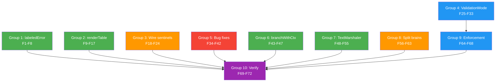

# Smart Consolidations — More With Less

**Date:** 2026-05-16 23:39
**Initiative:** DRY consolidation + bug fixes + ValidationMode enum
**Goal:** Delete ~304 lines with zero feature loss by expressing identical behavior once instead of 5-12 times
**Philosophy:** The same behavior, expressed once. Every removed line is a line that can't have a bug.

---

## Pareto Breakdown

### 1% → 51% of result
- `labeledError` internal type — 4 error types share identical struct+Error()+Unwrap(). Consolidate into 1.
- `renderTable` generic helper — 10 render functions share 2 patterns. Consolidate into registry of closures.
- Wire 8 unwired sentinel errors — Dead code right now. version.go uses wrong error. editor.go has bare fmt.Errorf.

### 4% → 64% of result
- `ValidationMode` enum — Replace `strict bool` with proper 3-level type (Lenient/Strict/Draconian)
- `branchWithCtx` helper — 5 methods copy-paste same 4-line block
- Bug fixes: exit code range (0-255), arg count validation (no negatives), nil injector check
- Split brain fix: `outputFormat` + `outputState.format` track same concept

### 20% → 80% of result
- TextMarshaler/Unmarshaler generic helpers — 8 types × 2 methods = identical boilerplate
- Split brain fix: `version` + `rootCmd.Version` dual-write → `setVersion()` method
- Strict/Draconian enforcement: help tags required, examples required
- Tests for all changes

---

## Medium Tasks (30-100 min each, 11 total)

| # | Task | Impact | Effort | Group |
|---|------|--------|--------|-------|
| M1 | labeledError consolidation | ~42 lines saved, DRY error types | 45 min | 1 |
| M2 | renderTable consolidation | ~130 lines saved, DRY rendering | 45 min | 2 |
| M3 | Wire unwired sentinels | Dead code → alive, fix bugs | 30 min | 3 |
| M4 | ValidationMode enum | Replace bool with proper type | 60 min | 4 |
| M5 | Bug fixes (exit code, args, nil) | Prevent invalid states | 30 min | 5 |
| M6 | branchWithCtx helper | DRY flow_context.go | 30 min | 6 |
| M7 | TextMarshaler consolidation | ~64 lines saved, DRY value types | 45 min | 7 |
| M8 | Split brain fixes | Single source of truth | 60 min | 8 |
| M9 | Strict/Draconian enforcement | Enforcement spectrum | 45 min | 9 |
| M10 | Tests for all changes | Verify correctness | 60 min | 10 |
| M11 | Final verification + commit | Ship it | 15 min | 11 |

---

## Fine Tasks (max 15 min each, 72 total)

### Group 1: labeledError (F1-F8)

| # | Task | Effort |
|---|------|--------|
| F1 | Create `labeledError` internal type in errors.go (kind, label, err fields + Error() + Unwrap()) | 5 min |
| F2 | Refactor `CommandError` to embed `labeledError`, keep distinct type for errors.As | 5 min |
| F3 | Refactor `ConfigError` to embed `labeledError` | 5 min |
| F4 | Refactor `ServiceError` to embed `labeledError` | 5 min |
| F5 | Update `NewCommandError`, `NewConfigError`, `NewServiceError` constructors | 5 min |
| F6 | Verify errors.As still works correctly for all 3 types | 5 min |
| F7 | Run tests — fix any breakage from labeledError refactor | 10 min |
| F8 | Run lint | 2 min |

### Group 2: renderTable consolidation (F9-F17)

| # | Task | Effort |
|---|------|--------|
| F9 | Define `tableRenderFn func(*output.TableData) (string, error)` type | 2 min |
| F10 | Create `renderAndPrint(w, data, fn, errMsg)` helper | 5 min |
| F11 | Convert marshal-based renderers (JSON, TSV, YAML, XML) to registry entries | 10 min |
| F12 | Convert renderer-based renderers (Markdown, HTML, Tree, D2, Mermaid, DOT) to registry entries | 10 min |
| F13 | Convert any-renderers (renderAnyJSON, renderAnyYAML) to use same helper | 5 min |
| F14 | Delete 10 individual renderTable* functions | 5 min |
| F15 | Keep renderTableStyled and renderTableCSV as-is (genuinely different) | 0 min |
| F16 | Run tests | 5 min |
| F17 | Run lint | 2 min |

### Group 3: Wire unwired sentinels (F18-F24)

| # | Task | Effort |
|---|------|--------|
| F18 | Fix version.go: replace `ErrMissingName` with `ErrMissingVersion` (2 locations) | 3 min |
| F19 | Wire `ErrEditorTempFile` in editor.go line 23 | 2 min |
| F20 | Wire `ErrEditorWrite` in editor.go line 34 | 2 min |
| F21 | Wire `ErrEditorRun` in editor.go line 51 | 2 min |
| F22 | Wire `ErrEditorRead` in editor.go line 56 | 2 min |
| F23 | Add tests: verify version command returns ErrMissingVersion, verify editor errors use sentinels | 10 min |
| F24 | Run tests + lint | 5 min |

### Group 4: ValidationMode enum (F25-F33)

| # | Task | Effort |
|---|------|--------|
| F25 | Define `ValidationMode` type with Lenient/Strict/Draconian constants in command.go | 5 min |
| F26 | Replace `CLI.strict bool` with `CLI.validationMode ValidationMode` in cli.go | 3 min |
| F27 | Update `WithStrictValidation` to set `ValidationModeStrict` | 3 min |
| F28 | Add `WithDraconianValidation[T]()` CLI option | 5 min |
| F29 | Change `validate(strict bool)` to `validate(mode ValidationMode)` in command.go | 5 min |
| F30 | Update `AddCommand` to pass `cli.validationMode` | 3 min |
| F31 | Update `Validate()` and `ValidateStrict()` to use ValidationMode | 3 min |
| F32 | Add tests for ValidationMode (strict, draconian, lenient) | 10 min |
| F33 | Run tests + lint | 5 min |

### Group 5: Bug fixes (F34-F42)

| # | Task | Effort |
|---|------|--------|
| F34 | Add exit code range validation (0-255) in `NewExitError` using `ErrInvalidExitCode` | 5 min |
| F35 | Add tests for invalid exit codes (-1, 256) | 5 min |
| F36 | Add `n >= 0` check in `WithExactArgs`, use `ErrNegativeArgCount` | 3 min |
| F37 | Add `n >= 0` checks in `WithMinimumArgs`, `WithMaximumArgs` | 3 min |
| F38 | Add `minArgs <= maxArgs` check in `WithRangeArgs`, use `ErrInvalidArgRange` | 5 min |
| F39 | Add tests for invalid arg counts (-1, min > max) | 5 min |
| F40 | Add nil injector check in `NewScopeFromInjector` | 5 min |
| F41 | Add test for nil injector panic/error | 5 min |
| F42 | Run tests + lint | 5 min |

### Group 6: branchWithCtx (F43-F47)

| # | Task | Effort |
|---|------|--------|
| F43 | Extract `branchWithCtx` helper in flow_context.go | 5 min |
| F44 | Refactor Branch, BranchWithDuration, BranchWithDeadlineTime to use helper | 5 min |
| F45 | Refactor BranchWithTimeout, BranchWithDeadline to use helper | 5 min |
| F46 | Run tests | 5 min |
| F47 | Run lint | 2 min |

### Group 7: TextMarshaler consolidation (F48-F55)

| # | Task | Effort |
|---|------|--------|
| F48 | Create generic `textMarshal[T](v T, fmt func(T) string)` and `textUnmarshal[T](dest *T, text []byte, parse func(string)(T,error))` in type_helpers.go | 5 min |
| F49 | Refactor Duration MarshalText/UnmarshalText to use helpers | 3 min |
| F50 | Refactor Email MarshalText/UnmarshalText to use helpers | 3 min |
| F51 | Refactor Port MarshalText/UnmarshalText to use helpers | 3 min |
| F52 | Refactor URL MarshalText/UnmarshalText to use helpers | 3 min |
| F53 | Refactor FilePath MarshalText/UnmarshalText to use helpers | 3 min |
| F54 | Refactor HostPort MarshalText/UnmarshalText to use helpers | 3 min |
| F55 | Run tests + lint | 5 min |

### Group 8: Split brain fixes (F56-F63)

| # | Task | Effort |
|---|------|--------|
| F56 | Remove `outputState` wrapper type from cli_output.go | 5 min |
| F57 | Use `outputFormat` field directly instead of `outputState.format` | 5 min |
| F58 | Update `initOutputFlag` and `parseOutputFlag` to work without outputState | 5 min |
| F59 | Update `OutputFormat()` and `SetOutputFormat()` accessors | 5 min |
| F60 | Extract `setVersion(string)` internal method on CLI[T] | 5 min |
| F61 | Extract `setLong(string)` internal method on CLI[T] | 5 min |
| F62 | Update `WithCLIVersion`, `SetVersion`, `WithCLILong`, `SetLong` to use new methods | 5 min |
| F63 | Run tests + lint | 5 min |

### Group 9: Strict/Draconian enforcement (F64-F68)

| # | Task | Effort |
|---|------|--------|
| F64 | In strict mode: reject flags with empty `help` tags in FlagRegistry | 10 min |
| F65 | In draconian mode: reject leaf commands without `WithExample` in validate() | 5 min |
| F66 | Add test: strict mode rejects flag without help tag | 5 min |
| F67 | Add test: draconian mode rejects leaf without example | 5 min |
| F68 | Run tests + lint | 5 min |

### Group 10: Final verification (F69-F72)

| # | Task | Effort |
|---|------|--------|
| F69 | Full test suite: `go test ./... -count=1 -timeout 120s -race` | 5 min |
| F70 | Full lint: `golangci-lint run ./...` | 2 min |
| F71 | Update AGENTS.md with all changes | 10 min |
| F72 | Git commit with detailed message | 5 min |

---

## Execution Graph

Groups 1-3, 5-8 can run in parallel. Group 4 must complete before Group 9. Group 10 runs last.

---

## Expected Impact

| Metric | Before | After | Delta |
|--------|--------|-------|-------|
| errors.go lines | 349 | ~310 | -39 |
| output.go lines | 326 | ~210 | -116 |
| flow_context.go lines | 274 | ~250 | -24 |
| Value type boilerplate | ~128 lines | ~48 lines | -80 |
| `strict bool` | 1 | 0 (replaced by ValidationMode) | Type safety |
| Unwired sentinels | 8 | 0 | Dead code eliminated |
| Split brains | 2 | 0 | Single source of truth |
| **Total lines saved** | | | **~259** |
