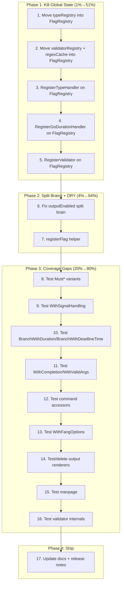

# cmdguard — Pareto Execution Plan

**Date:** 2026-05-17 03:31
**Version:** v2.3.0-dev
**Scope:** Architecture cleanup, coverage gaps, dead code removal, release prep

---

## Pareto Breakdown

### 1% → 51% of result

**Make `globalTypeRegistry` instance-scoped inside `FlagRegistry`.**

This single change eliminates:
- All `sync.RWMutex` contention on the global
- The inability to run custom type handler tests in parallel
- The `RegisterGoDurationHandler()` global mutation pattern
- The entire class of "test A's RegisterTypeHandler leaks into test B" bugs

### 4% → 64% of result

**Kill `globalValidators` + `regexCache` too + fix outputEnabled split brain.**

Same pattern: `globalValidators` is another global singleton. `regexCache` is an unbounded `sync.Map`. `outputEnabled` is a split brain with `outputState`. Together with #1, this eliminates ALL mutable global state from the package.

### 20% → 80% of result

**Test the 0% coverage functions + remove dead renderers.**

13 exported functions have 0% tests. The output renderer functions (TSV, Markdown, XML, HTML, Tree, D2, Mermaid, DOT, YAML) delegate to `go-output` which already tests them — our 9 wrappers are untested dead weight. Either test or delete.

---

## Execution Plan (17 tasks, 30-90min each)

| # | Task | Impact | Effort | Category |
|---|------|--------|--------|----------|
| 1 | Move `typeRegistry` inside `FlagRegistry` | 🔴 Critical | 60min | Architecture |
| 2 | Move `validatorRegistry` + `regexCache` inside `FlagRegistry` | 🔴 Critical | 45min | Architecture |
| 3 | Update `RegisterTypeHandler` to use `FlagRegistry` receiver | 🔴 Critical | 30min | Architecture |
| 4 | Update `RegisterGoDurationHandler` to use `FlagRegistry` receiver | 🟡 High | 15min | Architecture |
| 5 | Update `RegisterValidator` + `RegisterFlagValidator` to `FlagRegistry` | 🟡 High | 30min | Architecture |
| 6 | Fix `outputEnabled`/`outputState` split brain | 🟡 High | 20min | Split Brain |
| 7 | Add `registerFlag[T]` helper to deduplicate handler boilerplate | 🟢 Medium | 30min | DRY |
| 8 | Test `MustAddCommand` + `MustNewCLI` panic variants | 🟡 High | 15min | Coverage |
| 9 | Test `WithSignalHandling` | 🟡 High | 30min | Coverage |
| 10 | Test `BranchWithDuration` + `BranchWithDeadlineTime` | 🟡 High | 20min | Coverage |
| 11 | Test `WithCompletion` + `WithValidArgs` | 🟢 Medium | 20min | Coverage |
| 12 | Test command accessor methods (Version, Group, etc.) | 🟢 Medium | 15min | Coverage |
| 13 | Test `WithFangOptions` | 🟢 Low | 10min | Coverage |
| 14 | Test or delete dead output renderers (TSV/MD/XML/HTML/Tree/D2/Mermaid/DOT/YAML) | 🟡 High | 45min | Dead Code |
| 15 | Test `manpage.go` (NewManPage, GenerateManPageCommand) | 🟢 Medium | 30min | Coverage |
| 16 | Test validator internals (validateEmail, validateURL, runValidateTag) | 🟡 High | 30min | Coverage |
| 17 | Update AGENTS.md, TODO_LIST.md, FEATURES.md + write release notes | 🟢 Medium | 30min | Documentation |

---

## Micro-Task Breakdown (68 tasks, max 15min each)

| # | Micro-Task | Parent | Est |
|---|-----------|--------|-----|
| 1 | Read current `typeRegistry` struct + all references | #1 | 5 |
| 2 | Add `typeRegistry` field to `FlagRegistry` struct | #1 | 5 |
| 3 | Change `newTypeRegistry()` to be called from `NewFlagRegistry` | #1 | 5 |
| 4 | Move `registerKinds()` call into `NewFlagRegistry` | #1 | 5 |
| 5 | Move `registerCustomTypes()` call into `NewFlagRegistry` | #1 | 5 |
| 6 | Remove `var globalTypeRegistry` from `type_handler.go` | #1 | 5 |
| 7 | Update `dispatchRegister` to take `*FlagRegistry` parameter | #1 | 10 |
| 8 | Update `dispatchParse` to take `*FlagRegistry` parameter | #1 | 10 |
| 9 | Update `dispatchDefault` to take `*FlagRegistry` parameter | #1 | 10 |
| 10 | Update `handledByTypeRegistry` to take `*FlagRegistry` parameter | #1 | 10 |
| 11 | Update all callers of dispatch* in `flags.go` | #1 | 10 |
| 12 | Update all callers of dispatch* in `flags_parse.go` | #1 | 10 |
| 13 | Fix compilation errors from parameter changes | #1 | 10 |
| 14 | Run tests + fix failures from typeRegistry move | #1 | 15 |
| 15 | Read current `validatorRegistry` + `regexCache` references | #2 | 5 |
| 16 | Add `validators` + `regexCache` fields to `FlagRegistry` | #2 | 5 |
| 17 | Move `newValidatorRegistry()` into `NewFlagRegistry` | #2 | 5 |
| 18 | Move `regexCache` init into `NewFlagRegistry` | #2 | 5 |
| 19 | Remove `var globalValidators` from `flags_validate.go` | #2 | 5 |
| 20 | Remove `var regexCache` from `flags_validate.go` | #2 | 5 |
| 21 | Update `lookupValidator` to use `FlagRegistry` | #2 | 10 |
| 22 | Update `RegisterValidator` to use `FlagRegistry` receiver | #5 | 10 |
| 23 | Update `RegisterFlagValidator` to use `FlagRegistry` receiver | #5 | 10 |
| 24 | Update all validator callers in `flags_validate.go` | #2 | 10 |
| 25 | Update `runValidateTag` to use instance-scoped validators | #2 | 10 |
| 26 | Run tests + fix failures from validatorRegistry move | #2 | 15 |
| 27 | Change `RegisterTypeHandler` to method on `FlagRegistry` | #3 | 10 |
| 28 | Update all `RegisterTypeHandler` callers | #3 | 10 |
| 29 | Run tests + fix failures | #3 | 10 |
| 30 | Change `RegisterGoDurationHandler` to method on `FlagRegistry` | #4 | 10 |
| 31 | Update callers of `RegisterGoDurationHandler` | #4 | 5 |
| 32 | Run tests + fix failures | #4 | 10 |
| 33 | Identify `outputEnabled` usage sites in `cli.go` + `cli_output.go` | #6 | 5 |
| 34 | Replace `outputEnabled` checks with `outputState != nil` | #6 | 10 |
| 35 | Remove `outputEnabled` field from `CLI[T]` struct | #6 | 5 |
| 36 | Run tests + fix failures | #6 | 10 |
| 37 | Write `registerFlag[T]` helper in `type_handler_kinds.go` | #7 | 10 |
| 38 | Refactor int/uint/float/bool handlers to use `registerFlag[T]` | #7 | 15 |
| 39 | Run tests + lint | #7 | 5 |
| 40 | Write `TestMustAddCommand` — success + panic cases | #8 | 10 |
| 41 | Write `TestMustNewCLI` — success + panic cases | #8 | 10 |
| 42 | Write `TestWithSignalHandling` — verify context cancellation | #9 | 15 |
| 43 | Write `TestBranchWithDuration` — verify timeout + path | #10 | 10 |
| 44 | Write `TestBranchWithDeadlineTime` — verify deadline + path | #10 | 10 |
| 45 | Write `TestWithCompletion` — verify cobra completion wiring | #11 | 10 |
| 46 | Write `TestWithValidArgs` — verify valid args wiring | #11 | 10 |
| 47 | Write `TestCommandAccessors` — Version, Group, Silence* | #12 | 10 |
| 48 | Write `TestWithFangOptions` — verify options forwarded | #13 | 10 |
| 49 | Audit output renderers — check if go-output tests cover them | #14 | 10 |
| 50 | Write tests for renderTableTSV, renderTableMarkdown | #14 | 10 |
| 51 | Write tests for renderTableXML, renderTableHTML | #14 | 10 |
| 52 | Write tests for renderTableD2, renderTableMermaid, renderTableDOT | #14 | 10 |
| 53 | Write tests for renderTableTree, renderTableYAML | #14 | 10 |
| 54 | Write test for renderAnyYAML | #14 | 5 |
| 55 | Write `TestNewManPage` | #15 | 10 |
| 56 | Write `TestGenerateManPageCommand` | #15 | 15 |
| 57 | Write `TestValidateEmail` — valid + invalid cases | #16 | 10 |
| 58 | Write `TestValidateURL` — valid + invalid cases | #16 | 10 |
| 59 | Write `TestRunValidateTag` — regex, min, max, email, url | #16 | 10 |
| 60 | Write `TestValidateNonEmpty` — empty + non-empty | #16 | 5 |
| 61 | Write `TestValidateFieldByKind` — string/int/float | #16 | 10 |
| 62 | Update AGENTS.md with globalTypeRegistry elimination | #17 | 10 |
| 63 | Update TODO_LIST.md — mark all done items | #17 | 10 |
| 64 | Update FEATURES.md with architecture changes | #17 | 5 |
| 65 | Final full test suite run (race + lint) | #17 | 5 |
| 66 | Write v2.3.0 release notes | #17 | 10 |
| 67 | Verify all examples still compile | #17 | 5 |
| 68 | Final git commit + push | #17 | 5 |

---

## Execution Graph

---

## Risks & Mitigations

| Risk | Mitigation |
|------|-----------|
| Moving typeRegistry breaks all tests | Do it first, fix immediately, run tests after each step |
| `dispatchRegister` signature change ripples widely | Check all callers with `grep` before changing |
| Output renderers may be needed by downstream | Test them, don't delete — they're 3-line wrappers |
| `RegisterTypeHandler` API change breaks users | Keep old function as deprecated wrapper delegating to new method |
| funlen regression in `registerCustomTypes` | Split further if needed |

---

## Definition of Done

- [ ] Zero mutable global state in `pkg/cmdguard/v2/`
- [ ] All `Register*` functions are methods on `FlagRegistry`
- [ ] `outputEnabled` split brain eliminated
- [ ] All 13 previously-untested functions now have tests
- [ ] Coverage ≥ 82%
- [ ] 0 lint issues, 0 race conditions
- [ ] All examples compile
- [ ] TODO_LIST.md, FEATURES.md, AGENTS.md updated
- [ ] Release notes drafted
