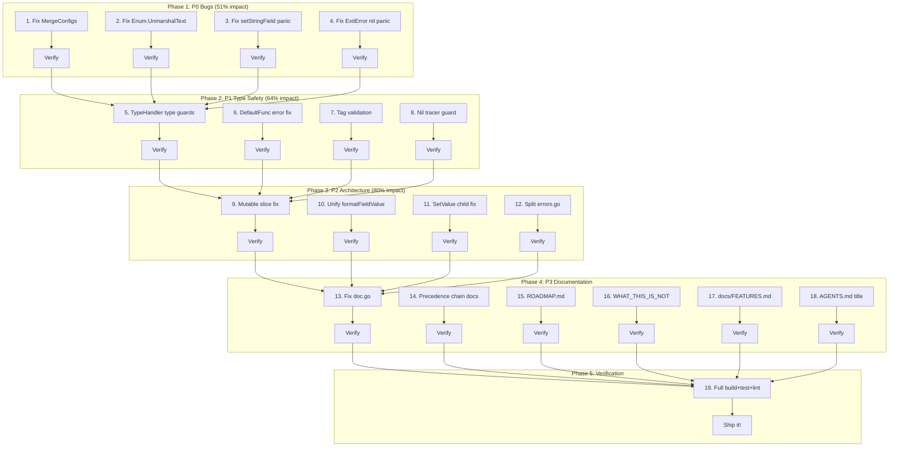

# Comprehensive Execution Plan — cmdguard v2.4 Maintenance

**Created:** 2026-06-10_03-30
**Scope:** P0-P3 fixes (items 1-19), excludes P5/P6 (v3.0 future work) and P4 (manual CI step)
**Total estimated effort:** ~14.5 hours

## Pareto Analysis

### 1% that delivers 51% of the result
Fix the 4 real bugs (P0). These cause **data loss, silent validation bypass, and panics**. A user hitting any of these loses trust in the library.

| # | Task | Impact |
|---|------|--------|
| 1 | Fix MergeConfigs zero-value data loss | Data loss bug — `false`/`0`/`""` silently overwritten |
| 2 | Fix Enum.UnmarshalText validation bypass | Security/correctness — any garbage accepted |
| 3 | Fix setStringField panic | Runtime crash on type mismatch |
| 4 | Fix ExitError.Error() nil panic | Runtime crash |

### 4% that delivers 64% of the result
P0 + P1 type safety. Eliminates entire classes of runtime failures by catching errors at registration time.

| # | Task | Impact |
|---|------|--------|
| 5 | Add TypeHandler runtime type guards | Tag typos caught at registration, not runtime |
| 6 | Fix DefaultFunc error suppression | Invalid defaults caught early, not silent zeros |
| 7 | Validate short/flag tag format | Garbage tags caught at registration |
| 8 | Telemetry nil tracer guard | Prevents nil dereference crash |

### 20% that delivers 80% of the result
All P0-P3 except item 9 (global singleton elimination — 4h, separate effort). Quick wins plus architecture cleanup.

## Execution Plan — Level 1 (7-27 tasks, 30-100min each)

| # | Task | Priority | Effort | Files | Status |
|---|------|----------|--------|-------|--------|
| 1 | Fix MergeConfigs zero-value sentinel | P0-Critical | 90m | config.go | ⬜ |
| 2 | Fix Enum.UnmarshalText validation bypass | P0-Critical | 60m | types_enum.go | ⬜ |
| 3 | Fix setStringField panic — add type guard | P0-Critical | 30m | config_setfield.go | ⬜ |
| 4 | Fix ExitError.Error() nil guard | P0-Critical | 15m | errors.go | ⬜ |
| 5 | Add TypeHandler runtime type guards | P1-High | 100m | type_handler.go, type_handler_kinds.go, type_handler_custom.go | ⬜ |
| 6 | Fix DefaultFunc error suppression (5 handlers) | P1-High | 60m | type_handler_kinds.go, type_handler_custom.go | ⬜ |
| 7 | Validate short tag length + flag tag format | P1-High | 30m | config_parsing.go | ⬜ |
| 8 | Add TelemetryMiddleware nil tracer guard | P1-High | 15m | telemetry.go | ⬜ |
| 9 | Fix Tags()/Path() mutable slice returns | P2-Medium | 30m | flags.go, flow_context.go | ⬜ |
| 10 | Unify fieldValueToString + formatFieldValue | P2-Medium | 60m | flag_helpers.go, config_file.go, flags_validate.go | ⬜ |
| 11 | Fix BranchingFlowContext.SetValue child overwrite | P2-Medium | 60m | flow_context.go | ⬜ |
| 12 | Split errors.go into domain-specific files | P2-Medium | 60m | errors.go → errors_command.go, errors_flags.go, errors_config.go, errors_di.go | ⬜ |
| 13 | Fix doc.go "never panics" claim | P3-Low | 15m | doc.go | ⬜ |
| 14 | Align flag precedence chain across docs | P3-Low | 30m | README.md, docs/FEATURES.md | ⬜ |
| 15 | Update ROADMAP.md — check off completed items | P3-Low | 15m | ROADMAP.md | ⬜ |
| 16 | Fix WHAT_THIS_PROJECT_IS_NOT.md — config IS provided | P3-Low | 15m | WHAT_THIS_PROJECT_IS_NOT.md | ⬜ |
| 17 | Fix docs/FEATURES.md — outdated API + deps | P3-Low | 60m | docs/FEATURES.md | ⬜ |
| 18 | Fix AGENTS.md v2.3 title → v2 | P3-Low | 5m | AGENTS.md | ⬜ |
| 19 | Run full test suite + lint + build verification | Verify | 30m | all | ⬜ |

**Total: 19 tasks, ~14.5 hours**

## Execution Plan — Level 2 (50-125 tasks, max 15min each)

| # | Task | Parent | Effort | Status |
|---|------|--------|--------|--------|
| 1 | Read config.go MergeConfigs and understand current IsZero logic | T1 | 5m | ⬜ |
| 2 | Add `explicitlySetFields map[string]bool` to FlagRegistry | T1 | 10m | ⬜ |
| 3 | Track set fields during parseAndSetValue | T1 | 10m | ⬜ |
| 4 | Update MergeConfigs to accept setFields parameter | T1 | 10m | ⬜ |
| 5 | Update all MergeConfigs callers | T1 | 10m | ⬜ |
| 6 | Write tests for MergeConfigs with zero values | T1 | 10m | ⬜ |
| 7 | Read types_enum.go UnmarshalText current logic | T2 | 5m | ⬜ |
| 8 | Remove UnmarshalText fallback that accepts any value when allowed is empty | T2 | 10m | ⬜ |
| 9 | Write test for Enum zero-value UnmarshalText rejection | T2 | 10m | ⬜ |
| 10 | Read config_setfield.go setStringField | T3 | 5m | ⬜ |
| 11 | Add AssignableTo guard before field.Set | T3 | 10m | ⬜ |
| 12 | Write test for setStringField type mismatch | T3 | 10m | ⬜ |
| 13 | Add nil guard to ExitError.Error() | T4 | 5m | ⬜ |
| 14 | Write test for nil Err in ExitError | T4 | 10m | ⬜ |
| 15 | Read type_handler.go dispatchParse/dispatchDefault | T5 | 5m | ⬜ |
| 16 | Add TargetType() reflect.Type to TypeHandler interface | T5 | 10m | ⬜ |
| 17 | Implement TargetType() in all TypeHandlerFunc instances | T5 | 10m | ⬜ |
| 18 | Add type guard in dispatchParse — verify return matches TargetType | T5 | 10m | ⬜ |
| 19 | Add type guard in dispatchDefault — verify return matches TargetType | T5 | 10m | ⬜ |
| 20 | Write tests for type guard catching mismatches | T5 | 10m | ⬜ |
| 21 | Fix bool DefaultFunc — return error on invalid default | T6 | 5m | ⬜ |
| 22 | Fix int DefaultFunc — return error on invalid default | T6 | 5m | ⬜ |
| 23 | Fix uint DefaultFunc — return error on invalid default | T6 | 5m | ⬜ |
| 24 | Fix float DefaultFunc — return error on invalid default | T6 | 5m | ⬜ |
| 25 | Fix duration DefaultFunc — return error on invalid default | T6 | 5m | ⬜ |
| 26 | Write test: invalid default strings produce errors | T6 | 10m | ⬜ |
| 27 | Add short tag length validation (must be 1 char) | T7 | 10m | ⬜ |
| 28 | Add flag tag name format validation (^[a-zA-Z][a-zA-Z0-9-]*$) | T7 | 10m | ⬜ |
| 29 | Write tests for tag validation | T7 | 10m | ⬜ |
| 30 | Add nil tracer guard in TelemetryMiddleware | T8 | 5m | ⬜ |
| 31 | Write test for nil tracer | T8 | 10m | ⬜ |
| 32 | Fix Tags() to return slices.Clone(r.tags) | T9 | 5m | ⬜ |
| 33 | Fix Path() to return slices.Clone(b.path) | T9 | 5m | ⬜ |
| 34 | Write tests for slice immutability | T9 | 10m | ⬜ |
| 35 | Read both fieldValueToString and formatFieldValue | T10 | 5m | ⬜ |
| 36 | Extract unified formatFieldValue to flag_helpers.go | T10 | 10m | ⬜ |
| 37 | Update config_file.go to use unified function | T10 | 5m | ⬜ |
| 38 | Update flags_validate.go to use unified function | T10 | 5m | ⬜ |
| 39 | Write tests for unified formatFieldValue | T10 | 10m | ⬜ |
| 40 | Read BranchingFlowContext.SetValue current logic | T11 | 5m | ⬜ |
| 41 | Add "skip if child has local value" check in SetValue | T11 | 10m | ⬜ |
| 42 | Write tests for SetValue child-local-value preservation | T11 | 10m | ⬜ |
| 43 | Create errors_command.go with command-related sentinels | T12 | 10m | ⬜ |
| 44 | Create errors_flags.go with flag-related sentinels | T12 | 10m | ⬜ |
| 45 | Create errors_config.go with config-related sentinels | T12 | 10m | ⬜ |
| 46 | Create errors_di.go with DI-related sentinels | T12 | 10m | ⬜ |
| 47 | Keep shared error types in errors.go, remove moved sentinels | T12 | 10m | ⬜ |
| 48 | Verify build passes after errors split | T12 | 5m | ⬜ |
| 49 | Fix doc.go line 119 — correct "never panics" claim | T13 | 5m | ⬜ |
| 50 | Fix README.md precedence chain | T14 | 10m | ⬜ |
| 51 | Fix docs/FEATURES.md precedence chain | T14 | 10m | ⬜ |
| 52 | Check off completed items in ROADMAP.md | T15 | 10m | ⬜ |
| 53 | Fix WHAT_THIS_PROJECT_IS_NOT.md config loading claim | T16 | 10m | ⬜ |
| 54 | Fix docs/FEATURES.md API examples + dependency paths | T17 | 15m | ⬜ |
| 55 | Fix AGENTS.md v2.3 title | T18 | 5m | ⬜ |
| 56 | Run go build ./... | T19 | 5m | ⬜ |
| 57 | Run golangci-lint run ./... | T19 | 5m | ⬜ |
| 58 | Run go test ./... -count=1 -timeout 120s -race | T19 | 10m | ⬜ |
| 59 | Run go test ./... -count=1 -timeout 120s -cover | T19 | 10m | ⬜ |
| 60 | Verify coverage did not decrease | T19 | 5m | ⬜ |
| 61 | Git commit all changes | T19 | 5m | ⬜ |

**Total: 61 sub-tasks**

## Execution Graph

