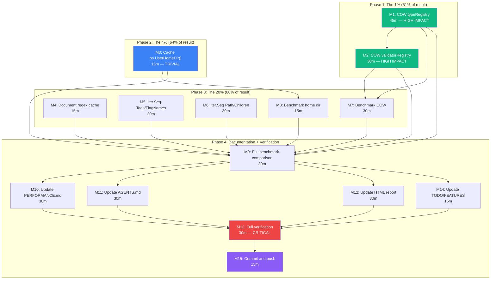

# Performance Optimization Sprint — Pareto Execution Plan

**Date:** 2026-06-14
**Sprint:** Performance optimizations from `docs/research/performance-analysis.html`
**Status:** Planning → Execution
**Goal:** Implement the 6 recommendations from the performance analysis report

---

## Context

The performance analysis report (`docs/research/performance-analysis.html`) identified cmdguard as
"production-ready from a performance standpoint" with 6 prioritized optimization recommendations.
This sprint implements the non-breaking optimizations, verifies them with benchmarks, and updates
all documentation.

**Key constraint:** No breaking API changes. All optimizations must be transparent to existing users.
The project is at v2.6.0 with 407+ passing tests, 85.5% coverage, 0 race conditions.

---

## Pareto Breakdown

### The 1% that delivers 51% of the result

**Copy-on-write registries (M1 + M2)**

Both `typeRegistry` and `validatorRegistry` are eagerly cloned per `FlagRegistry` instance
(`flags.go:42-43`). Each clone copies 2 maps (~12 allocs, ~1.5 KB). For a test suite creating
hundreds of CLI instances, this is the single largest measurable waste.

COW eliminates the clone until the first write — and most commands never write to their registries.
Feasibility verified: only 1 clone call site, 5 write paths (well-contained), no read-write
interleaving.

### The 4% that delivers 64% of the result

**COW registries + cached os.UserHomeDir() (M1 + M2 + M3)**

`expandConfigPath` (`config_file.go:78`) calls `os.UserHomeDir()` — a syscall — on every path
starting with `~/`. The home directory is immutable during a process lifetime. Caching it via
`sync.OnceValue` eliminates redundant syscalls. Trivial fix, zero risk.

### The 20% that delivers 80% of the result

**All code changes + benchmarks (M1–M8)**

- COW registries (M1, M2)
- Cached home dir (M3)
- Regex cache safety documentation (M4)
- Iterator-based API variants (M5, M6) — `iter.Seq` for zero-copy traversal
- Benchmarks to verify each optimization (M7, M8)

### The remaining 80% effort for 20% results

**Documentation, verification, and reporting (M9–M15)**

- Full benchmark comparison (M9)
- Update PERFORMANCE.md (M10)
- Update AGENTS.md gotchas (M11)
- Update HTML report (M12)
- Full verification: race + lint + build + test (M13)
- Update TODO_LIST.md (M14)
- Final commit and push (M15)

---

## Comprehensive Plan — Medium Granularity (30–100 min tasks)

| #   | Task                                    | Category | Impact   | Effort | Files                           |
| --- | --------------------------------------- | -------- | -------- | ------ | ------------------------------- |
| M1  | Copy-on-write typeRegistry              | Code     | High     | 45m    | `type_handler.go`, `flags.go`   |
| M2  | Copy-on-write validatorRegistry         | Code     | High     | 30m    | `flags_validate.go`, `flags.go` |
| M3  | Cache os.UserHomeDir()                  | Code     | Medium   | 15m    | `config_file.go`                |
| M4  | Document regex cache safety             | Doc      | Low      | 15m    | `flags_validate.go`             |
| M5  | iter.Seq for Tags()/FlagNames()         | Code     | Low      | 30m    | `flags.go`, `flags_suggest.go`  |
| M6  | iter.Seq for Path()/Children()          | Code     | Low      | 30m    | `flow_context.go`               |
| M7  | Benchmark: COW registry savings         | Test     | Medium   | 30m    | `benchmarks/`                   |
| M8  | Benchmark: home dir cache               | Test     | Low      | 15m    | `benchmarks/`                   |
| M9  | Run full benchmarks + compare           | Test     | Medium   | 30m    | —                               |
| M10 | Update PERFORMANCE.md                   | Doc      | Medium   | 30m    | `docs/PERFORMANCE.md`           |
| M11 | Update AGENTS.md gotchas                | Doc      | Low      | 30m    | `AGENTS.md`                     |
| M12 | Update perf HTML report                 | Doc      | Low      | 30m    | `docs/research/`                |
| M13 | Full verification: race+lint+build+test | Verify   | Critical | 30m    | —                               |
| M14 | Update TODO_LIST.md + FEATURES.md       | Doc      | Low      | 15m    | `TODO_LIST.md`, `FEATURES.md`   |
| M15 | Final commit and push                   | Git      | —        | 15m    | —                               |

**Sort order:** Impact × Safety (highest first). M1–M2 are the Pareto 1%.

---

## Detailed Breakdown — Fine Granularity (max 15 min tasks)

### Phase 1: Copy-on-write typeRegistry (M1)

| #   | Task                                                              | Est | Depends |
| --- | ----------------------------------------------------------------- | --- | ------- |
| F1  | Add `owned bool` field to typeRegistry struct                     | 5m  | —       |
| F2  | Modify `register()` to lazy-clone when `!owned`                   | 10m | F1      |
| F3  | Modify `clone()` to set `owned=true` on result                    | 5m  | F1      |
| F4  | Change `NewFlagRegistry` to share global pointer instead of clone | 10m | F2, F3  |
| F5  | Add test: COW isolation — instance write doesn't leak to global   | 10m | F4      |
| F6  | Add test: COW isolation — global write doesn't leak to instance   | 10m | F4      |

### Phase 2: Copy-on-write validatorRegistry (M2)

| #   | Task                                                            | Est | Depends |
| --- | --------------------------------------------------------------- | --- | ------- |
| F7  | Add `owned bool` field to validatorRegistry struct              | 5m  | —       |
| F8  | Modify `register()` to lazy-clone when `!owned`                 | 10m | F7      |
| F9  | Modify `clone()` to set `owned=true` on result                  | 5m  | F7      |
| F10 | Change `NewFlagRegistry` to share global validator pointer      | 10m | F8, F9  |
| F11 | Add test: COW isolation — validator instance write doesn't leak | 10m | F10     |
| F12 | Add test: COW isolation — validator global write doesn't leak   | 10m | F10     |

### Phase 3: Cache os.UserHomeDir() (M3)

| #   | Task                                             | Est | Depends |
| --- | ------------------------------------------------ | --- | ------- |
| F13 | Add `cachedHomeDir` sync.OnceValue helper        | 5m  | —       |
| F14 | Modify `expandConfigPath` to use cached home dir | 10m | F13     |
| F15 | Add test: expandConfigPath caches home dir       | 10m | F14     |

### Phase 4: Regex cache documentation (M4)

| #   | Task                                                       | Est | Depends |
| --- | ---------------------------------------------------------- | --- | ------- |
| F16 | Add safety comment to regexCache documenting bounded usage | 10m | —       |

### Phase 5: Iterator variants (M5 + M6)

| #   | Task                                                     | Est | Depends |
| --- | -------------------------------------------------------- | --- | ------- |
| F17 | Add `TagsSeq() iter.Seq[FlagTag]` to FlagRegistry        | 10m | —       |
| F18 | Add `FlagNamesSeq() iter.Seq[string]` to FlagRegistry    | 10m | —       |
| F19 | Add `PathSeq() iter.Seq[string]` to BranchingFlowContext | 10m | —       |
| F20 | Add `ChildrenSeq() iter.Seq[*BranchingFlowContext]`      | 10m | —       |
| F21 | Add tests for all 4 iterator methods                     | 15m | F17–F20 |

### Phase 6: Benchmarks (M7 + M8)

| #   | Task                                            | Est | Depends  |
| --- | ----------------------------------------------- | --- | -------- |
| F22 | Add `BenchmarkNewFlagRegistryCOW` to benchmarks | 10m | M1, M2   |
| F23 | Add `BenchmarkExpandConfigPath` to benchmarks   | 10m | M3       |
| F24 | Run benchmarks and verify allocation reduction  | 10m | F22, F23 |

### Phase 7: Full comparison + documentation (M9–M14)

| #   | Task                                                  | Est | Depends          |
| --- | ----------------------------------------------------- | --- | ---------------- |
| F25 | Run full benchmark suite (5×, -benchmem)              | 15m | All code changes |
| F26 | Compare before/after, document deltas                 | 10m | F25              |
| F27 | Update TL;DR + tables in PERFORMANCE.md               | 10m | F26              |
| F28 | Add "Optimizations Applied" section to PERFORMANCE.md | 10m | F26              |
| F29 | Add COW registry gotcha to AGENTS.md                  | 10m | M1, M2           |
| F30 | Add cached home dir gotcha to AGENTS.md               | 5m  | M3               |
| F31 | Add iterator methods gotcha to AGENTS.md              | 10m | M5, M6           |
| F32 | Update benchmark tables in HTML report                | 10m | F25              |
| F33 | Update summary numbers + recommendations in HTML      | 10m | F25              |
| F34 | Mark perf items done in TODO_LIST.md                  | 5m  | —                |
| F35 | Add iter.Seq methods to FEATURES.md                   | 5m  | M5, M6           |

### Phase 8: Verification + ship (M13 + M15)

| #   | Task                               | Est | Depends  |
| --- | ---------------------------------- | --- | -------- |
| F36 | Run `go build ./...`               | 5m  | All code |
| F37 | Run `go test ./... -count=1 -race` | 10m | All code |
| F38 | Run `golangci-lint run ./...`      | 5m  | All code |
| F39 | Run full benchmarks final time     | 15m | All code |
| F40 | Commit and push                    | 10m | F36–F39  |

**Total fine tasks: 40**
**Estimated total effort: ~8 hours**

---

## Execution Graph

---

## Risk Assessment

| Risk                               | Likelihood | Mitigation                                                         |
| ---------------------------------- | ---------- | ------------------------------------------------------------------ |
| COW breaks registry isolation      | Low        | Adding 4 isolation tests (F5, F6, F11, F12) before any code change |
| COW race condition on lazy clone   | Low        | Mutex already protects register(); clone-under-lock                |
| Iterator API confuses users        | Very Low   | Old methods kept; iter.Seq is additive only                        |
| Home dir cache returns stale value | Near-zero  | `sync.OnceValue` caches for process lifetime; HOME never changes   |
| Benchmark regression               | Low        | Run -count=5 before and after; compare                             |

---

## What This Sprint Does NOT Do

- **Email parsing** — external (`net/mail`), cannot fix within cmdguard
- **Pre-build middleware chain** — requires breaking API change; deferred to v3.0
- **Binary size reduction** — requires go-output module restructure; v3.0 scope
- **v3.0 roadmap items** — plugin system, nested structs, etc. — separate sprint
