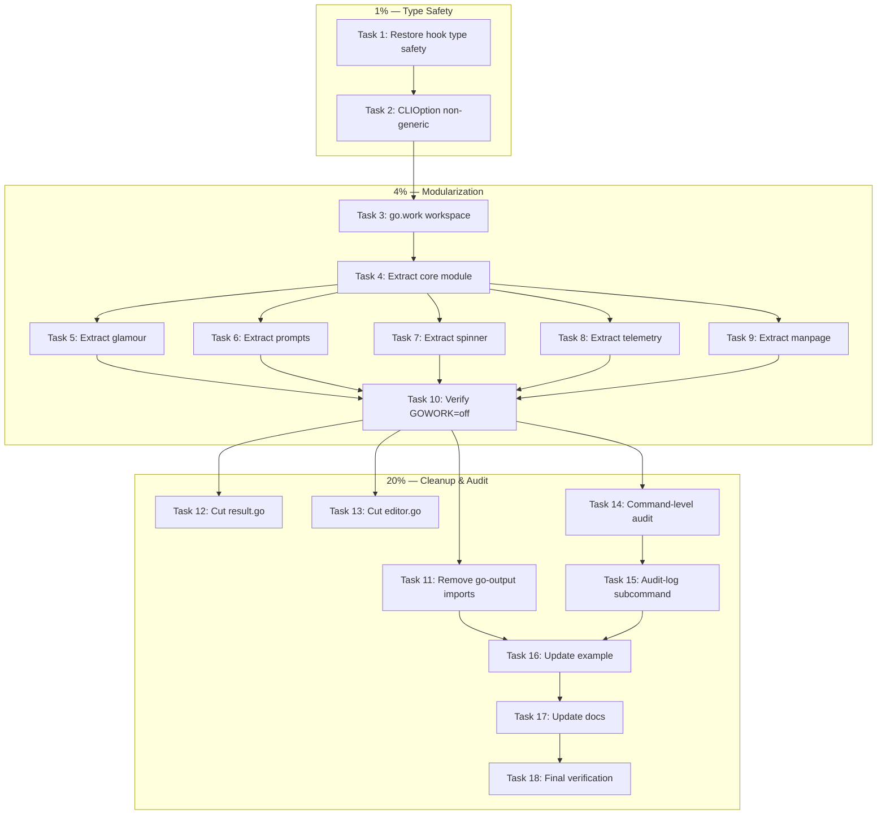

# v3 Superb CLI — Pareto Execution Plan

**Date:** 2026-07-06
**Goal:** Make cmdguard ENFORCE and MAKE EASY the building of superb CLIs
**Status:** Post-type-parameter-elimination. All tests green. Ready for v3 redesign.

---

## Context

cmdguard has 8,766 lines of non-test code, 30 direct dependencies, and 1,908 test runs.
The type parameter explosion is fixed (commit `4f9b0ea`). Now we tackle the real problems:

1. **Lifecycle hook regression** — I stored PreRunE/PostRunE as `any`, losing compile-time safety
2. **30 direct deps** — glamour, huh, lipgloss, otel, mango, koanf, go-output sub-modules all in core
3. **Flags aren't type-safe** — struct tags are uncompiled comments; global flags pollute subcommands
4. **Audit logs are shallow** — only DI lifecycle, not command-level events
5. **Dead weight** — result.go, editor.go, flow_context.go add complexity without CLI value

---

## Pareto Tiers

### 1% → 51%: Restore type safety + finish ergonomics

| ID | Task                                                                         | Impact   | Effort |
| -- | ---------------------------------------------------------------------------- | -------- | ------ |
| 1  | Restore compile-time safety on lifecycle hooks (sealed interface, not `any`) | Critical | 45min  |
| 2  | Make CLIOption non-generic (eliminate `[T]` from 22 CLI options)             | Critical | 30min  |

### 4% → 64%: Mono-repo modularization

| ID | Task                                      | Impact | Effort |
| -- | ----------------------------------------- | ------ | ------ |
| 3  | Create go.work workspace                  | High   | 30min  |
| 4  | Extract core module (cobra+do+fang+pflag) | High   | 90min  |
| 5  | Extract glamour module                    | Medium | 45min  |
| 6  | Extract prompts module (huh/bubbles)      | Medium | 45min  |
| 7  | Extract spinner module (lipgloss)         | Medium | 30min  |
| 8  | Extract telemetry module (otel)           | Low    | 30min  |
| 9  | Extract manpage module (mango/roff)       | Low    | 30min  |
| 10 | Verify GOWORK=off builds for every module | High   | 60min  |

### 20% → 80%: Config revolution + cleanup + audit deepening

| ID | Task                                           | Impact | Effort |
| -- | ---------------------------------------------- | ------ | ------ |
| 11 | Remove go-output blank imports from core       | High   | 45min  |
| 12 | Cut result.go (sum types not a CLI concern)    | Low    | 15min  |
| 13 | Cut editor.go                                  | Low    | 15min  |
| 14 | Add command-level audit events (middleware)    | High   | 60min  |
| 15 | Add built-in audit-log export subcommand       | Medium | 45min  |
| 16 | Update example to showcase v3 API              | High   | 60min  |
| 17 | Update README + AGENTS.md + FEATURES.md        | Medium | 45min  |
| 18 | Final verification: build + test + lint + race | High   | 30min  |

---

## Comprehensive Plan (Medium Granularity — 18 tasks, 30-90min each)

| #  | Task                                                              | Priority | Impact | Effort | Status |
| -- | ----------------------------------------------------------------- | -------- | ------ | ------ | ------ |
| 1  | Restore lifecycle hook compile-time safety (sealed interface)     | P0       | 10     | 45min  | TODO   |
| 2  | Make CLIOption non-generic                                        | P0       | 9      | 30min  | TODO   |
| 3  | Create go.work workspace + verify existing build                  | P1       | 8      | 30min  | TODO   |
| 4  | Extract core module: move cobra/do/fang/pflag deps to core go.mod | P1       | 10     | 90min  | TODO   |
| 5  | Extract glamour to pkg/cmdguard/glamour/ module                   | P1       | 6      | 45min  | TODO   |
| 6  | Extract prompts to pkg/cmdguard/prompts/ module                   | P1       | 6      | 45min  | TODO   |
| 7  | Extract spinner to pkg/cmdguard/spinner/ module                   | P1       | 5      | 30min  | TODO   |
| 8  | Extract telemetry to pkg/cmdguard/telemetry/ module               | P2       | 4      | 30min  | TODO   |
| 9  | Extract manpage to pkg/cmdguard/manpage/ module                   | P2       | 4      | 30min  | TODO   |
| 10 | Verify GOWORK=off builds for every module                         | P1       | 8      | 60min  | TODO   |
| 11 | Remove go-output blank imports from core (output.go cleanup)      | P1       | 7      | 45min  | TODO   |
| 12 | Cut result.go (sum types)                                         | P2       | 3      | 15min  | TODO   |
| 13 | Cut editor.go                                                     | P2       | 3      | 15min  | TODO   |
| 14 | Add command-level audit middleware (audit every command exec)     | P1       | 8      | 60min  | TODO   |
| 15 | Add built-in audit-log export subcommand                          | P2       | 5      | 45min  | TODO   |
| 16 | Update example/taskctl to showcase clean v3 API                   | P1       | 7      | 60min  | TODO   |
| 17 | Update README + AGENTS.md + FEATURES.md for v3                    | P2       | 5      | 45min  | TODO   |
| 18 | Final verification: build + test + lint + race                    | P0       | 9      | 30min  | TODO   |

**Total estimated effort:** ~13 hours
**Sorted by:** Priority (P0→P2), then Impact (desc), then Effort (asc)

---

## Execution Graph



---

## Detailed Breakdown (Fine Granularity)

### Task 1: Restore lifecycle hook compile-time safety (8 subtasks)

| #   | Subtask                                           | Effort |
| --- | ------------------------------------------------- | ------ |
| 1.1 | Read current commandSpec + wireAllHandlers code   | 5min   |
| 1.2 | Design sealed interface for typed lifecycle hooks | 10min  |
| 1.3 | Implement typedHook[T,F] wrapper                  | 10min  |
| 1.4 | Update WithPreRunE/WithPostRunE to return sealed  | 10min  |
| 1.5 | Update wireAllHandlers to type-assert safely      | 10min  |
| 1.6 | Fix tests that use spec.preRunEAny directly       | 10min  |
| 1.7 | Run tests + fix failures                          | 10min  |
| 1.8 | Commit checkpoint                                 | 5min   |

### Task 2: Make CLIOption non-generic (6 subtasks)

| #   | Subtask                                            | Effort |
| --- | -------------------------------------------------- | ------ |
| 2.1 | Create cliSpec struct (mirror commandSpec pattern) | 10min  |
| 2.2 | Convert CLIOption[T] → CLIOption                   | 10min  |
| 2.3 | Move CLI fields to cliSpec; store typed as any     | 10min  |
| 2.4 | Update all 22 With\* CLI options                   | 10min  |
| 2.5 | Fix test compilation errors                        | 10min  |
| 2.6 | Run tests + commit                                 | 10min  |

### Task 3: Create go.work workspace (5 subtasks)

| #   | Subtask                                  | Effort |
| --- | ---------------------------------------- | ------ |
| 3.1 | Run `go work init ./pkg/cmdguard/v2`     | 5min   |
| 3.2 | Verify build still works                 | 5min   |
| 3.3 | Add replace directives for local modules | 10min  |
| 3.4 | Update flake.nix if needed               | 5min   |
| 3.5 | Commit workspace setup                   | 5min   |

### Task 4: Extract core module (12 subtasks)

| #    | Subtask                                             | Effort |
| ---- | --------------------------------------------------- | ------ |
| 4.1  | Create pkg/cmdguard/v2/go.mod (core module)         | 10min  |
| 4.2  | Set module path to github.com/larsartmann/cmdguard  | 5min   |
| 4.3  | Move only cobra/do/fang/pflag/term to core deps     | 10min  |
| 4.4  | Create interface types for glamour/prompts/etc      | 15min  |
| 4.5  | Move glamour.go → conditional import or interface   | 15min  |
| 4.6  | Move prompts.go → conditional import or interface   | 10min  |
| 4.7  | Move spinner.go → conditional import or interface   | 10min  |
| 4.8  | Move telemetry.go → conditional import or interface | 10min  |
| 4.9  | Move manpage.go → conditional import or interface   | 10min  |
| 4.10 | Update go.work with new module                      | 5min   |
| 4.11 | Run GOWORK=off build + fix import errors            | 15min  |
| 4.12 | Commit core module extraction                       | 5min   |

### Task 5-9: Extract individual modules (5 subtasks each)

For each module (glamour, prompts, spinner, telemetry, manpage):

| #   | Subtask                                   | Effort |
| --- | ----------------------------------------- | ------ |
| X.1 | Create pkg/cmdguard/X/ directory + go.mod | 5min   |
| X.2 | Move source files from v2/ to X/          | 5min   |
| X.3 | Update imports + export types             | 10min  |
| X.4 | Add to go.work + verify build             | 10min  |
| X.5 | Commit                                    | 5min   |

### Task 10: Verify GOWORK=off builds (6 subtasks)

| #    | Subtask                          | Effort |
| ---- | -------------------------------- | ------ |
| 10.1 | GOWORK=off go build core         | 5min   |
| 10.2 | GOWORK=off go build glamour      | 5min   |
| 10.3 | GOWORK=off go build prompts      | 5min   |
| 10.4 | GOWORK=off go build all others   | 10min  |
| 10.5 | Fix any replace directive issues | 15min  |
| 10.6 | Commit verification              | 5min   |

### Task 11: Remove go-output from core (5 subtasks)

| #    | Subtask                                        | Effort |
| ---- | ---------------------------------------------- | ------ |
| 11.1 | Remove blank imports from output.go            | 10min  |
| 11.2 | Keep only OutputFormat type alias              | 10min  |
| 11.3 | Move OutputTable/OutputResult to thin wrappers | 10min  |
| 11.4 | Fix tests                                      | 10min  |
| 11.5 | Commit                                         | 5min   |

### Task 12-13: Cut dead weight (4 subtasks)

| #    | Subtask                                  | Effort |
| ---- | ---------------------------------------- | ------ |
| 12.1 | Check result.go usage (grep for imports) | 5min   |
| 12.2 | Remove result.go + fix references        | 10min  |
| 13.1 | Check editor.go usage                    | 5min   |
| 13.2 | Remove editor.go + fix references        | 10min  |

### Task 14: Command-level audit middleware (7 subtasks)

| #    | Subtask                                             | Effort |
| ---- | --------------------------------------------------- | ------ |
| 14.1 | Design CommandAuditEvent type                       | 10min  |
| 14.2 | Implement AuditMiddleware that captures per-command | 15min  |
| 14.3 | Record: command name, args, duration, error         | 10min  |
| 14.4 | Store events in DI scope for later retrieval        | 10min  |
| 14.5 | Add WithCommandAudit[T]() CLI option                | 10min  |
| 14.6 | Write tests for audit middleware                    | 15min  |
| 14.7 | Commit                                              | 5min   |

### Task 15: Built-in audit-log subcommand (5 subtasks)

| #    | Subtask                                               | Effort |
| ---- | ----------------------------------------------------- | ------ |
| 15.1 | Design AuditLogCommand[T] helper (like DoctorCommand) | 10min  |
| 15.2 | Add --format flag with format validation              | 10min  |
| 15.3 | Wire to ExportAuditLog                                | 10min  |
| 15.4 | Write tests                                           | 10min  |
| 15.5 | Commit                                                | 5min   |

### Task 16: Update example (6 subtasks)

| #    | Subtask                                      | Effort |
| ---- | -------------------------------------------- | ------ |
| 16.1 | Remove manual audit export code from main.go | 10min  |
| 16.2 | Add AuditLogCommand instead                  | 10min  |
| 16.3 | Showcase WithCommandAudit                    | 10min  |
| 16.4 | Clean up command definitions to v3 style     | 10min  |
| 16.5 | Run example tests                            | 10min  |
| 16.6 | Commit                                       | 5min   |

### Task 17: Update docs (5 subtasks)

| #    | Subtask                                 | Effort |
| ---- | --------------------------------------- | ------ |
| 17.1 | Update AGENTS.md module structure       | 10min  |
| 17.2 | Update FEATURES.md with v3 changes      | 10min  |
| 17.3 | Update README.md quickstart with v3 API | 10min  |
| 17.4 | Update CHANGELOG.md                     | 10min  |
| 17.5 | Commit                                  | 5min   |

### Task 18: Final verification (5 subtasks)

| #    | Subtask                                    | Effort |
| ---- | ------------------------------------------ | ------ |
| 18.1 | go build ./... (all modules)               | 5min   |
| 18.2 | go test ./... -count=1 -race -timeout 120s | 10min  |
| 18.3 | GOWORK=off go build per module             | 10min  |
| 18.4 | golangci-lint run ./...                    | 5min   |
| 18.5 | Final commit + push                        | 5min   |

---

## Total Subtask Count: 89

---

## Safety Rules

1. **Tests must pass after EVERY task** — no exceptions
2. **Commit after every task** — detailed messages, push at milestones
3. **GOWORK=off builds must work** — workspace is dev convenience, not a crutch
4. **No verschlimmbesserung** — if a change makes things worse, STOP and reassess
5. **Existing API consumers must still build** — breaking changes are additive (new modules), not destructive

---

## Dependency Tree Impact

### Before (current)

```
cmdguard/v2 (30 direct deps)
├── cobra, pflag, do, fang (core — 4 deps)
├── glamour (pulls chroma, goldmark, bluemonday, gorilla/css)
├── huh (pulls bubbles, bubbletea — full TUI framework)
├── lipgloss
├── otel (opentelemetry)
├── mango, mango-cobra, roff
├── koanf + parsers
├── go-output (10 sub-modules)
├── samber-do-auditlog
└── go-toml, go-yaml
```

### After (target)

```
cmdguard (6 direct deps: cobra, pflag, do, fang, go-toml, x/term)
├── cmdguard/glamour (glamour + deps — optional)
├── cmdguard/prompts (huh + deps — optional)
├── cmdguard/spinner (lipgloss — optional)
├── cmdguard/telemetry (otel — optional)
├── cmdguard/manpage (mango — optional)
├── cmdguard/auditlog (samber-do-auditlog — optional)
└── cmdguard/output (go-output — optional)
```

## Resolution (2026-07-18)

SHIPPED as v3.0.0 (2026-07-07). Tasks 1–10 (non-generic `CommandOption`, sealed lifecycle hooks, `go.work` mono-repo with extracted sub-modules) are done. Note the actual module layout differs from the plan's `pkg/cmdguard/v2/` paths: core is `github.com/larsartmann/cmdguard/v3` (under `pkg/cmdguard/v3/`), and 5 sub-modules live at the **repo root** (`glamour/`, `manpage/`, `prompts/`, `spinner/`, `telemetry/`) — not under `pkg/cmdguard/` — so their module paths resolve for external consumers.
