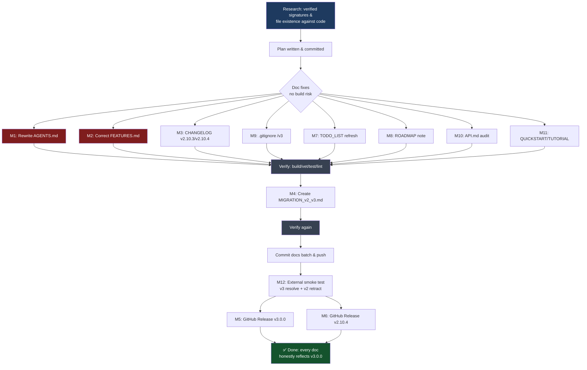

# Plan: v3 Docs & Release Cleanup

**Created:** 2026-07-07 06:54
**Status:** Approved — executing
**Method:** Pareto (1% → 51%, 4% → 64%, 20% → 80%)

## Context

The v3 breaking redesign (non-generic `CLIOption`/`CommandOption`, 5 extracted
sub-modules, `/v3` module path) was mechanically migrated and tagged `v3.0.0`,
but the **documentation was only path-updated, not architecturally rewritten**.
Result: every context/truth file (`AGENTS.md`, `FEATURES.md`) still describes the
v2 architecture — deleted files listed, deleted features shown as
`FULLY_FUNCTIONAL`, wrong dependency versions, wrong genericity. Plus release
artifacts are incomplete (no GitHub Releases, no migration guide, CHANGELOG gaps).

This plan makes every doc honestly reflect the shipped v3.0.0 code.

## Verified Ground Truth (from actual code)

- **Deleted from core:** `editor.go`, `glamour.go`, `manpage.go`, `result.go`,
  `spinner.go`, `telemetry.go`
- **Extracted to sub-modules:** `glamour/`, `manpage/`, `prompts/` (impl),
  `spinner/`, `telemetry/`
- **Still in core (interface only):** `prompts.go` (`PromptRunner` interface;
  huh/v2 impl lives in `prompts/` sub-module)
- **go-output:** v0.30.1 (docs say v0.23.3 ❌)
- **samber-do-auditlog:** v0.4.0 (docs say v0.3.1 ❌)
- **Non-generic CLIOptions (no `[T]`):** `WithSignalHandling`, `WithStrictValidation`,
  `WithGracefulShutdown`, `WithDILogging`, `WithDraconianValidation`, `WithAuditLog`,
  `WithConfigFile`, `WithPlugin`, `WithEnvPrefix`, etc.
- **Still generic `[T]`:** `WithConfigValidation[T]`, `WithMiddleware[T]`,
  `WithPostFlagParse[T]`, `WithCleanup[T]`, `ConfigFromContext[T]`,
  `ExportAuditLog[T]`, `NewCLI[T]`, `AddCommand[T,F]`, `Package[T]`
- **Deleted features:** `Result[T]`, `Validated[T]`, `EditInEditor`
- **Moved features:** `WithGlamourHelp`, `SpinnerMiddleware`, `TelemetryMiddleware`

## Pareto Tiers

| Tier      | Scope                                                                                     | Delivers                               |
| --------- | ----------------------------------------------------------------------------------------- | -------------------------------------- |
| 1% → 51%  | Rewrite `AGENTS.md` (the AI context file, ~40% stale)                                     | Every future session starts correct    |
| 4% → 64%  | + Correct `FEATURES.md` (feature inventory lies)                                          | Consumers see real capabilities        |
| 20% → 80% | + Release completeness (CHANGELOG, migration guide, Releases, smoke test, minor doc sync) | v3 adoption is unblocked & trustworthy |

## Medium-Granularity Plan (14 tasks)

| #   | Task                           | Fine    | Impact   | Effort |
| --- | ------------------------------ | ------- | -------- | ------ |
| M1  | Rewrite AGENTS.md              | F1–F15  | Critical | 90m    |
| M2  | Correct FEATURES.md            | F16–F25 | Critical | 45m    |
| M3  | CHANGELOG v2.10.3 + v2.10.4    | F26–F27 | High     | 20m    |
| M4  | Create docs/MIGRATION_v2_v3.md | F28–F33 | High     | 60m    |
| M5  | GitHub Release v3.0.0          | F34     | High     | 10m    |
| M6  | GitHub Release v2.10.4         | F35     | High     | 10m    |
| M7  | Refresh TODO_LIST.md           | F36–F37 | Med      | 15m    |
| M8  | Note migration in ROADMAP.md   | F38     | Med      | 15m    |
| M9  | Remove `/v3` from .gitignore   | F39     | Med      | 2m     |
| M10 | Audit & fix docs/API.md        | F40     | Med      | 30m    |
| M11 | Audit QUICKSTART + TUTORIAL    | F41–F42 | Med      | 20m    |
| M12 | External smoke test            | F43–F45 | High     | 25m    |
| M13 | Full verification              | F46–F49 | Gate     | 15m    |
| M14 | Plan doc + commit              | F50–F51 | Pro      | 20m    |

## Fine-Granularity Breakdown (51 tasks, ≤15 min each)

### M1 — AGENTS.md (the 1%)

| #   | Task                                                           | File/Target                   |
| --- | -------------------------------------------------------------- | ----------------------------- |
| F1  | Remove 6 deleted files from structure tree                     | AGENTS.md:76,91,92,97,99,100  |
| F2  | Add sub-module dirs + go.work to structure tree                | AGENTS.md structure block     |
| F3  | Fix deps: go-output v0.23.3 → v0.30.1                          | AGENTS.md:160                 |
| F4  | Fix deps: auditlog v0.3.1 → v0.4.0                             | AGENTS.md:161                 |
| F5  | Move huh/glamour/otel to sub-module deps                       | AGENTS.md:157,158,159         |
| F6  | Remove deleted Design Principles (#11,#15,#16,#17,#20)         | AGENTS.md:217,221,222,223,226 |
| F7  | Add Design Principles: sub-module arch + non-generic CLIOption | AGENTS.md principles          |
| F8  | Fix [T] on non-generic options in gotchas                      | AGENTS.md:275,277,284,285     |
| F9  | Fix go-output v0.23.3 ×3 in gotchas                            | AGENTS.md:266,267             |
| F10 | Rewrite Glamour gotchas (now sub-module)                       | AGENTS.md:269,270             |
| F11 | Rewrite Spinner gotcha (now sub-module)                        | AGENTS.md:306                 |
| F12 | Rewrite Telemetry gotcha (now sub-module)                      | AGENTS.md:307                 |
| F13 | Add sub-modules Gotchas section                                | AGENTS.md gotchas             |
| F14 | Fix WithAuditLog/ExportAuditLog genericity refs                | AGENTS.md:311,312             |
| F15 | Update Last Updated + status line                              | AGENTS.md:5                   |

### M2 — FEATURES.md

| #   | Task                                         |
| --- | -------------------------------------------- |
| F16 | go-output v0.23.3 → v0.30.1 (×2)             |
| F17 | auditlog v0.3.1 → v0.4.0                     |
| F18 | Remove Result[T]/Validated[T] section        |
| F19 | Remove EditInEditor row                      |
| F20 | Move WithGlamourHelp to sub-module           |
| F21 | Move SpinnerMiddleware to sub-module         |
| F22 | Move TelemetryMiddleware to sub-module       |
| F23 | WithAuditLog[T] → WithAuditLog (non-generic) |
| F24 | Move huh/glamour to sub-module deps          |
| F25 | Add sub-modules section                      |

### M3 — CHANGELOG.md

| #   | Task                        |
| --- | --------------------------- |
| F26 | Add v2.10.3 entry           |
| F27 | Add v2.10.4 entry (retract) |

### M4 — docs/MIGRATION_v2_v3.md

| #   | Task                                 |
| --- | ------------------------------------ |
| F28 | Create file: header + overview       |
| F29 | Module path migration section        |
| F30 | Command API breaking changes section |
| F31 | Sub-module adoption guide            |
| F32 | Before/after code examples           |
| F33 | Retract/recovery note                |

### M5–M6 — GitHub Releases

| #   | Task                      |
| --- | ------------------------- |
| F34 | gh release create v3.0.0  |
| F35 | gh release create v2.10.4 |

### M7–M11 — Minor doc sync

| #   | Task                                                               |
| --- | ------------------------------------------------------------------ |
| F36 | Refresh TODO_LIST.md header (v3.0.0, 87.3%, drop Result/Validated) |
| F37 | Add v3 migration to TODO_LIST completed                            |
| F38 | Note sub-module migration in ROADMAP completed                     |
| F39 | Remove `/v3` from .gitignore                                       |
| F40 | Audit & fix docs/API.md signatures                                 |
| F41 | Audit docs/QUICKSTART.md                                           |
| F42 | Audit docs/TUTORIAL.md                                             |

### M12 — Smoke test

| #   | Task                                             |
| --- | ------------------------------------------------ |
| F43 | External `go get .../v3@v3.0.0` resolves         |
| F44 | External `go get .../v2@latest` resolves v2.10.4 |
| F45 | Confirm retract warning surfaces                 |

### M13–M14 — Verify & record

| #   | Task                    |
| --- | ----------------------- |
| F46 | go build ./...          |
| F47 | go vet ./...            |
| F48 | go test ./... -race     |
| F49 | golangci-lint run ./... |
| F50 | Write this plan doc     |
| F51 | Commit & push           |

## Execution Graph

## Safety / Anti-Verschlimmbessern Rules

- **Don't touch point-in-time docs** (`docs/status/`, `docs/planning/`, `docs/reviews/`) — they're historical snapshots.
- **Don't remove `[T]` from functions that are still generic** (verified list above).
- **Don't add `[T]` to functions that are now non-generic** (verified list above).
- **ROADMAP completed section is historical** — only add a migration note, don't rewrite history.
- **Doc-only changes can't break build** — but verify anyway after each logical group.
- **Never `git restore`/`git reset`** files I didn't change.

## Resolution (2026-07-18)

EXECUTED, then superseded by further dependency bumps. This plan corrected the v3 docs, but its "ground truth" versions (go-output v0.30.1, auditlog v0.4.0) are now stale — current `go.mod` pins go-output v0.30.4 and auditlog v0.5.0 (bumped via the 2026-07-14 jsonv2 migration). Historical snapshot.
