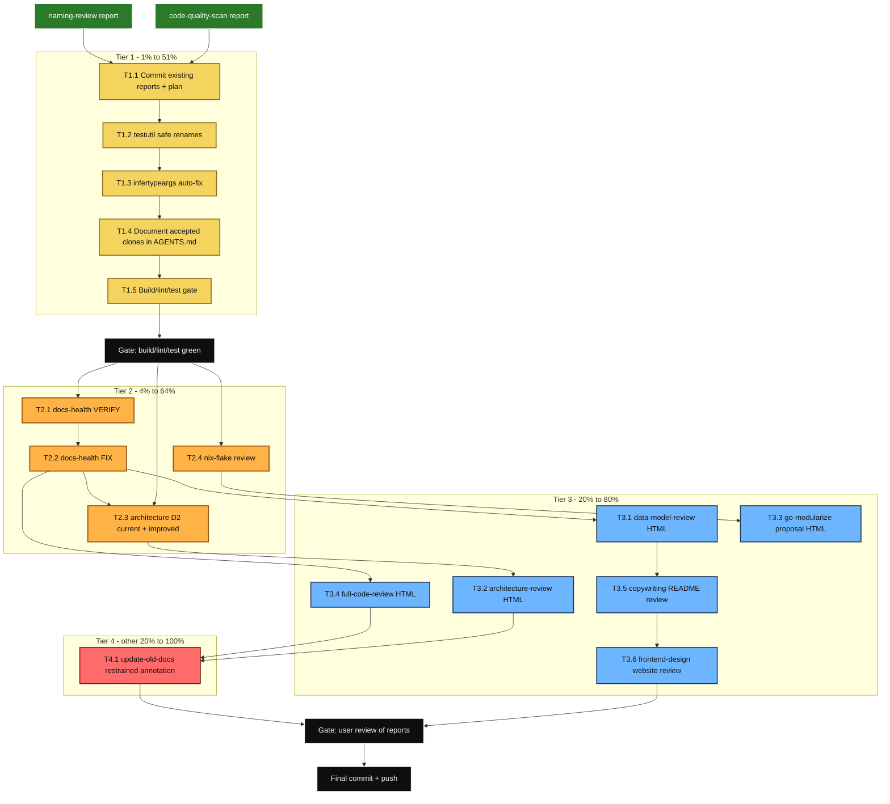

# Comprehensive Skills Execution Plan — cmdguard v3.0.0

**Generated:** 2026-07-18 20:46
**Branch:** master
**Baseline:** v3.0.0 · 0 lint issues · 0 build errors · 87.6% coverage · 1429 test runs · 7 fuzz targets · 26 benchmarks · all tests pass with `-race`
**Commit at start:** 73d49ad

---

> **Update 2026-07-23:** This plan was superseded by `docs/planning/2026-07-18_21-39_superb-post-audit-closure-plan.md` and executed in the 2026-07-18/19 sessions (`eb8586a` through `c02ca92`). The workspace now has 4 optional sub-modules; `manpage` was removed in `34a0c6e`.

## 1. Situation Assessment

### What is already true (do not re-prove)

| Dimension         | State                           | Evidence                                                                             |
| ----------------- | ------------------------------- | ------------------------------------------------------------------------------------ |
| Build             | PASS                            | `GOEXPERIMENT=jsonv2 go build ./...` clean across core + 5 sub-modules               |
| Lint              | 0 issues                        | `golangci-lint run ./...` clean across all 6 modules                                 |
| Tests             | PASS                            | `go test ./... -race -count=1` green                                                 |
| Coverage          | 87.6% core v3, 87.5% configload | Verified this session                                                                |
| Panics            | 0 by design                     | Every constructor returns `error`; no `Must*` variants                               |
| Module boundaries | 6 modules (core + 5 sub)        | Already split per Unix philosophy                                                    |
| Nix flake         | Already standard stack          | `flake-parts` + `treefmt-nix` + `systems` + `nixos-unstable`                         |
| Living docs       | exist                           | README, FEATURES, TODO_LIST, ROADMAP, CHANGELOG, AGENTS, DOMAIN_LANGUAGE all present |
| Public launch     | done                            | Website live, README rewritten, GitHub metadata set                                  |

### Verschlimmbesserung threats (explicitly avoided)

| #   | Threat                                                  | Why it would make things worse                                                          | Mitigation in this plan                                                     |
| --- | ------------------------------------------------------- | --------------------------------------------------------------------------------------- | --------------------------------------------------------------------------- |
| V1  | Renaming `TypeHandler` → `TypeCodec`                    | BREAKING public API change; v3 just shipped; would force v4                             | Report only; do NOT execute without explicit user approval                  |
| V2  | Refactoring the 5 accepted clone groups                 | Team already accepted them for documented reasons (abstraction cost > duplication cost) | Document decisions, do not refactor                                         |
| V3  | Blanket-annotating 40+ old status reports               | This is the exact incident that created the `update-old-docs` skill                     | Per-file judgment, annotate only files where a reader would clearly benefit |
| V4  | Rebuilding living docs from scratch                     | `docs-health` says "upsert, don't rewrite"; nuance lives in current docs                | Verify in place, patch drift only                                           |
| V5  | Generating low-effort HTML reports to tick skill boxes  | Noise devalues the signal reports                                                       | Each report cites `file:line` evidence and records rationale                |
| V6  | Renaming `Scope`, `BranchingFlowContext`, branded types | Names are already honest; churning them breaks consumers                                | Preserve; call out in strengths                                             |

### Skills coverage matrix

The original request named 16 skills (with duplicates). Deduplicated and mapped:

| Requested name                | Maps to skill              | Status                                                             |
| ----------------------------- | -------------------------- | ------------------------------------------------------------------ |
| code-quality-scan             | code-quality-scan          | ✅ Done (HTML report committed this session)                       |
| naming-review                 | naming-review              | ✅ Done (HTML report committed this session)                       |
| deduplicate-code              | deduplicate-code           | 🟡 Analysis done, decisions documented, iteration to zero = accept |
| docs-freshness-check          | docs-health                | ⏳ Pending                                                         |
| docs-health                   | docs-health                | ⏳ Pending                                                         |
| improve-codebase-architecture | architecture-review        | ⏳ Pending                                                         |
| architecture-review           | architecture-review        | ⏳ Pending                                                         |
| architecture-visualization    | architecture-visualization | ⏳ Pending                                                         |
| data-model-review             | data-model-review          | ⏳ Pending                                                         |
| go-modularize                 | go-modularize              | ⏳ Pending                                                         |
| nix-flake-migration           | nix-flake-migration        | ⏳ Pending                                                         |
| full-code-review              | full-code-review           | ⏳ Pending                                                         |
| copywriting                   | copywriting                | ⏳ Pending                                                         |
| frontend-design               | frontend-design            | ⏳ Pending (×2 in request)                                         |
| update-old-docs               | update-old-docs            | ⏳ Pending                                                         |
| pareto-planning               | pareto-planning            | 🟡 This document                                                   |

**Unique remaining skills to execute: 12** (plus this planning task).

---

## 2. Pareto Breakdown

### Tier 1 — the 1% that delivers 51%

The absolutely critical few. Tiny effort, outsized value. These close loose ends, capture work already done, and remove the cheapest defects.

| ID       | Task                                                                                                      | Why it is 1%                                                       |
| -------- | --------------------------------------------------------------------------------------------------------- | ------------------------------------------------------------------ |
| **T1.1** | Commit the 2 already-written HTML reports (code-quality-scan, naming-review) + this plan                  | Untracked work = work that doesn't exist. 5 minutes.               |
| **T1.2** | Apply zero-risk testutil renames: delete `StringSliceContains` duplicate, rename `doPanicTest` → `panics` | Internal package, no API break, fixes split-brain + vague verb     |
| **T1.3** | Auto-fix 33+ `infertypeargs` gopls hints across ~9 test files via `gopls fix -a`                          | Zero semantic change; silences a whole class of nag forever        |
| **T1.4** | Document the 5 accepted clone groups in `AGENTS.md` with one-line rationale each                          | Stops every future dedup pass from re-deliberating the same clones |
| **T1.5** | Verify build/lint/test still green after T1.2 + T1.3                                                      | Confidence gate; if anything broke, revert the specific change     |

### Tier 2 — the 4% that delivers 64%

Slightly larger set that produces visible artifacts and fixes any real drift.

| ID       | Task                                                                                                                         | Why it is 4%                                                 |
| -------- | ---------------------------------------------------------------------------------------------------------------------------- | ------------------------------------------------------------ |
| **T2.1** | `docs-health` VERIFY pass: check FEATURES / TODO_LIST / README / AGENTS / ROADMAP / CHANGELOG / DOMAIN_LANGUAGE against code | Living docs are the #1 source of future confusion if stale   |
| **T2.2** | `docs-health` FIX pass: patch any drift found (code wins, upsert not rewrite)                                                | Closes the gap                                               |
| **T2.3** | `architecture-visualization`: generate CURRENT state D2 (6 modules + dep flow) and IMPROVED state D2                         | Replaces the stale 2026-06-10 diagrams with v3.0.0 reality   |
| **T2.4** | `nix-flake-migration` review: confirm already-standard stack, note any gaps vs template                                      | Already 95% standard; value is documenting the 5% deviations |

### Tier 3 — the 20% that delivers 80%

Formal point-in-time reports. Each produces a self-contained HTML artifact under `docs/`.

| ID       | Task                                                                                                   | Why it is 20%                                                            |
| -------- | ------------------------------------------------------------------------------------------------------ | ------------------------------------------------------------------------ |
| **T3.1** | `data-model-review`: first-principles type review → HTML at `docs/brainstorming/`                      | Type system is the project's spine; branded types deserve a presentation |
| **T3.2** | `architecture-review`: modularity/coupling/composability → HTML at `docs/architecture-understanding/`  | Formal record of why the 6-module split is right                         |
| **T3.3** | `go-modularize` proposal: review existing boundaries (don't re-split) → HTML at `docs/modularization/` | Documents the Unix-philosophy win; FM#8/FM#11 checks                     |
| **T3.4** | `full-code-review`: visit every source+test file → HTML at `docs/reviews/`                             | Point-in-time audit, adds TODOs inline where appropriate                 |
| **T3.5** | `copywriting` review of README + website hero                                                          | README is the sales page; check clarity/benefits/CTA                     |
| **T3.6** | `frontend-design` review of website (HeroSection, landing components)                                  | Visual design critique, not a rebuild                                    |

### Tier 4 — the other 20% (to reach 100%)

Historical annotation with restraint.

| ID       | Task                                                                                                                                                                                                                 | Why it sits here                                                                          |
| -------- | -------------------------------------------------------------------------------------------------------------------------------------------------------------------------------------------------------------------- | ----------------------------------------------------------------------------------------- |
| **T4.1** | `update-old-docs`: per-file judgment over 43 status reports + 5 planning docs + 3 reviews + 3 architecture-understanding files. Annotate ONLY where a reader would clearly benefit. Most files should be LEFT ALONE. | Highest Verschlimmbesserung risk; lowest marginal value per file; must be judgment-driven |

---

## 3. Execution Graph

**Dependency rules**

- Tier 1 is strictly sequential — each step verifies before the next.
- Tier 2 tasks are parallel-safe after the Tier 1 gate.
- Tier 3 tasks depend on Tier 2 artifacts (diagrams, drift-free docs).
- Tier 4 (annotation) comes AFTER Tier 3 so the annotations can reference the newest reports.
- Two explicit user gates: build/lint/test after Tier 1, and report review before final commit.

---

## 4. Level 1 Plan — Medium Granularity (30–100 min per task)

**Sort order:** Tier asc, then Impact desc, then Effort asc, then Customer-value desc.

| #     | Tier | Task                                                                              | Impact | Effort | Customer value                           | Depends on   | Est (min) |
| ----- | ---- | --------------------------------------------------------------------------------- | ------ | ------ | ---------------------------------------- | ------------ | --------- |
| L1.01 | 1    | Commit 2 existing HTML reports + this plan                                        | High   | XS     | Maintainers see the work                 | —            | 12        |
| L1.02 | 1    | `deduplicate-code`: finish iteration to zero, record decisions in AGENTS.md       | Med    | S      | Future dedup passes skip accepted clones | L1.01        | 30        |
| L1.03 | 1    | Apply safe testutil renames (`StringSliceContains` del, `doPanicTest` → `panics`) | Med    | XS     | Cleaner internal API                     | L1.02        | 20        |
| L1.04 | 1    | Auto-fix 33+ `infertypeargs` across test files via `gopls fix -a`                 | Med    | S      | Tests read cleaner; CI hint noise gone   | L1.03        | 30        |
| L1.05 | 1    | Build/lint/test gate (`go build`, `golangci-lint`, `go test -race`)               | High   | XS     | Confidence                               | L1.04        | 15        |
| L1.06 | 2    | `docs-health` VERIFY: read every living doc, classify drift                       | High   | M      | Future readers trust docs                | L1.05        | 75        |
| L1.07 | 2    | `docs-health` FIX: patch drift in place (upsert, not rewrite)                     | High   | S      | Docs match code                          | L1.06        | 45        |
| L1.08 | 2    | `architecture-visualization`: current + improved D2 → SVG                         | Med    | M      | Visual onboarding                        | L1.05        | 60        |
| L1.09 | 2    | `nix-flake-migration` review: confirm standard stack, note gaps                   | Low    | XS     | Onboarding clarity                       | L1.05        | 30        |
| L1.10 | 3    | `data-model-review`: first-principles HTML presentation                           | High   | L      | Type-system deep dive                    | L1.07        | 90        |
| L1.11 | 3    | `architecture-review`: modularity/coupling HTML report                            | High   | L      | Architecture rationale                   | L1.08, L1.07 | 90        |
| L1.12 | 3    | `go-modularize` proposal HTML (review, not re-split)                              | Med    | M      | Module-boundary rationale                | L1.09        | 60        |
| L1.13 | 3    | `full-code-review`: visit every file → HTML                                       | High   | L      | Point-in-time audit                      | L1.07        | 100       |
| L1.14 | 3    | `copywriting` review of README + website hero                                     | Med    | M      | Better first impression                  | L1.07        | 45        |
| L1.15 | 3    | `frontend-design` critique of website components                                  | Low    | M      | Visual polish                            | L1.14        | 60        |
| L1.16 | 4    | `update-old-docs`: annotate drifted historical files (restraint)                  | Low    | L      | Old reports show "what happened next"    | L1.11, L1.13 | 75        |
| L1.17 | —    | Final build/lint/test gate + detailed commit + push                               | High   | XS     | Ship                                     | All          | 20        |

**Totals:** 17 L1 tasks · ~895 min (~15 hours) · sorted by tier then impact/effort/value.

**Notes on cuts:** the `TypeHandler` → `TypeCodec` rename is **excluded** from execution (Verschlimmbesserung threat V1) but documented in the naming-review report as a recommendation for a future major version. The 5 accepted clone groups are **excluded** from refactoring (V2) and instead get one-line rationale entries in AGENTS.md.

---

## 5. Level 2 Plan — Fine Granularity (≤ 12 min per task)

Each L1 task is decomposed into concrete, individually-verifiable steps. Sorted within their L1 parent by dependency, then impact.

### L1.01 — Commit existing reports + plan

| #      | Task                                                                                                                                                                                         | Est (min) |
| ------ | -------------------------------------------------------------------------------------------------------------------------------------------------------------------------------------------- | --------- |
| L2.001 | `git status` to confirm untracked files                                                                                                                                                      | 2         |
| L2.002 | View both HTML reports once to confirm they render                                                                                                                                           | 4         |
| L2.003 | `git add docs/reviews/2026-07-18_09-44_code-quality-scan.html docs/reviews/2026-07-18_09-44_naming-review.html docs/planning/2026-07-18_20-46_superb-comprehensive-skills-execution-plan.md` | 3         |
| L2.004 | Write detailed commit message (reports + plan rationale)                                                                                                                                     | 5         |
| L2.005 | `git commit` (no `--no-verify` — BuildFlow hook will run)                                                                                                                                    | 2         |
| L2.006 | `git push origin master`                                                                                                                                                                     | 2         |

### L1.02 — Finish deduplicate-code

| #      | Task                                                                            | Est (min) |
| ------ | ------------------------------------------------------------------------------- | --------- |
| L2.007 | Re-run `art-dupl --semantic -t 5` to confirm 1 clone group still                | 3         |
| L2.008 | Re-run `art-dupl --semantic -t 3` to confirm 5 clone groups                     | 3         |
| L2.009 | Read each of the 5 clone sites to confirm decision                              | 8         |
| L2.010 | Draft a one-line rationale per clone (for AGENTS.md)                            | 6         |
| L2.011 | Add `### Accepted clone groups` section to AGENTS.md under v3 Design Principles | 8         |
| L2.012 | Verify `nix fmt` and `nix flake check` still pass                               | 4         |

### L1.03 — Safe testutil renames

| #      | Task                                                                    | Est (min) |
| ------ | ----------------------------------------------------------------------- | --------- |
| L2.013 | `grep -rn "StringSliceContains"` across repo to count callers           | 3         |
| L2.014 | If callers exist, migrate them to `slices.Contains` or `ContainsString` | 8         |
| L2.015 | Delete `StringSliceContains` from `panic_test_helpers.go`               | 2         |
| L2.016 | Rename `doPanicTest` → `panics` (3 callers in same file)                | 6         |
| L2.017 | `GOEXPERIMENT=jsonv2 go test ./pkg/testutil/... -race`                  | 3         |

### L1.04 — infertypeargs auto-fix

| #      | Task                                                       | Est (min) |
| ------ | ---------------------------------------------------------- | --------- |
| L2.018 | List all files with `infertypeargs` hint from gopls output | 4         |
| L2.019 | For each file: `GOEXPERIMENT=jsonv2 gopls fix -a <file>`   | 10        |
| L2.020 | `git diff` review to confirm only type-arg removals        | 5         |
| L2.021 | `GOEXPERIMENT=jsonv2 go test ./... -race -count=1`         | 6         |

### L1.05 — Tier 1 gate

| #      | Task                                                             | Est (min) |
| ------ | ---------------------------------------------------------------- | --------- |
| L2.022 | `GOEXPERIMENT=jsonv2 go build ./...`                             | 3         |
| L2.023 | `GOEXPERIMENT=jsonv2 golangci-lint run ./...`                    | 6         |
| L2.024 | `GOEXPERIMENT=jsonv2 go test ./... -race -count=1 -timeout 120s` | 6         |
| L2.025 | For each sub-module: `cd <m> && go build && go test -race`       | 8         |
| L2.026 | Commit Tier 1 changes with detailed message; push                | 4         |

### L1.06 — docs-health VERIFY

| #      | Task                                                                        | Est (min) |
| ------ | --------------------------------------------------------------------------- | --------- |
| L2.027 | Read `FEATURES.md` fully; grep code for each claim                          | 12        |
| L2.028 | Read `TODO_LIST.md`; verify each TODO is still open                         | 10        |
| L2.029 | Read `README.md`; verify install/usage commands work                        | 10        |
| L2.030 | Read `AGENTS.md`; verify commands + counts (e.g. "1429 test runs", "87.6%") | 12        |
| L2.031 | Read `ROADMAP.md`; verify items not already shipped                         | 8         |
| L2.032 | Read `CHANGELOG.md`; verify latest entry matches git history                | 6         |
| L2.033 | Read `docs/DOMAIN_LANGUAGE.md`; verify terms still used                     | 8         |
| L2.034 | Cross-file consistency sweep (TODO vs FEATURES, FEATURES vs CHANGELOG)      | 10        |

### L1.07 — docs-health FIX

| #      | Task                                                                  | Est (min) |
| ------ | --------------------------------------------------------------------- | --------- |
| L2.035 | Per-finding: edit the specific doc line to match code (upsert)        | 10        |
| L2.036 | Re-verify counts by running the commands the docs cite                | 8         |
| L2.037 | If drift > 50% on a single doc, flag for rebuild (don't rebuild here) | 4         |
| L2.038 | Commit docs-health fixes with detailed message; push                  | 5         |

### L1.08 — architecture-visualization

| #      | Task                                                                                           | Est (min) |
| ------ | ---------------------------------------------------------------------------------------------- | --------- |
| L2.039 | Read the 2026-06-10 existing D2 files for context                                              | 8         |
| L2.040 | Read `docs/modularization/DEPENDENCY_GRAPH.md`                                                 | 4         |
| L2.041 | Map the actual 6-module structure + deps (core, glamour, manpage, prompts, spinner, telemetry) | 12        |
| L2.042 | Write CURRENT D2: `docs/architecture-understanding/2026-07-18_20-46_current-architecture.d2`   | 12        |
| L2.043 | Render to SVG via `d2 --layout=elk <d2> <svg>`                                                 | 4         |
| L2.044 | Write IMPROVED D2 (target state — likely very similar; show the 1-2 deltas)                    | 10        |
| L2.045 | Render improved to SVG                                                                         | 4         |
| L2.046 | Verify SVGs open in a browser                                                                  | 2         |

### L1.09 — nix-flake-migration review

| #      | Task                                                                                                                       | Est (min) |
| ------ | -------------------------------------------------------------------------------------------------------------------------- | --------- |
| L2.047 | Read `flake.nix` and compare against the standard stack template                                                           | 8         |
| L2.048 | List deviations (e.g. no `git-hooks.nix`, no `buildGoModule`)                                                              | 6         |
| L2.049 | Decide per deviation: intentional, gap, or future work                                                                     | 8         |
| L2.050 | Write proposal HTML at `docs/proposals/2026-07-18_20-46_nix-flake-migration.html` (using `code-quality-scan` HTML as base) | 12        |

### L1.10 — data-model-review

| #      | Task                                                                       | Est (min) |
| ------ | -------------------------------------------------------------------------- | --------- |
| L2.051 | Inventory all 71 type declarations (structs, interfaces, type aliases)     | 10        |
| L2.052 | Catalog problems (P1–P12 from skill checklist) with severity               | 12        |
| L2.053 | Read `references/go-patterns.md` for pattern catalog                       | 8         |
| L2.054 | Design improved model sections (branded types, interface unions, generics) | 12        |
| L2.055 | Draft Go code examples with `.tok-*` syntax highlighting                   | 10        |
| L2.056 | Write migration roadmap (numbered steps)                                   | 8         |
| L2.057 | Write HTML to `docs/brainstorming/2026-07-18_data-model-review.html`       | 12        |
| L2.058 | Verify HTML opens; check all `<pre><code>` blocks render                   | 4         |

### L1.11 — architecture-review

| #      | Task                                                                                      | Est (min) |
| ------ | ----------------------------------------------------------------------------------------- | --------- |
| L2.059 | Re-read AGENTS.md architecture section + 3 ADRs                                           | 10        |
| L2.060 | Analyze coupling: `go mod graph` per module                                               | 8         |
| L2.061 | Score modularity (modules, interfaces, internal/ usage)                                   | 10        |
| L2.062 | Identify coupling hotspots (`.card-problem` candidates)                                   | 10        |
| L2.063 | Draft composability recommendations                                                       | 10        |
| L2.064 | Write before/after comparison for any proposed change                                     | 8         |
| L2.065 | Write HTML to `docs/architecture-understanding/2026-07-18_20-46_modularity-coupling.html` | 12        |
| L2.066 | Reference the D2 diagrams from L1.08                                                      | 4         |

### L1.12 — go-modularize proposal

| #      | Task                                                                                | Est (min) |
| ------ | ----------------------------------------------------------------------------------- | --------- |
| L2.067 | Read existing `docs/modularization/PROPOSAL.md` (2026-06-10)                        | 6         |
| L2.068 | Run the "When NOT to Modularize" + "When NOT to Consolidate" checks                 | 10        |
| L2.069 | Verify all 12 failure modes (FM#1–FM#12) are absent                                 | 10        |
| L2.070 | `GOWORK=off go build ./...` per module to confirm isolation                         | 10        |
| L2.071 | Write updated HTML proposal at `docs/modularization/2026-07-18_20-46_PROPOSAL.html` | 12        |

### L1.13 — full-code-review

| #      | Task                                                                | Est (min) |
| ------ | ------------------------------------------------------------------- | --------- |
| L2.072 | List all 160 Go files by line count                                 | 4         |
| L2.073 | Visit every source file in `pkg/cmdguard/v3` (60 files)             | 12        |
| L2.074 | Visit every test file (100 files) — lighter pass                    | 12        |
| L2.075 | Visit each sub-module source file                                   | 10        |
| L2.076 | Visit examples (`taskctl`, `docs-generator`)                        | 8         |
| L2.077 | Visit `tests/integration` and `benchmarks`                          | 6         |
| L2.078 | For each finding: add TODO inline OR fix on the spot                | 12        |
| L2.079 | Cross-reference dedup and naming findings                           | 6         |
| L2.080 | Write HTML to `docs/reviews/2026-07-18_20-46_full-code-review.html` | 12        |

### L1.14 — copywriting review

| #      | Task                                                             | Est (min) |
| ------ | ---------------------------------------------------------------- | --------- |
| L2.081 | Read `README.md` fully                                           | 8         |
| L2.082 | Read website `src/data/*.ts` (hero, features, comparisons)       | 8         |
| L2.083 | Check for `.agents/product-marketing.md` (skill instruction)     | 2         |
| L2.084 | Apply clarity/benefits/specificity principles; flag vague claims | 10        |
| L2.085 | Draft 2-3 headline alternatives + CTA improvements               | 10        |
| L2.086 | Output: a copywriting findings doc (no rewrite unless asked)     | 8         |

### L1.15 — frontend-design review

| #      | Task                                                              | Est (min) |
| ------ | ----------------------------------------------------------------- | --------- |
| L2.087 | Read website `src/components/*.astro` (Hero, CTA, Features, etc.) | 12        |
| L2.088 | Read `src/styles/global.css` and `starlight.css`                  | 8         |
| L2.089 | Audit against the "3 AI-default looks" warning from the skill     | 10        |
| L2.090 | Check typography pairing, color palette specificity               | 8         |
| L2.091 | Note signature element (hero-shapes cluster exists?)              | 4         |
| L2.092 | Output: frontend-design critique (Markdown, not a rebuild)        | 10        |

### L1.16 — update-old-docs (RESTRAINT)

| #      | Task                                                                                 | Est (min) |
| ------ | ------------------------------------------------------------------------------------ | --------- |
| L2.093 | Inventory 43 status reports + 5 planning docs + 3 reviews + 3 architecture files     | 8         |
| L2.094 | For each file: READ first, then classify ANNOTATE / SKIP / LEAVE ALONE               | 12        |
| L2.095 | For each ANNOTATE: write specific note (commit hash + what's still open)             | 10        |
| L2.096 | Apply "so what?" test to each annotation; delete failures                            | 8         |
| L2.097 | Place annotations as inline edits OR end-of-file appendix (never top-of-file banner) | 10        |
| L2.098 | Count files LEFT UNTOUCHED — should be the majority                                  | 4         |
| L2.099 | Verify no inline styles / handlers were added to CSP-compliant HTML files            | 4         |
| L2.100 | Commit with message that includes the untouched-file count                           | 5         |

### L1.17 — Final gate + commit + push

| #      | Task                                                             | Est (min) |
| ------ | ---------------------------------------------------------------- | --------- |
| L2.101 | `GOEXPERIMENT=jsonv2 go build ./...`                             | 3         |
| L2.102 | `GOEXPERIMENT=jsonv2 golangci-lint run ./...`                    | 6         |
| L2.103 | `GOEXPERIMENT=jsonv2 go test ./... -race -count=1 -timeout 120s` | 6         |
| L2.104 | All 5 sub-modules: build + test                                  | 8         |
| L2.105 | `nix flake check`                                                | 4         |
| L2.106 | `git status` final review                                        | 3         |
| L2.107 | Detailed commit message with summary of all artifacts added      | 8         |
| L2.108 | `git push origin master`                                         | 2         |

**Totals:** 108 L2 tasks · ~900 min · sorted by L1 parent then dependency.

**Verschlimmbesserung guards built into L2:**

- L2.037: flag (don't rebuild) docs with >50% drift
- L2.094: per-file judgment, majority LEAVE ALONE expected
- L2.096: "so what?" test, delete failures
- L2.099: CSP guard for HTML
- L2.100: report untouched-file count as success metric
- Every Tier 3 HTML report cites `file:line` evidence (no vague claims)
- `TypeHandler` rename and accepted-clone refactors are **absent** from L2

---

## 6. What is explicitly OUT of scope

To prevent well-intentioned damage:

1. **No public API renames.** `TypeHandler` → `TypeCodec`, `RegisterTypeHandler` → `RegisterTypeCodec`, `CommandInfo` → `CommandMeta` are REPORTED ONLY in the naming-review HTML. v3 just shipped; forcing v4 for a cosmetic rename is a net loss.
2. **No refactoring of accepted clones.** The 5 clone groups flagged by art-dupl are accepted with documented rationale. Forcing abstractions would hurt readability.
3. **No rebuild of living docs.** `docs-health` mode is VERIFY + PATCH, not BUILD from scratch.
4. **No batch annotation of historical files.** `update-old-docs` runs per-file; the success metric is "value per annotation", not "files touched".
5. **No website redesign.** `frontend-design` produces a critique document, not new `.astro` files (unless a specific finding is clearly safe to fix).
6. **No `git push --force`.** Standard commits only; BuildFlow pre-commit hook runs without `--no-verify`.

---

## 7. Verification gates (when to stop and check)

| Gate | After  | Criteria                                                                    |
| ---- | ------ | --------------------------------------------------------------------------- |
| G1   | Tier 1 | build/lint/test green; testutil + infertypeargs changes verified            |
| G2   | Tier 2 | docs drift patched; D2 SVGs render; nix proposal written                    |
| G3   | Tier 3 | All HTML reports open in browser; each finding has `file:line` evidence     |
| G4   | Tier 4 | Annotation set passes "so what?" test; untouched-file count > 0             |
| G5   | Final  | Full build/lint/test/sub-modules/nix flake check green; clean commit + push |

---

## 8. Success criteria

The plan succeeds when:

- [ ] All 12 remaining skills have either produced a report OR produced a documented decision not to execute (with rationale).
- [ ] Zero regressions: build, lint, test all still green at HEAD.
- [ ] Every HTML report is self-contained, opens in a browser, and cites evidence.
- [ ] AGENTS.md captures the new accepted-clone rationale so future passes skip them.
- [ ] No public API broken. No v4 forced. No Verschlimmbesserung.
- [ ] The majority of old status reports are LEFT UNTOUCHED (restraint = success).
- [ ] Final commit message tells the story so a reader can reconstruct what was done and why.

---

## 9. Sequencing rationale (why this order)

1. **Tier 1 first** because it is near-zero risk and removes the cheapest defects. Committing early also saves the work already done (2 HTML reports) before more work piles on top.
2. **Tier 2 second** because it produces the inputs that Tier 3 reports reference (current diagrams, drift-free living docs).
3. **Tier 3 third** because each report is a snapshot that should reflect the post-Tier-2 state of the codebase.
4. **Tier 4 last** because annotations on historical reports should reference the freshest possible reports ("done in commit X", "see review Y").
5. **Final gate is non-negotiable.** No commit ships without `go build && golangci-lint && go test -race` across all 6 modules.

---

_Generated by pareto-planning skill. This is a point-in-time plan; when it goes stale, the `update-old-docs` skill annotates non-destructively — do not rewrite._

## Resolution (2026-07-23)

- The 16 skills were mapped to 12 tasks and executed in the closure plan.
- All Tier 1 code fixes and verification gates from the closure plan shipped.
- `manpage` was removed in `34a0c6e`; current sub-modules are glamour, prompts, spinner, telemetry.
- Current metrics: 470 test functions, 1434 runs, 87.8% core coverage, 0 lint issues.
