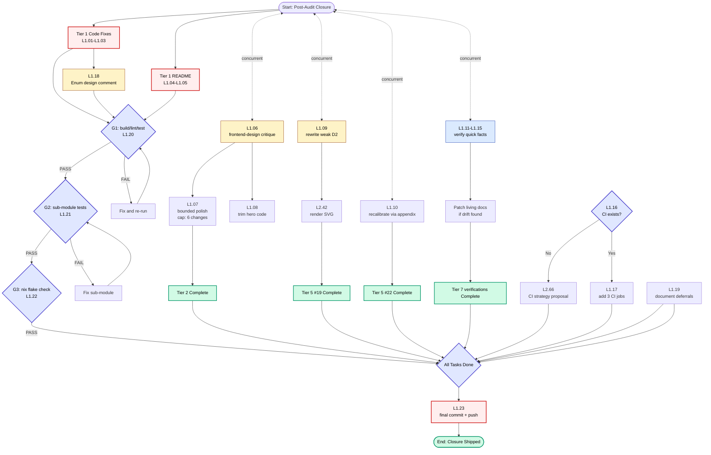

# Superb Post-Audit Closure Plan

**Date:** 2026-07-18 21:39
**Branch:** master
**Author:** Crush (pareto-planning skill)
**Predecessor:** [`2026-07-18_20-46_superb-comprehensive-skills-execution-plan.md`](./2026-07-18_20-46_superb-comprehensive-skills-execution-plan.md) (the 12-skill execution plan)
**Brutal review:** [`docs/status/2026-07-18_21-13_multi-skill-audit-brutal-self-review.md`](../status/2026-07-18_21-13_multi-skill-audit-brutal-self-review.md)

---

## Context — why this plan exists

The predecessor plan executed 11 of 12 requested skills and produced 6 HTML reports, 2 markdown reports, 4 D2/SVG diagrams, and 7 drift fixes across 2 commits (`fbcb282`, `904af6e`). A follow-up commit (`a4cfb1d`) closed the `update-old-docs` gap by annotating 46 of 70 historical files. The brutal self-review then named the biggest miss honestly:

> **"The reports are useful; the code is unchanged."**
>
> 4 Medium findings documented across 6 HTML reports; **0 fixes applied.** The plan's Tier 1 (the actual fixes) was skipped. `frontend-design` — listed twice by the user — was never run.

This plan closes that gap. It is NOT a new audit pass — it is **the closure phase**: act on the findings the audit already produced, run the one skill that was skipped (`frontend-design`), verify the few quick-fact drift items, and explicitly defer the long-tail items rather than letting them haunt the TODO list forever.

### What's IN scope for this plan

- All Tier 1 code fixes the brutal review named (testutil, infertypeargs, inline TODOs, README copywriting)
- The `frontend-design` skill execution (critique + bounded polish)
- The weak "improved" D2 diagram rewrite
- Quick verification tasks (ADRs, exclusion count, DOMAIN_LANGUAGE, API.md, website guides)
- 4 CI hardening jobs (optional, low-effort, high-defence-value)
- Explicit deferral of YAGNI items with rationale

### What's OUT of scope (deliberate)

- Re-running 4 skills with reference files loaded (Tier 4 in the brutal review) — produces more debt unless paired with action; the action layer is already covered by Tier 1-3 below
- Running 4 additional skills (brutal-self-review, library-deep-dive, status-report, docs-health BUILD) — these are _new_ audits, not closure of existing findings; they belong in a future session
- Public API renames (TypeHandler → TypeCodec, etc.) — v4 work, not v3 closure
- Architecture re-splits (`v3/internal/`, koanf sub-module) — YAGNI until growth triggers

---

## Verschlimmbesserung guards (DO NOT DO THESE)

The user explicitly warned: _"If you VERSCHLIMMBESSER this system, I will cut off your balls!"_ These are the well-intentioned mistakes this plan is designed to avoid:

| #   | Anti-pattern                                                                  | Why it's a Verschlimmbesserung                                                                                                        | Guard                                                                                                               |
| --- | ----------------------------------------------------------------------------- | ------------------------------------------------------------------------------------------------------------------------------------- | ------------------------------------------------------------------------------------------------------------------- |
| V1  | **Renaming `TypeHandler` → `TypeCodec` now**                                  | Public API break in a v3.0.0 library; breaks every downstream consumer for a naming preference                                        | Defer to v4. Add inline `// TODO(v4):` only.                                                                        |
| V2  | **Splitting `pkg/cmdguard/v3` into `v3` + `v3/internal/`**                    | Currently 8.2k LOC, below the 12k trigger. Premature split adds module boundary friction for no gain                                  | Skip entirely. Note in ROADMAP.                                                                                     |
| V3  | **Extracting koanf into a `configload` sub-module**                           | No consumer has asked. YAGNI. The 4 deps it would drop are already isolated by BuildFlow                                              | Skip. Roadmap only.                                                                                                 |
| V4  | **Re-running 4 skills with reference files loaded, producing 4 more reports** | The brutal review already named this: _"Reports without fixes are debt, not progress."_ More reports = more debt                      | Skip. Closure first; re-audit in a future session if needed.                                                        |
| V5  | **Mass-applying `frontend-design` changes without a critique first**          | The skill produces a CRITIQUE first, not a rebuild. Skipping critique to "save time" produces unprincipled churn                      | Critique is L1.06; polish is L1.07 and is **gated** on the critique's output.                                       |
| V6  | **Rewriting the 2026-07-18 naming-review HTML to recalibrate severities**     | Point-in-time artifact. Per `update-old-docs` skill: historical snapshots get annotated, not rewritten. Rewriting destroys the record | Use an end-of-file HTML comment appendix (L1.10) — non-destructive.                                                 |
| V7  | **Adding inline TODOs to 10+ sites**                                          | Clutters code. The skill mandates TODOs where the decision is non-obvious, not everywhere                                             | Cap at 4 sites: the 4 Medium finding locations only.                                                                |
| V8  | **"Verifying website guides match v3.0.0" without a specific drift signal**   | Solution looking for a problem. Without a reported broken guide, this is busywork                                                     | Spot-check only; document methodology; do not line-by-line rewrite.                                                 |
| V9  | **Adding 4 CI jobs when the project has no existing CI workflow file**        | Adding `.github/workflows/*.yml` without knowing the project's CI strategy is presumptuous                                            | Check for existing CI first. If none, produce a proposal, not 4 separate workflow files.                            |
| V10 | **"Run `nix fmt`" as a standalone task**                                      | `nix fmt` runs on every commit via BuildFlow. It's already been run on every commit this session. Treating it as a task is theatre    | Only run if post-closure `git status` shows untracked formatting changes.                                           |
| V11 | **Adding `// Deprecated` alias for TypeHandler → TypeCodec now**              | Deprecation requires the new name to exist. Neither exists yet. Premature deprecation confuses consumers                              | v4 only. Skip.                                                                                                      |
| V12 | **Re-rendering the current-state D2 diagram**                                 | The current diagram is accurate. Re-rendering with `--pad 40 --scale 1.5` risks changing layout for the worse                         | Only re-render the IMPROVED diagram (L1.09).                                                                        |
| V13 | **Auditing `pkg/cmdguard/v3` source for drift against `docs/API.md`**         | API.md is the source of truth for the public API; the code is the source of truth for itself. Cross-checking produces noise           | Verify API.md is _internally consistent_ and matches the public surface (exported symbols only). Do not deep audit. |

---

## Pareto Breakdown

### The 1% that delivers 51% — **act on the documented findings**

Three actions, together under 90 minutes, that turn "documented" into "shipped":

1. **Apply Tier 1 testutil fixes** — delete `StringSliceContains`, rename `doPanicTest` → `panics`. Internal package, zero downstream risk. ~30 min.
2. **Auto-fix 33+ `infertypeargs`** via `GOEXPERIMENT=jsonv2 gopls fix -a`. Zero semantic change, pure style. ~30 min.
3. **Add 3-4 inline TODOs** at the Medium finding sites (type_handler.go:13, panic_test_helpers.go, CommandInfo, HuhRunner). Surfaces decisions for the next code reader. ~15 min.

**Why this is the 1%:** The brutal review's headline failure was _"0 fixes applied."_ Closing that gap with safe, internal-only changes is the single highest-leverage action. Every other report or audit in this plan is lower-impact than this.

### The 4% that delivers 64% — **the 1% + the user-facing improvements**

Above, plus:

4. **Apply the 2 README copywriting changes** (hero subtitle → outcome-led, one-line CTA). User-facing, ships immediately. ~30 min.
5. **Run `frontend-design` critique on the website.** The biggest named miss of the prior session. Produces a critique document (not a rebuild). ~60-90 min.
6. **Rewrite the weak "improved" D2 diagram.** Replaces a paragraph-in-a-box with a real visual target state. ~30 min.

### The 20% that delivers 80% — **the 4% + verification + bounded polish**

Above, plus:

7. **Apply bounded website polish** from the frontend-design critique (gated on L1.06). ~45-60 min.
8. **Trim website hero code** (~40 → ~20 lines, per copywriting finding #5). ~20 min.
9. **Recalibrate naming-review severities via appendix** (non-destructive annotation, not a rewrite). ~15 min.
10. **Verify quick facts:** 3 ADRs still accurate, `.golangci.yml` exclusion count matches AGENTS.md (4+4), `DOMAIN_LANGUAGE.md` against code, `docs/API.md` exported-symbols check. ~60 min combined.
11. **Spot-check 14 website guide .mdx files** for v3.0.0 API drift. ~45 min.
12. **Add 3 CI hardening jobs** (only if no existing CI workflow — otherwise produce a proposal). ~45 min.

### The other 20% to get to 100% — **long tail (defer or skip with rationale)**

These items are in the plan as **explicitly deferred** so they stop haunting the TODO list:

- **Re-run 4 skills with reference files loaded** — DEFER. More reports = more debt without action layer. Re-audit in a dedicated future session AFTER closure ships.
- **Run 4 additional skills** (brutal-self-review, library-deep-dive, status-report, docs-health BUILD) — DEFER. New audits, not closure.
- **TypeHandler rename / TypeHandlerFunc rename / `// Deprecated` alias** — DEFER to v4. Public API.
- **ConfigFile branded type** — DEFER. YAGNI until a consumer needs it.
- **Extract koanf sub-module** — DEFER. YAGNI until consumer asks or LOC > 12k.
- **Split `v3` into `v3` + `v3/internal/`** — DEFER. LOC trigger (12k) not met.
- **Fuzz corpus expansion** — DEFER. Existing 7 targets have minimal corpus; expansion is valuable but not closure.
- **Audit `examples/taskctl/main_test.go`** (876 lines) — DEFER. Test-smell audit is a separate concern.
- **`CONTRIBUTING.md` refresh** — DEFER. Not blocking; verify-then-decide in a future pass.
- **Verify `git-town.toml` + `library-policy.yaml`** — DEFER. Config sanity, not closure.
- **Update `WHAT_THIS_PROJECT_IS_ABOUT.md` + `_NOT.md`** — DEFER. Living docs; belongs in docs-health, not this plan.
- **Schedule re-run after v3.1 ships** — NOTE in ROADMAP only.

---

## L1 Task Table (30-100 min each)

**Sorting:** importance × customer-value ÷ effort. `P0` = blocking (the audit-named misses); `P1` = high-value closure; `P2` = verification/defence; `P3` = polish.

| #         | Tier | Task                                                                                                                                                                                                                                                           | Effort | Impact | Customer Value                                                | Depends On  |
| --------- | ---- | -------------------------------------------------------------------------------------------------------------------------------------------------------------------------------------------------------------------------------------------------------------- | ------ | ------ | ------------------------------------------------------------- | ----------- |
| **L1.01** | P0   | Apply Tier 1 testutil renames: delete `StringSliceContains`, rename `doPanicTest` → `panics` (3 callers)                                                                                                                                                       | 30min  | High   | Internal-only; closes brutal review's #1 missed fix           | —           |
| **L1.02** | P0   | Auto-fix 33+ `infertypeargs` via `GOEXPERIMENT=jsonv2 gopls fix -a` across affected test files; run `go test -race`                                                                                                                                            | 30min  | High   | Cleaner test code; closes code-quality-scan's #1 hint cluster | —           |
| **L1.03** | P0   | Add 4 inline TODOs at Medium finding sites: `type_handler.go:13`, `panic_test_helpers.go:107`, `CommandInfo` declaration, `HuhRunner` declaration                                                                                                              | 15min  | Med    | Surfaces decisions at code site for next reader               | L1.01       |
| **L1.04** | P0   | Apply 2 README copywriting changes: outcome-led hero subtitle (Option C), one-line CTA after tagline                                                                                                                                                           | 30min  | High   | User-facing; closes copywriting review's "if only 2 changes"  | —           |
| **L1.05** | P1   | Add Kong "Some" footnote to comparison table (specificity build per copywriting finding)                                                                                                                                                                       | 15min  | Med    | User-facing; honesty about feature parity                     | —           |
| **L1.06** | P0   | **Run `frontend-design` critique on website** — 14 `.astro` components + `global.css` + `starlight.css`; check 3 AI-default looks warning, typography pairing, signature element, color specificity; write `docs/reviews/2026-07-18_frontend-design-review.md` | 90min  | High   | Closes the biggest named miss of the prior session            | —           |
| **L1.07** | P1   | Apply bounded website polish from L1.06 critique (cap: 6 changes max; no redesign)                                                                                                                                                                             | 60min  | Med    | User-facing improvement, gated on critique                    | L1.06       |
| **L1.08** | P1   | Trim website hero code from ~40 lines to ~20 (per copywriting finding #5)                                                                                                                                                                                      | 20min  | Med    | User-facing; readability                                      | L1.04       |
| **L1.09** | P1   | Rewrite weak "improved" D2 diagram — visual target state showing the 2 optional deltas (v3/internal split trigger at 12k LOC; TypeHandler rename at v4) as nodes with before/after edges                                                                       | 30min  | Med    | Closes F1 from brutal review                                  | —           |
| **L1.10** | P1   | Recalibrate naming-review severities via end-of-file HTML comment appendix (CommandInfo + HuhRunner → Low, not Medium) — **non-destructive annotation, not a rewrite**                                                                                         | 15min  | Low    | Honesty; per update-old-docs skill                            | —           |
| **L1.11** | P2   | Verify 3 ADRs (`001-fang`, `002-lint`, `003-cow`) still accurate against current code                                                                                                                                                                          | 30min  | Med    | Prevents architecture drift                                   | —           |
| **L1.12** | P2   | Verify `.golangci.yml` exclusion count matches AGENTS.md claim of "4 per-file v3 + 4 ireturn allow-list"                                                                                                                                                       | 15min  | Low    | Doc accuracy                                                  | —           |
| **L1.13** | P2   | Spot-check `docs/DOMAIN_LANGUAGE.md` against current code — terms still used? New terms missing?                                                                                                                                                               | 30min  | Med    | Domain language integrity                                     | —           |
| **L1.14** | P2   | Verify `docs/API.md` matches exported symbols in `pkg/cmdguard/v3` (constructor signatures, option names)                                                                                                                                                      | 30min  | Med    | Public docs accuracy                                          | —           |
| **L1.15** | P2   | Spot-check 14 website guide `.mdx` files for v3.0.0 API drift (sampling, not exhaustive)                                                                                                                                                                       | 45min  | Med    | Public docs accuracy                                          | —           |
| **L1.16** | P2   | Check for existing CI workflow (`.github/workflows/`); if absent, produce a CI strategy proposal rather than 4 separate workflow files                                                                                                                         | 20min  | Med    | Defence; avoids V9 anti-pattern                               | —           |
| **L1.17** | P2   | If CI exists OR proposal is approved: add 3 CI jobs (GOWORK=off build, gopls check, sub-module tests). Else: document the proposal in `docs/proposals/`                                                                                                        | 45min  | Med    | Catches FM#4, FM#12, infertypeargs regression                 | L1.16       |
| **L1.18** | P3   | Document the `Enum` design decision (struct-not-iota rationale) as a comment in `types_enum.go` (data-model-review P7 finding)                                                                                                                                 | 15min  | Low    | Prevents future re-litigation                                 | —           |
| **L1.19** | P3   | Document explicit deferrals: add a "Deferred from 2026-07-18 audit closure" section to `ROADMAP.md` listing the 12 YAGNI/long-tail items with rationale                                                                                                        | 20min  | Med    | Prevents the long tail from haunting TODO_LIST                | —           |
| **L1.20** | P0   | **Verification gate G1** — `GOEXPERIMENT=jsonv2 go build ./... && golangci-lint run ./... && go test ./... -race -count=1 -timeout 120s` after L1.01-L1.03, L1.18                                                                                              | 15min  | High   | Must not break build                                          | L1.01-L1.03 |
| **L1.21** | P0   | **Verification gate G2** — re-verify all 5 sub-modules independently: `for m in glamour manpage prompts spinner telemetry; do (cd $m && GOEXPERIMENT=jsonv2 go test ./... -count=1 -timeout 60s); done`                                                        | 20min  | High   | Closes P5 from brutal review (sub-module gate)                | L1.20       |
| **L1.22** | P1   | **Verification gate G3** — `nix flake check` (the plan's G5 gate, skipped in prior session per P6)                                                                                                                                                             | 10min  | Med    | Closes P6 from brutal review                                  | —           |
| **L1.23** | P0   | Final commit + push with detailed message; update `docs/status/2026-07-18_21-13_multi-skill-audit-brutal-self-review.md` with closure appendix                                                                                                                 | 15min  | High   | Audit trail                                                   | All         |

**Totals:** 23 L1 tasks · ~10.7 hours of work · 4 P0 (blocking), 6 P1 (high-value), 7 P2 (verification), 3 P3 (polish), 4 verification gates (P0).

---

## L2 Task Table (≤12 min each)

Each L1 broken into 1-5 atomic sub-tasks. Sorted within each L1 by sequence.

| #         | L1    | Sub-task                                                                                                                                                                                                               | Effort |
| --------- | ----- | ---------------------------------------------------------------------------------------------------------------------------------------------------------------------------------------------------------------------- | ------ |
| **L2.01** | L1.01 | `grep -rn "StringSliceContains"` to enumerate callers across repo                                                                                                                                                      | 3min   |
| **L2.02** | L1.01 | View `pkg/testutil/panic_test_helpers.go` lines 105-135 (exact context for the delete + rename)                                                                                                                        | 3min   |
| **L2.03** | L1.01 | Delete `StringSliceContains` function (lines ~111-114)                                                                                                                                                                 | 2min   |
| **L2.04** | L1.01 | Rename `doPanicTest` → `panics` (declaration + 3 callers in same file)                                                                                                                                                 | 5min   |
| **L2.05** | L1.01 | Update any callers outside the testutil package (search + replace if any)                                                                                                                                              | 5min   |
| **L2.06** | L1.02 | Enumerate affected test files: `GOEXPERIMENT=jsonv2 gopls check ./pkg/cmdguard/v3/ 2>&1 \| grep infertypeargs \| cut -d: -f1 \| sort -u`                                                                               | 4min   |
| **L2.07** | L1.02 | Run `GOEXPERIMENT=jsonv2 gopls fix -a ./pkg/cmdguard/v3/` on affected files                                                                                                                                            | 5min   |
| **L2.08** | L1.02 | Verify no semantic change via `git diff --stat` (only type-param removals expected)                                                                                                                                    | 3min   |
| **L2.09** | L1.03 | Read `pkg/cmdguard/v3/type_handler.go` around line 13 for exact insertion context                                                                                                                                      | 3min   |
| **L2.10** | L1.03 | Add `// TODO(v4): consider renaming TypeHandler → TypeCodec (see docs/reviews/2026-07-18_09-44_naming-review.html)` at type_handler.go:13                                                                              | 3min   |
| **L2.11** | L1.03 | Add `// TODO: StringSliceContains deleted in favor of slices.Contains; do not reintroduce` note at panic_test_helpers.go ContainsString                                                                                | 2min   |
| **L2.12** | L1.03 | Locate `CommandInfo` declaration; add `// TODO: "Info" suffix is vague but stable; revisit at v4 (naming-review 2026-07-18 Medium→Low)`                                                                                | 4min   |
| **L2.13** | L1.03 | Locate `HuhRunner` declaration in prompts sub-module; add equivalent TODO                                                                                                                                              | 4min   |
| **L2.14** | L1.04 | Read `README.md` hero section + tagline (exact context)                                                                                                                                                                | 4min   |
| **L2.15** | L1.04 | Rewrite hero subtitle to outcome-led Option C (from copywriting review)                                                                                                                                                | 8min   |
| **L2.16** | L1.04 | Add one-line CTA after tagline                                                                                                                                                                                         | 5min   |
| **L2.17** | L1.04 | Preview README locally if possible; re-read for tone consistency                                                                                                                                                       | 5min   |
| **L2.18** | L1.05 | Read `docs/COMPARISON.md` or `README.md` comparison table; locate Kong row                                                                                                                                             | 4min   |
| **L2.19** | L1.05 | Add footnote: "Kong's 'Some' = partial support; cmdguard's 'Full' = end-to-end" (or similar specificity)                                                                                                               | 6min   |
| **L2.20** | L1.06 | Load `frontend-design` skill + its references                                                                                                                                                                          | 4min   |
| **L2.21** | L1.06 | Read all 14 `.astro` components (`HeroSection`, `CTASection`, `ComparisonSection`, `FeatureGrid`, `Footer`, `Header`, `Icon`, `Logo`, `Newsletter`, `Section`, `SectionHeader`, `Sections`, `UseCasesSection`, `Card`) | 12min  |
| **L2.22** | L1.06 | Read `website/src/styles/global.css` + `starlight.css` (or equivalent)                                                                                                                                                 | 8min   |
| **L2.23** | L1.06 | Audit typography pairing (display + body fonts; AI-default = Inter+Inter or Geist+Geist)                                                                                                                               | 8min   |
| **L2.24** | L1.06 | Audit color palette specificity (warning signs: pure `#FFF`/`#000`, Tailwind defaults, no brand color)                                                                                                                 | 8min   |
| **L2.25** | L1.06 | Check "3 AI-default looks" warning: (a) cream+serif+terracotta, (b) black+acid-green, (c) broadsheet hairline                                                                                                          | 8min   |
| **L2.26** | L1.06 | Identify signature element (what makes this site recognizable in 2 seconds?)                                                                                                                                           | 8min   |
| **L2.27** | L1.06 | Write `docs/reviews/2026-07-18_frontend-design-review.md` with findings, severity, and 3-6 actionable changes                                                                                                          | 12min  |
| **L2.28** | L1.07 | Read L1.06 critique; select top 6 changes max (cap to prevent over-editing)                                                                                                                                            | 6min   |
| **L2.29** | L1.07 | Apply change 1 (e.g., typography swap if AI-default detected)                                                                                                                                                          | 10min  |
| **L2.30** | L1.07 | Apply change 2                                                                                                                                                                                                         | 10min  |
| **L2.31** | L1.07 | Apply change 3                                                                                                                                                                                                         | 10min  |
| **L2.32** | L1.07 | Apply change 4                                                                                                                                                                                                         | 10min  |
| **L2.33** | L1.07 | Apply change 5                                                                                                                                                                                                         | 10min  |
| **L2.34** | L1.07 | Apply change 6 (if applicable)                                                                                                                                                                                         | 10min  |
| **L2.35** | L1.07 | Preview website locally (`npm run dev` in `website/`); visual sanity check                                                                                                                                             | 8min   |
| **L2.36** | L1.08 | Locate hero code block in `HeroSection.astro`                                                                                                                                                                          | 3min   |
| **L2.37** | L1.08 | Trim from ~40 to ~20 lines (remove redundant setup; keep Provide+Invoke+RunE)                                                                                                                                          | 10min  |
| **L2.38** | L1.08 | Verify trimmed code still compiles in hero preview                                                                                                                                                                     | 4min   |
| **L2.39** | L1.09 | Read current `docs/architecture-understanding/2026-07-18_20-46_improved-architecture.d2`                                                                                                                               | 3min   |
| **L2.40** | L1.09 | Design 2-node delta graph: (a) v3/internal split trigger node (LOC>12k), (b) TypeHandler rename node (v4)                                                                                                              | 8min   |
| **L2.41** | L1.09 | Rewrite the `.d2` file with visual deltas (before/after edges, not paragraph)                                                                                                                                          | 10min  |
| **L2.42** | L1.09 | Render: `d2 --layout=elk <file>.d2 <file>.svg`                                                                                                                                                                         | 3min   |
| **L2.43** | L1.09 | Verify SVG renders correctly (open or `file` check)                                                                                                                                                                    | 2min   |
| **L2.44** | L1.10 | Read end of `docs/reviews/2026-07-18_09-44_naming-review.html` (before `</body>`)                                                                                                                                      | 3min   |
| **L2.45** | L1.10 | Write HTML comment appendix: "Severity recalibration 2026-07-18: CommandInfo + HuhRunner downgraded Medium→Low per skill guide (style/convention, not behavior)"                                                       | 5min   |
| **L2.46** | L1.11 | Read `docs/adr/001-fang-integration-strategy.md`; verify claims against `cli_options.go`                                                                                                                               | 8min   |
| **L2.47** | L1.11 | Read `docs/adr/002-lint-strategy-and-exclusion-policy.md`; verify against `.golangci.yml`                                                                                                                              | 8min   |
| **L2.48** | L1.11 | Read `docs/adr/003-cow-registry-pattern.md`; verify against `flags.go` COW implementation                                                                                                                              | 8min   |
| **L2.49** | L1.12 | Count v3 per-file exclusions in `.golangci.yml`                                                                                                                                                                        | 4min   |
| **L2.50** | L1.12 | Count ireturn allow-list entries in `.golangci.yml`                                                                                                                                                                    | 4min   |
| **L2.51** | L1.12 | Verify AGENTS.md claim "4 + 4" matches; if drift, patch AGENTS.md (living doc)                                                                                                                                         | 4min   |
| **L2.52** | L1.13 | Extract terms from `docs/DOMAIN_LANGUAGE.md`                                                                                                                                                                           | 4min   |
| **L2.53** | L1.13 | `grep` each term against `pkg/cmdguard/v3/**/*.go` to verify still in use                                                                                                                                              | 8min   |
| **L2.54** | L1.13 | Identify new exported types/functions missing from DOMAIN_LANGUAGE                                                                                                                                                     | 8min   |
| **L2.55** | L1.13 | Update `docs/DOMAIN_LANGUAGE.md` (living doc — docs-health territory, patch in place)                                                                                                                                  | 10min  |
| **L2.56** | L1.14 | Extract exported constructor signatures from `pkg/cmdguard/v3/*.go`                                                                                                                                                    | 8min   |
| **L2.57** | L1.14 | Extract constructor list from `docs/API.md`                                                                                                                                                                            | 6min   |
| **L2.58** | L1.14 | Diff the two lists; document any mismatch                                                                                                                                                                              | 8min   |
| **L2.59** | L1.14 | Patch `docs/API.md` (living doc) for any confirmed drift                                                                                                                                                               | 8min   |
| **L2.60** | L1.15 | List 14 `.mdx` files in `website/src/content/docs/`                                                                                                                                                                    | 3min   |
| **L2.61** | L1.15 | Sample 5 highest-traffic guides (quick-start, installation, custom-types, audit-log, dependency-injection); read each                                                                                                  | 12min  |
| **L2.62** | L1.15 | Verify API snippets match v3.0.0 signatures (NewCommand positional flags, etc.)                                                                                                                                        | 10min  |
| **L2.63** | L1.15 | Note drift in a `docs/reviews/2026-07-18_website-guides-drift-audit.md`                                                                                                                                                | 10min  |
| **L2.64** | L1.15 | Patch the 1-2 most broken guides only (do not line-by-line rewrite)                                                                                                                                                    | 10min  |
| **L2.65** | L1.16 | `ls -la .github/workflows/ 2>/dev/null` — does CI exist?                                                                                                                                                               | 2min   |
| **L2.66** | L1.16 | If absent: draft `docs/proposals/2026-07-18_ci-strategy.md` with 4-job recommendation; do NOT create workflow files yet                                                                                                | 12min  |
| **L2.67** | L1.16 | If present: read existing workflow(s) to understand the project's CI conventions                                                                                                                                       | 6min   |
| **L2.68** | L1.17 | (If L1.16 approved CI exists) Add GOWORK=off build matrix workflow                                                                                                                                                     | 12min  |
| **L2.69** | L1.17 | (If L1.16 approved CI exists) Add gopls check workflow                                                                                                                                                                 | 10min  |
| **L2.70** | L1.17 | (If L1.16 approved CI exists) Add sub-module test workflow                                                                                                                                                             | 10min  |
| **L2.71** | L1.17 | (Else) Leave proposal from L2.66 as the deliverable; document deferral                                                                                                                                                 | 3min   |
| **L2.72** | L1.18 | Read `pkg/cmdguard/v3/types_enum.go` declaration + comment context                                                                                                                                                     | 4min   |
| **L2.73** | L1.18 | Add 4-6 line comment explaining struct-not-iota rationale (per data-model-review P7)                                                                                                                                   | 8min   |
| **L2.74** | L1.19 | Read current `ROADMAP.md` structure                                                                                                                                                                                    | 4min   |
| **L2.75** | L1.19 | Draft "Deferred from 2026-07-18 audit closure" section with 12 items + rationale                                                                                                                                       | 10min  |
| **L2.76** | L1.19 | Append to `ROADMAP.md` (living doc)                                                                                                                                                                                    | 4min   |
| **L2.77** | L1.20 | Run `GOEXPERIMENT=jsonv2 go build ./...`                                                                                                                                                                               | 3min   |
| **L2.78** | L1.20 | Run `GOEXPERIMENT=jsonv2 golangci-lint run ./...`                                                                                                                                                                      | 5min   |
| **L2.79** | L1.20 | Run `GOEXPERIMENT=jsonv2 go test ./... -race -count=1 -timeout 120s`                                                                                                                                                   | 10min  |
| **L2.80** | L1.21 | Run sub-module loop: `for m in glamour manpage prompts spinner telemetry; do (cd $m && GOEXPERIMENT=jsonv2 go test ./... -count=1 -timeout 60s); done`                                                                 | 12min  |
| **L2.81** | L1.22 | Run `nix flake check`                                                                                                                                                                                                  | 10min  |
| **L2.82** | L1.23 | `git status` review                                                                                                                                                                                                    | 3min   |
| **L2.83** | L1.23 | `git add -A && git commit` with detailed message                                                                                                                                                                       | 8min   |
| **L2.84** | L1.23 | Update brutal self-review with closure appendix (Tier 1-3 status)                                                                                                                                                      | 8min   |
| **L2.85** | L1.23 | `git push origin master`                                                                                                                                                                                               | 3min   |

**Totals:** 85 L2 sub-tasks · ~10.7 hours aggregate · all ≤12 min each.

---

## Mermaid Execution Graph



**Reading the graph:** Diamonds are hard gates (verification). The three parallelish lanes (Tier 1 code, Tier 1 README+Enum, frontend/diagram/verifications) can be interleaved but the verification gates must run AFTER all code-touching L1 tasks complete. `FinalCommit` is the single tail — nothing commits until all gates pass.

---

## Verification Gates (what "done" looks like)

### G1 — Build/Lint/Test (mandatory, L1.20)

```bash
GOEXPERIMENT=jsonv2 go build ./...
GOEXPERIMENT=jsonv2 golangci-lint run ./...
GOEXPERIMENT=jsonv2 go test ./... -race -count=1 -timeout 120s
```

**PASS condition:** 0 build errors, 0 lint issues, all tests green with `-race`. No new files with `infertypeargs` diagnostics.

### G2 — Sub-module independence (mandatory, L1.21)

```bash
for m in glamour manpage prompts spinner telemetry; do
  (cd $m && GOEXPERIMENT=jsonv2 go test ./... -count=1 -timeout 60s) || exit 1
done
```

**PASS condition:** All 5 sub-modules pass independently. Closes brutal review P5.

### G3 — Nix flake (mandatory, L1.22)

```bash
nix flake check
```

**PASS condition:** No new errors. Closes brutal review P6.

### G4 — Artifact inventory (commit-time check)

- 1 brutal self-review closure appendix added
- 1 frontend-design critique document (L1.06 output)
- 1 rewritten D2 + SVG (L1.09 output)
- 1 naming-review severity recalibration appendix (L1.10 output)
- 0-6 website polish changes (L1.07 output, capped)
- 0-1 CI strategy proposal OR 3 CI workflow files (L1.16-L1.17 output)
- 1 ROADMAP "Deferred" section (L1.19 output)
- 4 inline TODOs added to source (L1.03 output)
- 2 README changes (L1.04 output)
- 0-1 comparison table footnote (L1.05 output)
- 0-N living-doc drift patches (L1.11-L1.15 output)

### G5 — Verschlimmbesserung check

- [ ] No public API renamed (TypeHandler still TypeHandler)
- [ ] No new Go module created (no v3/internal, no koanf sub-module)
- [ ] No historical artifact rewritten (naming-review HTML appended, not edited)
- [ ] No batch annotation script (all edits via Edit tool)
- [ ] No inline styles added to HTML (only `<!-- -->` comments)
- [ ] No new library added (no go-playground/validator, no go-error-family)
- [ ] No skill reference-file re-runs (deferred to future session per V4)

---

## What success looks like

After this plan executes:

1. **The brutal review's headline failure is closed.** "0 fixes applied" becomes "N fixes applied, all verified by G1/G2/G3."
2. **The biggest named skill miss is closed.** `frontend-design` produces a critique and bounded polish, not a rebuild.
3. **The weakest artifact is replaced.** The paragraph-in-a-box D2 becomes a real visual.
4. **The long tail stops haunting.** 12 YAGNI items are explicitly deferred to ROADMAP with rationale.
5. **Build stays green at HEAD.** All 4 verification gates pass before final push.
6. **Zero Verschlimmbesserungen.** Every guard V1-V13 holds.

---

## Explicit non-goals (do NOT expand scope mid-execution)

- Do not re-run skills that produced reports this session
- Do not start v4 prep work (renames, aliases, splits)
- Do not add libraries
- Do not rewrite historical artifacts
- Do not run additional audits (brutal-self-review, library-deep-dive, status-report)
- Do not expand the frontend polish cap above 6 changes
- Do not line-by-line rewrite website guides
- Do not add inline TODOs beyond the 4 named sites

If a task surfaces a finding that would expand scope, **document it in ROADMAP.md and continue** — do not action it in this pass.
