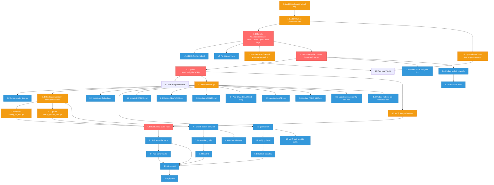

# Consolidate Config Loading to KoanfLoader Only

**Date:** 2026-07-26
**Status:** ~~Planning~~ Implemented 2026-07-27 (commit `e3e710c`)
**Author:** AI Session

> **Update 2026-07-27 (commit `e3e710c`):** This plan was **executed**. The
> `configload` sub-package was deleted entirely; `KoanfLoader` now lives in the
> `v3` package (`koanf_loader.go`); `jsonLoader`/`NewJSONLoader()` were deleted;
> `WithConfigFile` creates a `KoanfLoader` with auto-format detection. Full
> item-by-item status in [Resolution](#resolution-2026-07-27) below. The circular
> dependency blocker flagged in section "Critical Architectural Decision" was
> resolved by **moving KoanfLoader into `v3`** (eliminating the `configload`
> package), which was option (a) of the options later raised. The go.work
> go-output pollution noted in the implementation report is **still open**.

---

## Context

cmdguard currently has **three** config file loading mechanisms, all implementing the same `ConfigFileLoader` interface:

| Loader                       | File                   | Formats                  | Nested?                                                    | Reads own files?               |
| ---------------------------- | ---------------------- | ------------------------ | ---------------------------------------------------------- | ------------------------------ |
| `jsonLoader` (core)          | `config_file.go`       | JSON only                | Yes (`collectKeysRecursive` + `MatchCaseInsensitiveNames`) | No — receives bytes            |
| `genericLoader` (configload) | `configload/loader.go` | YAML, TOML, JSON         | **No** (top-level keys only)                               | No — receives bytes            |
| `KoanfLoader` (configload)   | `configload/koanf.go`  | YAML, JSON (**no TOML**) | Yes (koanf flattening + `Tag: "flag"`)                     | **Yes — ignores `data` param** |

No single loader handles all formats AND nested config. `WithConfigFile` hardcodes JSON. `WithConfigFileLoader` is the escape hatch. The `ConfigFileLoader.Load(data []byte, ...)` interface is a lie — KoanfLoader ignores `data`. There are 6 loader functions (`YAML()`, `TOML()`, `JSON()`, `Auto()`, `LoaderForPath()`, `NewKoanfLoader()`) for what should be one concept.

## Critical Architectural Decision

### Two incompatible approaches to nested config

**Approach 1 (jsonLoader / integration tests):**

```go
type DBConfig struct {
    Host string `flag:"db-host" json:"db-host"`
    Port int    `flag:"db-port" json:"db-port"`
}
type RootConfig struct {
    Database DBConfig `json:"Database"`  // no flag tag → ParseFlagTags recurses
}
// Config file: {"Database": {"db-host": "x", "db-port": 5432}}
// collectKeysRecursive flattens all keys → "db-host" matches flag tag
// json.Unmarshal with MatchCaseInsensitiveNames matches "Database" → field DB
```

**Approach 2 (current KoanfLoader / koanf_test.go):**

```go
type Config struct {
    ServerPort int `flag:"server.port"`  // flat struct, dotted flag name
}
// Config file: server: {port: 3000}
// koanf flattens to "server.port" → matches flag tag
// k.UnmarshalWithConf(Tag: "flag", FlatPaths: true) populates struct
```

These are **fundamentally incompatible**: Approach 1 uses Go field names (case-insensitive) for config key matching; Approach 2 uses `flag` tag values (exact match) with koanf's flattening.

### Decision: Standardize on Approach 1

**Approach 1 is the standard.** All integration tests, the taskctl example, and real user code use it. Approach 2 exists only in koanf unit tests.

**Implementation:** KoanfLoader uses koanf **only as a format parser** (YAML/TOML/JSON), converts the parsed config to JSON bytes via `k.Marshal(json.Parser())`, then reuses the existing `jsonLoader` logic (`collectKeysRecursive` + `FilterSetFields` + `json.Unmarshal` with `MatchCaseInsensitiveNames(true)`).

This preserves **all** existing behavior (case-insensitive matching, nested struct support, `collectKeysRecursive` key detection) while adding YAML and TOML format support through koanf's parsers.

### What this means for the `ConfigFileLoader` interface

The interface `Load(data []byte, cfg any) (setFields []string, err error)` stays as-is. KoanfLoader ignores `data` (reads files itself). Custom loaders can still use `data` if they want (via the retained `loadConfigFile` helper). The `data` param is documented as "may be nil for loaders that handle their own file reading."

---

## Pareto Breakdown

### 1% that delivers 51%

| Task                                                    | Why                                            |
| ------------------------------------------------------- | ---------------------------------------------- |
| Refactor KoanfLoader to use koanf→JSON→jsonLoader logic | Unifies behavior, preserves all existing tests |
| Make `WithConfigFile` use KoanfLoader internally        | One entry point, auto-format-detection         |

### 4% that delivers 64%

| Task                                                                                            | Why                              |
| ----------------------------------------------------------------------------------------------- | -------------------------------- |
| Delete `genericLoader`, `autoLoader`, `YAML()`, `TOML()`, `JSON()`, `Auto()`, `LoaderForPath()` | Eliminates 6 redundant functions |
| Delete `jsonLoader`, `NewJSONLoader()` from public API                                          | One loader, one code path        |
| Remove `go-faster/yaml` and `pelletier/go-toml/v2` deps                                         | Fewer dependencies               |

### 20% that delivers 80%

| Task                                                                                      | Why                         |
| ----------------------------------------------------------------------------------------- | --------------------------- |
| Add TOML parser to KoanfLoader                                                            | All 3 formats supported     |
| Update all tests (config_file_test.go, config_nested_test.go, koanf_test.go, integration) | Verify nothing breaks       |
| Update examples                                                                           | Consumer-facing correctness |

### Remaining 20% for 100%

| Task                                                                              | Why                                     |
| --------------------------------------------------------------------------------- | --------------------------------------- |
| Update all documentation (README, FEATURES, AGENTS, CHANGELOG, API, website, ADR) | Users need to know about the change     |
| Update lint config (ireturn allow list)                                           | `ConfigFileLoader` may leave allow list |
| Final verification (tests, lint, build, benchmarks)                               | Confidence                              |
| git commit & push                                                                 | Ship it                                 |

---

## Comprehensive Plan (30-100min tasks)

| # | Task                                                                                        | Est   | Impact   | Effort | Priority |
| - | ------------------------------------------------------------------------------------------- | ----- | -------- | ------ | -------- |
| 1 | Refactor KoanfLoader: koanf as parser → JSON → existing jsonLoader logic                    | 45min | Critical | Medium | P0       |
| 2 | Make `WithConfigFile` use KoanfLoader; update `loadConfigFileOrSkip`                        | 30min | Critical | Low    | P0       |
| 3 | Delete old loaders (`loader.go`, `loader_test.go`, `jsonLoader`, `NewJSONLoader`)           | 30min | High     | Low    | P1       |
| 4 | Update tests (`config_file_test.go`, `config_nested_test.go`, `koanf_test.go`, integration) | 60min | Critical | Medium | P0       |
| 5 | Update deps (`go.mod`: remove go-faster/yaml + pelletier/go-toml, add koanf/parsers/toml)   | 15min | Medium   | Low    | P1       |
| 6 | Update examples (`taskctl/main.go`)                                                         | 15min | Low      | Low    | P2       |
| 7 | Update lint config (`.golangci.yml` ireturn allow list)                                     | 15min | Low      | Low    | P2       |
| 8 | Update documentation (README, FEATURES, AGENTS, CHANGELOG, API, TODO, website, ADR)         | 90min | Medium   | Low    | P2       |
| 9 | Final verification (tests -race, lint, build, benchmarks)                                   | 30min | Critical | Low    | P0       |

**Total estimated: ~330min (5.5 hours)**

---

## Detailed Breakdown (max 12min per task)

| #   | Subtask                                                                                                                                                                                              | Parent | Est   | Depends on    |
| --- | ---------------------------------------------------------------------------------------------------------------------------------------------------------------------------------------------------- | ------ | ----- | ------------- |
| 1.1 | Add `koanf/parsers/toml` to `go.mod` (imports only, no code change yet)                                                                                                                              | Task 1 | 5min  | -             |
| 1.2 | Add `.toml` case to `parserForPath` in `koanf.go`                                                                                                                                                    | Task 1 | 5min  | 1.1           |
| 1.3 | Rewrite `KoanfLoader.Load`: koanf parse → `k.Marshal(json.Parser())` → `collectKeysRecursive` + `FilterSetFields` + `json.Unmarshal` with `MatchCaseInsensitiveNames`                                | Task 1 | 12min | 1.2           |
| 1.4 | Add `SetPaths` method to `KoanfLoader` for `--config` override support                                                                                                                               | Task 1 | 5min  | 1.3           |
| 1.5 | Fix doc comment: remove non-existent `KoanfWithPaths` reference                                                                                                                                      | Task 1 | 3min  | 1.3           |
| 1.6 | Update `koanf_test.go` nested config tests: change from dotted flag names to nested structs (Approach 1)                                                                                             | Task 1 | 12min | 1.3           |
| 1.7 | Update `koanf_test.go` TOML test: change from "expect error" to "expect success"                                                                                                                     | Task 1 | 5min  | 1.2           |
| 1.8 | Run koanf tests, fix failures                                                                                                                                                                        | Task 1 | 10min | 1.6, 1.7      |
| 2.1 | Change `WithConfigFile` to create `NewKoanfLoader(paths...)` instead of `&jsonLoader{}`                                                                                                              | Task 2 | 5min  | 1.3           |
| 2.2 | Update `loadConfigFileOrSkip`: type-check for `*KoanfLoader` → `SetPaths` + `Load(nil, cfg)`; else `loadConfigFile` for custom loaders                                                               | Task 2 | 12min | 2.1           |
| 2.3 | Update `WithConfigFile` doc comment (no longer JSON-only)                                                                                                                                            | Task 2 | 3min  | 2.1           |
| 2.4 | Run `config_file_integration_test.go`, fix failures                                                                                                                                                  | Task 2 | 10min | 2.2           |
| 3.1 | Delete `configload/loader.go` (genericLoader, autoLoader, YAML, TOML, JSON, Auto, LoaderForPath)                                                                                                     | Task 3 | 5min  | 2.2           |
| 3.2 | Delete `configload/loader_test.go`                                                                                                                                                                   | Task 3 | 2min  | 3.1           |
| 3.3 | Delete `jsonLoader` struct and `NewJSONLoader()` from `config_file.go`; keep `collectKeysRecursive`, `FilterSetFields`, `loadConfigFile`, `expandConfigPath` as internal helpers                     | Task 3 | 10min | 3.1           |
| 3.4 | Update `configload` package doc comment (no longer "optional loaders")                                                                                                                               | Task 3 | 3min  | 3.1           |
| 4.1 | Update `config_file_test.go`: replace `&jsonLoader{}` with `configload.NewKoanfLoader(tmpPath)`; replace `NewJSONLoader()` calls; keep `expandConfigPath`, `loadConfigFile`, `FilterSetFields` tests | Task 4 | 12min | 3.3           |
| 4.2 | Update `config_nested_test.go`: replace `&jsonLoader{}` with `configload.NewKoanfLoader(tmpPath)` for `TestNestedConfig_JSONFile`                                                                    | Task 4 | 8min  | 3.3           |
| 4.3 | Verify `config_file_integration_test.go` passes (may need `json:` tags on test structs for koanf JSON round-trip)                                                                                    | Task 4 | 12min | 2.2           |
| 4.4 | Run full test suite with `-race -count=1`, fix any failures                                                                                                                                          | Task 4 | 12min | 4.1, 4.2, 4.3 |
| 5.1 | `go mod tidy` to remove `go-faster/yaml` and `pelletier/go-toml/v2`                                                                                                                                  | Task 5 | 5min  | 3.1           |
| 5.2 | Verify `go build ./...` succeeds                                                                                                                                                                     | Task 5 | 5min  | 5.1           |
| 5.3 | Verify sub-modules still build: `for m in glamour prompts spinner telemetry; do (cd $m && go build ./...); done`                                                                                     | Task 5 | 5min  | 5.1           |
| 6.1 | Update `examples/taskctl/main.go`: keep `WithConfigFile` (now uses KoanfLoader), update comment if needed                                                                                            | Task 6 | 5min  | 2.1           |
| 6.2 | Run `examples/taskctl` tests, fix failures                                                                                                                                                           | Task 6 | 10min | 6.1           |
| 7.1 | Check if `ConfigFileLoader` still returned by any function (if not, remove from ireturn allow list in `.golangci.yml`)                                                                               | Task 7 | 5min  | 3.3           |
| 7.2 | Run `golangci-lint run ./...`, fix any issues                                                                                                                                                        | Task 7 | 10min | 7.1           |
| 8.1 | Update `README.md`: config file section — one loader, auto-format detection, TOML support                                                                                                            | Task 8 | 12min | 3.1           |
| 8.2 | Update `FEATURES.md`: remove `YAML()`, `TOML()`, `JSON()`, `Auto()`, `LoaderForPath()` entries; update `KoanfLoader` status to DONE                                                                  | Task 8 | 8min  | 3.1           |
| 8.3 | Update `AGENTS.md`: config loading section — one loader, koanf as parser, remove `genericLoader`/`autoLoader` references                                                                             | Task 8 | 10min | 3.1           |
| 8.4 | Add `CHANGELOG.md` entry: breaking change, migration guide                                                                                                                                           | Task 8 | 10min | 3.1           |
| 8.5 | Update `docs/API.md`: remove old loader functions, update `WithConfigFile` description                                                                                                               | Task 8 | 5min  | 3.1           |
| 8.6 | Update `TODO_LIST.md`: mark task #7 (koanf sub-module) as partially done (consolidated, sub-module extraction deferred)                                                                              | Task 8 | 3min  | 3.1           |
| 8.7 | Update `website/src/content/docs/guides/config-files.mdx`: remove `configload.YAML()`, `configload.TOML()`, `configload.Auto()` examples; show `WithConfigFile` with auto-detection                  | Task 8 | 10min | 3.1           |
| 8.8 | Update `website/src/content/docs/api-reference.mdx`: remove old loader entries                                                                                                                       | Task 8 | 5min  | 3.1           |
| 8.9 | Update `docs/adr/002-lint-strategy-and-exclusion-policy.md`: update ireturn allow list if changed                                                                                                    | Task 8 | 3min  | 7.1           |
| 9.1 | Run `go test ./... -count=1 -timeout 120s -race`                                                                                                                                                     | Task 9 | 10min | All           |
| 9.2 | Run `golangci-lint run ./...`                                                                                                                                                                        | Task 9 | 5min  | 9.1           |
| 9.3 | Run `go build ./...` + sub-module builds                                                                                                                                                             | Task 9 | 5min  | 9.1           |
| 9.4 | Run benchmarks, verify no regression                                                                                                                                                                 | Task 9 | 10min | 9.1           |
| 9.5 | `git add -A && git commit` with detailed message                                                                                                                                                     | Task 9 | 5min  | 9.1-9.4       |
| 9.6 | `git push`                                                                                                                                                                                           | Task 9 | 2min  | 9.5           |

---

## Mermaid Execution Graph



---

## Breaking Changes

### Public API removals

| Removed                          | Replacement                           | Migration                                                       |
| -------------------------------- | ------------------------------------- | --------------------------------------------------------------- |
| `configload.YAML()`              | `configload.NewKoanfLoader(paths...)` | `WithConfigFile("config.yaml")` (auto-detects)                  |
| `configload.TOML()`              | `configload.NewKoanfLoader(paths...)` | `WithConfigFile("config.toml")` (auto-detects)                  |
| `configload.JSON()`              | `configload.NewKoanfLoader(paths...)` | `WithConfigFile("config.json")` (auto-detects)                  |
| `configload.Auto()`              | `configload.NewKoanfLoader(paths...)` | `WithConfigFile("a.yaml", "b.toml", "c.json")` (tries in order) |
| `configload.LoaderForPath(path)` | `configload.NewKoanfLoader(path)`     | KoanfLoader auto-detects from extension                         |
| `NewJSONLoader()`                | `configload.NewKoanfLoader(paths...)` | KoanfLoader handles JSON (+ YAML/TOML)                          |
| `jsonLoader` (struct)            | `*configload.KoanfLoader`             | Not directly used by consumers                                  |

### Behavioral changes

| Change                                                                                          | Impact                                                                                                                                          | Severity                                            |
| ----------------------------------------------------------------------------------------------- | ----------------------------------------------------------------------------------------------------------------------------------------------- | --------------------------------------------------- |
| KoanfLoader no longer uses `UnmarshalWithConf(Tag: "flag", FlatPaths: true)`                    | Dotted flag names (`flag:"server.port"`) on flat structs no longer match nested config keys. Use nested structs with simple flag names instead. | Medium — only affected koanf_test.go, no real users |
| KoanfLoader nested config uses case-insensitive matching (via `json.MatchCaseInsensitiveNames`) | Config file keys match Go field names case-insensitively, same as jsonLoader. No change for existing JSON users.                                | None — preserves existing behavior                  |
| TOML files now supported by KoanfLoader                                                         | `.toml` files are parsed instead of silently skipped                                                                                            | Positive — new feature                              |

### Non-breaking

| Preserved                                                           | Why                                                  |
| ------------------------------------------------------------------- | ---------------------------------------------------- |
| `ConfigFileLoader` interface signature                              | No change — `Load(data []byte, cfg any)` stays       |
| `WithConfigFile(paths...)` signature                                | Same API, different internal loader                  |
| `WithConfigFileLoader(loader, paths...)` signature                  | Same API, works with custom loaders                  |
| `loadConfigFile()` function                                         | Retained for custom (non-KoanfLoader) loaders        |
| `FilterSetFields()`, `collectKeysRecursive()`, `expandConfigPath()` | Retained as internal helpers                         |
| `resolveConfigFlag()` (--config override)                           | Retained, works via `SetPaths` on KoanfLoader        |
| `updateTagDefaultsFromConfig()`                                     | Retained, same precedence mechanism                  |
| Nested struct config (Approach 1)                                   | Fully preserved — koanf→JSON→jsonLoader logic        |
| Case-insensitive key matching                                       | Preserved via `json.MatchCaseInsensitiveNames(true)` |

---

## Migration Guide for Users

### Before (multiple loaders)

```go
// JSON (default)
cli, _ := cmdguard.NewCLI[Config]("app", "1.0", Config{},
    cmdguard.WithConfigFile("config.json"),
)

// YAML
cli, _ := cmdguard.NewCLI[Config]("app", "1.0", Config{},
    cmdguard.WithConfigFileLoader[Config](configload.YAML(), "config.yaml"),
)

// TOML
cli, _ := cmdguard.NewCLI[Config]("app", "1.0", Config{},
    cmdguard.WithConfigFileLoader[Config](configload.TOML(), "config.toml"),
)

// Auto-detect
cli, _ := cmdguard.NewCLI[Config]("app", "1.0", Config{},
    cmdguard.WithConfigFileLoader[Config](configload.Auto(), "config"),
)
```

### After (one loader, auto-detection)

```go
// JSON, YAML, or TOML — auto-detected from file extension
cli, _ := cmdguard.NewCLI[Config]("app", "1.0", Config{},
    cmdguard.WithConfigFile("config.yaml"),
)

// Multiple paths — tries in order, auto-detects format from each
cli, _ := cmdguard.NewCLI[Config]("app", "1.0", Config{},
    cmdguard.WithConfigFile("$HOME/.config/app/config.yaml", "/etc/app/config.json"),
)
```

---

## Known Limitations

1. **Same-named flag tags in different nested structs**: `collectKeysRecursive` flattens all keys, so two fields with `flag:"port"` in different nested structs both match when either appears in the config file. Use unique flag names or dotted names (requires manual koanf configuration).

2. **`ConfigFileLoader.Load(data []byte, ...)` interface**: The `data` parameter is nil for KoanfLoader (it reads files itself). Custom loaders that need `data` should use `loadConfigFile()` (retained for backward compat) or read files themselves.

3. **KoanfLoader TOML**: Requires `github.com/knadh/koanf/parsers/toml` as a new dependency (replaces `pelletier/go-toml/v2`).

4. **Sub-module extraction deferred → moot:** `configload` was deleted entirely (not extracted). KoanfLoader lives in `v3` (`koanf_loader.go`), so there is no sub-package left to extract. The original TODO #7 is closed.

---

## Resolution (2026-07-27)

This plan was implemented across two sessions (2026-07-26 → 2026-07-27) and
shipped in commit `e3e710c`. The implementation report lives at
`docs/status/2026-07-27_01-37_config-loading-consolidation-implementation-complete-with-gaps.md`.

| Plan task                             | Outcome                                                                                                                                                           |
| ------------------------------------- | ----------------------------------------------------------------------------------------------------------------------------------------------------------------- |
| Task 1 (Refactor KoanfLoader)         | DONE — KoanfLoader moved into `v3` (`koanf_loader.go`); uses koanf as parser → JSON → `loadConfigFromJSON`                                                        |
| Task 2 (WithConfigFile → KoanfLoader) | DONE — `WithConfigFile` now creates `NewKoanfLoader(paths...)`                                                                                                    |
| Task 3 (Delete old loaders)           | DONE — `configload/` package deleted entirely; `jsonLoader`/`NewJSONLoader()` deleted                                                                             |
| Task 4 (Update tests)                 | DONE — `koanf_loader_test.go` (14 cases); `config_file_test.go`, `config_nested_test.go` updated                                                                  |
| Task 5 (go mod tidy)                  | DONE — `go-faster/yaml` + `pelletier/go-toml/v2` demoted to `// indirect` (NOT fully removed — koanf pulls them transitively)                                     |
| Task 6 (Update examples)              | DONE — taskctl passes unchanged                                                                                                                                   |
| Task 7 (Lint config)                  | DONE — depguard updated; `ConfigFileLoader` ireturn allow-list entry is now dead config (nothing returns the interface — `NewKoanfLoader` returns `*KoanfLoader`) |
| Task 8 (Update docs)                  | PARTIAL — core living docs updated; website docs + `WHAT_THIS_PROJECT_IS_NOT.md` + this file left stale (addressed 2026-07-27 docs-health pass)                   |
| Task 9 (Final verification)           | DONE — build OK, tests green, lint 0 issues, coverage 87.8%                                                                                                       |

**Deviation from plan:** the circular dependency (raised later in the
implementation report) was resolved by **moving KoanfLoader into `v3`** and
deleting `configload` outright, rather than keeping `configload` as the plan's
section "What this means for the ConfigFileLoader interface" assumed. This was
cleaner than the plan's "export jsonLoader helpers" option.

**Still open (from the implementation report):** the `go.work` still contains 13
local `/home/lars/projects/go-output/*` `use` directives that make the repo
unbuildable on any other machine — the #1 blocker flagged in the report and
**not yet fixed**. Tracked in `TODO_LIST.md`.
