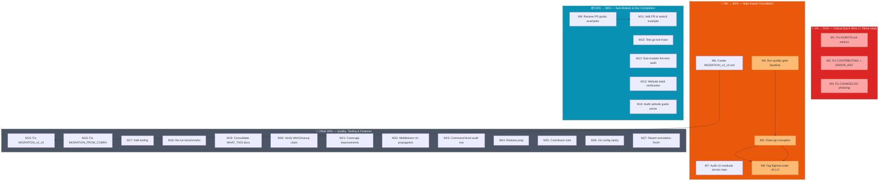
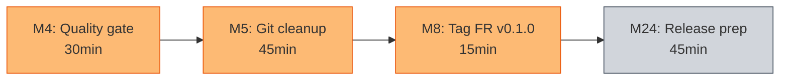

# Pareto Execution Plan — 2026-08-06 12:40 — Docs Health Closure & Quality Sprint

> **Context:** This plan consolidates ALL open tasks from `TODO_LIST.md` (19 items) and
> the `2026-08-06_12-38` status report's 50-item backlog. After deduplication and
> removal of v5-deferred items (which cannot ship without a major version bump),
> **47 unique actionable items** remain. This plan ranks them by impact, breaks them
> into two granularity levels, and defines the execution order.
>
> **Generated:** 2026-08-06 12:40
> **Source inputs:** `TODO_LIST.md`, `docs/status/2026-08-06_12-38_docs-health-and-report-annotation.md`
> **Project state:** v4.0.0+, 87.8% core coverage, ~550 tests, 0 lint issues, 5 commits ahead of origin

---

## Step 1: Pareto Breakdown — What Should We Really Do?

### The 1% that delivers 51% of the result

**Eliminate every documentation lie.** Right now, three files that contributors read
first contain stale version references and wrong metrics. Fixing them takes ~15 minutes
but eliminates the most damaging cross-file drift in the project.

| Task                                                                                                                                                                       | Why it's 1%→51%                                                                     | Effort |
| -------------------------------------------------------------------------------------------------------------------------------------------------------------------------- | ----------------------------------------------------------------------------------- | ------ |
| **Fix AGENTS.md metrics** (test count 467→~550, benchmarks 26→29, fuzz 7→8, go-output v0.35→v0.37, FR coverage ~91%→96.1%, add CaptureToWriter/WithFlightRecorderRecorder) | Every AI session reads AGENTS.md first. Wrong numbers cascade into wrong decisions. | 15min  |
| **Fix CONTRIBUTING.md** v3→v4 (lines 101, 115)                                                                                                                             | First file a new contributor reads. Says the wrong package name.                    | 2min   |
| **Fix docs/ERROR_REFERENCE.md** title v2→v4                                                                                                                                | Says "v2" while referencing v4 source files.                                        | 1min   |

### The 4% that delivers 64% of the result

**Establish trust in the repo and the migration path.** A clean git history, a passing
quality gate, and a dedicated v3→v4 migration guide are the foundation everything else
builds on.

| Task                                                                                                       | Why it's 4%→64%                                                                                                         | Effort |
| ---------------------------------------------------------------------------------------------------------- | ----------------------------------------------------------------------------------------------------------------------- | ------ |
| **Run full quality gate** (`go test ./... -race` + `golangci-lint run ./...` + `art-dupl` + `govulncheck`) | Establishes the baseline. Without this, we don't know if the project is actually healthy.                               | 30min  |
| **Clean up git corruption** (6 broken links, 37 dangling commits, invalid reflog `3e483b3b`)               | The repo has known corruption since 2026-08-01. `git fsck` reports errors. `git gc` would fail. This is a ticking bomb. | 45min  |
| **Create `docs/MIGRATION_v3_v4.md`**                                                                       | The v2→v3 migration got a 225-line guide. The v3→v4 migration got a CHANGELOG bullet. Users upgrading have no guide.    | 60min  |
| **Audit all remaining v3 references** across `.github/workflows/`, docs, and examples in one pass          | Systematic sweep prevents whack-a-mole fixes over weeks.                                                                | 60min  |
| **Tag `flightrecorder` v0.1.0**                                                                            | Other 4 sub-modules are tagged. This one isn't. Downstream consumers can't `go get` a stable version.                   | 15min  |

### The 20% that delivers 80% of the result

**Complete the flight recorder sub-module and verify all sub-modules independently.**
The sub-modules are the project's modular architecture story — if they're untested,
untagged, or undocumented, the architecture story is hollow.

| Task                                                     | Effort |
| -------------------------------------------------------- | ------ |
| Restore lost flightrecorder godoc examples               | 30min  |
| Test `go tool trace` parseability                        | 30min  |
| Add flightrecorder to `examples/taskctl/`                | 60min  |
| Sub-module lint + test audit (all 5 independently)       | 60min  |
| Website build verification + stale ref check             | 30min  |
| Audit `docs/COMPARISON.md` + `DOMAIN_LANGUAGE.md` for v4 | 45min  |
| Audit website guide prose (14 .mdx files)                | 60min  |
| Re-run benchmarks for `docs/PERFORMANCE.md`              | 30min  |

### The other 20% to get to 100%

Tooling improvements, doc consolidation, coverage improvements, middleware redesign,
release prep, and nice-to-have enhancements. Important but not urgent.

---

## Step 2: Comprehensive Plan — Medium Granularity (30-100min tasks)

> Sorted by impact (highest first), then effort (lowest first within same impact tier).
> v5-deferred items (T1-T3, P1-P4) are EXCLUDED — they cannot ship in v4.x.

| #   | Task                                                                                                                                                                                                                                       | Pareto    | Impact   | Effort | Deps | Customer Value                                                |
| --- | ------------------------------------------------------------------------------------------------------------------------------------------------------------------------------------------------------------------------------------------ | --------- | -------- | ------ | ---- | ------------------------------------------------------------- |
| M1  | **Fix AGENTS.md metrics + sync cross-file numbers** — test count 467→~550, benchmarks 26→29, fuzz 7→8, go-output v0.35→v0.37, FR coverage ~91%→96.1%, add CaptureToWriter/WithFlightRecorderRecorder, verify .golangci.yml exclusion count | 1%→51%    | Critical | 30min  | —    | Every AI session and contributor gets accurate context        |
| M2  | **Fix CONTRIBUTING.md + ERROR_REFERENCE.md** — v3→v4 (2 lines) + title v2→v4 (1 line)                                                                                                                                                      | 1%→51%    | Critical | 10min  | —    | New contributors see correct version immediately              |
| M3  | **Fix CHANGELOG.md test count phrasing** — "48 tests + 3 examples" is misleading (48 includes examples)                                                                                                                                    | 1%→51%    | Medium   | 5min   | —    | Accurate public changelog                                     |
| M4  | **Run full quality gate** — `go test ./... -race`, `golangci-lint run ./...`, `art-dupl --semantic -t 3`, `govulncheck ./...`, capture baseline                                                                                            | 4%→64%    | Critical | 30min  | —    | Confidence that the project is actually healthy               |
| M5  | **Clean up git corruption** — expire reflog, investigate 37 dangling commits, `git gc --prune=now`, verify git-town state, delete `recovery/921bf73-backup` ref                                                                            | 4%→64%    | Critical | 45min  | M4   | `git fsck` clean, no ticking bomb                             |
| M6  | **Create `docs/MIGRATION_v3_v4.md`** — dedicated v3→v4 migration guide covering module path change, package rename, configload deletion, NewCommand API change                                                                             | 4%→64%    | High     | 60min  | —    | Users upgrading from v3 have a step-by-step guide             |
| M7  | **Audit v3 residuals across repo** — `.github/workflows/`, `docs/COMPARISON.md`, `docs/PERFORMANCE.md`, `docs/DOMAIN_LANGUAGE.md`, `examples/`, `benchmarks/`, all `.md` files for stale `v3` references                                   | 4%→64%    | High     | 90min  | —    | No stale version references anywhere in the project           |
| M8  | **Tag `flightrecorder` v0.1.0** — version-tag the sub-module like the other 4                                                                                                                                                              | 4%→64%    | High     | 15min  | M5   | Downstream consumers can `go get` a stable version            |
| M9  | **Restore lost flightrecorder godoc examples** — `ExampleWithFlightRecorderRecorder`, `ExampleRecorder_CaptureToWriter` (lost in git corruption)                                                                                           | 20%→80%   | Medium   | 30min  | —    | Complete godoc coverage for flightrecorder                    |
| M10 | **Test `go tool trace` parseability** — shell out to `go tool trace`, verify snapshot files are valid                                                                                                                                      | 20%→80%   | Medium   | 30min  | —    | Confidence that trace snapshots actually work                 |
| M11 | **Add flightrecorder to `examples/taskctl/`** — demonstrate real-world usage in the flagship example                                                                                                                                       | 20%→80%   | Medium   | 60min  | M9   | Users see how to wire flight recorder in a real CLI           |
| M12 | **Sub-module lint + test audit** — run `golangci-lint run ./...` and `go test ./... -race` on each of the 5 sub-modules independently                                                                                                      | 20%→80%   | High     | 60min  | —    | Confidence that all sub-modules are independently healthy     |
| M13 | **Website build verification** — `pnpm run build` in `website/`, check for stale references                                                                                                                                                 | 20%→80%   | Medium   | 30min  | —    | Website doesn't have broken builds or stale content           |
| M14 | **Audit website guide prose** — verify 14 `.mdx` files describe v4 API behavior (not just v4 import paths)                                                                                                                                 | 20%→80%   | Medium   | 60min  | —    | Website guides match actual v4 semantics                      |
| M15 | **Fix `docs/MIGRATION_v2_v3.md`** — add manpage removal note to §3, add MIGRATION_v3_v4.md link to README                                                                                                                                  | other 20% | Low      | 15min  | M6   | Historical migration guide is accurate                        |
| M16 | **Fix `docs/MIGRATION_FROM_COBRA.md` TimingMiddleware example** — simplify the callback                                                                                                                                                    | other 20% | Low      | 15min  | —    | Migration example is clean and minimal                        |
| M17 | **Add tooling: gofmt check, pre-commit hook, .gitignore** — add `go mod tidy -diff` to nix fmt, pre-commit hook for tidy, `.trace` to .gitignore, Nix `check-all` target                                                                   | other 20% | Medium   | 45min  | —    | Automated quality gates prevent future drift                  |
| M18 | **Re-run benchmarks for `docs/PERFORMANCE.md`** — update numbers from v2.6.0 era to v4.0.0                                                                                                                                                 | other 20% | Low      | 30min  | —    | Performance docs are accurate                                 |
| M19 | **Consolidate `WHAT_THIS_PROJECT_IS_ABOUT.md` + `_NOT.md`** — merge into README/CONTRIBUTING or remove if redundant                                                                                                                        | other 20% | Low      | 45min  | —    | Fewer files, less drift surface                               |
| M20 | **Verify `WithCleanup[T]` claim with a test** — prove it covers raw cobra subcommands                                                                                                                                                      | other 20% | Medium   | 30min  | —    | Documented behavior is tested                                 |
| M21 | **Coverage improvements: `pkg/testutil` + `examples/taskctl`** — bring testutil from 49.6% and taskctl from 68.2% closer to core's 87.8%                                                                                                   | other 20% | Medium   | 100min | —    | Higher coverage, fewer regressions                            |
| M22 | **Middleware context propagation redesign (P5)** — change `next func() error` to `next func(ctx context.Context) error` to enable timeout/cancellation middleware                                                                          | other 20% | High     | 100min | —    | Middleware can propagate context (enables timeout middleware) |
| M23 | **Command-level audit middleware (F1)** — capture command execution events (start, end, duration, error) in audit log                                                                                                                      | other 20% | High     | 100min | —    | Audit log covers command execution, not just DI lifecycle     |
| M24 | **Release prep** — SECURITY.md version table, v4.0.0 GitHub release notes, pkg.go.dev badge, GitHub Action badge, "Related projects" section                                                                                               | other 20% | Medium   | 45min  | M8   | Public-facing release artifacts are complete                  |
| M25 | **Write "Why so many sub-modules?" contributor note** — decision tree for when to add a new sub-module                                                                                                                                     | other 20% | Low      | 30min  | —    | Contributors understand the modular architecture              |
| M26 | **Verify `git-town.toml` + check `master` vs `main`**                                                                                                                                                                                      | other 20% | Low      | 10min  | —    | Git config sanity                                             |
| M27 | **Annotate section e) in 6 status reports + add Resolution appendices**                                                                                                                                                                    | other 20% | Low      | 45min  | —    | Historical reports fully resolved                             |

**Total estimated effort: ~19 hours** (spanning multiple sessions)

---

## Step 3: Detailed Breakdown — Fine Granularity (≤12min tasks)

> Each medium task decomposed into atomic steps. Sorted within parent task by execution order.
> Items marked ⚡ are quick wins (<5min). Items marked 🔒 have hard dependencies.

### M1: Fix AGENTS.md metrics + sync cross-file numbers

| Sub# | Sub-task                                                                      | Time |
| ---- | ----------------------------------------------------------------------------- | ---- |
| 1.1  | ⚡ Read AGENTS.md header line with test/benchmark/fuzz counts                 | 2min |
| 1.2  | ⚡ Update test count 467→~550                                                 | 2min |
| 1.3  | ⚡ Update benchmarks 26→29                                                    | 2min |
| 1.4  | ⚡ Update fuzz 7→8                                                            | 2min |
| 1.5  | ⚡ Update FR coverage ~91%→~96% in Package Guidelines table                   | 2min |
| 1.6  | ⚡ Update go-output v0.35.0→v0.37.0 in dependencies table                     | 2min |
| 1.7  | Add CaptureToWriter + WithFlightRecorderRecorder to FR sub-module description | 5min |
| 1.8  | ⚡ Verify .golangci.yml exclusion count matches AGENTS.md claim (4+4+1+1)     | 5min |

### M2: Fix CONTRIBUTING.md + ERROR_REFERENCE.md

| Sub# | Sub-task                                                                     | Time |
| ---- | ---------------------------------------------------------------------------- | ---- |
| 2.1  | ⚡ Fix CONTRIBUTING.md:101 — `v3` → `v4`                                     | 2min |
| 2.2  | ⚡ Fix CONTRIBUTING.md:115 — `v3 Design Principles` → `v4 Design Principles` | 2min |
| 2.3  | ⚡ Fix docs/ERROR_REFERENCE.md:1 — title `v2` → `v4`                         | 2min |

### M3: Fix CHANGELOG.md test count phrasing

| Sub# | Sub-task                                                                          | Time |
| ---- | --------------------------------------------------------------------------------- | ---- |
| 3.1  | ⚡ Fix "48 tests + 3 examples" → "48 test functions (including 3 godoc examples)" | 3min |

### M4: Run full quality gate

| Sub# | Sub-task                                                             | Time  |
| ---- | -------------------------------------------------------------------- | ----- |
| 4.1  | Run `GOEXPERIMENT=jsonv2 go test ./... -count=1 -timeout 120s -race` | 10min |
| 4.2  | Run `golangci-lint run ./...`                                        | 10min |
| 4.3  | Run `art-dupl --semantic -t 3` on v4 package                         | 10min |
| 4.4  | Run `govulncheck ./...`                                              | 10min |

### M5: Clean up git corruption

| Sub# | Sub-task                                                                      | Time  |
| ---- | ----------------------------------------------------------------------------- | ----- |
| 5.1  | Run `git fsck --full` and capture current corruption state                    | 5min  |
| 5.2  | Investigate 37 dangling commits — `git show` each, check for recoverable work | 10min |
| 5.3  | Expire reflog: `git reflog expire --expire=now --all`                         | 2min  |
| 5.4  | Run `git gc --prune=now`                                                      | 5min  |
| 5.5  | 🔒 Verify `git fsck --connectivity-only` is clean                             | 5min  |
| 5.6  | Delete `recovery/921bf73-backup` ref                                          | 2min  |
| 5.7  | Verify `git diff --cached` works (was broken by missing blob)                 | 2min  |
| 5.8  | Verify git-town state (`git town status` or check `.git/town*`)               | 5min  |

### M6: Create docs/MIGRATION_v3_v4.md

| Sub# | Sub-task                                                                    | Time  |
| ---- | --------------------------------------------------------------------------- | ----- |
| 6.1  | Read CHANGELOG [4.0.0] section for breaking changes list                    | 5min  |
| 6.2  | Read existing `docs/MIGRATION_v2_v3.md` for format/style reference          | 5min  |
| 6.3  | Write §1: Module path change (`/v3` → `/v4`) with find-replace instructions | 10min |
| 6.4  | Write §2: Package name change (`v3` → `v4`) — update all import aliases     | 10min |
| 6.5  | Write §3: `configload` deletion → `KoanfLoader` migration                   | 10min |
| 6.6  | Write §4: `NewCommand`/`NewParentCommand` API — flags now positional        | 10min |
| 6.7  | Write §5: `NewJSONLoader` deletion — use `WithConfigFile` instead           | 5min  |
| 6.8  | Add link from README.md alongside v2→v3 link                                | 5min  |

### M7: Audit v3 residuals across repo

| Sub# | Sub-task                                                                   | Time  |
| ---- | -------------------------------------------------------------------------- | ----- |
| 7.1  | `grep -rn 'cmdguard/v3' .github/workflows/` — fix any matches              | 10min |
| 7.2  | `grep -rn 'v3\.' docs/COMPARISON.md` — audit prose for v3 semantics        | 10min |
| 7.3  | `grep -rn 'v3\.' docs/PERFORMANCE.md` — check for stale performance claims | 10min |
| 7.4  | Verify `docs/DOMAIN_LANGUAGE.md` terms match v4 API                        | 10min |
| 7.5  | `grep -rn 'v3' examples/ benchmarks/ tests/` — find any stale refs         | 10min |
| 7.6  | Audit `docs/QUICKSTART.md` "output formats" count (should be 16, not 12)   | 5min  |
| 7.7  | Audit `docs/TUTORIAL.md` for v4 API pattern accuracy                       | 10min |
| 7.8  | Audit `docs/CLI_DESIGN_PRINCIPLES.md` for v3 references                    | 10min |
| 7.9  | `grep -rn 'v3\|v2' docs/proposals/ docs/feedback/` — check remaining docs  | 10min |

### M8: Tag flightrecorder v0.1.0

| Sub# | Sub-task                                          | Time |
| ---- | ------------------------------------------------- | ---- |
| 8.1  | 🔒 Verify `git fsck` is clean (after M5)          | 2min |
| 8.2  | Run flightrecorder tests one final time           | 5min |
| 8.3  | `git tag flightrecorder/v0.1.0`                   | 2min |
| 8.4  | Add CHANGELOG entry for flightrecorder/v0.1.0 tag | 5min |

### M9: Restore lost flightrecorder godoc examples

| Sub# | Sub-task                                                                     | Time  |
| ---- | ---------------------------------------------------------------------------- | ----- |
| 9.1  | Read `flightrecorder/middleware.go` — `WithFlightRecorderRecorder` signature | 5min  |
| 9.2  | Write `ExampleWithFlightRecorderRecorder` in `example_test.go`               | 10min |
| 9.3  | Read `flightrecorder/recorder.go` — `CaptureToWriter` signature              | 5min  |
| 9.4  | Write `ExampleRecorder_CaptureToWriter` in `example_test.go`                 | 10min |

### M10: Test go tool trace parseability

| Sub# | Sub-task                                                       | Time  |
| ---- | -------------------------------------------------------------- | ----- |
| 10.1 | Generate a trace snapshot via integration test                 | 10min |
| 10.2 | Run `go tool trace <file>` with timeout, verify no parse error | 10min |
| 10.3 | Document `go tool trace` workflow in flightrecorder/README.md  | 10min |

### M11: Add flightrecorder to examples/taskctl/

| Sub# | Sub-task                                                         | Time  |
| ---- | ---------------------------------------------------------------- | ----- |
| 11.1 | Read `examples/taskctl/main.go` — understand current CLI options | 10min |
| 11.2 | Add `flightrecorder.WithFlightRecorder` to CLI options           | 10min |
| 11.3 | Add `flightrecorder` to import block                             | 2min  |
| 11.4 | Run taskctl tests — verify nothing breaks                        | 10min |
| 11.5 | Update `examples/taskctl/README.md` to mention flight recorder   | 10min |
| 11.6 | Verify `go build` passes                                         | 5min  |

### M12: Sub-module lint + test audit

| Sub# | Sub-task                                                              | Time  |
| ---- | --------------------------------------------------------------------- | ----- |
| 12.1 | `cd glamour && golangci-lint run ./... && go test ./... -race`        | 10min |
| 12.2 | `cd prompts && golangci-lint run ./... && go test ./... -race`        | 10min |
| 12.3 | `cd spinner && golangci-lint run ./... && go test ./... -race`        | 10min |
| 12.4 | `cd telemetry && golangci-lint run ./... && go test ./... -race`      | 10min |
| 12.5 | `cd flightrecorder && golangci-lint run ./... && go test ./... -race` | 10min |

### M13: Website build verification

| Sub# | Sub-task                                                | Time  |
| ---- | ------------------------------------------------------- | ----- |
| 13.1 | `cd website && pnpm run build`                           | 10min |
| 13.2 | Check build output for warnings/errors                  | 5min  |
| 13.3 | Grep website source for remaining stale `v3` references | 10min |

### M14: Audit website guide prose

| Sub# | Sub-task                                                                     | Time  |
| ---- | ---------------------------------------------------------------------------- | ----- |
| 14.1 | Read `website/src/content/docs/guides/flags.mdx` — verify v4 semantics       | 10min |
| 14.2 | Read `website/src/content/docs/guides/commands.mdx` — verify v4 semantics    | 10min |
| 14.3 | Read `website/src/content/docs/guides/sub-modules.mdx` — verify v4 semantics | 10min |
| 14.4 | Read `website/src/content/docs/guides/middleware.mdx` — verify v4 semantics  | 10min |
| 14.5 | Read remaining 10 guide .mdx files — spot-check for v3 prose                 | 10min |

### M15: Fix MIGRATION_v2_v3.md + README link

| Sub# | Sub-task                                                             | Time |
| ---- | -------------------------------------------------------------------- | ---- |
| 15.1 | Add manpage removal note to `docs/MIGRATION_v2_v3.md` §3             | 5min |
| 15.2 | 🔒 Add `docs/MIGRATION_v3_v4.md` link to README alongside v2→v3 link | 5min |

### M16: Fix MIGRATION_FROM_COBRA.md

| Sub# | Sub-task                                                        | Time  |
| ---- | --------------------------------------------------------------- | ----- |
| 16.1 | Read TimingMiddleware example in `docs/MIGRATION_FROM_COBRA.md` | 5min  |
| 16.2 | Simplify callback to minimal correct form                       | 10min |

### M17: Add tooling

| Sub# | Sub-task                                                        | Time  |
| ---- | --------------------------------------------------------------- | ----- |
| 17.1 | Add `.trace` to `.gitignore`                                    | 2min  |
| 17.2 | Check if `nix fmt` includes `gofmt -s` — add if missing         | 10min |
| 17.3 | Add `go mod tidy -diff` check to `nix fmt` or a Nix check       | 10min |
| 17.4 | Add Nix `check-all` target (build + test + lint + format-check) | 10min |

### M18: Re-run benchmarks

| Sub# | Sub-task                                               | Time  |
| ---- | ------------------------------------------------------ | ----- |
| 18.1 | Run `go test -bench=. -benchmem ./benchmarks/...`      | 10min |
| 18.2 | Update `docs/PERFORMANCE.md` with new numbers          | 10min |
| 18.3 | Add flightrecorder benchmark section to PERFORMANCE.md | 10min |

### M19: Consolidate WHAT_THIS_PROJECT docs

| Sub# | Sub-task                                                   | Time  |
| ---- | ---------------------------------------------------------- | ----- |
| 19.1 | Read both files, identify unique content vs README overlap | 10min |
| 19.2 | Merge unique content into README or CONTRIBUTING           | 10min |
| 19.3 | Delete both files, update cross-references                 | 10min |
| 19.4 | Verify `go build` and `nix flake check`                    | 5min  |

### M20: Verify WithCleanup[T] claim

| Sub# | Sub-task                                                       | Time  |
| ---- | -------------------------------------------------------------- | ----- |
| 20.1 | Write test that adds a raw cobra subcommand + WithCleanup hook | 10min |
| 20.2 | Verify cleanup fires even when raw subcommand's RunE errors    | 10min |
| 20.3 | Run test with `-race`                                          | 5min  |

### M21: Coverage improvements

| Sub# | Sub-task                                                             | Time  |
| ---- | -------------------------------------------------------------------- | ----- |
| 21.1 | Read `pkg/testutil/panic_test_helpers.go` — identify uncovered paths | 10min |
| 21.2 | Write tests for uncovered testutil paths                             | 10min |
| 21.3 | Read `examples/taskctl/main_test.go` — identify uncovered commands   | 10min |
| 21.4 | Write tests for uncovered taskctl command paths                      | 10min |
| 21.5 | Write more taskctl tests for edge cases                              | 10min |
| 21.6 | Run coverage report — verify improvement                             | 5min  |

### M22: Middleware context propagation

| Sub# | Sub-task                                                                                     | Time  |
| ---- | -------------------------------------------------------------------------------------------- | ----- |
| 22.1 | Design new `Middleware[T]` signature: `next func(ctx context.Context) error`                 | 10min |
| 22.2 | Update all middleware implementations (Timing, Recovery, spinner, telemetry, flightrecorder) | 10min |
| 22.3 | Update `buildChain` in `cli.go` to pass context through chain                                | 10min |
| 22.4 | Update all middleware tests                                                                  | 10min |
| 22.5 | Run full test suite + lint                                                                   | 10min |

### M23: Command-level audit middleware

| Sub# | Sub-task                                                              | Time  |
| ---- | --------------------------------------------------------------------- | ----- |
| 23.1 | Design `CommandAuditMiddleware[T]` — capture start/end/duration/error | 10min |
| 23.2 | Implement in `middleware.go` or new file                              | 10min |
| 23.3 | Write tests                                                           | 10min |
| 23.4 | Document in FEATURES.md                                               | 5min  |
| 23.5 | Run full test suite + lint                                            | 10min |

### M24: Release prep

| Sub# | Sub-task                                                 | Time  |
| ---- | -------------------------------------------------------- | ----- |
| 24.1 | Verify SECURITY.md version table includes v4             | 5min  |
| 24.2 | Write v4.0.0 GitHub release notes (or verify they exist) | 10min |
| 24.3 | Add `pkg.go.dev` badge to README                         | 5min  |
| 24.4 | Add GitHub Action badge for `nix flake check`            | 5min  |
| 24.5 | Add "Related projects" section to README                 | 10min |

### M25: Contributor note

| Sub# | Sub-task                                                          | Time  |
| ---- | ----------------------------------------------------------------- | ----- |
| 25.1 | Write "Why so many sub-modules?" decision tree in CONTRIBUTING.md | 10min |
| 25.2 | Review for accuracy against current sub-module architecture       | 5min  |

### M26: Git config sanity

| Sub# | Sub-task                                                    | Time |
| ---- | ----------------------------------------------------------- | ---- |
| 26.1 | Check `git-town.toml` — `master` vs `main` setting          | 5min |
| 26.2 | Verify `library-policy.yaml` references are accurate for v4 | 5min |

### M27: Status report annotation completion

| Sub# | Sub-task                                             | Time  |
| ---- | ---------------------------------------------------- | ----- |
| 27.1 | Annotate section e) in `2026-08-01_19-42` report     | 10min |
| 27.2 | Annotate section e) in `2026-08-01_20-45` report     | 10min |
| 27.3 | Annotate section e) in `2026-08-01_21-22` report     | 10min |
| 27.4 | Add Resolution appendix to 3 flight-recorder reports | 10min |

---

## Execution Graph

### Critical Path

**Critical path: M4 → M5 → M8 → M24 = ~2h15min**

The quality gate must run before git cleanup (to know the baseline). Git cleanup must
finish before tagging (clean repo required). Tagging must finish before release prep
(stable version needed for badges/notes).

### Parallelizable Work

These tasks have NO dependencies and can be done in any order or in parallel:

- **M1, M2, M3** — Quick wins (do first, ~20min total)
- **M6** — Migration guide (independent of code health)
- **M7** — v3 residual audit (independent of git state)
- **M9, M10** — Flight recorder examples + trace test (independent)
- **M12** — Sub-module audit (independent of root module)
- **M13, M14** — Website work (independent of Go code)
- **M15, M16, M17, M18, M19, M20** — All independent quality tasks
- **M22, M23** — Feature work (independent of docs)
- **M25, M26, M27** — Polish (independent of everything)

---

## Execution Strategy

### Phase 1: Quick Wins (1%→51%) — ~20min

**Do first, do fast, do now.**
M1 + M2 + M3. Eliminate all documentation lies.

### Phase 2: Foundation (4%→64%) — ~4h

**Establish trust before building on it.**
M4 (quality gate) → M5 (git cleanup) → M8 (tag FR).
M6 (migration guide) and M7 (v3 audit) in parallel.

### Phase 3: Completion (20%→80%) — ~5h

**Finish what's 90% done.**
M9-M14. Flight recorder examples, trace validation, sub-module audit, website verification.

### Phase 4: Quality & Features (other 20%) — ~10h

**Multi-session work.**
M15-M27. Tooling, coverage, middleware redesign, release prep.

---

## Risk Assessment

| Risk                                                                              | Probability | Impact   | Mitigation                                                       |
| --------------------------------------------------------------------------------- | ----------- | -------- | ---------------------------------------------------------------- |
| Git cleanup (`git gc --prune=now`) removes recoverable work from dangling commits | Medium      | High     | Investigate all 37 dangling commits BEFORE pruning (M5.2)        |
| Middleware context propagation (M22) breaks downstream consumers                  | Low         | Critical | This is a v4.x breaking change — may need to defer to v5         |
| Website build (M13) reveals broken .mdx files                                     | Medium      | Low      | Text-only changes; build errors would be syntax, not logic       |
| Re-running benchmarks (M18) shows performance regression                          | Low         | Medium   | If regression found, investigate root cause before updating docs |

---

_Snapshot generated 2026-08-06 12:40. This is a point-in-time plan — it will go stale.
When bringing this plan current, use `docs-health` → ANNOTATE mode._
